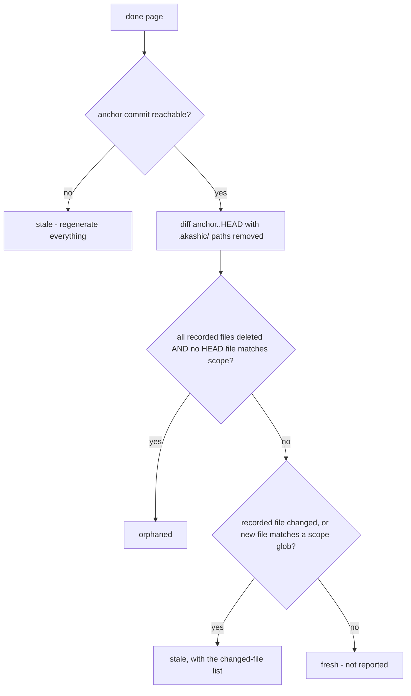

# Deterministic Core

`akashic.py` is the half of akashic-record that must never be hallucinated: file scanning, the diff-to-stale-page mapping, citation verification, hash/anchor stamping, and — now — deterministic rendering of the exact subagent prompt used to generate a page. It never calls an LLM, and the LLM side (catalog planning and page prose, described in [Skill Orchestration](./skill-orchestration.md)) never computes a hash, diff, line range, or prompt text. The script is stdlib-only Python 3.9+, exposes five subcommands — `scan`, `stale`, `verify`, `anchor`, `prompt` — behind a `-C` directory flag, requires a git repository with at least one commit, and exits 0 on success, 1 on verification failures, 2 on usage or precondition errors. How these commands fit into the overall system is covered in [Project Overview](./index.md).

Sources: [akashic.py:1-29](../../akashic.py#L1-L29), [akashic.py:766-791](../../akashic.py#L766-L791), [akashic.py:71-80](../../akashic.py#L71-L80)

## scan — the planner's filtered view

`scan` prints every file the planner is allowed to see, one `lines<TAB>path` entry per tracked file, preceded by a `# N files, M lines` header. The candidate set is `git ls-files`, so anything gitignored is already gone. On top of that, `is_noise` drops:

- files under vendor directories (`node_modules`, `vendor`, `third_party`) at any depth;
- a small denylist of lockfile names (`package-lock.json`, `pnpm-lock.yaml`, `bun.lockb`, `npm-shrinkwrap.json`, `Pipfile.lock`, `go.sum`);
- noise suffixes: `.lock`, `.min.js`, `.min.css`, `.map`, `.svg`;
- everything under `.akashic/` itself;
- any path matching the catalog's `exclude` globs.

Binary files (a NUL byte in the first 8 KiB) and unreadable files are skipped after that. If the surviving count exceeds `max_files` (default 5000), the command dies with instructions to add `exclude` globs rather than silently truncating; entries are emitted sorted by path.

Glob matching via `matches_any` is fnmatch with two gitignore-flavored affordances: a slash-free pattern also matches the basename at any depth (`*.snap` matches `a/b/x.snap`), and a `**/` prefix also matches at the repository root (`**/*.snap` matches `top.snap`).

Sources: [akashic.py:33-38](../../akashic.py#L33-L38), [akashic.py:139-152](../../akashic.py#L139-L152), [akashic.py:155-166](../../akashic.py#L155-L166), [akashic.py:196-201](../../akashic.py#L196-L201), [akashic.py:206-230](../../akashic.py#L206-L230)

## stale — bucket semantics

`stale` is read-only: it prints a JSON report with `anchor`, `head`, `anchor_reachable`, `dirty`, and five page buckets — `stale`, `edited`, `orphaned`, `uncovered`, `missing`. Only pages with `status: "done"` participate.

Two buckets are computed before any diff. `missing` lists done pages whose wiki file is gone. `edited` compares the current normalized-body hash of each page file (CRLF/CR to LF, trailing whitespace stripped per line, trailing newlines stripped) against the `hash` recorded in the catalog — edit detection is independent of git and never guessed from it. If the recorded anchor commit is absent or unreachable, the tool refuses to guess: `anchor_reachable` goes false and every done page is reported stale with an empty `changed` list, on the principle that wasting a regeneration is acceptable but marking stale content fresh is not.

With a reachable anchor, the tool parses `git diff --name-status -M -z anchor..HEAD` into modified/added/deleted/rename sets. Renames land on both sides: both endpoints count as changed (citations to the old path dangle), and the new name counts as an addition for scope matching. A done page is then bucketed:

Sources: [akashic.py:497-556](../../akashic.py#L497-L556)

The orphaned condition is deliberately narrow: a page is orphaned only when everything it documented is deleted *and* nothing in the current HEAD tree matches its scope — a rewritten module is stale, not orphaned.

**Self-dependency exclusion.** Every path under `.akashic/` is stripped from the diff sets and from the HEAD file list (`outside_akashic`, a closure inside `compute_stale`) before any bucketing. Wiki artifacts must never be staleness inputs: if the wiki depended on itself, committing it would break the post-anchor invariant immediately.

`uncovered` lists added files that no page claims. `files` entries are exact paths — a recorded root `Makefile` must not shadow a new nested `Makefile` — while `scope` entries are globs; noise (the same filter as `scan`, including catalog excludes) and binaries are dropped.

Sources: [akashic.py:533-541](../../akashic.py#L533-L541), [akashic.py:558-571](../../akashic.py#L558-L571), [akashic.py:169-174](../../akashic.py#L169-L174)

## verify — the citation gate

`verify` returns exit 1 with one error line per failure, or prints `verify: ok`. Catalog invariants come first: duplicate page ids, invalid `status` values (only `planned` and `done`), unknown parents, and parent cycles. Page ids are already slug-validated at catalog load, because ids become path components — a non-slug id is a traversal vector.

For each done page it then enforces, in order:

- the wiki file `wiki/<id>.md` exists;
- the first non-empty line is an H1 title;
- the page has at least one `Sources:` line (cite-or-omit — every page cites at least one repo file);
- no Sources block is empty of parseable links.

A Sources block is a paragraph — the `Sources:` line plus continuation lines until a blank line or heading — so wrapped citations count. Fenced code blocks are ignored entirely: an example citation inside a fence is neither verified nor a dependency. The link-matching regex uses a non-greedy text group rather than excluding `]` outright, because a citation's link text is often a literal file path and dynamic-route frameworks (e.g. a Next.js `[id]/route.ts` segment) put unescaped `]` characters inside that path; an excluding character class would stop at the first one and silently report zero links for a valid citation.

Each citation target is resolved (`resolve_citation`) relative to the page file. CommonMark allows a link destination to be wrapped in `<...>` so it can contain literal `[`/`]` without percent-encoding — exactly what citing a bracketed dynamic-route path forces the destination to need — so the wrapper is stripped before parsing. A target is then rejected if it:

- uses a URL scheme (`file://`, `https://`, ...);
- is an absolute path;
- contains control characters;
- resolves outside the repository.

Cited paths must then match git's exact path strings — not the filesystem — because untracked or ignored files can never appear in an anchor-to-HEAD diff (the page would be permanently fresh), and case-insensitive filesystems would accept a wrong-case path the diff intersection would never match. (Paths under `.akashic/` are exempt from the tracked check but must exist.) The file must also exist in the working tree, and any `#L<start>-L<end>` fragment is checked by `check_fragment`: a well-formed range needs `1 <= start <= end`, and `end` may exceed the file's real line count by at most one. That +1 tolerance exists because a file ending in a trailing newline splits into one more line than `line_count()` reports if a consumer enumerates on `"\n"` without dropping the final empty segment — exactly what generates a subagent's citations in practice — so the extra, harmless empty line is tolerated while a range more than one over is still rejected.

A citation that resolves cleanly but names a file outside the page's own catalog `scope` doesn't fail verify — it produces a warning instead, since the file is real and correctly cited; the drift is a signal in either direction (scope too narrow, or too wide) worth surfacing rather than blocking anchor over.

Relative `.md` links outside Sources blocks are treated as wiki links. A link that resolves inside the wiki directory is checked against **catalog membership**, not file existence: the target id (the linked file's stem) must be a known page id in `catalog.json` — `README` is exempted as the anchor-derived TOC — and if the id exists but its page is not yet `status: "done"`, that's only a warning (a forward reference to a planned sibling is expected during progressive generation), not an error. Wiki files present on disk but absent from the catalog are reported as warnings only, and left untouched.

Sources: [akashic.py:41-46](../../akashic.py#L41-L46), [akashic.py:283-330](../../akashic.py#L283-L330), [akashic.py:394-428](../../akashic.py#L394-L428), [akashic.py:430-454](../../akashic.py#L430-L454)

## anchor — recording state without laundering edits

`anchor` is the only metadata mutation point, and it runs the full verify gate first — any verification error means it refuses to anchor (exit 1). For each done page it recomputes `files` as the union of the page's resolved citations and every tracked file matching its `scope` globs, with `.akashic/` paths excluded on both sides so wiki artifacts can never become page dependencies.

**Hash-preservation rule.** The recorded `hash` permanently means "what the tool wrote". A null hash is the explicit bless signal, set by the orchestrator after writing a page. If the current page text hashes differently from a non-null recorded hash, a human edited the page: `anchor` keeps the *old* hash and warns, because re-hashing would launder the `edited` marker away and let the next update silently overwrite the human's work. Only a null or matching recorded hash gets stamped with the current hash.

Finally it:

- stamps `anchor` (current HEAD) and a `generated` UTC timestamp into the catalog;
- rebuilds `wiki/README.md` (`render_readme`), a derived table of contents regenerated on every anchor so it can never drift from the catalog (done pages are links, others are marked *(planned)*, nesting follows `parent`);
- saves the catalog atomically via a temp-file rename (`save_catalog`);
- warns if the working tree is dirty (the wiki may describe uncommitted code; the recommended flow is commit, then anchor).

Sources: [akashic.py:131-136](../../akashic.py#L131-L136), [akashic.py:581-603](../../akashic.py#L581-L603), [akashic.py:606-660](../../akashic.py#L606-L660)

## prompt — deterministic subagent-prompt rendering

`akashic.py prompt <page-id>` prints the exact text a subagent should receive to generate one catalog page, so no human has to hand-type the same rules into every dispatch. `render_prompt` is plain string templating over `catalog.json` and the filesystem — it makes no LLM-style judgment call — and its output mirrors the shape SKILL.md's page contract expects: a goal statement, the citable file list, sibling pages for cross-linking, the exact `Sources:`/heading/Mermaid/cross-link/cite-or-omit rules, and a trailing `*Generated from commit \`<hash>\` on <date>.*` line.

The citable file list is `expand_scope`: every git-tracked file matching the page's `scope` globs, sorted. This is deliberately narrower than the whole repo — a page can only cite what its own scope expands to.

`find_context_docs` separately surfaces local-only agent-guidance files (`CLAUDE.md`, `AGENTS.md`, `.cursorrules`, `.windsurfrules`, `GEMINI.md`, `.github/copilot-instructions.md`) that exist on disk but are **not** tracked by git — commonly excluded via `.git/info/exclude` or a personal gitignore. When present, the rendered prompt explicitly tells the subagent it may read them for context but must never cite them in a `Sources:` line, since an untracked file may not exist for another clone of the repo; a fact sourced from one should instead be traced to the tracked code that implements it, stated as uncited prose, or omitted. If no such files are present (or they're already tracked), the warning paragraph is omitted entirely rather than emitted as boilerplate.

`cmd_prompt` requires a page id argument and dies with exit 2 if the id isn't in the catalog, via the same `die()` path every other precondition failure uses.

Sources: [akashic.py:669-693](../../akashic.py#L669-L693), [akashic.py:695-754](../../akashic.py#L695-L754), [akashic.py:757-761](../../akashic.py#L757-L761)

## What the test suite proves

`test_akashic.py` keeps one check per component, on throwaway git-repo fixtures with stdlib unittest only. The invariants it pins down:

- **Scan filtering**: a source file survives while a binary, a lockfile, an excluded glob, and `.akashic/` itself are all dropped.
- **The canonical incremental mapping**: edit `f1`, delete `f2`, add `f3` yields exactly `{stale: [a], orphaned: [b], uncovered: [f3]}` with empty `edited`/`missing`.
- **Renames**: a rename is stale (citations dangle), never orphaned.
- **Unreachable anchor**: everything regenerates; never guess.
- **The citation gate**: a valid page passes cleanly; out-of-range fragments fail naming the page and line; a trailing-newline `+1` range is tolerated but `+2` still fails; traversal targets, scheme URLs, untracked-but-on-disk citations, NUL-byte paths (error, not crash), and empty Sources blocks all fail; wrapped Sources paragraphs are verified; fenced example citations are neither verified nor recorded as dependencies; a bracketed dynamic-route path (`app/users/[id]/route.ts`) parses as a citation both in plain link-text form and in `<...>`-wrapped destination form; a citation outside the page's own scope warns but does not fail verify; a wiki link to an unknown catalog page id still fails, while a forward link to a not-yet-`done` sibling does not.
- **The post-anchor invariant**: after `anchor` and committing its artifacts, all five stale buckets are empty — with `README.md` deliberately in a page's scope to prove the wiki's own derived TOC never basename-matches into a self-dependency — and a manual edit afterwards flips exactly the `edited` bucket. `anchor` refuses (exit 1) on verification failure.
- **Edit protection survives re-anchoring**: a second anchor over a human-edited page keeps the original tool hash; only an explicit `hash: null` bless clears the `edited` state.
- **Trust-boundary loading**: a traversal page id and a string-typed `scope` are rejected at catalog load with exit 2.
- **Glob and coverage semantics**: the `**/` and basename affordances of `matches_any`, and that exact `files` entries do not shadow same-named files at other depths in the `uncovered` report.
- **`prompt` rendering**: for a page scoped to one file, the rendered prompt lists that file as citable and omits an out-of-scope sibling file, lists every other catalog page as a cross-link sibling, includes the page's `goal` text verbatim, and — when an untracked `CLAUDE.md` exists on disk — names it alongside a "NOT tracked by git" warning; that warning is omitted entirely when no untracked context doc is present; requesting an unknown page id exits 2.

Sources: [test_akashic.py:1-7](../../test_akashic.py#L1-L7), [test_akashic.py:85-143](../../test_akashic.py#L85-L143), [test_akashic.py:212-262](../../test_akashic.py#L212-L262), [test_akashic.py:351-378](../../test_akashic.py#L351-L378), [test_akashic.py:453-497](../../test_akashic.py#L453-L497), [test_akashic.py:499-514](../../test_akashic.py#L499-L514)

*Generated from commit `8ae2ecc0` on 2026-07-16.*
