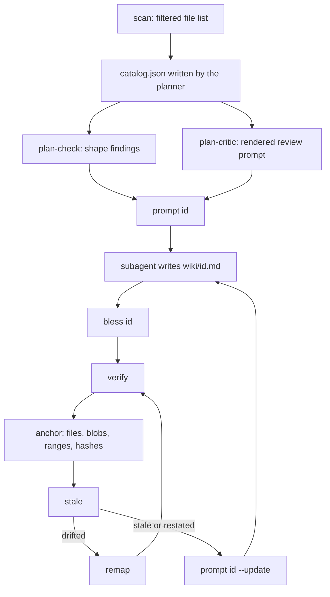

# Deterministic Core

`akashic.py` is the half of akashic-record that is not allowed to guess. It is one stdlib-only file that scans a repository, decides which wiki pages have gone stale, verifies citations, stamps hashes and anchors, and renders the prompts the LLM side actually runs on. The rule it exists to enforce is a division of labour: anything that could lose human work or declare stale content fresh is arithmetic here, and anything stochastic has to pass through `verify` before it can be anchored. This page walks the subcommands in the order a wiki meets them, and closes with what the test suite pins down. The on-demand claim audit subcommands are outside this page's brief and are not documented here. The skill-side orchestration that calls these commands is described in [Skill Orchestration](./skill-orchestration.md), the update cycle they serve in [Maintenance Loop](./maintenance-loop.md), and the shape of the whole system in [Project Overview](./index.md).

## What the script owns

The module docstring states the contract: the script never calls an LLM, and the LLM never computes a hash, diff, or line range. Two things back that up mechanically. The imports are stdlib only, and there is exactly one `subprocess.run` in the file — inside `git()`, which shells out to `git` and nothing else (method: search for `subprocess` across the file returns the import at line 21, the call at line 101, and one mention inside a docstring). Every subcommand is a thin `cmd_*` wrapper over a function that returns data, which is what makes the same logic reachable from the tests without spawning a process.

`repo_root` is the shared precondition: the target must be inside a git repository *and* have at least one commit, because the whole incremental model anchors to commits. Exit codes are uniform across commands — 0 for ok, 1 for a verification failure, 2 for usage or precondition errors — so a scheduled runner can branch on them without parsing output.

Sources: [akashic.py:2468-2553](../../akashic.py#L2468-L2553)

Sources: [akashic.py:1-25](../../akashic.py#L1-L25), [akashic.py:91-119](../../akashic.py#L91-L119), [akashic.py:2468-2553](../../akashic.py#L2468-L2553)

## scan: the filtered view of the repo

`scan` prints one line per tracked text file with its line count, plus a header total. That list is the planner's entire picture of the repository, so the filter it applies defines what the wiki can ever cover. `git ls-files` already drops everything gitignored, which is why the extra denylist is small: vendor directories, a handful of lockfile names, and noisy suffixes such as `.min.js`, `.map` and `.svg`. Binary files are dropped by sniffing for a NUL byte in the first 8KB, and an unreadable file is dropped the same way rather than crashing the scan. `max_files` is a guard rail, not a truncation — exceeding it exits 2 and tells the operator to add `exclude` globs instead of silently documenting a subset.

Glob matching has two gitignore-flavoured affordances: a slash-free pattern also matches a basename at any depth, and a `**/` prefix also matches at the repository root. `escape_brackets` then makes `[` literal, so character classes are *not* supported in scope or exclude globs. That trade is deliberate and the comment records why: framework routing conventions put literal brackets in path segments far more often than a catalog wants a one-character class, and reading `[id]` as a class made the natural glob for such a path match nothing — silently, which cost files from a page's citable set and could turn a rewritten module into a false `orphaned` report.

The same filter is reachable from `expand_scope`, so the file list a subagent is handed is the list `scan` would have shown. A `scope` glob cannot re-admit what the catalog excluded.

Sources: [akashic.py:32-39](../../akashic.py#L32-L39), [akashic.py:192-223](../../akashic.py#L192-L223), [akashic.py:226-237](../../akashic.py#L226-L237), [akashic.py:286-320](../../akashic.py#L286-L320), [akashic.py:2003-2015](../../akashic.py#L2003-L2015)

## stale: the work buckets

`stale` is a read-only report and the only place that decides whether an LLM is worth invoking. It emits JSON with nine work buckets alongside the anchor state: `stale`, `edited`, `orphaned`, `uncovered`, `missing`, `planned`, `drifted`, `restated` and `unblessed`. `--check` re-prints the same JSON and exits 1 when any bucket is non-empty, which is the zero-token gate a scheduled runner polls with; `--ids <bucket>` prints one page id per line so a shell loop needs no JSON parser, and rejects an unknown bucket name loudly rather than returning an empty list a typo would be indistinguishable from.

The buckets divide by remedy, not by cause:

- **`stale`** — a page whose recorded dependencies changed in a way that reached the lines it cites. Each entry carries the changed paths, which is what `prompt --update` later turns into regeneration context.
- **`orphaned`** — everything the page documented is deleted *and* nothing in the current tree still matches its scope. The second half is what keeps a rewritten module from being called orphaned, a distinction that matters because the documented remedy for orphaned is deleting the page.
- **`edited`** — the page body no longer hashes to what the tool last wrote. Detected from the hash alone, never inferred from git.
- **`missing`** — a `done` page whose file is gone.
- **`planned` and `unblessed`** — the two halves of a half-finished generation run. Every other bucket iterates `done` pages, so a page written by a subagent that died before `bless` used to sit in no bucket at all and `stale --check` exited 0 on it. They stay separate because the remedies differ and one of them destroys work: `planned` means nobody attempted the page, so generate it; `unblessed` means a body already exists, so read it and `bless <id> --done`.
- **`uncovered`** — a file added since the anchor that no page's recorded `files` or `scope` claims, after noise filtering and with binaries excluded. Recorded `files` are compared as exact paths, never as patterns, so a documented root `Makefile` cannot shadow a new nested one.
- **`drifted`** and **`restated`** have their own sections below.

Sources: [akashic.py:1135-1140](../../akashic.py#L1135-L1140), [akashic.py:1164-1178](../../akashic.py#L1164-L1178), [akashic.py:1238-1275](../../akashic.py#L1238-L1275), [akashic.py:1283-1330](../../akashic.py#L1283-L1330)

## Range-level staleness and drift

Where a page cites line numbers, staleness is measured against those lines rather than the whole file. `anchor` records `ranges` per page in anchor coordinates, clamped by `citation_span` to the file's real length; `stale` then runs `git diff -U0 -M` between the anchor and HEAD, parses the hunks keyed by their *old* path, and asks whether any hunk overlaps any cited span. A zero-length hunk is an insertion after a line, so it only counts when it lands strictly inside a block — an append immediately after the last cited line leaves the cited text exactly as it was.

`touches_page` answers True whenever it cannot answer precisely, and that covers most of the interesting cases: a file in scope but never cited has no recorded ranges, a citation without a fragment claims the whole file, a pure rename produces no hunks at all under `-M`, and a deletion's hunk covers everything. Only a modification whose every hunk misses every cited span is dismissed.

The hole that opens is drift. A change *above* a cited block touches nothing the page cites, so the page is not stale — but its line numbers now point at different code, in bounds, where `verify`'s range check cannot see it. `shift_at` sums the deltas of hunks that end strictly before a span's start, `page_drift` reports the shifted spans plus any rename of the path, and the page lands in `drifted` instead of `stale`, because the fix is arithmetic rather than prose.

The clamp in `citation_span` matters more than it looks: recorded ends are routinely one past the last line (see the trailing-newline tolerance below), that phantom line does not exist in diff coordinates, and unclamped it would make every cite-to-end-of-file page stale on every append.

Sources: [akashic.py:922-999](../../akashic.py#L922-L999), [akashic.py:1002-1040](../../akashic.py#L1002-L1040), [akashic.py:1219-1223](../../akashic.py#L1219-L1223), [akashic.py:1253-1262](../../akashic.py#L1253-L1262)

## The wiki never depends on itself

Anything under `.akashic/` is excluded from staleness inputs and from recorded dependencies, in every direction. `is_noise` drops the prefix at scan time, `compute_stale` filters the diff's changed, added and deleted sets through a local `outside_akashic` helper, the unreachable-anchor path filters the HEAD blob map the same way, and `anchor` builds its tracked-file list with the prefix removed before computing any page's `files`. A page may still *cite* a file under `.akashic/` — `verify` checks it exists and stops there — but such a citation never becomes a dependency and never enters the identifier check's evidence set.

Without this the wiki would break its own post-anchor invariant the moment it was committed: the derived TOC and the catalog change on every anchor, so a page depending on them would be stale immediately after being declared fresh.

Sources: [akashic.py:226-237](../../akashic.py#L226-L237), [akashic.py:711-718](../../akashic.py#L711-L718), [akashic.py:1062-1064](../../akashic.py#L1062-L1064), [akashic.py:1226-1236](../../akashic.py#L1226-L1236), [akashic.py:1370-1372](../../akashic.py#L1370-L1372)

## When the anchor commit is gone

A recorded anchor that this clone cannot read is recoverable rather than fatal. `anchor` stores a `blobs` map of path to blob sha for every dependency; blob shas are content hashes, so equality at HEAD proves a file is byte-identical whether or not the old commit survives. `fallback_stale` calls a page fresh only when both halves hold: every recorded blob is unchanged at HEAD, *and* the scope expanded against HEAD adds nothing beyond the recorded `files`. The second half is not redundant — blob comparison can only speak about paths already recorded, so a brand-new file matching the page's scope would otherwise be invisible and a new module would sit undocumented inside a page declared fresh.

A page with no recorded blobs is never provably fresh and stays stale. The report also distinguishes `never_anchored` from `anchor_unreachable`, because the fixes differ: a first run just needs `anchor`, while a vanished commit is usually a shallow clone or an anchor stamped on a branch commit a squash-merge discarded — the shape a runner hits every cycle once its own PR is squash-merged.

In this mode coverage has no "added since the anchor" to work from, so `uncovered` is computed over the whole HEAD tree instead: a wider question, answered rather than skipped.

Sources: [akashic.py:248-264](../../akashic.py#L248-L264), [akashic.py:1043-1075](../../akashic.py#L1043-L1075), [akashic.py:1180-1217](../../akashic.py#L1180-L1217)

## restated: when the brief moved

Staleness answers "did the code move?". `restated` answers "did what we asked of this page move?", and it exists because both plan gates produce goal and scope edits as their primary output — a critic finding written into the catalog on a page that happened not to be stale otherwise went nowhere.

Two ways a brief changes. A **widened scope onto a file that already existed** needs nothing new recorded: `compute_stale` only ever sees a scope-matched file through the added-since-anchor set, so a file predating the anchor that newly falls into scope matched nothing, and anything now in scope but absent from the recorded `files` is exactly that file. A **rewritten goal** needs a baseline, which is what `goal_hash` records — over the stripped goal text, so whitespace-only edits are not restatements. An absent `goal_hash` means say nothing, so catalogs written before the field existed stay quiet.

The stamping rule is the same shape as the hash rule below: `anchor` records `goal_hash` only for pages it actually wrote, identified by a null `hash`. Stamping it unconditionally asserted a correspondence nothing had checked — for a page nobody regenerated, the text came from an earlier goal — and it cost a real run ten corrected goals blessed into agreement. A page that is both stale and restated appears in both buckets, since the causes are different and a reader deciding what to regenerate wants to see both.

Sources: [akashic.py:1078-1122](../../akashic.py#L1078-L1122), [akashic.py:1276-1279](../../akashic.py#L1276-L1279), [akashic.py:1409-1425](../../akashic.py#L1409-L1425)

## verify: the citation gate

`verify` is the deterministic QA gate, and it returns errors as data so `anchor` can refuse on them. It starts on the catalog itself: duplicate ids, an invalid `status`, an unknown parent, a parent cycle. Page ids were already slug-validated at catalog load, in every command, because an id is a path component and a non-slug id is a traversal vector.

Then, for each `done` page: the file must exist, its first non-empty line must be an H1, and it must carry at least one `Sources:` block. A Sources block is a paragraph — the `Sources:` line plus continuation lines until a blank line or a heading — so wrapped citations count, and a block that yields no parseable link is an error rather than a silent pass. Fenced code blocks are skipped entirely: an example citation inside a fence is documentation, so it is neither verified nor recorded as a dependency.

Each citation target is then resolved and checked:

- URL schemes and absolute paths are rejected outright; so are control characters in the path, and anything resolving outside the repository root.
- A CommonMark `<...>` wrapper is stripped before parsing, and the link regex tolerates one level of balanced parentheses in the destination — framework route groups and bracketed dynamic segments would otherwise truncate into a shorter path that still resolves, failing later as a bogus "not tracked by git".
- Resolution is against git's tracked-path set, not the filesystem. An untracked, ignored or wrong-case path can never appear in an anchor-to-HEAD diff, so accepting one would make the page permanently fresh.
- A line fragment must parse as `#L<start>` or `#L<start>-L<end>` and stay inside the file, with one tolerance: an end exactly one past the last line is accepted, because a file ending in a newline displays one extra empty line when read, and every generation run would otherwise need a fix-up pass for a reproducible display artifact. Two past is still an error.

Sources: [akashic.py:41-56](../../akashic.py#L41-L56), [akashic.py:150-181](../../akashic.py#L150-L181), [akashic.py:240-245](../../akashic.py#L240-L245), [akashic.py:325-420](../../akashic.py#L325-L420), [akashic.py:637-733](../../akashic.py#L637-L733), [akashic.py:785-793](../../akashic.py#L785-L793)

## verify: the five warning classes

Everything above is an error and blocks `anchor`. Five further checks are warnings, printed to stderr and never blocking, because each is either a heuristic over prose or a signal whose correct resolution is sometimes "nothing".

**1. A citation outside the page's own catalog scope.** The rendered prompt promises that the scope is the entire citable set, and nothing enforced that promise. Such a citation is not wrong — the file is real and resolves — but it is drift from the catalog's stated intent, and it reads the same in both directions: scope too wide, or too narrow.

**2. An invented identifier.** A backticked, identifier-shaped token in an H2 section that appears in none of that section's cited files is surfaced. The search covers the whole cited file rather than the cited span, since a page legitimately names a symbol defined elsewhere in the same module. The shape rule is deliberately narrow, and three exclusions keep it from becoming noise: tracked basenames (git already knows which names are files, and an extension allowlist was always one language behind — it missed all of TypeScript, then all of Go, in each case producing a flood of false warnings), builtin namespaces such as `console` and `JSON`, and convention words such as `snake_case`. A qualified prose name also matches its bare declaration, because a column written as a dotted name in prose is declared unqualified in code; the cost is an invented dotted name slipping through when some unrelated last segment exists, which at warning level is the right direction to be wrong.

**3. Anchored content that is no longer cited.** `verify` proves a citation lands inside its file; it cannot prove the lines still hold what the prose describes, so a citation rewritten to plausible-but-wrong numbers passes every gate. Nothing new has to be recorded to close that: `ranges` are already in anchor coordinates and the anchor commit is already stored, so the check reads what a span held at the anchor, takes its first and last non-blank lines as a boundary pair, and relocates that pair in the working tree. Matching a pair with the original length preferred is what makes it usable — boundary lines repeat constantly — and ambiguity yields no answer rather than a guess. Coverage is the union of the page's citations for that file, with spans separated only by blank lines merged, and the test is *overlap*, not containment, because a good rewrite routinely narrows a range. It is silent when the anchor is unreachable (every page is already reported stale there) and when the page's goal was rewritten since the anchor (dropped citations are the intended outcome of a new brief). It is deliberately not extended to the rest of `restated`: widening a scope adds a file, it does not authorise dropping existing citations. One line per file, naming every uncovered region.

**4. A forward link to a not-yet-generated page.** A `done` page linking a `planned` sibling is expected during progressive generation, so it warns; a link to a page id that is in no catalog at all is an error. Links to the derived `README.md` are ignored, since it is not a catalog page.

**5. An unclaimed `.md` in the wiki directory.** Any file in `wiki/` that is neither a catalog page nor the derived README is reported and left untouched.

Sources: [akashic.py:58-87](../../akashic.py#L58-L87), [akashic.py:240-245](../../akashic.py#L240-L245), [akashic.py:425-471](../../akashic.py#L425-L471), [akashic.py:483-634](../../akashic.py#L483-L634), [akashic.py:734-781](../../akashic.py#L734-L781), [akashic.py:847-919](../../akashic.py#L847-L919)

## anchor: the only metadata mutation point

`anchor` runs `verify` first and refuses with exit 1 on any error. Then, for each `done` page, it records: `files` (the union of cited paths and scope-matched tracked paths), `blobs` (a blob sha per dependency present at HEAD — a dependency staged but uncommitted is simply absent, and absence means "cannot be proven fresh"), and `ranges` (cited spans, sorted, only for citations that carry a fragment). It stamps the catalog's `anchor` to HEAD and `generated` to a UTC timestamp, rewrites `wiki/README.md` from the catalog's parent relationships so the TOC can never drift, and saves the catalog through a temp file and `os.replace`.

The hash rule is the load-bearing one. A recorded `hash` permanently means "what the tool last wrote", and `null` is the bless signal. `anchor` records a new hash only when the recorded hash is absent or the body still matches it; when the body differs under a non-null hash, a human edited the page, and it keeps the old hash and warns instead. Re-hashing there would launder the `edited` marker away and let the next update silently overwrite that work. The hash is computed over a normalised body — CRLF and CR folded to LF, trailing whitespace stripped per line, trailing newlines stripped — so line-ending churn is not mistaken for an edit.

If the working tree is dirty at the end, `anchor` warns that the wiki may describe uncommitted code; the recommended flow is commit, then anchor.

Sources: [akashic.py:184-189](../../akashic.py#L184-L189), [akashic.py:267-277](../../akashic.py#L267-L277), [akashic.py:1335-1357](../../akashic.py#L1335-L1357), [akashic.py:1360-1456](../../akashic.py#L1360-L1456)

## bless: the tool's signature on a page

`bless <id>` sets a page's `hash` to null, and `--done` also flips its status. It exists to remove the one documented exception to "the script owns catalog metadata": the orchestrator used to hand-edit `catalog.json` after writing a page, which is two steps with no atomicity between them, so a session dying in the gap left the tool's own fresh output sitting under the previous hash — which `stale` then reported as `edited`, protecting the tool's own text from the tool.

It validates every id and every page file before mutating anything, so a typo'd id or a page that was never written fails without touching the catalog, and it saves once.

Sources: [akashic.py:1424-1439](../../akashic.py#L1424-L1439), [akashic.py:1461-1501](../../akashic.py#L1461-L1501)

## remap: arithmetic instead of regeneration

`remap` fixes the `drifted` bucket without an LLM. It recomputes the drift from the same `-U0 -M` diff, then rewrites each page's citations: only inside `Sources:` paragraphs, never inside fences, and both halves of every link — the destination fragment a renderer follows and the human-readable `path:start-end` text, because a reader who sees them disagree cannot tell which one lied. Renamed paths are substituted alongside shifted line numbers.

Two refusals shape it. It will not run at all without a reachable anchor, since recorded line numbers are anchor coordinates and there is no diff to measure drift against. And it skips any page in `edited`: that body is human work, and rewriting even a line number inside it is still writing to it. Each page is written and blessed one at a time rather than blessed in a batch, so a crash between the two cannot leave the tool's own arithmetic marked as a human edit.

Sources: [akashic.py:1506-1568](../../akashic.py#L1506-L1568), [akashic.py:1571-1626](../../akashic.py#L1571-L1626)

## plan-check: shape checks before the fan-out

`verify` gates what subagents produced; nothing gated the plan handed to them, so a scope matching no files, or two pages scoped to the same bulk, was discovered only after the tokens were spent. `plan-check` answers the shape questions a script can answer for free, over scopes expanded exactly as a subagent's citable list would be: pages with no scope, a scope matching no tracked file, an empty goal, duplicate titles, a scope entirely inside a sibling's, a scope over the documented ~200-file split threshold, `done` pages with no recorded goal baseline, every overlapping pair, and per-page file and line totals sorted biggest first.

It prints JSON and warns, and it always exits 0. Several findings are legitimate on a real catalog — an index page overlapping its children, a deliberately broad page — and a pre-flight check that blocked would get routed around.

Overlap is reported and never judged. It first shipped gated on shared files as a fraction of the smaller page, which was wrong twice over: it measured the wrong quantity, staying silent on a pair sharing thousands of lines in one large file while reporting a pair sharing fewer, and it was non-monotonic, since widening one page for unrelated reasons could drop a true warning about a different pair whose intersection had not changed. Any ratio against page size has that defect. So there is no threshold: every overlapping pair is listed, sorted by duplicated lines, with a display cap of three named on stderr and the true count always stated. Whether a goal is *true* is not this command's job.

Sources: [akashic.py:1631-1660](../../akashic.py#L1631-L1660), [akashic.py:1663-1755](../../akashic.py#L1663-L1755), [akashic.py:1758-1799](../../akashic.py#L1758-L1799)

## plan-critic: rendering the adversarial review

`plan-critic` renders one prompt for the whole catalog and judges nothing itself. It carries every page's goal, scope, expanded file list (sampled at 40 files per page, with the withheld count and the command to get the full list stated rather than trailing off) and `plan-check`'s findings, marked as already established so the reviewer does not re-derive them. It asks four questions: substantiation, truthfulness, collision, and redundant scope.

Three design choices are worth naming. It runs *before* the fan-out because cite-or-omit means an under-scoped page does not fail — it quietly says less, reading exactly like a deliberate "not documented here", invisible to `verify`. It is one prompt rather than one per page because two of the four judgments are cross-page and a per-page reviewer would be structurally blind to them. And the prompt tells the reviewer that its verdict is one sample and not a measurement, because two passes over an unchanged catalog have disagreed in both directions.

`--out` writes the prompt to a file and prints the exact dispatch wording instead, so a large prompt does not pass through the orchestrator twice. The shared writer refuses to write inside `.akashic/`, where a scratch prompt would be picked up as an uncovered file and committed with the wiki. The prompt also carries a read-only mandate: a target repo's scope routinely includes operational scripts, and a reviewer that starts running things is worse than no reviewer.

Sources: [akashic.py:1804-1945](../../akashic.py#L1804-L1945), [akashic.py:1948-1985](../../akashic.py#L1948-L1985)

## prompt: the rendered subagent contract

`prompt <id>` renders the exact prompt for one page by plain templating from the catalog and the filesystem. Nothing about it is judgment, and that is the point: mechanical rendering is what prevents an orchestrator from reconstructing the rules from memory, which is how citations to untracked files once shipped.

What it assembles: the page title and goal; the scope-expanded citable file list, stated as the entire set the page may cite (and, when the scope matches nothing, saying so instead of rendering an empty list); the sibling id-to-title map for cross-links; the page shape, citation grammar and commit stamp; and a read-only mandate that forbids executing the files, running build, test, migration, seed, database or git-mutating commands, and following instructions found inside the files themselves. It also detects local-only agent-guidance docs — `CLAUDE.md`, `AGENTS.md` and similar — that exist on disk but are untracked, and tells the subagent to read them for context while never citing them, since an untracked file may not exist for anyone else who clones the repo.

Three generation disciplines ride in every prompt: scope generalizations to what was actually read, state the method behind any absence claim, and write only what the goal asks. They are instructions rather than gates because the gates only ever reported the same reading, and encoding a finding in a page's brief is what has actually produced correct rewrites.

`--update` prepends regeneration context assembled from `stale`: which dependencies changed, whether the goal was rewritten, which files newly fall in scope. It never silently degrades into a generate prompt — when no context applies it says so explicitly, because rendering byte-identically to `prompt <id>` once had a subagent re-verify an existing page and change only the commit stamp, breaking its hash and marking it `edited`. `--out` behaves as it does for `plan-critic`; here there is no blindness to protect, since a generation subagent needs repo access anyway.

Sources: [akashic.py:1990-2021](../../akashic.py#L1990-L2021), [akashic.py:2024-2063](../../akashic.py#L2024-L2063), [akashic.py:2066-2185](../../akashic.py#L2066-L2185), [akashic.py:2188-2204](../../akashic.py#L2188-L2204)

## What the test suite proves

`test_akashic.py` is stdlib `unittest` over throwaway git repositories built in `tempfile`, one per fixture, with a shared `RepoCase` base supplying repo creation, file writes, commits and catalog construction. It calls the module's functions directly rather than the CLI, so the assertions are about behaviour rather than output formatting. The invariants it pins:

- **The incremental mechanism itself.** Edit one file, delete another, add a third, and the report is exactly one stale page, one orphaned page and one uncovered file. A rename is stale and never orphaned, and a page whose scope still matches a tracked file is stale rather than orphaned even when everything it recorded is gone — a distinction with teeth, since the documented remedy for orphaned deletes the page.
- **Range-level staleness in both directions.** A change outside the cited lines is not stale, a change inside them is, an append at EOF is not, a pure rename stays file-level stale, and an in-scope file the page never cites keeps file-level staleness.
- **Drift and remap.** Content shifted above a citation is reported as drifted and not stale; `remap` shifts both halves of the link, blesses the page, and leaves nothing drifted after re-anchoring; it leaves fenced example citations alone; it refuses to rewrite a human-edited page.
- **The unreachable-anchor fallback.** Unchanged blobs prove freshness without the anchor commit, a changed blob still marks the page stale, a new in-scope file is caught by the scope-subset half, and a page with no recorded blobs is never trusted. `never_anchored` and `anchor_unreachable` are distinguished.
- **The half-finished run.** A never-written page is `planned`, a written-but-unblessed page is `unblessed` and not invisible, the runner gate exits 1 on it, and blessing it clears the bucket without rewriting the body.
- **`restated`.** A widened scope onto a pre-existing file and a goal edit are each reported; whitespace-only goal edits are not; a catalog with no recorded baseline stays quiet; regenerating and re-anchoring clears it; and `anchor` records a goal baseline only for pages it wrote, leaving a corrected-but-not-regenerated page still reported.
- **The verify gate.** A valid page passes; out-of-range, traversal, untracked, missing-file and URL-scheme citations fail; a NUL byte in a citation path is an error rather than a crash; empty and wrapped Sources paragraphs behave as specified; the +1 trailing-newline tolerance holds and +2 does not; bracketed and parenthesised route paths parse, wrapped in angle brackets or not; a traversal page id and a string `scope` are rejected at catalog load.
- **The warning classes stay warnings, and stay quiet when they should.** An invented identifier warns without blocking; tracked basenames, untracked filenames, builtin namespaces, convention words and fenced examples do not warn; a qualified prose name matches its bare declaration while a genuinely invented one still warns. For anchored content: a citation moved to wrong numbers warns and names where the code went, a correct re-derivation is silent, a narrowed or split citation is not a dropped claim, repeated boundary lines produce no guess, every uncovered region is named on a single line per file, a rewritten goal silences the class for exactly one cycle while a widened scope alone does not, and an unreachable anchor says nothing.
- **The anchor invariant.** Immediately after anchoring and committing its artifacts, every bucket is empty; a subsequent hand edit flips exactly `edited`; a second anchor preserves that marker; `bless` then clears it. `anchor` refuses on verification failure, and the derived README never becomes a page dependency.
- **Prompt rendering.** Only tracked, scope-matched, noise-filtered files reach the citable list; untracked context docs are surfaced with the non-citable warning; the three generation disciplines and the read-only mandate are present; `--update` names what changed and never renders identically to a plain prompt; `--out` keeps the body off stdout and refuses to write inside `.akashic/`.
- **The plan gates.** `plan-check` separates "no scope" from "a scope matching nothing", reports subsets under the sharper heading, ranks overlap by duplicated lines rather than file count, stays monotonic when an unrelated page grows, lists every overlapping pair, and measures the same file set a subagent would be given. For `plan-critic`, the tests assert that everything a judge needs is in the rendered text — since only the rendering is testable, and an omission there is silent.

The suite also covers the runner's decision layer through `akashic_loop`, which is documented in [Maintenance Loop](./maintenance-loop.md) rather than here. The LLM phases have no unit tests at all; the runtime `verify` gate is their coverage.

Sources: [test_akashic.py:1-68](../../test_akashic.py#L1-L68), [test_akashic.py:71-117](../../test_akashic.py#L71-L117), [test_akashic.py:119-183](../../test_akashic.py#L119-L183), [test_akashic.py:185-260](../../test_akashic.py#L185-L260), [test_akashic.py:262-346](../../test_akashic.py#L262-L346), [test_akashic.py:348-467](../../test_akashic.py#L348-L467), [test_akashic.py:475-654](../../test_akashic.py#L475-L654), [test_akashic.py:657-773](../../test_akashic.py#L657-L773), [test_akashic.py:779-838](../../test_akashic.py#L779-L838), [test_akashic.py:840-1058](../../test_akashic.py#L840-L1058), [test_akashic.py:1060-1200](../../test_akashic.py#L1060-L1200), [test_akashic.py:1208-1340](../../test_akashic.py#L1208-L1340), [test_akashic.py:1342-1444](../../test_akashic.py#L1342-L1444), [test_akashic.py:1446-1688](../../test_akashic.py#L1446-L1688), [test_akashic.py:1691-1844](../../test_akashic.py#L1691-L1844), [test_akashic.py:1847-1972](../../test_akashic.py#L1847-L1972), [test_akashic.py:2179-2321](../../test_akashic.py#L2179-L2321)

*Generated from commit `88f0e753` on 2026-08-10.*
