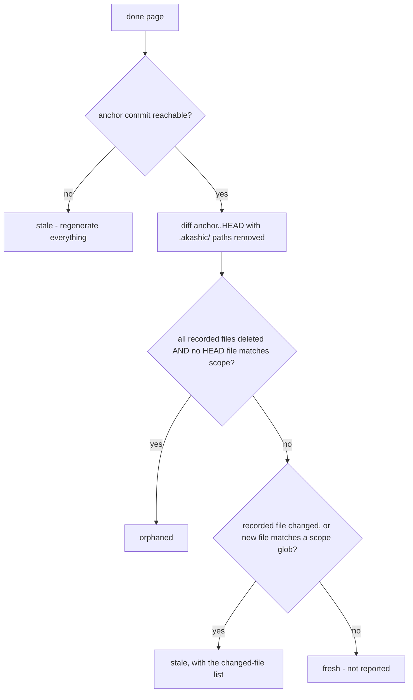

# Deterministic Core

`akashic.py` is the half of akashic-record that must never be hallucinated: file scanning, the diff-to-stale-page mapping, citation verification, and hash/anchor stamping. It never calls an LLM, and the LLM side (catalog planning and page prose, described in [Skill Orchestration](./skill-orchestration.md)) never computes a hash, diff, or line range. The script is stdlib-only Python 3.9+, exposes four subcommands — `scan`, `stale`, `verify`, `anchor` — behind a `-C` directory flag, requires a git repository with at least one commit, and exits 0 on success, 1 on verification failures, 2 on usage or precondition errors. How these commands fit into the overall system is covered in [Project Overview](./index.md).

Sources: [akashic.py:1-29](../../akashic.py#L1-L29), [akashic.py:626-646](../../akashic.py#L626-L646), [akashic.py:67-76](../../akashic.py#L67-L76)

## scan — the planner's filtered view

`scan` prints every file the planner is allowed to see, one `lines<TAB>path` entry per tracked file, preceded by a `# N files, M lines` header. The candidate set is `git ls-files`, so anything gitignored is already gone. On top of that, `is_noise` drops:

- files under vendor directories (`node_modules`, `vendor`, `third_party`) at any depth;
- a small denylist of lockfile names (`package-lock.json`, `pnpm-lock.yaml`, `bun.lockb`, `npm-shrinkwrap.json`, `Pipfile.lock`, `go.sum`);
- noise suffixes: `.lock`, `.min.js`, `.min.css`, `.map`, `.svg`;
- everything under `.akashic/` itself;
- any path matching the catalog's `exclude` globs.

Binary files (NUL byte in the first 8 KiB) and unreadable files are skipped after that. If the surviving count exceeds `max_files` (default 5000), the command dies with instructions to add `exclude` globs rather than silently truncating; entries are emitted sorted by path.

Glob matching via `matches_any` is fnmatch with two gitignore-flavored affordances: a slash-free pattern also matches the basename at any depth (`*.snap` matches `a/b/x.snap`), and a `**/` prefix also matches at the repository root (`**/*.snap` matches `top.snap`).

Sources: [akashic.py:33-38](../../akashic.py#L33-L38), [akashic.py:135-162](../../akashic.py#L135-L162), [akashic.py:165-170](../../akashic.py#L165-L170), [akashic.py:192-197](../../akashic.py#L192-L197), [akashic.py:202-226](../../akashic.py#L202-L226)

## stale — bucket semantics

`stale` is read-only: it prints a JSON report with `anchor`, `head`, `anchor_reachable`, `dirty`, and five page buckets — `stale`, `edited`, `orphaned`, `uncovered`, `missing`. Only pages with `status: "done"` participate.

Two buckets are computed before any diff. `missing` lists done pages whose wiki file is gone. `edited` compares the current normalized-body hash of each page file (CRLF/CR to LF, trailing whitespace stripped per line, trailing newlines stripped) against the `hash` recorded in the catalog — edit detection is independent of git and never guessed from it. If the recorded anchor commit is absent or unreachable, the tool refuses to guess: `anchor_reachable` goes false and every done page is reported stale with an empty `changed` list, on the principle that wasting a regeneration is acceptable but marking stale content fresh is not.

With a reachable anchor, the tool parses `git diff --name-status -M -z anchor..HEAD` into modified/added/deleted/rename sets. Renames land on both sides: both endpoints count as changed (citations to the old path dangle), and the new name counts as an addition for scope matching. A done page is then bucketed:

Sources: [akashic.py:475-511](../../akashic.py#L475-L511)

The orphaned condition is deliberately narrow: a page is orphaned only when everything it documented is deleted *and* nothing in the current HEAD tree matches its scope — a rewritten module is stale, not orphaned.

**Self-dependency exclusion.** Every path under `.akashic/` is stripped from the diff sets and from the HEAD file list (`outside_akashic`) before any bucketing. Wiki artifacts must never be staleness inputs: if the wiki depended on itself, committing it would break the post-anchor invariant immediately.

`uncovered` lists added files that no page claims. `files` entries are exact paths — a recorded root `Makefile` must not shadow a new nested `Makefile` — while `scope` entries are globs; noise (same filter as `scan`, including catalog excludes) and binaries are dropped.

Sources: [akashic.py:426-449](../../akashic.py#L426-L449), [akashic.py:452-531](../../akashic.py#L452-L531), [akashic.py:173-183](../../akashic.py#L173-L183)

## verify — the citation gate

`verify` returns exit 1 with one error line per failure, or prints `verify: ok`. Catalog invariants come first: duplicate page ids, invalid `status` values (only `planned` and `done`), unknown parents, and parent cycles. Page ids are already slug-validated at catalog load, because ids become path components — a non-slug id is a traversal vector.

For each done page it then enforces, in order:

- the wiki file `wiki/<id>.md` exists;
- the first non-empty line is an H1 title;
- the page has at least one `Sources:` line (cite-or-omit — every page cites at least one repo file);
- no Sources block is empty of parseable links.

A Sources block is a paragraph — the `Sources:` line plus continuation lines until a blank line or heading — so wrapped citations count. Fenced code blocks are ignored entirely: an example citation inside a fence is neither verified nor a dependency.

Each citation target is resolved relative to the page file and rejected if it:

- uses a URL scheme (`file://`, `https://`, ...);
- is an absolute path;
- contains control characters;
- resolves outside the repository.

Cited paths must then match git's exact path strings — not the filesystem — because untracked or ignored files can never appear in an anchor-to-HEAD diff (the page would be permanently fresh), and case-insensitive filesystems would accept a wrong-case path the diff intersection would never match. (Paths under `.akashic/` are exempt from the tracked check but must exist.) The file must also exist in the working tree, and any `#L<start>-L<end>` fragment must be a well-formed range with `1 <= start <= end <= file length`.

Relative `.md` links outside Sources blocks are treated as wiki links, and a link into the wiki directory that points at a missing file is a broken-wiki-link error. Wiki files not in the catalog produce a warning only and are left untouched.

Sources: [akashic.py:110-116](../../akashic.py#L110-L116), [akashic.py:231-310](../../akashic.py#L231-L310), [akashic.py:315-421](../../akashic.py#L315-L421)

## anchor — recording state without laundering edits

`anchor` is the only metadata mutation point, and it runs the full verify gate first — any verification error means it refuses to anchor (exit 1). For each done page it recomputes `files` as the union of the page's resolved citations and every tracked file matching its `scope` globs, with `.akashic/` paths excluded on both sides so wiki artifacts can never become page dependencies.

**Hash-preservation rule.** The recorded `hash` permanently means "what the tool wrote". A null hash is the explicit bless signal, set by the orchestrator after writing a page. If the current page text hashes differently from a non-null recorded hash, a human edited the page: `anchor` keeps the *old* hash and warns, because re-hashing would launder the `edited` marker away and let the next update silently overwrite the human's work. Only a null or matching recorded hash gets stamped with the current hash.

Finally it:

- stamps `anchor` (current HEAD) and a `generated` UTC timestamp into the catalog;
- rebuilds `wiki/README.md`, a derived table of contents regenerated on every anchor so it can never drift from the catalog (done pages are links, others are marked *(planned)*, nesting follows `parent`);
- saves the catalog atomically via a temp-file rename;
- warns if the working tree is dirty (the wiki may describe uncommitted code; the recommended flow is commit, then anchor).

Sources: [akashic.py:127-132](../../akashic.py#L127-L132), [akashic.py:536-558](../../akashic.py#L536-L558), [akashic.py:561-621](../../akashic.py#L561-L621)

## What the test suite proves

`test_akashic.py` keeps one check per component, on throwaway git-repo fixtures with stdlib unittest only. The invariants it pins down:

- **Scan filtering**: a source file survives while a binary, a lockfile, an excluded glob, and `.akashic/` itself are all dropped.
- **The canonical incremental mapping**: edit `f1`, delete `f2`, add `f3` yields exactly `{stale: [a], orphaned: [b], uncovered: [f3]}` with empty `edited`/`missing`.
- **Renames**: a rename is stale (citations dangle), never orphaned.
- **Unreachable anchor**: everything regenerates; never guess.
- **The citation gate**: a valid page passes cleanly; out-of-range fragments fail naming the page and line; traversal targets, scheme URLs, untracked-but-on-disk citations, NUL-byte paths (error, not crash), and empty Sources blocks all fail; wrapped Sources paragraphs are verified; fenced example citations are neither verified nor recorded as dependencies.
- **The post-anchor invariant**: after `anchor` and committing its artifacts, all five stale buckets are empty — with `README.md` deliberately in a page's scope to prove the wiki's own derived TOC never basename-matches into a self-dependency — and a manual edit afterwards flips exactly the `edited` bucket. `anchor` refuses (exit 1) on verification failure.
- **Edit protection survives re-anchoring**: a second anchor over a human-edited page keeps the original tool hash; only an explicit `hash: null` bless clears the `edited` state.
- **Trust-boundary loading**: a traversal page id and a string-typed `scope` are rejected at catalog load with exit 2.
- **Glob and coverage semantics**: the `**/` and basename affordances of `matches_any`, and that exact `files` entries do not shadow same-named files at other depths in the `uncovered` report.

Sources: [test_akashic.py:1-7](../../test_akashic.py#L1-L7), [test_akashic.py:67-143](../../test_akashic.py#L67-L143), [test_akashic.py:146-244](../../test_akashic.py#L146-L244), [test_akashic.py:247-387](../../test_akashic.py#L247-L387)

*Generated from commit `6855f70` on 2026-07-16.*
