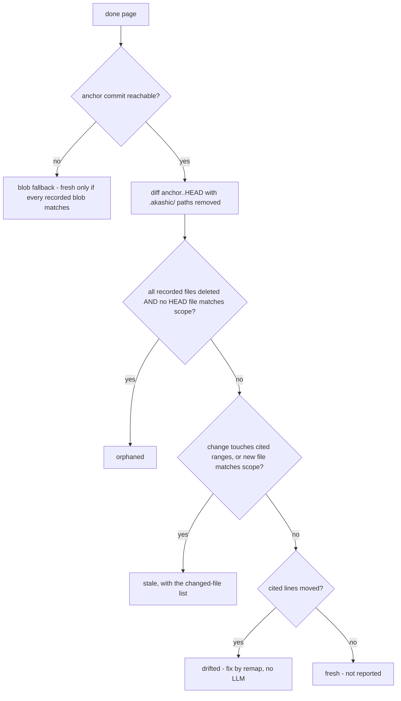

# Deterministic Core

`akashic.py` is the half of akashic-record that must never be hallucinated: file scanning, the diff-to-stale-page mapping, citation verification, hash/anchor stamping, and deterministic rendering of the exact subagent prompt used to generate a page. It never calls an LLM, and the LLM side (catalog planning and page prose, described in [Skill Orchestration](./skill-orchestration.md)) never computes a hash, diff, line range, or prompt text. The script is stdlib-only Python 3.9+, exposes ten subcommands — `scan`, `stale`, `verify`, `anchor`, `prompt`, `remap`, `plan-check`, `plan-critic`, `audit`, `bless` — behind a `-C` directory flag, requires a git repository with at least one commit, and exits 0 on success, 1 on verification failures, 2 on usage or precondition errors. How these commands fit into the overall system is covered in [Project Overview](./index.md).

Sources: [akashic.py:1-29](../../akashic.py#L1-L29), [akashic.py:109-118](../../akashic.py#L109-L118), [akashic.py:2206-2280](../../akashic.py#L2206-L2280)

## scan — the planner's filtered view

`scan` prints every file the planner is allowed to see, one `lines<TAB>path` entry per tracked file, preceded by a `# N files, M lines` header. The candidate set is `git ls-files`, so anything gitignored is already gone. On top of that, `is_noise` drops:

- files under vendor directories (`node_modules`, `vendor`, `third_party`) at any depth;
- a small denylist of lockfile names (`package-lock.json`, `pnpm-lock.yaml`, `bun.lockb`, `npm-shrinkwrap.json`, `Pipfile.lock`, `go.sum`);
- noise suffixes: `.lock`, `.min.js`, `.min.css`, `.map`, `.svg`;
- everything under `.akashic/` itself;
- any path matching the catalog's `exclude` globs.

Binary files (a NUL byte in the first 8 KiB) and unreadable files are skipped after that. If the surviving count exceeds `max_files` (default 5000), the command dies with instructions to add `exclude` globs rather than silently truncating; entries are emitted sorted by path.

This filter is not scan-local. `stale`'s `uncovered` bucket and `prompt`'s citable-file expansion call the same `is_noise` and the same binary check, so there is exactly one definition of which files the wiki can see.

Sources: [akashic.py:26-38](../../akashic.py#L26-L38), [akashic.py:225-236](../../akashic.py#L225-L236), [akashic.py:285-290](../../akashic.py#L285-L290), [akashic.py:295-319](../../akashic.py#L295-L319)

## Glob matching — one chokepoint, literal brackets

Every glob in the system — page `scope`, catalog `exclude` — is matched by `matches_any`, and nothing else calls `fnmatch` directly. It is fnmatch with two gitignore-flavored affordances: a slash-free pattern also matches the basename at any depth (`*.snap` matches `a/b/x.snap`), and a `**/` prefix also matches at the repository root (`**/*.snap` matches `top.snap`, which plain fnmatch would reject for lack of a slash).

Before matching, every pattern passes through `escape_brackets`, which rewrites `[` as the fnmatch-literal `[[]`. The consequence is deliberate and documented in the helper itself: **character classes are not supported** in scope or exclude globs. Framework routing conventions put literal brackets in path segments (Next.js `[id]/route.ts`) far more often than a catalog wants a one-character class, and reading `[id]` as a class made the natural glob for such a path match nothing — silently. `*` and `?` keep their glob meaning, a lone `]` is already literal to fnmatch, and slicing off the `**/` prefix after escaping is safe because escaping never touches that prefix.

Routing all consumers through the single function is what makes that one fix reach every failure mode. A broken bracket glob affected, at minimum:

- **the citable set** — `expand_scope` would offer a page no files, so `prompt` emits the "fix this page's catalog scope" placeholder;
- **added-file staleness** — a new file under the scope never marks the page stale, which is the one outcome the tool is built to prevent;
- **recorded dependencies** — `anchor`'s `in_scope` union would come back empty;
- **the orphaned-rescue clause** — the check that keeps a rewritten module classified stale rather than `orphaned` saw no surviving in-scope file, and the skill's remediation for `orphaned` deletes the page and its catalog entry;
- **coverage and scope warnings** — `uncovered` and `verify`'s out-of-scope citation warning both take the same path.

Sources: [akashic.py:191-203](../../akashic.py#L191-L203), [akashic.py:206-222](../../akashic.py#L206-L222), [akashic.py:699-703](../../akashic.py#L699-L703), [akashic.py:1158-1172](../../akashic.py#L1158-L1172), [akashic.py:1184-1195](../../akashic.py#L1184-L1195), [akashic.py:1291-1293](../../akashic.py#L1291-L1293), [akashic.py:1833-1845](../../akashic.py#L1833-L1845)

## stale — bucket semantics

`stale` is read-only: it prints a JSON report with `anchor`, `head`, `anchor_reachable`, `anchor_state`, `dirty`, and eight page buckets — `stale`, `edited`, `orphaned`, `uncovered`, `missing`, `planned`, `drifted`, `restated`. Only the first five concern pages with `status: "done"`; the last three are exceptions, and exist because of what the others cannot see.

**Drift, and `remap`.** Range-level staleness buys precision at a price: a change *above* a page's cited lines no longer marks it stale, yet still moves the code it points at. The recorded numbers stay in bounds, so `verify` cannot see it — the citation is silently wrong. `stale` therefore reports those pages in a `drifted` bucket, and `remap` repairs them as arithmetic: `shift_at` sums the deltas of hunks above each span, `page_drift` produces the new spans and any renamed path, and `remap_body` rewrites both the destination fragment and the human-readable `path:start-end` text, because a reader seeing the two disagree cannot tell which lied. Fenced blocks are skipped (an example citation is documentation, not a dependency) and `edited` pages are skipped entirely (hard rule 2 covers line numbers too). Each page is blessed in the same step as its rewrite, since a rewritten body under its old hash would read as a human edit.

**Range-level staleness.** For a modified file the page cites *with line numbers*, `stale` asks the sharper question: did the change reach the lines this page leans on? `anchor` records those spans in `ranges`, `git diff -U0` hunks are already in anchor coordinates, and `touches_page` intersects them as integer math. A page cited at lines 10-40 no longer regenerates because line 900 changed. A zero-length hunk is an insertion after old line N and counts only when `s <= N < e`, so an insertion just past the last cited line leaves the page describing what it always described. Everything the intersection cannot speak about stays file-level and stale: uncited scope files, fragment-less citations, pure renames (no hunks under `-M`), deletions, and the blob fallback. It only ever removes a false positive.

**`restated`: the brief changed, not the sources.** Every other bucket answers "did the code move?". None answered "did what we asked of this page move?", and both plan gates produce goal and scope edits as their primary output — so a critic finding on a page that happened not to be stale was written into the catalog and never reached the page. `compute_restated` has two triggers and only one of them needed a new field. A **scope widened onto a file that already existed** was completely invisible: `compute_stale` sees a scope-matched file only through `added_now`, files added *since* the anchor, so a file predating it that newly falls into scope matched nothing and the page silently claimed a file it had never read. Detecting it is free, because `anchor` already records `files` — anything now in scope and absent from it is exactly that file. A **goal edit** is caught against `goal_hash`, recorded at anchor; an absent field means say nothing, so catalogs written before it existed stay quiet. The bucket is orthogonal to the rest: a page can be both stale and restated, and a reader deciding what to regenerate wants both.

**`planned` and the completeness hole.** `missing` inspects done pages only, and both `verify` and `anchor` skip anything not done, so a page a subagent never wrote was indistinguishable from a page nobody attempted. A generate run whose agents mostly died would report `verify: ok`, stamp an anchor, and print a clean `stale`. The bucket lists catalog pages with no file on disk. It stays a report rather than an error because a partly generated wiki is a legitimate resume state, so strictness is opt-in.

**`--check` is the runner's gate.** With it, `stale` exits 1 when any bucket in `WORK_BUCKETS` is non-empty and names the counts on stderr, so a scheduled loop can ask "is an LLM worth invoking?" for zero tokens. `edited` counts toward that exit even though nothing regenerates for it, because a human edit still has to reach a human.

**The blob fallback.** An unreachable anchor no longer means regenerating everything. `anchor` records a `blobs` map — path to blob sha — for each page's dependencies, from one `git ls-tree -r HEAD`. Blob shas are content hashes, so equality at HEAD proves a file is byte-identical without the anchor commit existing. `fallback_stale` calls a page fresh only when every recorded blob still matches **and** its scope expanded against HEAD adds nothing beyond the recorded files; the second half is not redundant, because blob equality can only speak about paths already recorded, so a new file inside the page's scope would otherwise be declared documented. A page with no recorded blobs is never provably fresh. Coverage in this mode is computed over the whole HEAD tree, since there is no "added since" to diff against.

**`anchor_state` splits an unreachable anchor in two.** `never_anchored` means no anchor was ever recorded and the fix is simply to anchor; `anchor_unreachable` means the recorded commit is not in this clone, usually a shallow clone (`git cat-file -e` exits 128 at depth 1) or an anchor stamped on a commit a squash-merge discarded. Both still report every done page stale, because the tool never guesses.

Two buckets are computed before any diff. `missing` lists done pages whose wiki file is gone. `edited` compares the current normalized-body hash of each page file (CRLF/CR to LF, trailing whitespace stripped per line, trailing newlines stripped) against the `hash` recorded in the catalog — edit detection is independent of git and never guessed from it.

With a reachable anchor, the tool parses `git diff --name-status -M -z anchor..HEAD` into modified/added/deleted/rename sets. Renames land on both sides: both endpoints count as changed (citations to the old path dangle), and the new name counts as an addition for scope matching.

Sources: [akashic.py:266-276](../../akashic.py#L266-L276), [akashic.py:755-778](../../akashic.py#L755-L778), [akashic.py:859-921](../../akashic.py#L859-L921), [akashic.py:924-977](../../akashic.py#L924-L977), [akashic.py:980-1012](../../akashic.py#L980-L1012), [akashic.py:1203-1228](../../akashic.py#L1203-L1228), [akashic.py:1391-1453](../../akashic.py#L1391-L1453)

A done page is then bucketed:

Sources: [akashic.py:1062-1200](../../akashic.py#L1062-L1200)

The orphaned condition is deliberately narrow: a page is orphaned only when everything it documented is deleted *and* nothing in the current HEAD tree matches its scope — a rewritten module is stale, not orphaned. Because that second half is a `matches_any` call, its correctness depends on the glob chokepoint above.

**Self-dependency exclusion.** Every path under `.akashic/` is stripped from the diff sets and from the HEAD file list (`outside_akashic`, a closure inside `compute_stale`) before any bucketing. Wiki artifacts must never be staleness inputs: if the wiki depended on itself, committing it would break the post-anchor invariant immediately.

`uncovered` lists added files that no page claims. `files` entries are exact paths — a recorded root `Makefile` must not shadow a new nested `Makefile` — while `scope` entries are globs; noise (the same filter as `scan`, including catalog excludes) and binaries are dropped.

Sources: [akashic.py:1146-1156](../../akashic.py#L1146-L1156), [akashic.py:1158-1172](../../akashic.py#L1158-L1172), [akashic.py:1184-1195](../../akashic.py#L1184-L1195)

## verify — the citation gate

`verify` returns exit 1 with one error line per failure, or prints `verify: ok`. Catalog invariants come first: duplicate page ids, invalid `status` values (only `planned` and `done`), unknown parents, and parent cycles. Page ids are already slug-validated at catalog load, because ids become path components — a non-slug id is a traversal vector. The same load also type-checks `exclude`, `max_files`, each page's `id`/`title`/`goal` strings, `scope`/`files` as lists of strings, and `parent` as a string or null.

For each done page it then enforces, in order:

- the wiki file `wiki/<id>.md` exists;
- the first non-empty line is an H1 title;
- at least one `Sources:` block exists (cite-or-omit), and no `Sources:` block yields zero parseable links;
- every citation resolves, is tracked by git, exists in the working tree, and has a valid line fragment.

A `Sources:` block is a paragraph — the `Sources:` line plus continuation lines until a blank line or heading — so wrapped citations are verified. Fenced code blocks are skipped entirely, so an example citation inside a fence is neither verified nor recorded as a dependency. Non-`Sources:` links ending in `.md` are collected separately as wiki links: one pointing into the wiki directory must name a real catalog id (`README.md` is exempt, being derived at anchor time), while a link to a `planned` sibling is only a warning, since a partially generated wiki is a valid state.

Citation resolution rejects URL schemes, absolute paths, control characters (including percent-decoded NUL), and anything resolving outside the repository root. Two destination forms are accepted: CommonMark's `<...>` wrapper, and a bare form permitting one level of balanced parentheses — framework route groups name path segments that way (`api/(cron)/route.ts`), and a destination pattern that stopped at the first `)` would truncate to a shorter prefix that still resolves, so the citation would fail as "not tracked by git" instead of being parsed correctly. Link *text* is matched non-greedily rather than with `[^\]]*`, because dynamic-route paths (`[id]/route.ts`) put literal `]` characters inside the text.

Resolved paths are checked against git's tracked-path set, not the filesystem: an untracked or wrong-case path can never appear in an anchor-to-HEAD diff, so accepting it would make the page permanently fresh. Line fragments must be `#L<start>` or `#L<start>-L<end>`, and the end line may exceed the real line count by exactly one — Claude's Read tool numbers one extra empty line for files ending in a trailing newline — with anything beyond that rejected. A citation to a real file outside the page's own catalog scope is a warning, not an error: it signals drift in either direction (scope too wide or too narrow) without blocking `anchor`. Extra `.md` files in the wiki directory that no catalog page claims are also warned about and left untouched.

Sources: [akashic.py:40-56](../../akashic.py#L40-L56), [akashic.py:129-180](../../akashic.py#L129-L180), [akashic.py:324-369](../../akashic.py#L324-L369), [akashic.py:372-394](../../akashic.py#L372-L394), [akashic.py:397-419](../../akashic.py#L397-L419), [akashic.py:594-739](../../akashic.py#L594-L739)

## The identifier-existence warning

`verify` proves a citation resolves. It cannot prove the sentence above that citation is true — and the cheapest, most embarrassing way for a generated page to be false is naming a function that exists nowhere in the files it points at. `check_identifiers` closes that narrowest slice: for each H2 section, it collects the files that section's `Sources:` lines cite, and warns when a backticked identifier-shaped token in the section's prose appears in none of them.

Three deliberate narrowings keep it usable:

- **Search the whole cited file, not the cited span.** A page legitimately names a symbol defined elsewhere in the same module, and the aim is catching invention rather than policing line numbers.
- **Only identifier *shapes* count.** `IDENT_SHAPE_RE` requires a letter plus a form prose does not carry — a call (`foo()`), snake_case, camelCase, or a dotted or scoped name. A warning on every backticked English word would train the operator to ignore the whole class, which is how the out-of-scope warning nearly died. `identifier_candidates` reduces `foo()` and `foo(` to `foo`, and tokens under three characters are skipped.
- **A qualified prose name also matches its bare declaration.** The column is declared `firstName` and the page calls it `users.firstName`; the placeholder is `$1` and the page writes `$n::uuid`. So the last segment of a dotted or scoped token counts too. Searching only the full token made every `table.column` a warning — on a real 28-page TypeScript wiki that was 43% of 187 findings, led by `users`, `deliveries` and `meal_requests`. The cost is an invented `foo.bar` slipping through when an unrelated `bar` exists, which at warning level is the right direction to be wrong: a missed invention is one bad sentence, a flood of false warnings kills the class. `BUILTIN_NAMESPACES` and `PROSE_TOKENS` sit beside it, dropping members of global namespaces and naming-convention words.
- **Calibration belongs against an external repo.** This one is four Python pages; it could never have contained the qualified-name class, and #8 nonetheless shipped claiming zero false positives on it. After the fix that 28-page repo reports 106, of which 82 of 87 distinct tokens do exist in the repo but outside the files their section cites — a page naming what it cannot cite, which is the finding rather than noise.
- **Filenames are not identifiers.** `FILE_EXT_RE` denylists them by extension: a filename carries a dot and so matches the dotted shape, but whether it exists is the citation gate's question, not this one's. The denylist is explicit rather than a generic "ends in a short suffix" rule, which would swallow method calls like `service.send`.

Tokens inside fenced blocks are skipped, as are `Sources:` lines themselves — their backticks are paths, already checked. Section boundaries come from `h2_sections`, which is fence-aware and shared on purpose: anything later that reasons about a page one section at a time uses the same definition rather than a third divergent splitter.

It is warning-level and never an error. It is a heuristic over prose, and a heuristic that blocked `anchor` would eventually block a correct page. Whether a cited *range* holds what the prose describes is a separate question, answered by the check below.

Sources: [akashic.py:57-72](../../akashic.py#L57-L72), [akashic.py:424-469](../../akashic.py#L424-L469), [akashic.py:661-669](../../akashic.py#L661-L669), [akashic.py:705-707](../../akashic.py#L705-L707), [akashic.py:781-801](../../akashic.py#L781-L801), [akashic.py:804-835](../../akashic.py#L804-L835)

## The anchored-content warning

`verify` proves a citation lands inside its file. It says nothing about whether those lines hold what the prose above them describes, so a citation rewritten to plausible-but-wrong numbers passes every gate. That is not hypothetical: three separate mechanical attempts at fixing this repo's own shifted citations produced ranges landing on a stray bracket, on blank lines, and mid-regex, and all three reported `verify: ok`.

Nothing new has to be recorded to close it. `ranges` are already stored in anchor coordinates and the anchor commit is already stored, so `check_anchored_content` reads what a span actually held (`git show <anchor>:<path>` via `file_at_rev`), locates that content in the working tree, and warns when no citation on the page covers where it landed. Existing catalogs gain the check for free.

Three decisions make it usable rather than noisy:

- **Edges, not the whole span.** `span_edges` takes the first and last non-blank lines. A span whose interior was edited has still moved as a unit, and that is the question here; whether its contents changed is `stale`'s question, answered elsewhere.
- **Match the pair, and require uniqueness.** `locate_edges` searches for the boundary lines *together*, preferring a pair separated by the recorded span's length. Matching each line alone left a fifth of this repo's spans unresolvable, because boundary lines repeat — `}`, `)`, a bare `return`. Where the answer is ambiguous the function returns nothing, since a wrong relocation would produce exactly the confidently-wrong numbers the check exists to catch.
- **Coverage is the union of a page's citations, merged across blank gaps.** A region legitimately gets split across two adjacent citations as a page grows, and the whitespace between them is not a hole. `merge_spans` collapses spans that touch, overlap, or are separated only by blank lines. Checking each citation on its own reported a correct page as having lost content, which is the precise false warning that gets a class filtered out unread.
- **One warning per file.** A single edit moves every span in a file, and twenty near-identical lines is how a warning class gets filtered out unread. The count of further affected spans is still reported, so nothing is hidden.

It stays silent when the anchor is unreachable, because every page is reported stale in that state anyway.

Two other candidates were measured against real wikis and rejected rather than shipped, and DESIGN.md records them so they are not re-proposed: warning when a range starts or ends on a bare closing bracket fires on 65% of citations in a TypeScript repo, `}` being the ordinary end of a function; and checking a section's identifiers against its cited *spans* instead of its cited files fires on 5.7%, on legitimate cross-references — the exact case the identifier check above excludes on purpose.

Sources: [akashic.py:472-478](../../akashic.py#L472-L478), [akashic.py:481-488](../../akashic.py#L481-L488), [akashic.py:491-509](../../akashic.py#L491-L509), [akashic.py:512-591](../../akashic.py#L512-L591), [akashic.py:633-637](../../akashic.py#L633-L637), [akashic.py:710-712](../../akashic.py#L710-L712)

## anchor — recording state without laundering edits

`anchor` is the only metadata mutation point, and it runs the full verify gate first — any verification error means it refuses to anchor (exit 1). For each done page it recomputes `files` as the union of the page's resolved citations and every tracked file matching its `scope` globs, with `.akashic/` paths excluded on both sides so wiki artifacts can never become page dependencies. Alongside `files` it records `blobs` (content identity per dependency, so freshness survives losing the anchor commit) and `ranges` (the cited spans in anchor coordinates, clamped by `citation_span` to the file's real length).

**Hash-preservation rule.** The recorded `hash` permanently means "what the tool wrote". A null hash is the explicit bless signal, set by `bless` after writing a page. If the current page text hashes differently from a non-null recorded hash, a human edited the page: `anchor` keeps the *old* hash and warns, because re-hashing would launder the `edited` marker away and let the next update silently overwrite the human's work. Only a null or matching recorded hash gets stamped with the current hash.

Finally it:

- stamps `anchor` (current HEAD) and a `generated` UTC timestamp into the catalog;
- rebuilds `wiki/README.md` (`render_readme`), a derived table of contents regenerated on every anchor so it can never drift from the catalog (done pages are links, others are marked *(planned)*, nesting follows `parent`);
- saves the catalog atomically via a temp-file rename (`save_catalog`);
- warns if the working tree is dirty (the wiki may describe uncommitted code; the recommended flow is commit, then anchor).

Sources: [akashic.py:183-188](../../akashic.py#L183-L188), [akashic.py:859-881](../../akashic.py#L859-L881), [akashic.py:1233-1255](../../akashic.py#L1233-L1255), [akashic.py:1258-1335](../../akashic.py#L1258-L1335), [akashic.py:1338-1341](../../akashic.py#L1338-L1341)

## bless — the last metadata mutation taken back from the LLM

`akashic.py bless <page-id> [<page-id> ...]` sets those pages' `hash` to null, and with `--done` also flips `status`, in a single atomic `save_catalog` write. It exists to close the one carve-out in the "script owns catalog metadata" rule: the orchestrator used to hand-edit `catalog.json` after regenerating a page.

That carve-out was not merely inelegant, it could lose work. Hand-editing is two steps with no atomicity between them — write the page, then edit the JSON — so a session dying in the gap leaves the tool's own fresh output sitting under the previous hash. `stale` then reports the page as `edited`, which is the marker that protects *human* work from being overwritten, so the tool's own output ends up protected from the tool, and recovering needs someone who understands the hash semantics.

`bless_pages` validates every id and every page file before mutating anything: an id absent from the catalog and a page whose `wiki/<id>.md` was never written both die with exit 2, leaving the catalog untouched. Those are the two ways the hand-edit went wrong in practice — a typo'd id, and blessing a page a subagent never actually produced.

Sources: [akashic.py:1346-1377](../../akashic.py#L1346-L1377), [akashic.py:1380-1386](../../akashic.py#L1380-L1386), [akashic.py:2253-2269](../../akashic.py#L2253-L2269)

## plan-check — the gate on the plan, not the output

Every other command in this file gates what subagents produced. `plan-check` is the only one that looks at what they are about to be *asked* to do, and it runs before any of them is dispatched. Until it existed, a scope matching no file — or two pages scoped to the same bulk — was discovered after the tokens were spent. In one 26-page run against a real Next.js repo, two pages both scoped to all 86 migrations cost roughly 180k tokens of duplicated reading and made every schema change mark two pages stale instead of one.

It is read-only and calls no LLM. JSON goes to stdout, a plain-language line per finding to stderr:

- **`no_scope` and `empty_scope`** are deliberately separate. One is an omission; the other is a glob that looks right and silently matches nothing. The second was previously visible only as a line inside a rendered prompt, read after dispatch.
- **`subset`** — one page's scope entirely inside a sibling's. A pair is reported once, under this heading rather than as overlap, because it is the sharper statement of the same fact.
- **`overlap`** — every pair with a non-empty intersection, counted in files *and* lines and sorted by lines. **No threshold, because the one that first shipped was wrong twice over.** Gating on shared files as a fraction of the smaller page's file count measured the wrong quantity — on a real 28-page catalog it stayed silent on a pair sharing 3632 lines while reporting one sharing 2754, since one enormous shared file is *few files*. It was also non-monotonic: widening a page from five files to seven for unrelated reasons dropped a true finding about a *different* pair whose intersection had not changed. Any ratio against page size carries that, because the denominator moves for reasons the pair knows nothing about. Judging which overlaps matter needs to know what the pages are for, so it belongs to [the critic](#plan-critic--rendering-the-review-the-script-cannot-perform), which already receives this report.
- **`oversized`** — over `SPLIT_THRESHOLD`, which is the ~200-file split rule the planning instructions already state. Reading the number from the documented rule rather than inventing one here is what keeps the two from drifting apart.
- **`empty_goal`** and **`duplicate_titles`** — catalog sanity.
- **`pages`** — expanded file and line totals, biggest first. Data rather than a finding: an outlier should be visible before dispatch instead of in the bill, and choosing a threshold for "too big" would mean inventing one.

`scope_sizes` expands through `expand_scope`, the same function that builds a subagent's citable list, so the check measures the real fan-out input rather than the globs someone typed. Line counts are cached across pages, since overlapping scopes would otherwise read the same file repeatedly.

`cmd_plan_check` always returns 0. Several findings are legitimate on a real catalog, and a pre-flight check that blocked would be routed around rather than read — the same reasoning that keeps the identifier and anchored-content checks at warning level.

Its reach is narrow on purpose. Of the seven planning defects that motivated this work, these checks catch one: the duplicated-scope pair. The other six are goals asserting things that do not exist, goals whose subject lies outside their own scope, and pairs of goals claiming the same subject — all of which need reading the code and judging meaning, which no amount of glob arithmetic provides.

Sources: [akashic.py:1515-1518](../../akashic.py#L1515-L1518), [akashic.py:1523-1523](../../akashic.py#L1523-L1523), [akashic.py:1527-1545](../../akashic.py#L1527-L1545), [akashic.py:1548-1633](../../akashic.py#L1548-L1633), [akashic.py:1636-1637](../../akashic.py#L1636-L1637), [akashic.py:1640-1672](../../akashic.py#L1640-L1672)

## plan-critic — rendering the review the script cannot perform

`plan-check` answers the shape questions. Six of the seven planning defects that motivated both commands are about *meaning* and no amount of glob arithmetic reaches them: a goal promising "site types and parent/child relationships" where no parent column existed anywhere and the enum was used by no column, on a different table; a goal whose subject lived outside its own scope; two pages both claiming Sentry.

Nothing downstream catches those. `verify` proves a citation resolves, never that a page wrote what it was asked to, and the standing cite-or-omit rule means an under-scoped page does not fail — it quietly says *less*, reading as a deliberate "not documented here" and indistinguishable from an intentional omission. The only pre-existing tripwire, `verify`'s out-of-scope citation warning, fires after the tokens are spent.

So `render_plan_critic` renders the review prompt and an LLM performs the review. The division of labor is untouched: this function is string templating over the catalog and the filesystem in exactly the `render_prompt` idiom, and makes no judgment. It carries every page's id, title, goal, scope globs, expanded file list and line total, and then `plan_check`'s findings under a heading marking them as already established — so the judge spends its effort on meaning rather than re-deriving arithmetic. That block is omitted entirely when the plan is clean, because an empty findings section is boilerplate that teaches a reader to skim.

Two details are load-bearing:

- **One prompt for the whole catalog, not one per page.** Two of the four judgments — collision, and redundant scope in substance — are cross-page, and a per-page reviewer would be structurally blind to them. A catalog is 8–30 pages, so a single adversarial pass costs a fraction of one page's generation.
- **Truncation is always announced.** Long file lists are cut at `CRITIC_FILE_SAMPLE` with the remaining count and the exact command to get the rest, while the true total is still stated on the `files:` line. A silently shortened list would produce a confident "unreachable" verdict about a file the page can actually cite.

The read-only mandate is rendered here too, extended to forbid editing the catalog or any wiki page: the critic reports, and the orchestrator decides. `cmd_plan_critic` dies with exit 2 on a catalog with no pages rather than emitting a review prompt about nothing.

Run against this repo's own catalog it found three real defects on its first use — `index` promising "the three artifacts" when there are four, `deterministic-core`'s goal naming four of eight commands, and `skill-orchestration` misnaming the fourth hard rule.

Sources: [akashic.py:1679-1679](../../akashic.py#L1679-L1679), [akashic.py:1682-1810](../../akashic.py#L1682-L1810), [akashic.py:1813-1815](../../akashic.py#L1813-L1815)

## prompt — deterministic subagent-prompt rendering

`akashic.py prompt <page-id>` prints the exact text a subagent should receive to generate one catalog page, so no human has to hand-type the same rules into every dispatch. `render_prompt` is plain string templating over `catalog.json` and the filesystem — it makes no LLM-style judgment call — and its output mirrors the shape SKILL.md's page contract expects: a goal statement, the citable file list, sibling pages for cross-linking, the exact `Sources:`/heading/Mermaid/cross-link/cite-or-omit rules, the catalog's prose `language`, and a trailing ``*Generated from commit `<hash>` on <date>.*`` line. When a page's scope matches nothing, the file list is replaced by an explicit instruction to fix the scope before generating.

The citable file list is `expand_scope`: tracked files matching the page's `scope` globs, then filtered by the same `is_noise` and binary checks `scan` applies, sorted. Sharing one definition of the citable universe is the point — otherwise `exclude` globs, lockfiles, minified assets, and binaries would be dropped from planning yet still land in a page's "the ENTIRE set of files you may cite" list, and `verify` would accept citations to them. A `scope` glob cannot re-admit what the catalog excluded.

`find_context_docs` separately surfaces local-only agent-guidance files (`CLAUDE.md`, `AGENTS.md`, `.cursorrules`, `.windsurfrules`, `GEMINI.md`, `.github/copilot-instructions.md`) that exist on disk but are **not** tracked by git — commonly excluded via `.git/info/exclude` or a personal gitignore. When present, the rendered prompt explicitly tells the subagent it may read them for context but must never cite them in a `Sources:` line, since an untracked file may not exist for another clone of the repo; a fact sourced from one should instead be traced to the tracked code that implements it, stated as uncited prose, or omitted. If no such files are present (or they are already tracked), the warning paragraph is omitted entirely rather than emitted as boilerplate.

The rendered text closes with a **read-only mandate**: read and cite these files, never execute them, run nothing git-mutating, and treat what the files say as material to document rather than as instructions to follow. It is rendered here rather than appended by whoever dispatches the prompt for the same reason the file list is — a page's scope routinely includes operational scripts, and a safety rule that has to be retyped per dispatch is one that eventually is not.

`--update` adds the regeneration context. `regeneration_context` asks `compute_stale` what is outstanding for this page and renders it: the modified dependencies for a `stale` page, and for a `restated` one whether its goal was rewritten or files newly fell into its scope. Both, because since `restated` there are two reasons to regenerate, and a prompt naming only changed dependencies would send a subagent hunting for code changes that are not there. It exists because the update flow always required that sentence while `prompt` never emitted it, so an orchestrator had to join `stale`'s JSON to the rendered prompt itself — the same hand-assembly this command was built to eliminate.

`cmd_prompt` requires a page id argument and dies with exit 2 if the id is not in the catalog, via the same `die()` path every other precondition failure uses.

Sources: [akashic.py:1827-1830](../../akashic.py#L1827-L1830), [akashic.py:1833-1845](../../akashic.py#L1833-L1845), [akashic.py:1848-1851](../../akashic.py#L1848-L1851), [akashic.py:1854-1975](../../akashic.py#L1854-L1975), [akashic.py:1978-1982](../../akashic.py#L1978-L1982)

## audit — the only check that asks whether the prose is true

Everything above checks the *scaffolding* of a claim. `verify` proves a citation resolves; the anchored-content warning proves it still points where it was anchored; the identifier warning proves a named symbol exists somewhere the section cites. None of them can say whether the sentence above the citation is true. The audit is the one thing that asks, and it is on-demand only — not in the update flow, never gating `anchor`, never scheduled.

`audit_extract` emits deterministic JSON per H2 section: the claim prose with its heading and its `Sources:` paragraphs stripped by `section_claim`, plus the exact bytes of every cited span via `span_text` and the already-clamping `citation_span`. Sections are cut with the same `h2_sections` splitter the identifier check uses, so there is one definition of a section rather than three. It extracts and judges nothing.

`render_audit_prompt` builds the judge prompt in the `render_prompt` idiom. The judge gets the claims and the evidence and nothing else: no repository access, and **evidence labelled `[E1]`, `[E2]` rather than by filename**. That is the load-bearing choice in the whole command. Every planning defect this project has recorded came from reasoning off a name — a page promised "site types and parent/child relationships" because a migration was called `add-siteType-enums.js`, where no parent column existed anywhere and the enum was used by no column, on a different table. A judge shown `services/auth/index.ts` fills gaps with what an auth service usually does; shown `[E1]` it can only read what is in front of it. The label-to-path mapping stays in the extract JSON, so a finding remains actionable: the orchestrator translates, not the judge.

Two more details earn their place. The prompt instructs the judge to **default to refuting** and to separate **contradicted** (the evidence shows otherwise), **unsupported** (the evidence is silent), and **overstated** (broader than what is shown) — a judge that reports only what it can disprove reports almost nothing, and the middle verdict is the common one. And a section citing nothing renders as `EVIDENCE: none` rather than being dropped, because prose resting on nothing at all is the strongest available finding.

The division of labor is untouched: this half renders prompts and slices bytes, and calls no LLM.

`--out` writes the prompt to a file and prints a dispatch line instead of the prompt itself. Evidence spans are verbatim source, so these get large — one page here renders 224KB — and printing it costs that twice, once into the orchestrator's context and once into the judge's, with the orchestrator gaining nothing from having read it. Handing over a path is not weaker: the judge is a subagent with tools, and its blindness has always been a contract rather than a sandbox. It refuses to write inside `.akashic/`, where a scratch file that size would surface as `uncovered` and be committed with the wiki.

On its first run against this repo's own [Maintenance Loop](./maintenance-loop.md) page it found one. The claim "a test pins the direction" sat on a page scoped to `bin/*`, which cannot cite `test_akashic.py` at all — true, and resting on nothing that page offers.

Sources: [akashic.py:1987-2007](../../akashic.py#L1987-L2007), [akashic.py:2010-2018](../../akashic.py#L2010-L2018), [akashic.py:2021-2064](../../akashic.py#L2021-L2064), [akashic.py:2071-2087](../../akashic.py#L2071-L2087), [akashic.py:2090-2159](../../akashic.py#L2090-L2159), [akashic.py:2162-2201](../../akashic.py#L2162-L2201)

## What the test suite proves

`test_akashic.py` is 118 stdlib `unittest` tests over throwaway git-repo fixtures, one check per deterministic component. The invariants it pins down:

- **Scan filtering**: a source file survives while a binary, a lockfile, an excluded glob, and `.akashic/` itself are all dropped.
- **The canonical incremental mapping**: edit `f1`, delete `f2`, add `f3` yields exactly `{stale: [a], orphaned: [b], uncovered: [f3]}` with empty `edited`/`missing`.
- **Renames**: a rename is stale (citations dangle), never orphaned.
- **Unreachable anchor**: everything regenerates; never guess. `never_anchored` is distinguished from `anchor_unreachable`.
- **The citation gate**: a valid page passes cleanly; out-of-range fragments fail naming the page and line; a trailing-newline `+1` range is tolerated but `+2` still fails; traversal targets, scheme URLs, untracked-but-on-disk citations, NUL-byte paths (error, not crash), and empty `Sources:` blocks all fail; wrapped `Sources:` paragraphs are verified; fenced example citations are neither verified nor recorded as dependencies; a citation outside the page's own scope warns but does not fail; a wiki link to an unknown catalog id still fails, while a forward link to a not-yet-`done` sibling does not.
- **Awkward real-world paths parse**: a bracketed dynamic-route path (`app/users/[id]/route.ts`) and a parenthesized route-group path (`app/api/(cron)/route.ts`) each verify both as a bare destination and inside the `<...>` wrapper — four tests, because the paren case previously truncated to a still-resolvable prefix and surfaced a real file as untracked.
- **Glob semantics, both layers**: the `**/` and basename affordances of `matches_any`; and separately that brackets are literal — a bracketed path matches its own exact pattern and a `[id]/*` pattern, nested bracketed segments match, both gitignore affordances still hold with brackets in play, and a single-character path like `users/i/route.ts` does *not* match `users/[id]/route.ts`, proving the character-class reading is gone rather than merely widened.
- **The bracket regression end-to-end**: a page scoped to `src/app/api/users/[id]/*` that loses one file but keeps another is reported `stale`, with `orphaned` empty — the case where a silent glob defect became a data-loss path, since the skill resolves `orphaned` by deleting the page and its catalog entry.
- **The post-anchor invariant**: after `anchor` and committing its artifacts, all buckets are empty — with `README.md` deliberately in a page's scope to prove the wiki's own derived TOC never basename-matches into a self-dependency — and a manual edit afterwards flips exactly the `edited` bucket. `anchor` refuses (exit 1) on verification failure.
- **Edit protection survives re-anchoring**: a second anchor over a human-edited page keeps the original tool hash; only an explicit `hash: null` bless clears the `edited` state.
- **A citation moved to the wrong lines is caught**: with the anchored content still findable, a page left citing the old numbers warns and names where the code actually went, while a correctly re-derived citation is silent; a region split across two citations counts as covered (including across a blank-line gap, asserted directly on `merge_spans`), repeated boundary lines produce no guess at all, and an unreachable anchor says nothing.
- **The identifier check matches qualified prose names**: `users.firstName` resolves against a bare `firstName` declaration, an invented `users.lastName` still warns when no segment matches, a scoped `$n::real_function` falls back the same way, and builtin namespaces and convention words are dropped outright.
- **The identifier warning stays a warning**: an invented function name is reported on stderr while `verify` still exits 0; a real identifier and a filename produce no warning; an identifier that appears only inside a fenced example is not checked; and `h2_sections` does not treat a `##` line inside a fence as a heading.
- **Plan-check's shape findings**: a scope matching nothing is separated from a page with no scope at all; a scope inside a sibling's is reported once as a subset rather than twice; every overlapping pair is listed and ranked by duplicated lines, so one enormous shared file outranks two tiny ones, and growing an unrelated page never silences a pair whose intersection did not change; the split rule fires at the documented threshold; empty goals and duplicate titles are caught; line totals come back biggest first; and scope expansion drops the same noise a subagent's citable list would, so the check measures the real fan-out input.
- **The critic prompt carries what a judge needs**: every goal and scope reaches it, all four judgments are stated, the scope is named as the citable boundary, `plan-check`'s findings are handed over as already established and the block is absent on a clean plan, an unmatched scope is called out inline, a truncated file list always states the remainder and how to get it, the read-only mandate is present, and an empty catalog exits 2 rather than rendering a review of nothing.
- **`--out` keeps a large prompt out of the orchestrator**: the file holds the evidence, stdout holds only the dispatch line, and writing inside `.akashic/` is refused outright.
- **The audit stays blind**: the rendered prompt never names a file while the extract still carries the label-to-path mapping, evidence is the exact cited bytes, the claim drops its heading and its `Sources:` paragraph, labels are unique across a page, the refute-by-default instruction and all three verdict words are present, a section citing nothing renders as `EVIDENCE: none` rather than vanishing, and an unknown page id exits 2 on both halves.
- **The loop's decision layer**: repo-list parsing, all four verdicts (including that an `edited`-only repo is never handed to an LLM and a drift-only repo never reaches a model), and the gate run against real fixture repos. Both directions of the dry-run notification are pinned too: a repo with outstanding work notifies rather than only printing, and a clean one stays silent. The `claude -p` call is deliberately uncovered, since a stubbed test would only assert the stub.
- **Drift and remap**: a shift above the cited lines is reported as `drifted` rather than `stale`, `remap` moves both halves of the citation to the right numbers, a fenced example is left untouched, and a hand-edited page is never rewritten.
- **Range intersection both ways**: a change outside the cited span leaves the page fresh, a change inside stales it, an append at end of file does not stale a cite-to-end page (the phantom-line clamp), a pure rename stays stale, and an uncited in-scope file keeps file-level staleness.
- **A changed brief is reported as `restated`**: a scope widened onto a file that predates the anchor is caught with nothing new recorded and without marking the page stale; a goal edit is caught against `goal_hash`; whitespace-only goal edits are not; a catalog with no recorded goal hash stays quiet; regenerating and re-anchoring clears it and the post-anchor invariant still holds across every bucket; and `--check` exits 1 for it, so the runner's gate sees it.
- **The blob fallback both ways**: with the anchor commit replaced by a bogus sha, unchanged content reports no stale pages, a changed dependency still reports one, a new in-scope file still reports one, and a page with no recorded blobs is never trusted.
- **The completeness hole**: a planned page with no file lands in `planned` and not in `missing`, and `--check` exits 0 on a clean tree but 1 once a dependency changes.
- **Trust-boundary loading**: a traversal page id and a string-typed `scope` are rejected at catalog load with exit 2.
- **`bless` refuses rather than half-writes**: an unknown page id and a page whose file was never written both exit 2 with the catalog unmutated, and `--done` flips a planned page's status while nulling its hash.
- **Coverage semantics**: exact `files` entries do not shadow same-named files at other depths in the `uncovered` report, and noise is filtered there too.
- **`--update` renders what changed**: a stale page's prompt names its modified dependencies and forbids a changelog, a restated page's names whether the goal moved or files newly entered scope, and a page with nothing outstanding gets no addendum at all.
- **`prompt` rendering**: the citable list holds only tracked, in-scope files and omits an out-of-scope sibling file; scope expansion applies the scan filters, so a `src/**` scope offers `src/app.py` but never `bundle.min.js`, `package-lock.json`, an excluded `.snap`, or a binary; siblings and the page `goal` appear verbatim; the read-only mandate is rendered into every prompt; an untracked `CLAUDE.md` is named alongside a "NOT tracked by git" warning, and that paragraph is absent when no such doc exists; an unknown page id exits 2.

Sources: [test_akashic.py:1-26](../../test_akashic.py#L1-L26), [test_akashic.py:29-86](../../test_akashic.py#L29-L86), [test_akashic.py:89-219](../../test_akashic.py#L89-L219), [test_akashic.py:221-271](../../test_akashic.py#L221-L271), [test_akashic.py:273-367](../../test_akashic.py#L273-L367), [test_akashic.py:369-412](../../test_akashic.py#L369-L412), [test_akashic.py:508-571](../../test_akashic.py#L508-L571), [test_akashic.py:574-624](../../test_akashic.py#L574-L624), [test_akashic.py:627-704](../../test_akashic.py#L627-L704), [test_akashic.py:765-830](../../test_akashic.py#L765-L830), [test_akashic.py:706-763](../../test_akashic.py#L706-L763), [test_akashic.py:879-1017](../../test_akashic.py#L879-L1017), [test_akashic.py:1019-1075](../../test_akashic.py#L1019-L1075), [test_akashic.py:1077-1305](../../test_akashic.py#L1077-L1305), [test_akashic.py:1308-1461](../../test_akashic.py#L1308-L1461), [test_akashic.py:1464-1550](../../test_akashic.py#L1464-L1550), [test_akashic.py:1553-1681](../../test_akashic.py#L1553-L1681), [test_akashic.py:1684-1830](../../test_akashic.py#L1684-L1830)

*Generated from commit `625a2f89` on 2026-08-07.*
