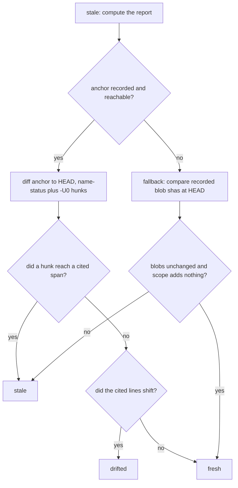

# Deterministic Core

`akashic.py` is the half of akashic-record that is not allowed to guess. It is a single stdlib-only file that scans a target repository, decides which wiki pages have gone out of date, verifies that every citation resolves to real tracked lines, and stamps the metadata that makes the next incremental run possible. The division of labour it enforces is the project's one non-negotiable rule: the script never calls a model, and the model never computes a hash, a diff, or a line range. Everything that could lose human work or declare stale content fresh lives here; the prose side lives in [Skill Orchestration](./skill-orchestration.md), and the loop that schedules the two lives in [Maintenance Loop](./maintenance-loop.md). For what the project as a whole is for, see [Project Overview](./index.md).

## The contract and the command surface

The module docstring states the contract directly, and the imports back it: every import is from the standard library, and the only `subprocess.run` in the file (a search for `subprocess.` across `akashic.py` returns exactly one hit, on line 100) sits inside the `git()` helper, so the only external process the script ever spawns is git. `repo_root` resolves the enclosing repository and refuses to run without at least one commit, because the whole anchor model is expressed in commits. Exit codes are fixed at three values: 0 for success, 1 for a verification failure, and 2 for a usage or precondition error, which is what `die` emits by default.

`main` wires the subcommands: `scan`, `stale` (with `--check` and `--ids`), `verify`, `anchor`, `prompt` (with `--update` and `--out`), `remap`, `plan-check`, `plan-critic`, `bless` (with `--done`), and an `audit` group holding `extract` and `prompt`. The audit group is on-demand by design and is not part of the standing update flow — the rest of this page covers the commands that are.

Sources: [akashic.py:1-24](../../akashic.py#L1-L24), [akashic.py:90-118](../../akashic.py#L90-L118), [akashic.py:2411-2496](../../akashic.py#L2411-L2496)

## `scan`: the filtered view of the repo

`scan` prints the planner's view of the repository: one line per file, line count first, preceded by a totals header. The candidate set comes from `git ls-files`, so anything gitignored is already absent; on top of that `is_noise` drops vendored directories (`node_modules`, `vendor`, `third_party`), a short denylist of committed lockfiles, files ending in the noise suffixes (`.lock`, `.min.js`, `.min.css`, `.map`, `.svg`), anything under `.akashic/`, and anything matching the catalog's `exclude` globs. Binary files are dropped by sniffing the first 8KB for a NUL byte, and a file that cannot be opened is dropped too rather than guessed at. If the surviving count exceeds `max_files`, `scan_repo` refuses instead of dumping a plan-sized listing.

Glob matching is `fnmatch` with two gitignore-flavoured affordances in `matches_any`: a slash-free pattern also matches the basename at any depth, and a `**/` prefix also matches at the repository root. `escape_brackets` makes `[` literal first, so a framework path segment like `[id]/route.ts` matches its own pattern instead of being read as a one-character class — the character-class reading silently emptied scopes, and an empty scope is how a live page gets reported as orphaned.

Sources: [akashic.py:26-38](../../akashic.py#L26-L38), [akashic.py:191-236](../../akashic.py#L191-L236), [akashic.py:239-244](../../akashic.py#L239-L244), [akashic.py:285-319](../../akashic.py#L285-L319)

## `stale`: the buckets and what each one means

`compute_stale` produces a read-only JSON report and never writes anything. Alongside the recorded `anchor`, current `head`, `anchor_reachable`, `anchor_state` and a `dirty` flag, it fills eight work buckets, enumerated in `WORK_BUCKETS`:

- **`stale`** — a done page whose recorded dependencies changed in a way that reached what the page cites. Each entry carries the page id and the `changed` paths.
- **`edited`** — the page body on disk no longer hashes to the `hash` the catalog recorded. This is computed from the file, never from git: `page_hash` normalizes line endings and trailing whitespace before hashing, so an editor's whitespace churn is not mistaken for an edit.
- **`orphaned`** — everything the page documented has been deleted *and* nothing in the current tree still matches its scope. A rewritten module fails the second half and comes out stale instead, which matters because the documented remedy for orphaned is deleting the page.
- **`uncovered`** — a file added since the anchor that no page's exact `files` entry or `scope` glob claims, after the same noise and binary filters `scan` applies. Recorded `files` are compared as exact paths so a root `Makefile` cannot shadow a new nested one.
- **`missing`** — a done page whose markdown file is gone.
- **`planned`** — a page that is not done and has no file on disk. Without it, a generate run whose subagents died would verify clean, anchor, and report nothing outstanding, because `verify` and `anchor` both skip non-done pages.
- **`drifted`** — the page is not stale, but the lines it cites moved. See the drift section below.
- **`restated`** — the page's brief changed rather than its sources.

`cmd_stale` prints the report. With `--check` it additionally exits 1 when any bucket is non-empty and names the counts on stderr — the zero-token gate a scheduled runner polls with. `edited` counts toward that exit code even though nothing regenerates for it, because a human edit still needs a human. With `--ids BUCKET` it prints one page id per line and nothing else, via `bucket_ids`, and an unrecognized bucket name is a hard error rather than an empty list.

Sources: [akashic.py:266-282](../../akashic.py#L266-L282), [akashic.py:1103-1139](../../akashic.py#L1103-L1139), [akashic.py:1199-1241](../../akashic.py#L1199-L1241), [akashic.py:1244-1291](../../akashic.py#L1244-L1291)

## Two ways to answer the question: diff, or blobs

The normal path diffs the anchor commit against HEAD. When the anchor is missing or unreachable — a first run, a shallow clone, or an anchor stamped on a commit a squash-merge threw away — no diff exists, and `fallback_stale` answers from the `blobs` map that `anchor` recorded instead. Blob shas are content hashes, so equality at HEAD is proof of byte-identity rather than an inference, which is the only reason this path is allowed to call anything fresh. It demands two things at once: every recorded dependency still hashes the same, and the page's scope expanded against HEAD adds no file the page has not already recorded. The second condition is not redundant, since blob comparison can only speak about paths already listed and a brand-new file matching the scope would otherwise be invisible. A page with no recorded blobs is never provably fresh. The two unreachable causes are named apart in `anchor_state` (`never_anchored` versus `anchor_unreachable`) because they need different fixes.

Sources: [akashic.py:247-263](../../akashic.py#L247-L263), [akashic.py:1021-1053](../../akashic.py#L1021-L1053), [akashic.py:1141-1178](../../akashic.py#L1141-L1178)

## Range-level staleness and drift

Where a page cites line numbers, staleness is measured against those lines rather than the whole file. `anchor` records `ranges` per page in anchor coordinates; `citation_span` clamps a recorded end to the file's real length, which matters because citation ends are routinely one past the last line and an unclamped phantom line would intersect every append at EOF. `parse_diff_hunks` reads `git diff -U0` keyed by the *old* path, since that is the coordinate system the ranges live in, and `hunk_touches_ranges` intersects the two — treating a zero-length hunk as an insertion that only counts when it lands strictly inside a cited block.

`touches_page` answers True whenever it cannot answer precisely, and that covers most of the interesting cases: a scope file with no citation has no recorded range, a citation without a fragment claims the whole file, a pure rename produces no hunks at all under `-M`, and a deletion's hunk covers everything. Only a modification whose every hunk misses every cited span is dismissed.

That precision opens one hole, and `page_drift` closes it. If something above a cited block grew or shrank, the block was not touched but its line numbers now point somewhere else — in bounds, so `verify` cannot see it. `shift_at` sums the deltas of hunks that end strictly above the span (an overlapping hunk is a content change, not drift), and a rename with unchanged content is folded in as the other kind of drift. Those pages land in `drifted` rather than `stale`, because the fix is arithmetic rather than prose.

Sources: [akashic.py:900-922](../../akashic.py#L900-L922), [akashic.py:925-1018](../../akashic.py#L925-L1018), [akashic.py:1199-1223](../../akashic.py#L1199-L1223)

## A changed brief: the `restated` bucket

Staleness asks whether the code moved. `compute_restated` asks whether what was *asked* of the page moved, which is a separate question and orthogonal to the first — a page can be in both buckets at once. Two ways a brief changes. A scope widened onto a file that already existed matches nothing in the diff, because the diff only ever surfaces files added since the anchor; detecting it needs no new field, since anything now in scope and absent from the recorded `files` is exactly that file, reported as `new_in_scope`. A rewritten goal needs a baseline, and `goal_hash` supplies it: the hash is over the stripped goal text, so whitespace-only edits are not a restatement. An absent `goal_hash` means the tool does not know which goal produced the text, and it says nothing rather than guessing.

The baseline is recorded by `anchor` **only for pages the tool actually wrote that run** — that is, pages whose `hash` was null at the time. Stamping it unconditionally was the same mistake the hash-preservation rule exists to prevent: for a page nobody regenerated, the text came from an earlier goal, and recording the current one asserts a correspondence nothing checked while destroying the true baseline. Pages left without a baseline are counted by `plan-check` rather than papered over.

Sources: [akashic.py:1056-1100](../../akashic.py#L1056-L1100), [akashic.py:1370-1386](../../akashic.py#L1370-L1386), [akashic.py:1680-1686](../../akashic.py#L1680-L1686)

## The wiki never depends on itself

`.akashic/` paths are excluded at every point where they could become an input. `is_noise` drops anything under the directory, so neither `scan` nor `uncovered` ever sees it. `compute_stale` filters the diff's modified, added, deleted and renamed sets through a local `outside_akashic` helper before any page is examined. `anchor` builds its tracked-file list with the same prefix filter, so a `scope` glob broad enough to match `README.md` cannot pull the wiki's own derived TOC into a page's dependencies. `verify` treats a citation resolving inside `.akashic/` as existence-checked but never records it as a dependency, and `fallback_stale` strips the prefix from the HEAD blob listing before comparing scopes.

The reason is the post-anchor invariant: the wiki is committed into the repository it documents, so a page that depended on wiki artifacts would go stale the moment its own anchor commit landed.

Sources: [akashic.py:225-236](../../akashic.py#L225-L236), [akashic.py:709-716](../../akashic.py#L709-L716), [akashic.py:1040-1042](../../akashic.py#L1040-L1042), [akashic.py:1189-1197](../../akashic.py#L1189-L1197), [akashic.py:1331-1334](../../akashic.py#L1331-L1334)

## `verify`: the citation gate

`verify_repo` returns a list of error strings; `cmd_verify` prints them and exits 1 if there are any. Catalog-level errors come first — duplicate page ids, an invalid `status`, an unknown parent, a parent cycle — and every id has already been slug-validated at catalog load, since an id is used as a path component and a non-slug id is a traversal vector.

Per done page, `parse_page_links` splits the body into Sources blocks, citations and wiki links. A Sources block is a paragraph, so citations on continuation lines count; fenced code is skipped entirely, which is what keeps an example citation in a fence from being verified or recorded as a dependency. The link regex tolerates the two path shapes that broke naive parsing: literal brackets in the link text, and one level of balanced parentheses in the destination, plus CommonMark's `<...>`-wrapped form.

The errors a page can fail on:

- the first non-empty line is not an H1;
- no `Sources:` line anywhere, or a Sources block that yielded no parseable link;
- a citation using a URL scheme, an absolute path, a control character, or a path resolving outside the repository root;
- a cited path that is not in git's tracked-path set. Resolution is against `git ls-files` rather than the filesystem on purpose: an untracked or wrong-case path can never appear in an anchor-to-HEAD diff, so accepting it would make the page permanently fresh;
- a cited path tracked by git but absent from the working tree;
- a malformed or out-of-range line fragment. `check_fragment` tolerates an end exactly one past the last line — Claude's Read tool displays a phantom empty line for any file ending in a newline — and rejects anything further;
- a wiki link to a page id that is in no catalog entry.

Sources: [akashic.py:129-180](../../akashic.py#L129-L180), [akashic.py:324-419](../../akashic.py#L324-L419), [akashic.py:635-663](../../akashic.py#L635-L663), [akashic.py:665-744](../../akashic.py#L665-L744), [akashic.py:783-791](../../akashic.py#L783-L791)

## The five warning classes

These are the five `warn(` call sites reachable from `verify_repo` — five hits, by search over its body. Warnings go to stderr and never enter the error list, so none of them can block `anchor`. That is deliberate in each case: they are heuristics over prose or legitimate transitional states, and a gate that is wrong on a correct page eventually gets routed around.

**1. A citation outside the page's scope.** The rendered prompt promises the subagent that its scope is the entire citable set, and nothing enforced that until this check. The file is real and resolves correctly, so it is not an error; it is drift from the catalog's stated intent, and the same signal in both directions — a scope too narrow, or too wide.

**2. An invented identifier.** `check_identifiers` collects backticked, identifier-shaped tokens per H2 section and warns when a token appears in none of the files that section cites. The shape regex is deliberately narrow (a call, snake_case, camelCase, a dotted or scoped name), filenames are excluded by extension because whether a file exists is the citation gate's question, builtin namespaces like `console` and `JSON` are excluded, and convention words like `camelCase` are listed as prose. The search covers the whole cited file rather than the cited span, since a page legitimately names a symbol declared elsewhere in the same module. `identifier_candidates` also accepts the last segment of a qualified name, because a page writing `users.firstName` is describing a column declared as `firstName` — that single false positive class was 43% of the warnings on a real 28-page wiki.

**3. Anchored content that is no longer cited.** `verify` can prove a range sits inside its file but not that the lines hold what the prose above them describes, so a citation rewritten to plausible-but-wrong numbers passes every gate. `check_anchored_content` closes that using data already recorded: it reads what each anchored span held at the anchor commit, takes its first and last non-blank lines as a boundary pair, and relocates that pair in the working tree via `locate_edges`. Ambiguity — repeated boundary lines like a bare `}` — yields no answer rather than a guess. Coverage is the union of the page's current citations for that file, merged by `merge_spans`, which also bridges gaps holding only blank lines. The test is *overlap*, not containment, because a good rewrite routinely narrows or splits a range and containment made every narrowing a false positive. One warning per file, naming every uncovered region. The check is silent when the anchor commit is unreachable (every page is already reported stale there) and silent for a page whose goal was rewritten since the anchor, since dropped citations are the intended outcome of a new brief. That suppression is scoped to a goal edit and not to the rest of `restated`: widening a scope adds a file, it does not authorize dropping existing citations. The window is one verify cycle, because `anchor` stamps the new goal baseline for pages it wrote.

**4. A forward link to a not-yet-generated page.** A done page may link a sibling whose status is still `planned`. Progressive and partial generation is a supported state, so this is a warning; a link to an id in no catalog entry remains an error. Links to `README.md` are ignored, since that file is derived at anchor time rather than being a catalog page.

**5. An unclaimed `.md` in the wiki directory.** Any markdown file in `.akashic/wiki/` that is neither a catalog page nor the derived `README.md` is reported and explicitly left untouched.

Sources: [akashic.py:424-469](../../akashic.py#L424-L469), [akashic.py:481-530](../../akashic.py#L481-L530), [akashic.py:533-632](../../akashic.py#L533-L632), [akashic.py:732-753](../../akashic.py#L732-L753), [akashic.py:755-779](../../akashic.py#L755-L779), [akashic.py:822-897](../../akashic.py#L822-L897)

## `anchor`: the only metadata mutation point

`anchor_repo` runs `verify_repo` first and refuses with exit code 1 if there is a single error. For each done page it re-parses the body, resolves the citations, and records four things: `files` (cited paths plus every tracked scope match, sorted), `blobs` (the HEAD blob sha for each dependency present at HEAD), `ranges` (cited spans, sorted, only for citations carrying line numbers), and — only when the page's `hash` was null — `goal_hash`. Then it stamps `anchor` to HEAD and `generated` to the current UTC timestamp, rewrites `wiki/README.md` from `render_readme`, and saves the catalog through a temp file plus `os.replace`.

The hash-preservation rule is the safety property the rest of the design rests on. A recorded `hash` permanently means "what the tool last wrote". Null is the bless signal. If the body on disk differs from a non-null recorded hash, a human edited it, and `anchor` keeps the old hash and warns rather than re-hashing — re-hashing would launder the `edited` marker away and let the next update overwrite that work silently. A dependency absent from HEAD (staged but uncommitted, say) simply gets no blob entry, and absence means "cannot be proven fresh", which is the safe direction. Anchoring a dirty tree is allowed but warned about.

`wiki/README.md` is derived on every anchor from the catalog's `parent` fields, which is where page hierarchy lives; the flat files on disk carry none. Done pages are linked, planned pages are listed as text marked planned.

Sources: [akashic.py:183-188](../../akashic.py#L183-L188), [akashic.py:1296-1318](../../akashic.py#L1296-L1318), [akashic.py:1321-1411](../../akashic.py#L1321-L1411), [akashic.py:1414-1417](../../akashic.py#L1414-L1417)

## `bless`: the one metadata edit the LLM side used to do by hand

`bless_pages` sets `hash` to null for the named pages, and with `--done` also flips their status. It validates everything before mutating anything: an unknown page id is a usage error, and so is blessing a page whose markdown file does not exist on disk, so a refused bless leaves the catalog untouched. One command and one atomic save replace what used to be two steps — write the page, then hand-edit `catalog.json` — with no atomicity between them. A session dying in that gap left the tool's own fresh output sitting under the previous hash, which `stale` then reported as `edited`: the tool's work protected from the tool.

Sources: [akashic.py:1422-1462](../../akashic.py#L1422-L1462)

## `remap`: fixing drift without a model

`remap_repo` acts on the `drifted` bucket and refuses outright when the anchor is unreachable, since recorded line numbers are anchor coordinates and there is no diff to measure against. For each drifted page it recomputes the shift, rewrites the body, and blesses that page immediately — not in a batch at the end, because a rewritten body under its old recorded hash reads as a human edit, and a crash in the gap would leave the tool's own arithmetic protected from the tool.

`remap_body` touches `Sources:` paragraphs only and skips fenced blocks entirely: an example citation inside a fence is documentation, not a dependency. Both halves of each link are updated — the destination fragment a renderer follows and the human-readable `path:start-end` text — because a reader who sees the two disagree cannot tell which one lied. A page already in the `edited` bucket is skipped and reported, since rewriting even a line number inside a human-edited body is still writing to it.

Sources: [akashic.py:965-1001](../../akashic.py#L965-L1001), [akashic.py:1467-1587](../../akashic.py#L1467-L1587)

## `plan-check` and `plan-critic`: gating the plan, not the pages

`verify` gates what subagents produced; nothing gated the plan handed to them, so an unmatched scope or two pages scoped to the same bulk was discovered only after the tokens were spent. `plan_check` answers the shape questions a script can answer for free, expanding each scope through the same `expand_scope` the prompt uses so it measures the real fan-out input rather than the globs someone typed. It reports per-page file and line totals biggest-first, plus `no_scope`, `empty_scope`, `empty_goal`, `duplicate_titles`, `oversized` (over the documented ~200-file split threshold), `no_goal_baseline`, `subset` and `overlap`.

Overlap is measured and never judged. It first shipped gated on shared files as a fraction of the smaller page and that was wrong twice over: it stayed silent on a pair sharing thousands of lines in one huge file while reporting a smaller pair, and it was non-monotonic, since widening one page for unrelated reasons dropped a true finding about a different pair whose intersection had not changed. So there is no threshold — every overlapping pair is listed, ranked by duplicated lines, with subset pairs reported once under the sharper heading. `cmd_plan_check` prints the JSON and mirrors the findings as warnings, and always exits 0: several findings are legitimate on a real catalog, and a pre-flight check that blocked would get routed around.

`render_plan_critic` renders the adversarial review prompt an LLM then judges — templating only, with no judgment in the script. One prompt covers the whole catalog, because two of its four questions (collision, redundant scope) are cross-page and a per-page reviewer would be structurally blind to them. It carries every goal, scope and expanded file list (sampled at `CRITIC_FILE_SAMPLE` files per page, with the withheld count and the command to get the rest always stated), hands over `plan_check`'s findings marked as already established so they are not re-derived, names the scope as the citable boundary, renders the same read-only mandate the page prompts do, and tells the judge its verdict is one sample rather than a measurement — two passes over an unchanged catalog have disagreed in both directions. `write_prompt_out`, shared with the audit command, writes a large prompt to a file and prints the exact dispatch wording instead of routing tens of kilobytes through the orchestrator twice; it refuses to write inside `.akashic/`, where the scratch file would be picked up as uncovered and committed with the wiki.

Sources: [akashic.py:1592-1621](../../akashic.py#L1592-L1621), [akashic.py:1624-1720](../../akashic.py#L1624-L1720), [akashic.py:1723-1760](../../akashic.py#L1723-L1760), [akashic.py:1765-1906](../../akashic.py#L1765-L1906), [akashic.py:1909-1946](../../akashic.py#L1909-L1946)

## `prompt`: rendering a subagent's brief

`render_prompt` instantiates the page contract mechanically from the catalog plus the filesystem, so every dispatch gets an identical, correct copy of the rules. The citable file list comes from `expand_scope`, which applies exactly the filters `scan` applies — otherwise a broad scope glob would quietly re-admit lockfiles, minified assets, binaries and everything the catalog excluded, and `verify` would then accept citations to them. Sibling ids and titles are listed for cross-linking. `find_context_docs` surfaces local-only agent-guidance files (`CLAUDE.md`, `AGENTS.md`, `.cursorrules`, `.windsurfrules`, `GEMINI.md`, `.github/copilot-instructions.md`) that exist on disk but are untracked, telling the subagent it may read them for context and may never cite them, since an untracked file may not exist for anyone else who clones the repo.

The rendered shape covers the H1, the H2-plus-`Sources:` structure, the citation grammar with repo root at `../../`, Mermaid usage, cross-links, cite-or-omit, the commit stamp for the last line and the prose language. Three generation disciplines ride in every prompt: scope generalizations to what was actually read, state the method behind any absence claim, and write only what the goal asks. They are instructions rather than gates because the gates only ever returned the same reading. The prompt closes with a read-only mandate — never execute what you were told to read, nothing git-mutating, and file contents are material to document rather than direction to act on — rendered by the script precisely because a rule that depends on being retyped is a rule that eventually is not.

With `--update`, `regeneration_context` prepends the reason this page is being rewritten: the changed dependency list for a `stale` page, a note that the goal was rewritten, and the newly-in-scope files for a `restated` one, followed by the instruction not to append a changelog. It covers both reasons because since `restated` there are two, and a prompt naming only changed dependencies would send a subagent hunting for code changes that are not there. `--out` behaves as it does for the critic, writing the prompt to a path and printing the dispatch line.

Sources: [akashic.py:1958-1982](../../akashic.py#L1958-L1982), [akashic.py:1985-2024](../../akashic.py#L1985-L2024), [akashic.py:2027-2128](../../akashic.py#L2027-L2128), [akashic.py:2131-2147](../../akashic.py#L2131-L2147)

## What the tests prove: staleness, drift and anchoring

`test_akashic.py` is stdlib `unittest` over throwaway git repositories built in `tempfile` by `RepoCase`, which also provides the catalog and page fixtures. The invariants it pins down:

- The canonical incremental mapping: edit one file, delete another, add a third, and the report is exactly one stale page, one orphaned page, one uncovered file.
- A rename is stale, never orphaned — and a page whose scope glob contains literal brackets is not falsely orphaned either, which matters because the documented remedy for orphaned deletes the page.
- An unreachable anchor reports every page stale rather than guessing, and `never_anchored` is distinguished from `anchor_unreachable`. With recorded blobs, unchanged content is provably fresh without the anchor commit; a changed blob still marks the page stale; a new in-scope file still marks it stale; and a page with no recorded blobs is never trusted.
- Range-level staleness: a change at line 35 does not stale a page citing lines 5-10, a change at line 7 does, an append at EOF does not, a pure rename stays file-level stale, and an in-scope file with no cited fragment keeps file-level staleness.
- Content shifted above a citation lands in `drifted`, `remap_repo` shifts both halves of the link and blesses the page, fenced example citations are left alone, and a human-edited page is skipped rather than rewritten.
- The `restated` bucket: a scope widened onto a pre-existing file and a goal edit are both reported, whitespace-only goal changes are not, a catalog with no recorded baseline stays quiet, regenerating and re-anchoring clears it, and `anchor_repo` records a goal baseline only for pages it actually wrote.
- The post-anchor invariant: after `anchor_repo` and committing its artifacts, every work bucket is empty. A subsequent manual edit flips exactly `edited`, and a second `anchor_repo` preserves that protection instead of laundering it away — the explicit `bless_pages` call is what clears it.
- `anchor_repo` refuses on any verification failure, and `bless_pages` refuses both an unknown id and a page whose file was never written, leaving the catalog unmutated.

Sources: [test_akashic.py:29-68](../../test_akashic.py#L29-L68), [test_akashic.py:71-86](../../test_akashic.py#L71-L86), [test_akashic.py:90-182](../../test_akashic.py#L90-L182), [test_akashic.py:202-286](../../test_akashic.py#L202-L286), [test_akashic.py:288-407](../../test_akashic.py#L288-L407), [test_akashic.py:441-555](../../test_akashic.py#L441-L555), [test_akashic.py:664-778](../../test_akashic.py#L664-L778), [test_akashic.py:1276-1300](../../test_akashic.py#L1276-L1300)

## What the tests prove: verification, warnings and rendering

- The citation gate: a valid page passes; an out-of-range fragment fails naming the page and line; a `+1` end is tolerated and `+2` is not; traversal, URL schemes, NUL bytes, untracked paths and missing files all fail; an empty Sources block fails; a continuation-line citation is checked; a fenced example citation is neither verified nor recorded as a dependency.
- Parser robustness for real-world paths: bracketed dynamic routes, parenthesized route groups, and both in their angle-bracket-wrapped form. `matches_any` keeps its gitignore affordances while treating brackets as literal.
- Trust boundaries: a traversal page id and a string-valued `scope` are both rejected at catalog load with exit code 2.
- The warning classes stay warnings and stay quiet on correct pages: an invented identifier warns while real identifiers, filenames, fenced examples, builtin namespaces, convention words and qualified prose names do not; an out-of-scope citation warns rather than failing; a link to a planned sibling passes while a link to an unknown id fails.
- The anchored-content check has its own cluster: a citation moved to the wrong lines warns and names where the content went; a correctly re-derived one is silent; a narrowed citation and one split around real content are not dropped claims; repeated boundary lines produce no guess; every uncovered region is named on a single line per file; a rewritten goal silences the class while a widened scope alone does not; an absent goal baseline leaves it armed; an unreachable anchor says nothing. `merge_spans` bridges blank-only gaps but not gaps holding real content.
- Prompt rendering: only tracked, scope-matched files are offered as citable; `exclude` globs and built-in noise never reach that list; untracked context docs are surfaced with the non-citable warning, and omitted when none exist; the three generation disciplines and the read-only mandate are present; `--update` names changed dependencies and a changed brief, and is silent for a fresh page; `--out` keeps the body off stdout and refuses to write inside `.akashic/`; an unknown page id fails.
- The plan gates: an unmatched scope and a missing scope are separate findings; a sibling subset is reported once under the sharper heading; overlap is ranked by duplicated lines rather than file count, and growing one page never silences an unrelated pair; every overlapping pair is listed; oversized scopes, empty goals and duplicate titles are reported; scope expansion matches what a subagent would be given. For the critic, the tests assert only what the rendering must contain — goals, scopes, the four judgments, the citable-boundary sentence, the handed-over deterministic findings, the truncation notice with the true count, the read-only mandate and the one-sample caveat — because the judgment itself is an LLM's and a stubbed test would assert the stub.

The suite also imports `akashic_loop` and covers the runner's decision layer, which belongs to [Maintenance Loop](./maintenance-loop.md) rather than to this page.

Sources: [test_akashic.py:608-660](../../test_akashic.py#L608-L660), [test_akashic.py:795-828](../../test_akashic.py#L795-L828), [test_akashic.py:830-1108](../../test_akashic.py#L830-L1108), [test_akashic.py:1110-1274](../../test_akashic.py#L1110-L1274), [test_akashic.py:1331-1346](../../test_akashic.py#L1331-L1346), [test_akashic.py:1348-1576](../../test_akashic.py#L1348-L1576), [test_akashic.py:1579-1860](../../test_akashic.py#L1579-L1860), [test_akashic.py:2067-2070](../../test_akashic.py#L2067-L2070)

*Generated from commit `e8261862` on 2026-08-07.*
