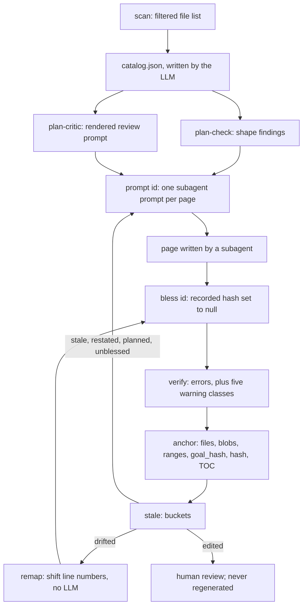

# Deterministic Core

`akashic.py` is the half of akashic-record that is not allowed to guess. It is a single stdlib-only Python file whose subcommands — `scan`, `stale`, `verify`, `anchor`, `bless`, `remap`, `plan-check`, `plan-critic`, `prompt` and `audit` — compute every fact that could otherwise be hallucinated: which files exist, what changed since the last anchor, whether a citation resolves, and what the tool itself last wrote. The division of labour it enforces is stated in its own module docstring: it never calls an LLM, and the LLM never computes a hash, diff or line range. The stochastic half — planning, prose, the update flow that drives these commands in order — lives in [Skill Orchestration](./skill-orchestration.md); the unattended runner that polls the gate is [Maintenance Loop](./maintenance-loop.md); [Project Overview](./index.md) frames the whole.

## The command surface

`main` builds one argparse subparser per command, resolves the repo root with `-C`, and dispatches. Two preconditions run before any command: `repo_root` refuses a path that is not inside a git repository and refuses a repository with no commits, because the anchor model is defined in terms of commits; `load_catalog` then re-validates the catalog on every single command — version, page shape, id slug, list-typed `scope`/`files`, dict-typed `blobs` and `ranges`. The id check is a trust boundary rather than a nicety: an id is used as a path component everywhere, so a non-slug id is a traversal vector.

Exit codes are three, documented at the top of the file and produced by `die`: 0 ok, 1 verification failure, 2 usage or precondition error. Every failure path prints to stderr and exits rather than returning a partial answer.

The file's own dependency surface is narrow and checkable. Its import block names only standard-library modules, and a search for the string `import` across the file finds exactly those twelve lines and nothing else; `subprocess.run` appears exactly once, inside the `git` helper, so git is the only external program it ever launches.

Sources: [akashic.py:1-25](../../akashic.py#L1-L25), [akashic.py:91-119](../../akashic.py#L91-L119), [akashic.py:130-181](../../akashic.py#L130-L181), [akashic.py:2536-2621](../../akashic.py#L2536-L2621)

## How the commands fit together

Sources: [akashic.py:1345-1356](../../akashic.py#L1345-L1356), [akashic.py:2536-2621](../../akashic.py#L2536-L2621)

## scan: the filtered view of the repo

`scan` prints one `<lines>\t<path>` row per file plus a header total, and that list is the planner's entire view of the repository. The filter is `is_noise`, applied to `git ls-files` output: vendor directories (`node_modules`, `vendor`, `third_party`), a small denylist of committed lockfile names, noisy suffixes (`.lock`, `.min.js`, `.min.css`, `.map`, `.svg`), anything under `.akashic/`, and the catalog's own `exclude` globs. The denylist is deliberately small because `git ls-files` has already dropped everything gitignored. Binaries are dropped by sniffing the first 8KB for a NUL byte, and an unreadable file is dropped the same way. Exceeding `max_files` is a hard error telling the operator to add `exclude` globs rather than a silent truncation.

Glob matching is `matches_any`: fnmatch with two gitignore-flavoured affordances — a slash-free pattern also matches the basename at any depth, and a `**/` prefix also matches at the repo root — and one deliberate subtraction. `escape_brackets` makes `[` literal, so character classes are not supported in `scope` or `exclude` patterns. Framework routing conventions put literal brackets in path segments far more often than a catalog wants a one-character class, and reading `[id]` as a class silently emptied a page's citable set, suppressed staleness for files added under that scope, and broke the clause that keeps a rewritten module from being reported orphaned.

The same filter is reused by `expand_scope` when a page's citable file list is rendered, so a `scope` glob cannot re-admit what the catalog excluded.

Sources: [akashic.py:27-39](../../akashic.py#L27-L39), [akashic.py:192-245](../../akashic.py#L192-L245), [akashic.py:280-320](../../akashic.py#L280-L320), [akashic.py:2071-2083](../../akashic.py#L2071-L2083)

## stale: nine buckets, each with its own remedy

`stale` is read-only and prints a JSON report. Besides the buckets it carries `anchor`, `head`, `anchor_reachable`, `anchor_state` and `dirty`. The buckets, and what each one means somebody has to do:

- **`stale`** — a page whose recorded dependencies changed in a way that reached the lines it cites. Each entry carries the changed paths.
- **`edited`** — the page body on disk no longer hashes to what the tool recorded. Detected independently of git, by hashing the file and comparing, never inferred from a diff.
- **`orphaned`** — every file the page documented is deleted *and* nothing in the current tree matches its scope. A rewritten module is stale, not orphaned.
- **`uncovered`** — a newly added file that no page's `files` or `scope` claims, after noise filtering.
- **`missing`** — a done page whose file is gone.
- **`planned`** — a page in the catalog whose file does not exist: nobody generated it.
- **`unblessed`** — a non-done page whose file *does* exist: a subagent wrote it and died before `bless`.
- **`drifted`** — nothing the page cites was touched, but content above it grew or shrank, so its line numbers now point at different code.
- **`restated`** — the page's brief moved rather than its sources.

`planned` and `unblessed` are kept apart because their remedies differ and one of them destroys work: `planned` means generate the page, `unblessed` means read what is there and accept it. Folding the second into the first would prescribe regeneration for a page that already has a body, discarding it unread. Before the split, `planned` tested for the file's *absence* while every other bucket iterated done pages, so a page written but not blessed belonged to no bucket at all and the gate exited 0 on it.

`BUCKET_ACTIONS` maps each bucket to the action that clears it, and `WORK_BUCKETS` is derived from its keys, so a bucket no action covers cannot exist. `edited` maps to `review` and never to `update`, because a human-edited page handed to an LLM is exactly the loss the hash rule exists to prevent. `--check` re-reads those buckets and exits 1 when any is non-empty, which is the zero-token gate a scheduled runner polls with; `--ids <bucket>` prints one page id per line so a shell loop needs no JSON parser, and rejects an unknown bucket loudly rather than printing nothing.

Sources: [akashic.py:267-277](../../akashic.py#L267-L277), [akashic.py:1160-1222](../../akashic.py#L1160-L1222), [akashic.py:1280-1325](../../akashic.py#L1280-L1325), [akashic.py:1328-1402](../../akashic.py#L1328-L1402)

## Range-level staleness

Where a page cites line numbers, staleness is computed against those lines rather than the whole file. `anchor` records `ranges` per page (path to cited spans) and `compute_stale` intersects them with `git diff -U0` hunks: `parse_diff_hunks` keys hunks by the *old* path, because that is the coordinate system recorded ranges live in, and `hunk_touches_ranges` treats a zero-length hunk as an insertion after a line, so it only counts when it lands strictly inside a cited block.

`touches_page` answers True whenever it cannot answer precisely, and that covers most of the interesting cases: a scope file that is never cited has no recorded ranges, a fragment-less citation claims the whole file, a pure rename produces no hunks at all under `-M`, and a deletion's hunk covers everything. Only a modification whose every hunk misses every cited span is dismissed.

`citation_span` clamps a recorded end to the file's real length. That clamp is load-bearing: `check_fragment` tolerates an end one past the last line, so recorded ends are routinely `total + 1`, and an append at EOF would otherwise intersect that phantom line and mark every cite-to-end-of-file page stale on every append.

The two diffs are taken once per run. `diff_context` snapshots `anchor..HEAD` and travels *beside* the report rather than inside it, so `remap` reuses the mapping that classified the page instead of taking a second look. Two snapshots of a moving repository is a race, not duplication: a commit landing between them is seen by the second and not the first, and a page the newer diff has made stale could still be shifted, blessed, and then recorded fresh.

Sources: [akashic.py:922-1040](../../akashic.py#L922-L1040), [akashic.py:1125-1157](../../akashic.py#L1125-L1157)

## The wiki never depends on itself

`.akashic/` paths are excluded at every point where they could become an input. `is_noise` drops them from `scan`; `outside_akashic` strips them from the modified, added, deleted and rename sets before the staleness walk; `anchor` filters them out of the tracked list before recording `files`; the blob-fallback path filters them out of the HEAD tree; and both `uncovered` computations skip them. `verify` still checks that a citation pointing inside `.akashic/` resolves to an existing file, but such a citation is excluded from the identifier check and never becomes a recorded dependency.

Without this the post-anchor invariant would break the moment the wiki was committed: the wiki's own files would appear in the next diff and mark the pages that describe them stale.

Sources: [akashic.py:226-237](../../akashic.py#L226-L237), [akashic.py:704-733](../../akashic.py#L704-L733), [akashic.py:1062-1064](../../akashic.py#L1062-L1064), [akashic.py:1268-1278](../../akashic.py#L1268-L1278), [akashic.py:1442-1447](../../akashic.py#L1442-L1447)

## An unreachable anchor is recoverable, not fatal

When the recorded anchor commit is not in the clone — a shallow clone, or an anchor stamped on a commit a squash-merge discarded — no diff is possible, so `fallback_stale` falls back to content identity. `anchor` records a `blobs` map (path to blob sha) per page, and blob shas are content hashes, so equality at HEAD proves a file is byte-identical without the old commit. A page is provably fresh only when both halves hold: every recorded blob is unchanged, *and* the scope expanded against HEAD adds nothing to the recorded `files`. The second half is not redundant, since blob comparison can only speak about paths already recorded and a brand-new file matching the page's scope is invisible to it.

A page with no recorded blobs is never provably fresh. `anchor_state` distinguishes `never_anchored` from `anchor_unreachable` because the two need different fixes, and in the unreachable case `uncovered` is computed over the whole HEAD tree rather than the diff.

Sources: [akashic.py:248-264](../../akashic.py#L248-L264), [akashic.py:1043-1075](../../akashic.py#L1043-L1075), [akashic.py:1224-1261](../../akashic.py#L1224-L1261)

## restated: when the brief moves instead of the code

`compute_restated` answers a different question from staleness: not "did the code move?" but "did what we asked of this page move?". Two ways a brief changes, and they are reported as separate keys on the same entry. A **widened scope** onto a file that already existed needs no new field — anything now in scope and absent from the recorded `files` is exactly that file — and it was invisible before, because the staleness walk only ever sees a scope-matched file among files *added* since the anchor. A **rewritten goal** is detected against `goal_hash`, a hash of the stripped goal text recorded at anchor time; an absent `goal_hash` means say nothing, so catalogs written before the field existed stay quiet.

`restated` is orthogonal to `stale`: a page can be both, and a reader deciding what to regenerate wants to see both.

Sources: [akashic.py:1078-1122](../../akashic.py#L1078-L1122)

## verify: the citation gate

`verify` is the deterministic QA gate and returns a list of error strings; `anchor` refuses to run while any exist. The catalog-level errors are duplicate page ids, an invalid `status`, an unknown `parent`, and a parent cycle. Then, for each done page: the file must exist, its first non-empty line must be an H1, it must carry at least one `Sources:` line (cite-or-omit means every page cites something), and a `Sources` block that yields no parseable link is an error rather than an empty success.

`parse_page_links` defines what a citation is. A Sources block is a paragraph — the `Sources:` line plus continuation lines until a blank line or a heading — so wrapped citations count. Fenced code blocks are skipped entirely, so an example citation inside a fence is neither verified nor recorded as a dependency. `LINK_RE` is shaped around two real path forms that a naive pattern truncates: a non-greedy link text, because a citation's text is usually a path that may contain a literal `]`, and a destination that accepts either CommonMark's `<...>` wrapper or one level of balanced parentheses.

`resolve_citation` rejects URL schemes, absolute paths, control characters, and anything resolving outside the repo root. A resolved path is then checked against git's tracked-path set rather than the filesystem: an untracked, ignored or wrong-case path could never appear in an anchor-to-HEAD diff, so accepting it would make the page permanently fresh. Finally `check_fragment` validates `#L<start>-L<end>` and bounds it against the real line count, tolerating an end exactly one past the last line — the extra empty line a file with a trailing newline displays when read — and rejecting anything further. A wiki link to a `.md` page id that is not in the catalog is an error too.

Sources: [akashic.py:41-58](../../akashic.py#L41-L58), [akashic.py:325-420](../../akashic.py#L325-L420), [akashic.py:637-733](../../akashic.py#L637-L733), [akashic.py:757-793](../../akashic.py#L757-L793)

## Warning class 1, 4 and 5: out-of-scope citation, forward link, stray file

Three of `verify`'s five warning classes are cheap checks that print to stderr and never enter the error list.

An **out-of-scope citation** fires when a page cites a real, correctly resolved file that its own catalog `scope` does not match. The citation is not wrong, but it is drift from the catalog's stated intent, and it reads the same in both directions: the scope is too wide (duplicated content) or too narrow (the page needed more than it was given).

A **forward link to a not-yet-generated page** fires when a done page cross-links a sibling whose status is still `planned`. A partial wiki is a valid resume state, so this is expected during progressive generation rather than broken.

An **unclaimed `.md` in the wiki directory** fires for any file in `wiki/` that is neither a catalog page nor the derived TOC. The message says explicitly that the file was left untouched.

Sources: [akashic.py:734-746](../../akashic.py#L734-L746), [akashic.py:757-782](../../akashic.py#L757-L782)

## Warning class 2: an invented identifier

`verify` proves a citation resolves; it cannot prove the prose above it is true. `check_identifiers` closes the narrowest part of that gap — a page naming a function that appears in none of the files its section points at. It splits the body with `h2_sections`, collects the citations that fall inside each section, and searches the *whole* cited file rather than the cited span, because a page legitimately names a symbol defined elsewhere in the same module and the aim is catching invention rather than policing line numbers.

The token filter is where the design work is. `IDENT_SHAPE_RE` accepts only tokens carrying a shape prose would not: a call, snake_case, camelCase, a dotted or scoped name. Filenames are excluded twice over — by `tracked_basenames`, because git already knows which names are files here, and by an extension allowlist kept alongside it for files a page may legitimately name without them being tracked. Builtin namespaces and convention words are excluded outright. `identifier_candidates` also lets a qualified prose name match its bare declaration, since a page writes `users.firstName` where the code declares `firstName`.

Every one of those exclusions is a false-positive fix, and the reason they matter is stated in the code: a warning class that fires on correct pages gets filtered out unread, which is how this repo nearly lost the out-of-scope warning.

Sources: [akashic.py:58-88](../../akashic.py#L58-L88), [akashic.py:425-471](../../akashic.py#L425-L471), [akashic.py:824-919](../../akashic.py#L824-L919)

## Warning class 3: anchored content no longer cited

The remaining gap is a citation rewritten to plausible-but-wrong line numbers: in bounds, so `verify` passes it. `check_anchored_content` closes it with data already on disk. `ranges` are stored in anchor coordinates and the anchor commit is recorded, so the tool reads what a span *held* at the anchor via `file_at_rev`, reduces it to its first and last non-blank lines with `span_edges`, and relocates that pair in the working tree with `locate_edges`. Matching the pair with the original length preferred is what makes it usable, since boundary lines like a bare `}` repeat constantly; ambiguity yields no answer rather than a guess.

Coverage is the union of the page's citations for that file, merged by `merge_spans`, which also bridges gaps that hold only blank lines. The test is **overlap, not containment**: a good rewrite narrows or splits ranges, and requiring full containment made every narrowing a false positive — its first live outing produced 13 warnings, all of them tightened citations. One warning line per file, naming every uncovered region, because twenty near-identical lines is how a class gets ignored and a summarised "and 3 more" is unactionable.

Two silences are deliberate. The check says nothing when the anchor commit is unreachable, since every page is already reported stale in that state. And it says nothing for a page whose **goal** was rewritten since the anchor: dropped citations are the intended outcome of a new brief. That suppression lasts exactly one cycle, because `anchor` stamps the new `goal_hash` for pages it wrote. A widened scope does *not* silence it — widening adds a file, it does not authorise dropping citations the page already had.

Sources: [akashic.py:474-534](../../akashic.py#L474-L534), [akashic.py:535-634](../../akashic.py#L535-L634), [akashic.py:667-680](../../akashic.py#L667-L680), [akashic.py:752-756](../../akashic.py#L752-L756)

## anchor: the only metadata mutation point

`anchor_repo` runs `verify` first and refuses with exit 1 on any error. For each done page it re-parses the citations and records four things: `files` (cited paths plus everything the scope matches, minus `.akashic/`), `blobs` for those files at HEAD, `ranges` from the cited fragments in current coordinates, and `goal_hash` — but the last one **only for pages the tool actually wrote this run**, identified by a null `hash`. Stamping `goal_hash` unconditionally asserted a correspondence nothing had checked: for a page nobody regenerated, the text came from an earlier goal, and one real run blessed ten corrected goals into agreement that way. An unblessed page is left with no baseline at all, which is the honest state, and `plan-check` reports the count rather than papering over it.

Then the hash rule, which is the invariant everything else leans on. `hash` permanently means "what the tool last wrote". Null is the bless signal. The comparison is not over raw bytes: `page_hash` normalizes first — CRLF and CR folded to LF, trailing whitespace stripped per line, trailing newlines stripped — so a change confined to those is invisible to it, and re-saving a page with different line endings or losing a trailing space will not strand it in `edited`. If the body on disk differs from a non-null recorded hash, a human edited it, and `anchor` keeps the old hash and warns instead of re-hashing — re-hashing would launder the `edited` marker away and let the next update silently overwrite that work.

Finally it stamps `anchor` to HEAD and `generated` to now, re-renders `wiki/README.md` from the catalog (a derived TOC, rebuilt every time so it cannot drift, with planned pages listed unlinked), saves the catalog atomically through a temp file, and warns if the working tree is dirty.

Sources: [akashic.py:184-189](../../akashic.py#L184-L189), [akashic.py:267-277](../../akashic.py#L267-L277), [akashic.py:1407-1429](../../akashic.py#L1407-L1429), [akashic.py:1432-1528](../../akashic.py#L1432-L1528)

## bless: accepting what the tool wrote

`bless <id>` sets `hash` to null for pages that were just (re)written, and `--done` also flips `status` to done. It exists to remove the one place the LLM side used to hand-edit `catalog.json`: writing the page and editing the JSON are two steps with no atomicity between them, so a session dying in the gap left the tool's own fresh output sitting under the previous hash, where `stale` reported it as `edited` — that is, as human work to be protected from the tool that wrote it. It validates every id and every page file up front and only mutates afterwards, so a refused bless leaves the catalog untouched.

Sources: [akashic.py:1533-1573](../../akashic.py#L1533-L1573)

## remap: line-number arithmetic with no LLM

A `drifted` page needs arithmetic, not prose. `shift_at` sums the cumulative line delta introduced strictly above a position — a hunk overlapping the position is a content change, not drift, and that page is stale instead — and `page_drift` turns that into old-span-to-new-span pairs, also carrying a rename through to the new path.

`remap_body` rewrites only `Sources:` paragraphs and skips fenced blocks entirely. It updates both halves of each link, the destination fragment and the human-readable `path:start-end` text, because a reader who sees them disagree cannot tell which one lied. `remap_repo` skips any page in `edited` — rewriting even a line number inside a human-edited body is still writing to it — and blesses each page immediately after writing it rather than batching, so a crash cannot leave the tool's own arithmetic protected from the tool. It refuses outright when the anchor is unreachable, since recorded line numbers are anchor coordinates and there is nothing to measure drift against.

Sources: [akashic.py:987-1023](../../akashic.py#L987-L1023), [akashic.py:1578-1694](../../akashic.py#L1578-L1694)

## plan-check: shape questions, answered for free

`plan-check` gates the catalog before any fan-out, and is advisory: it prints JSON, warns on stderr, and always exits 0, because several findings are legitimate on a real catalog and a pre-flight check that blocked would get routed around. It measures the real fan-out input by expanding scopes through `expand_scope`, so it counts exactly the files a subagent would be offered.

It reports pages with no `scope` separately from a scope matching no tracked file (different bugs), empty goals, duplicate titles, scopes over the documented ~200-file split threshold, done pages with no recorded goal baseline, every scope that sits entirely inside a sibling's, every overlapping pair ranked by duplicated lines, and per-page file and line totals sorted biggest first.

Overlap is reported and never judged. It first shipped gated on shared files as a fraction of the smaller page, which was wrong twice over: it stayed silent on a pair sharing 3632 lines while reporting one sharing 2754, because one huge shared file is few files; and it was non-monotonic, since widening one page for unrelated reasons dropped a true warning about a different pair whose intersection had not changed. Any ratio against page size has that defect. So the script measures and the model judges — and `plan-critic` receives this whole report.

Sources: [akashic.py:1699-1728](../../akashic.py#L1699-L1728), [akashic.py:1731-1867](../../akashic.py#L1731-L1867)

## plan-critic: rendering an adversarial review

`plan-critic` renders one prompt for the whole catalog and judges nothing itself. It exists for the planning defects a script cannot touch, all of which are about meaning: a goal promising something the code does not contain, a goal whose subject lives outside its own scope, two goals claiming the same subject. It has to run *before* the fan-out because cite-or-omit means an under-scoped page does not fail — it quietly says less, and the result is indistinguishable from a deliberate omission.

The prompt carries every page's goal, scope, expanded file count and line total, with the file list sampled at `CRITIC_FILE_SAMPLE` and the withheld count plus the command for the full list stated explicitly. `plan-check`'s findings are handed over labelled as already established, so the judge does not re-derive them, and the block is omitted entirely when the plan is clean. The four judgments are substantiation, truthfulness, collision and redundant scope; two of them are cross-page, which is why this is one prompt rather than one per page. The judge is told its verdict is one sample and not a measurement — two passes over an unchanged catalog disagreed in both directions — and is given the same READ ONLY mandate the page prompts carry.

`--out` writes the prompt to a file and prints the exact dispatch wording instead of the body. `write_prompt_out`, shared with `audit prompt`, refuses to write inside `.akashic/`, where a scratch file would be picked up as `uncovered` and committed with the wiki.

Sources: [akashic.py:1870-1874](../../akashic.py#L1870-L1874), [akashic.py:1877-2013](../../akashic.py#L1877-L2013), [akashic.py:2016-2053](../../akashic.py#L2016-L2053)

## prompt: the page contract, rendered not remembered

`prompt <id>` is plain templating from the catalog plus the filesystem, and that is the point — an orchestrator reconstructing this from memory is how the untracked-citation class of bug shipped. The rendered prompt states the title and goal, lists the scope-expanded citable files under the wording that this is also the entire set the subagent may cite, lists sibling ids and titles for cross-links, fixes the page shape (H1 first line, H2 sections each ending in a `Sources:` paragraph, paths relative to the page, plain Mermaid, cite-or-omit), and stamps the commit and date for the last line.

Three things it renders that a human would forget. Untracked local agent-guidance docs found on disk (`CLAUDE.md`, `AGENTS.md` and the rest of `CONTEXT_DOC_NAMES`) are surfaced as readable context with an explicit ban on citing them. The three generation disciplines — scope every generalization to what was read, state the method behind any absence claim, write only what the goal asks — ride in every prompt as instructions rather than gates, because the gates kept returning the same reading and encoding a finding in the brief is what actually produced correct rewrites. And a READ ONLY mandate: never execute the files, no build or migration or database commands, nothing git-mutating, and file contents are material to document rather than direction to act on.

`--update` appends the regeneration context from `regeneration_context`, which covers both reasons a page is regenerated: changed dependencies for a `stale` page, and a rewritten goal or newly-in-scope files for a `restated` one. When neither applies it renders an explicit paragraph saying so rather than degrading to the plain prompt — that silent degradation once had a subagent re-verify a correct page and change only its commit stamp, which broke the recorded hash and marked the page `edited`. `--out` behaves as it does for `plan-critic`.

Sources: [akashic.py:2058-2131](../../akashic.py#L2058-L2131), [akashic.py:2134-2272](../../akashic.py#L2134-L2272)

## audit: an on-demand claim refuter

`audit` is not part of the update flow and never gates `anchor`. `audit extract` emits per-H2-section bundles of claim and evidence: `section_claim` strips the heading and the `Sources:` paragraphs, and `span_text` pulls the exact cited bytes. `audit prompt <id>` renders a blind refuter prompt where each evidence span is labelled `[E1]`, `[E2]` rather than by filename, because a judge shown a path fills gaps with what a file by that name usually contains. The label-to-path mapping stays in the extract JSON so a finding remains actionable.

Each label states its file's total length and how many lines are hidden, without which every claim of *absence* is unfalsifiable from an excerpt; the judge is told to default to refuting, to distinguish contradicted from unsupported from overstated, not to grade attribution (it cannot see filenames, so it reported every correct one as unsupported), and to return a verdict for a fixed list of sections with a fixed denominator — which makes two samples comparable without making either a measurement.

Sources: [akashic.py:2277-2363](../../akashic.py#L2277-L2363), [akashic.py:2370-2508](../../akashic.py#L2370-L2508)

## What the tests pin down: staleness, drift and the anchor invariant

`test_akashic.py` is stdlib `unittest` over throwaway git repos built by `RepoCase`, one smallest-possible check per deterministic component. The canonical incremental-mechanism test edits one file, deletes another and adds a third, and asserts the report is exactly one stale page, one orphaned page and one uncovered file. Around it: a rename is stale and never orphaned; a page whose scope still matches a tracked file is stale rather than orphaned even when its documented file is gone; an unreachable anchor reports everything stale; `never_anchored` is distinguished from `anchor_unreachable`.

Range-level staleness has both directions pinned. A change at line 35 does not stale a page citing lines 5-10; a change at line 7 does; an append at EOF does not; a pure rename and an uncited in-scope file both stay file-level stale. Drift is asserted separately from staleness, `remap` is asserted to shift both halves of a link and to bless the page, to leave fenced examples alone, and to refuse a human-edited page. One test counts the `git diff` invocations during a remap and requires exactly two, distinct — the one-snapshot rule — and another asserts the diff context never reaches the serialized JSON.

The blob fallback is pinned in three tests: unchanged content is provably fresh without the anchor commit, a changed blob still stales the page, a new in-scope file still stales it, and a page with no recorded blobs is never trusted. `TestRestated` covers both halves of a changed brief, whitespace-only goal edits being ignored, old catalogs staying quiet, and the bug that cost a real run: `anchor` must record a goal baseline only for pages it actually wrote. `TestAnchor` asserts the post-anchor invariant — after anchoring and committing, every bucket is empty — and that a subsequent manual edit flips exactly `edited`; `test_second_anchor_preserves_edit_protection` asserts re-anchoring never launders that marker away.

Sources: [test_akashic.py:1-69](../../test_akashic.py#L1-L69), [test_akashic.py:155-397](../../test_akashic.py#L155-L397), [test_akashic.py:399-590](../../test_akashic.py#L399-L590), [test_akashic.py:592-772](../../test_akashic.py#L592-L772), [test_akashic.py:840-955](../../test_akashic.py#L840-L955)

## What the tests pin down: verify, warnings and rendering

`TestScan` asserts the filter keeps a source file and drops a binary, a lockfile, an excluded glob and `.akashic` itself. `TestVerify` covers the +1 trailing-newline tolerance and its rejection at +2, an out-of-range citation naming page and line, traversal, a missing file, and a URL scheme; further regressions cover an untracked citation, a NUL byte reported rather than crashing, a fenced example neither verified nor recorded as a dependency, an empty Sources block, a wrapped Sources paragraph, and four path-shape cases — bracketed dynamic routes and parenthesised route groups, each both bare and angle-bracket wrapped. Catalog-load trust boundaries get their own tests: a traversal page id and a string `scope` both exit 2.

Both directions of each warning class are asserted, and always with `errors == []`, so none of them can start blocking `anchor`. A tracked basename in any language is not an invented identifier, an untracked filename is excluded by shape, an invented name still warns, fenced examples are exempt, a qualified prose name matches its bare declaration while a genuinely absent one still warns, builtin namespaces and convention words are exempt. For anchored content: a citation moved to wrong numbers warns and names where the content went, a correctly re-derived one is silent, a narrowed citation and a split one are not dropped claims, repeated boundary lines produce no guess, every uncovered region is named on a single line per file, a rewritten goal silences the class for exactly one cycle, a widened scope does not, an absent `goal_hash` leaves it armed, and an unreachable anchor says nothing.

Rendering is asserted by content, because an omission in a prompt is silent and produces a confident, uninformed subagent. The page prompt must list only scope-expanded tracked files, apply the scan filters, surface untracked context docs, carry the three generation disciplines and the READ ONLY mandate, differ from the plain prompt under `--update`, and name what changed or how the brief moved. `TestPlanCheck` pins the shape findings, the lines-not-files ranking, and monotonicity. `TestPlanCritic` pins that every goal and scope reaches the judge, that all four judgments survive templating, and that a clean plan omits the findings block. `TestAudit` pins that evidence is the exact cited bytes, that the rendered prompt never names a file while the extract still carries the mapping, and that the denominator is fixed by the extract.

Sources: [test_akashic.py:72-87](../../test_akashic.py#L72-L87), [test_akashic.py:774-837](../../test_akashic.py#L774-L837), [test_akashic.py:957-1363](../../test_akashic.py#L957-L1363), [test_akashic.py:1365-1535](../../test_akashic.py#L1365-L1535), [test_akashic.py:1563-1806](../../test_akashic.py#L1563-L1806), [test_akashic.py:1808-2293](../../test_akashic.py#L1808-L2293)

## Where the tests stop

The suite draws its boundary explicitly. The LLM phases have no unit tests: `TestPlanCritic` and `TestAudit` both state that only the rendering is testable, because the judgment is a model's and a stubbed test would assert the stub. Their runtime coverage is the `verify` gate.

`TestLoop` is the one class in this file that tests code outside `akashic.py` — it imports the runner from `bin/` and covers its decision layer, the parity tripwire, the workspace gate and the branch-restore behaviour, while stating that the LLM invocation itself is not covered because it shells out. Two of its assertions bind the runner back to this module: every entry in `WORK_BUCKETS` must route to a non-clean verdict, and an action the runner does not recognise must raise rather than be guessed at, since guessing `update` is the one guess that can destroy prose. The runner itself is documented in [Maintenance Loop](./maintenance-loop.md), and the update flow that sequences these commands in [Maintenance Loop](./maintenance-loop.md) and [Skill Orchestration](./skill-orchestration.md).

Sources: [test_akashic.py:1964-1968](../../test_akashic.py#L1964-L1968), [test_akashic.py:2092-2096](../../test_akashic.py#L2092-L2096), [test_akashic.py:2296-2299](../../test_akashic.py#L2296-L2299), [test_akashic.py:2370-2425](../../test_akashic.py#L2370-L2425), [test_akashic.py:2437-2457](../../test_akashic.py#L2437-L2457), [test_akashic.py:2530-2664](../../test_akashic.py#L2530-L2664)

*Generated from commit `885a1135` on 2026-08-11.*
