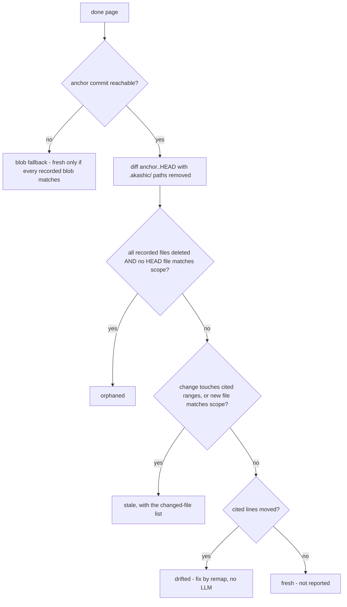

# Deterministic Core

`akashic.py` is the half of akashic-record that must never be hallucinated: file scanning, the diff-to-stale-page mapping, citation verification, hash/anchor stamping, and deterministic rendering of the exact subagent prompt used to generate a page. It never calls an LLM, and the LLM side (catalog planning and page prose, described in [Skill Orchestration](./skill-orchestration.md)) never computes a hash, diff, line range, or prompt text. The script is stdlib-only Python 3.9+, exposes seven subcommands — `scan`, `stale`, `verify`, `anchor`, `prompt`, `remap`, `bless` — behind a `-C` directory flag, requires a git repository with at least one commit, and exits 0 on success, 1 on verification failures, 2 on usage or precondition errors. How these commands fit into the overall system is covered in [Project Overview](./index.md).

Sources: [akashic.py:1-29](../../akashic.py#L1-L29), [akashic.py:95-104](../../akashic.py#L95-L104), [akashic.py:1395-1438](../../akashic.py#L1395-L1438)

## scan — the planner's filtered view

`scan` prints every file the planner is allowed to see, one `lines<TAB>path` entry per tracked file, preceded by a `# N files, M lines` header. The candidate set is `git ls-files`, so anything gitignored is already gone. On top of that, `is_noise` drops:

- files under vendor directories (`node_modules`, `vendor`, `third_party`) at any depth;
- a small denylist of lockfile names (`package-lock.json`, `pnpm-lock.yaml`, `bun.lockb`, `npm-shrinkwrap.json`, `Pipfile.lock`, `go.sum`);
- noise suffixes: `.lock`, `.min.js`, `.min.css`, `.map`, `.svg`;
- everything under `.akashic/` itself;
- any path matching the catalog's `exclude` globs.

Binary files (a NUL byte in the first 8 KiB) and unreadable files are skipped after that. If the surviving count exceeds `max_files` (default 5000), the command dies with instructions to add `exclude` globs rather than silently truncating; entries are emitted sorted by path.

This filter is not scan-local. `stale`'s `uncovered` bucket and `prompt`'s citable-file expansion call the same `is_noise` and the same binary check, so there is exactly one definition of which files the wiki can see.

Sources: [akashic.py:26-38](../../akashic.py#L26-L38), [akashic.py:211-222](../../akashic.py#L211-L222), [akashic.py:271-276](../../akashic.py#L271-L276), [akashic.py:281-305](../../akashic.py#L281-L305)

## Glob matching — one chokepoint, literal brackets

Every glob in the system — page `scope`, catalog `exclude` — is matched by `matches_any`, and nothing else calls `fnmatch` directly. It is fnmatch with two gitignore-flavored affordances: a slash-free pattern also matches the basename at any depth (`*.snap` matches `a/b/x.snap`), and a `**/` prefix also matches at the repository root (`**/*.snap` matches `top.snap`, which plain fnmatch would reject for lack of a slash).

Before matching, every pattern passes through `escape_brackets`, which rewrites `[` as the fnmatch-literal `[[]`. The consequence is deliberate and documented in the helper itself: **character classes are not supported** in scope or exclude globs. Framework routing conventions put literal brackets in path segments (Next.js `[id]/route.ts`) far more often than a catalog wants a one-character class, and reading `[id]` as a class made the natural glob for such a path match nothing — silently. `*` and `?` keep their glob meaning, a lone `]` is already literal to fnmatch, and slicing off the `**/` prefix after escaping is safe because escaping never touches that prefix.

Routing all consumers through the single function is what makes that one fix reach every failure mode. A broken bracket glob affected, at minimum:

- **the citable set** — `expand_scope` would offer a page no files, so `prompt` emits the "fix this page's catalog scope" placeholder;
- **added-file staleness** — a new file under the scope never marks the page stale, which is the one outcome the tool is built to prevent;
- **recorded dependencies** — `anchor`'s `in_scope` union would come back empty;
- **the orphaned-rescue clause** — the check that keeps a rewritten module classified stale rather than `orphaned` saw no surviving in-scope file, and the skill's remediation for `orphaned` deletes the page and its catalog entry;
- **coverage and scope warnings** — `uncovered` and `verify`'s out-of-scope citation warning both take the same path.

Sources: [akashic.py:177-189](../../akashic.py#L177-L189), [akashic.py:192-208](../../akashic.py#L192-L208), [akashic.py:547-551](../../akashic.py#L547-L551), [akashic.py:926-940](../../akashic.py#L926-L940), [akashic.py:952-963](../../akashic.py#L952-L963), [akashic.py:1055-1057](../../akashic.py#L1055-L1057), [akashic.py:1289-1301](../../akashic.py#L1289-L1301)

## stale — bucket semantics

`stale` is read-only: it prints a JSON report with `anchor`, `head`, `anchor_reachable`, `anchor_state`, `dirty`, and seven page buckets — `stale`, `edited`, `orphaned`, `uncovered`, `missing`, `planned`, `drifted`. Only the first five concern pages with `status: "done"`; the last two are exceptions, and exist because of what the others cannot see.

**Drift, and `remap`.** Range-level staleness buys precision at a price: a change *above* a page's cited lines no longer marks it stale, yet still moves the code it points at. The recorded numbers stay in bounds, so `verify` cannot see it — the citation is silently wrong. `stale` therefore reports those pages in a `drifted` bucket, and `remap` repairs them as arithmetic: `shift_at` sums the deltas of hunks above each span, `page_drift` produces the new spans and any renamed path, and `remap_body` rewrites both the destination fragment and the human-readable `path:start-end` text, because a reader seeing the two disagree cannot tell which lied. Fenced blocks are skipped (an example citation is documentation, not a dependency) and `edited` pages are skipped entirely (hard rule 2 covers line numbers too). Each page is blessed in the same step as its rewrite, since a rewritten body under its old hash would read as a human edit.

**Range-level staleness.** For a modified file the page cites *with line numbers*, `stale` asks the sharper question: did the change reach the lines this page leans on? `anchor` records those spans in `ranges`, `git diff -U0` hunks are already in anchor coordinates, and `touches_page` intersects them as integer math. A page cited at lines 10-40 no longer regenerates because line 900 changed. A zero-length hunk is an insertion after old line N and counts only when `s <= N < e`, so an insertion just past the last cited line leaves the page describing what it always described. Everything the intersection cannot speak about stays file-level and stale: uncited scope files, fragment-less citations, pure renames (no hunks under `-M`), deletions, and the blob fallback. It only ever removes a false positive.

**`planned` and the completeness hole.** `missing` inspects done pages only, and both `verify` and `anchor` skip anything not done, so a page a subagent never wrote was indistinguishable from a page nobody attempted. A generate run whose agents mostly died would report `verify: ok`, stamp an anchor, and print a clean `stale`. The bucket lists catalog pages with no file on disk. It stays a report rather than an error because a partly generated wiki is a legitimate resume state, so strictness is opt-in.

**`--check` is the runner's gate.** With it, `stale` exits 1 when any bucket in `WORK_BUCKETS` is non-empty and names the counts on stderr, so a scheduled loop can ask "is an LLM worth invoking?" for zero tokens. `edited` counts toward that exit even though nothing regenerates for it, because a human edit still has to reach a human.

**The blob fallback.** An unreachable anchor no longer means regenerating everything. `anchor` records a `blobs` map — path to blob sha — for each page's dependencies, from one `git ls-tree -r HEAD`. Blob shas are content hashes, so equality at HEAD proves a file is byte-identical without the anchor commit existing. `fallback_stale` calls a page fresh only when every recorded blob still matches **and** its scope expanded against HEAD adds nothing beyond the recorded files; the second half is not redundant, because blob equality can only speak about paths already recorded, so a new file inside the page's scope would otherwise be declared documented. A page with no recorded blobs is never provably fresh. Coverage in this mode is computed over the whole HEAD tree, since there is no "added since" to diff against.

**`anchor_state` splits an unreachable anchor in two.** `never_anchored` means no anchor was ever recorded and the fix is simply to anchor; `anchor_unreachable` means the recorded commit is not in this clone, usually a shallow clone (`git cat-file -e` exits 128 at depth 1) or an anchor stamped on a commit a squash-merge discarded. Both still report every done page stale, because the tool never guesses.

Two buckets are computed before any diff. `missing` lists done pages whose wiki file is gone. `edited` compares the current normalized-body hash of each page file (CRLF/CR to LF, trailing whitespace stripped per line, trailing newlines stripped) against the `hash` recorded in the catalog — edit detection is independent of git and never guessed from it.

With a reachable anchor, the tool parses `git diff --name-status -M -z anchor..HEAD` into modified/added/deleted/rename sets. Renames land on both sides: both endpoints count as changed (citations to the old path dangle), and the new name counts as an addition for scope matching.

Sources: [akashic.py:252-262](../../akashic.py#L252-L262), [akashic.py:598-621](../../akashic.py#L598-L621), [akashic.py:677-739](../../akashic.py#L677-L739), [akashic.py:742-795](../../akashic.py#L742-L795), [akashic.py:798-830](../../akashic.py#L798-L830), [akashic.py:967-992](../../akashic.py#L967-L992), [akashic.py:1151-1213](../../akashic.py#L1151-L1213)

A done page is then bucketed:

Sources: [akashic.py:833-964](../../akashic.py#L833-L964)

The orphaned condition is deliberately narrow: a page is orphaned only when everything it documented is deleted *and* nothing in the current HEAD tree matches its scope — a rewritten module is stale, not orphaned. Because that second half is a `matches_any` call, its correctness depends on the glob chokepoint above.

**Self-dependency exclusion.** Every path under `.akashic/` is stripped from the diff sets and from the HEAD file list (`outside_akashic`, a closure inside `compute_stale`) before any bucketing. Wiki artifacts must never be staleness inputs: if the wiki depended on itself, committing it would break the post-anchor invariant immediately.

`uncovered` lists added files that no page claims. `files` entries are exact paths — a recorded root `Makefile` must not shadow a new nested `Makefile` — while `scope` entries are globs; noise (the same filter as `scan`, including catalog excludes) and binaries are dropped.

Sources: [akashic.py:914-924](../../akashic.py#L914-L924), [akashic.py:926-940](../../akashic.py#L926-L940), [akashic.py:952-963](../../akashic.py#L952-L963)

## verify — the citation gate

`verify` returns exit 1 with one error line per failure, or prints `verify: ok`. Catalog invariants come first: duplicate page ids, invalid `status` values (only `planned` and `done`), unknown parents, and parent cycles. Page ids are already slug-validated at catalog load, because ids become path components — a non-slug id is a traversal vector. The same load also type-checks `exclude`, `max_files`, each page's `id`/`title`/`goal` strings, `scope`/`files` as lists of strings, and `parent` as a string or null.

For each done page it then enforces, in order:

- the wiki file `wiki/<id>.md` exists;
- the first non-empty line is an H1 title;
- at least one `Sources:` block exists (cite-or-omit), and no `Sources:` block yields zero parseable links;
- every citation resolves, is tracked by git, exists in the working tree, and has a valid line fragment.

A `Sources:` block is a paragraph — the `Sources:` line plus continuation lines until a blank line or heading — so wrapped citations are verified. Fenced code blocks are skipped entirely, so an example citation inside a fence is neither verified nor recorded as a dependency. Non-`Sources:` links ending in `.md` are collected separately as wiki links: one pointing into the wiki directory must name a real catalog id (`README.md` is exempt, being derived at anchor time), while a link to a `planned` sibling is only a warning, since a partially generated wiki is a valid state.

Citation resolution rejects URL schemes, absolute paths, control characters (including percent-decoded NUL), and anything resolving outside the repository root. Two destination forms are accepted: CommonMark's `<...>` wrapper, and a bare form permitting one level of balanced parentheses — framework route groups name path segments that way (`api/(cron)/route.ts`), and a destination pattern that stopped at the first `)` would truncate to a shorter prefix that still resolves, so the citation would fail as "not tracked by git" instead of being parsed correctly. Link *text* is matched non-greedily rather than with `[^\]]*`, because dynamic-route paths (`[id]/route.ts`) put literal `]` characters inside the text.

Resolved paths are checked against git's tracked-path set, not the filesystem: an untracked or wrong-case path can never appear in an anchor-to-HEAD diff, so accepting it would make the page permanently fresh. Line fragments must be `#L<start>` or `#L<start>-L<end>`, and the end line may exceed the real line count by exactly one — Claude's Read tool numbers one extra empty line for files ending in a trailing newline — with anything beyond that rejected. A citation to a real file outside the page's own catalog scope is a warning, not an error: it signals drift in either direction (scope too wide or too narrow) without blocking `anchor`. Extra `.md` files in the wiki directory that no catalog page claims are also warned about and left untouched.

Sources: [akashic.py:40-56](../../akashic.py#L40-L56), [akashic.py:115-166](../../akashic.py#L115-L166), [akashic.py:310-355](../../akashic.py#L310-L355), [akashic.py:358-380](../../akashic.py#L358-L380), [akashic.py:383-405](../../akashic.py#L383-L405), [akashic.py:455-582](../../akashic.py#L455-L582)

## The identifier-existence warning

`verify` proves a citation resolves. It cannot prove the sentence above that citation is true — and the cheapest, most embarrassing way for a generated page to be false is naming a function that exists nowhere in the files it points at. `check_identifiers` closes that narrowest slice: for each H2 section, it collects the files that section's `Sources:` lines cite, and warns when a backticked identifier-shaped token in the section's prose appears in none of them.

Three deliberate narrowings keep it usable:

- **Search the whole cited file, not the cited span.** A page legitimately names a symbol defined elsewhere in the same module, and the aim is catching invention rather than policing line numbers.
- **Only identifier *shapes* count.** `IDENT_SHAPE_RE` requires a letter plus a form prose does not carry — a call (`foo()`), snake_case, camelCase, or a dotted or scoped name. A warning on every backticked English word would train the operator to ignore the whole class, which is how the out-of-scope warning nearly died. `identifier_haystack` reduces `foo()` and `foo(` to `foo` before searching, and tokens under three characters are skipped.
- **Filenames are not identifiers.** `FILE_EXT_RE` denylists them by extension: a filename carries a dot and so matches the dotted shape, but whether it exists is the citation gate's question, not this one's. The denylist is explicit rather than a generic "ends in a short suffix" rule, which would swallow method calls like `service.send`.

Tokens inside fenced blocks are skipped, as are `Sources:` lines themselves — their backticks are paths, already checked. Section boundaries come from `h2_sections`, which is fence-aware and shared on purpose: anything later that reasons about a page one section at a time uses the same definition rather than a third divergent splitter.

It is warning-level and never an error. It is a heuristic over prose, and a heuristic that blocked `anchor` would eventually block a correct page. What it does not do is check that a cited *range* holds the content the prose describes — a citation can drift onto unrelated lines inside the right file and both this check and the bounds check will pass.

Sources: [akashic.py:57-72](../../akashic.py#L57-L72), [akashic.py:410-452](../../akashic.py#L410-L452), [akashic.py:514-521](../../akashic.py#L514-L521), [akashic.py:553-555](../../akashic.py#L553-L555), [akashic.py:624-644](../../akashic.py#L624-L644), [akashic.py:647-674](../../akashic.py#L647-L674)

## anchor — recording state without laundering edits

`anchor` is the only metadata mutation point, and it runs the full verify gate first — any verification error means it refuses to anchor (exit 1). For each done page it recomputes `files` as the union of the page's resolved citations and every tracked file matching its `scope` globs, with `.akashic/` paths excluded on both sides so wiki artifacts can never become page dependencies. Alongside `files` it records `blobs` (content identity per dependency, so freshness survives losing the anchor commit) and `ranges` (the cited spans in anchor coordinates, clamped by `citation_span` to the file's real length).

**Hash-preservation rule.** The recorded `hash` permanently means "what the tool wrote". A null hash is the explicit bless signal, set by `bless` after writing a page. If the current page text hashes differently from a non-null recorded hash, a human edited the page: `anchor` keeps the *old* hash and warns, because re-hashing would launder the `edited` marker away and let the next update silently overwrite the human's work. Only a null or matching recorded hash gets stamped with the current hash.

Finally it:

- stamps `anchor` (current HEAD) and a `generated` UTC timestamp into the catalog;
- rebuilds `wiki/README.md` (`render_readme`), a derived table of contents regenerated on every anchor so it can never drift from the catalog (done pages are links, others are marked *(planned)*, nesting follows `parent`);
- saves the catalog atomically via a temp-file rename (`save_catalog`);
- warns if the working tree is dirty (the wiki may describe uncommitted code; the recommended flow is commit, then anchor).

Sources: [akashic.py:169-174](../../akashic.py#L169-L174), [akashic.py:677-699](../../akashic.py#L677-L699), [akashic.py:997-1019](../../akashic.py#L997-L1019), [akashic.py:1022-1095](../../akashic.py#L1022-L1095), [akashic.py:1098-1101](../../akashic.py#L1098-L1101)

## bless — the last metadata mutation taken back from the LLM

`akashic.py bless <page-id> [<page-id> ...]` sets those pages' `hash` to null, and with `--done` also flips `status`, in a single atomic `save_catalog` write. It exists to close the one carve-out in the "script owns catalog metadata" rule: the orchestrator used to hand-edit `catalog.json` after regenerating a page.

That carve-out was not merely inelegant, it could lose work. Hand-editing is two steps with no atomicity between them — write the page, then edit the JSON — so a session dying in the gap leaves the tool's own fresh output sitting under the previous hash. `stale` then reports the page as `edited`, which is the marker that protects *human* work from being overwritten, so the tool's own output ends up protected from the tool, and recovering needs someone who understands the hash semantics.

`bless_pages` validates every id and every page file before mutating anything: an id absent from the catalog and a page whose `wiki/<id>.md` was never written both die with exit 2, leaving the catalog untouched. Those are the two ways the hand-edit went wrong in practice — a typo'd id, and blessing a page a subagent never actually produced.

Sources: [akashic.py:1106-1137](../../akashic.py#L1106-L1137), [akashic.py:1140-1146](../../akashic.py#L1140-L1146), [akashic.py:1417-1429](../../akashic.py#L1417-L1429)

## prompt — deterministic subagent-prompt rendering

`akashic.py prompt <page-id>` prints the exact text a subagent should receive to generate one catalog page, so no human has to hand-type the same rules into every dispatch. `render_prompt` is plain string templating over `catalog.json` and the filesystem — it makes no LLM-style judgment call — and its output mirrors the shape SKILL.md's page contract expects: a goal statement, the citable file list, sibling pages for cross-linking, the exact `Sources:`/heading/Mermaid/cross-link/cite-or-omit rules, the catalog's prose `language`, and a trailing ``*Generated from commit `<hash>` on <date>.*`` line. When a page's scope matches nothing, the file list is replaced by an explicit instruction to fix the scope before generating.

The citable file list is `expand_scope`: tracked files matching the page's `scope` globs, then filtered by the same `is_noise` and binary checks `scan` applies, sorted. Sharing one definition of the citable universe is the point — otherwise `exclude` globs, lockfiles, minified assets, and binaries would be dropped from planning yet still land in a page's "the ENTIRE set of files you may cite" list, and `verify` would accept citations to them. A `scope` glob cannot re-admit what the catalog excluded.

`find_context_docs` separately surfaces local-only agent-guidance files (`CLAUDE.md`, `AGENTS.md`, `.cursorrules`, `.windsurfrules`, `GEMINI.md`, `.github/copilot-instructions.md`) that exist on disk but are **not** tracked by git — commonly excluded via `.git/info/exclude` or a personal gitignore. When present, the rendered prompt explicitly tells the subagent it may read them for context but must never cite them in a `Sources:` line, since an untracked file may not exist for another clone of the repo; a fact sourced from one should instead be traced to the tracked code that implements it, stated as uncited prose, or omitted. If no such files are present (or they are already tracked), the warning paragraph is omitted entirely rather than emitted as boilerplate.

The rendered text closes with a **read-only mandate**: read and cite these files, never execute them, run nothing git-mutating, and treat what the files say as material to document rather than as instructions to follow. It is rendered here rather than appended by whoever dispatches the prompt for the same reason the file list is — a page's scope routinely includes operational scripts, and a safety rule that has to be retyped per dispatch is one that eventually is not.

`cmd_prompt` requires a page id argument and dies with exit 2 if the id is not in the catalog, via the same `die()` path every other precondition failure uses.

Sources: [akashic.py:1283-1286](../../akashic.py#L1283-L1286), [akashic.py:1289-1301](../../akashic.py#L1289-L1301), [akashic.py:1304-1307](../../akashic.py#L1304-L1307), [akashic.py:1310-1383](../../akashic.py#L1310-L1383), [akashic.py:1386-1390](../../akashic.py#L1386-L1390)

## What the test suite proves

`test_akashic.py` is 67 stdlib `unittest` tests over throwaway git-repo fixtures, one check per deterministic component. The invariants it pins down:

- **Scan filtering**: a source file survives while a binary, a lockfile, an excluded glob, and `.akashic/` itself are all dropped.
- **The canonical incremental mapping**: edit `f1`, delete `f2`, add `f3` yields exactly `{stale: [a], orphaned: [b], uncovered: [f3]}` with empty `edited`/`missing`.
- **Renames**: a rename is stale (citations dangle), never orphaned.
- **Unreachable anchor**: everything regenerates; never guess. `never_anchored` is distinguished from `anchor_unreachable`.
- **The citation gate**: a valid page passes cleanly; out-of-range fragments fail naming the page and line; a trailing-newline `+1` range is tolerated but `+2` still fails; traversal targets, scheme URLs, untracked-but-on-disk citations, NUL-byte paths (error, not crash), and empty `Sources:` blocks all fail; wrapped `Sources:` paragraphs are verified; fenced example citations are neither verified nor recorded as dependencies; a citation outside the page's own scope warns but does not fail; a wiki link to an unknown catalog id still fails, while a forward link to a not-yet-`done` sibling does not.
- **Awkward real-world paths parse**: a bracketed dynamic-route path (`app/users/[id]/route.ts`) and a parenthesized route-group path (`app/api/(cron)/route.ts`) each verify both as a bare destination and inside the `<...>` wrapper — four tests, because the paren case previously truncated to a still-resolvable prefix and surfaced a real file as untracked.
- **Glob semantics, both layers**: the `**/` and basename affordances of `matches_any`; and separately that brackets are literal — a bracketed path matches its own exact pattern and a `[id]/*` pattern, nested bracketed segments match, both gitignore affordances still hold with brackets in play, and a single-character path like `users/i/route.ts` does *not* match `users/[id]/route.ts`, proving the character-class reading is gone rather than merely widened.
- **The bracket regression end-to-end**: a page scoped to `src/app/api/users/[id]/*` that loses one file but keeps another is reported `stale`, with `orphaned` empty — the case where a silent glob defect became a data-loss path, since the skill resolves `orphaned` by deleting the page and its catalog entry.
- **The post-anchor invariant**: after `anchor` and committing its artifacts, all buckets are empty — with `README.md` deliberately in a page's scope to prove the wiki's own derived TOC never basename-matches into a self-dependency — and a manual edit afterwards flips exactly the `edited` bucket. `anchor` refuses (exit 1) on verification failure.
- **Edit protection survives re-anchoring**: a second anchor over a human-edited page keeps the original tool hash; only an explicit `hash: null` bless clears the `edited` state.
- **The identifier warning stays a warning**: an invented function name is reported on stderr while `verify` still exits 0; a real identifier and a filename produce no warning; an identifier that appears only inside a fenced example is not checked; and `h2_sections` does not treat a `##` line inside a fence as a heading.
- **The loop's decision layer**: repo-list parsing, all four verdicts (including that an `edited`-only repo is never handed to an LLM and a drift-only repo never reaches a model), and the gate run against real fixture repos. The `claude -p` call is deliberately uncovered, since a stubbed test would only assert the stub.
- **Drift and remap**: a shift above the cited lines is reported as `drifted` rather than `stale`, `remap` moves both halves of the citation to the right numbers, a fenced example is left untouched, and a hand-edited page is never rewritten.
- **Range intersection both ways**: a change outside the cited span leaves the page fresh, a change inside stales it, an append at end of file does not stale a cite-to-end page (the phantom-line clamp), a pure rename stays stale, and an uncited in-scope file keeps file-level staleness.
- **The blob fallback both ways**: with the anchor commit replaced by a bogus sha, unchanged content reports no stale pages, a changed dependency still reports one, a new in-scope file still reports one, and a page with no recorded blobs is never trusted.
- **The completeness hole**: a planned page with no file lands in `planned` and not in `missing`, and `--check` exits 0 on a clean tree but 1 once a dependency changes.
- **Trust-boundary loading**: a traversal page id and a string-typed `scope` are rejected at catalog load with exit 2.
- **`bless` refuses rather than half-writes**: an unknown page id and a page whose file was never written both exit 2 with the catalog unmutated, and `--done` flips a planned page's status while nulling its hash.
- **Coverage semantics**: exact `files` entries do not shadow same-named files at other depths in the `uncovered` report, and noise is filtered there too.
- **`prompt` rendering**: the citable list holds only tracked, in-scope files and omits an out-of-scope sibling file; scope expansion applies the scan filters, so a `src/**` scope offers `src/app.py` but never `bundle.min.js`, `package-lock.json`, an excluded `.snap`, or a binary; siblings and the page `goal` appear verbatim; the read-only mandate is rendered into every prompt; an untracked `CLAUDE.md` is named alongside a "NOT tracked by git" warning, and that paragraph is absent when no such doc exists; an unknown page id exits 2.

Sources: [test_akashic.py:1-26](../../test_akashic.py#L1-L26), [test_akashic.py:29-86](../../test_akashic.py#L29-L86), [test_akashic.py:89-219](../../test_akashic.py#L89-L219), [test_akashic.py:221-271](../../test_akashic.py#L221-L271), [test_akashic.py:273-367](../../test_akashic.py#L273-L367), [test_akashic.py:369-412](../../test_akashic.py#L369-L412), [test_akashic.py:415-478](../../test_akashic.py#L415-L478), [test_akashic.py:481-531](../../test_akashic.py#L481-L531), [test_akashic.py:534-611](../../test_akashic.py#L534-L611), [test_akashic.py:613-652](../../test_akashic.py#L613-L652), [test_akashic.py:654-786](../../test_akashic.py#L654-L786), [test_akashic.py:788-844](../../test_akashic.py#L788-L844), [test_akashic.py:846-1004](../../test_akashic.py#L846-L1004), [test_akashic.py:1007-1111](../../test_akashic.py#L1007-L1111)

*Generated from commit `52cc0e1b` on 2026-08-07.*
