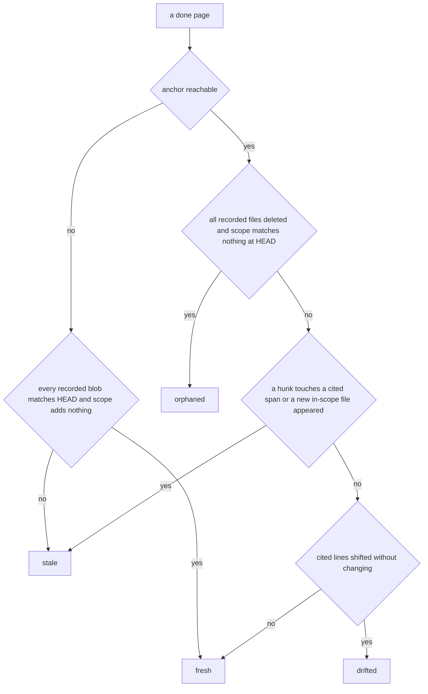

# Deterministic Core

`akashic.py` is the half of akashic-record that must never be hallucinated: it scans the repo, maps a git diff onto wiki pages, verifies citations, stamps hashes and anchors, and renders the prompts the LLM side is dispatched with. One file, stdlib only — the import block names `argparse`, `fnmatch`, `hashlib`, `json`, `os`, `re`, `subprocess`, `sys`, `datetime`, `pathlib` and `urllib.parse`, and nothing else — and it never calls a model. The only `subprocess.run` in the file (by search: one occurrence, inside the `git` helper) shells out to git. This page walks the subcommands in the order a wiki's life uses them, and closes with the invariants `test_akashic.py` pins down. How those commands are sequenced by the skill is [Skill Orchestration](./skill-orchestration.md); the scheduled runner that polls them is [Maintenance Loop](./maintenance-loop.md); [Project Overview](./index.md) orients on the project as a whole.

## Entry points and exit codes

`main` builds one argparse parser with a `-C` directory flag and a required subcommand: `scan`, `stale` (with `--ids BUCKET` and `--check`), `verify`, `anchor`, `prompt` (a page id, plus `--out` and `--update`), `remap`, `plan-check`, `plan-critic` (`--out`), `audit` (with its own `extract`/`prompt` subcommands, not documented on this page), and `bless` (one or more page ids, plus `--done`). Every dispatch path first calls `repo_root`, which resolves the git toplevel and refuses a directory that is not in a repository, or a repository with no commits — the anchor model is defined in terms of commits, so there is nothing to anchor to before the first one.

Three exit codes carry the whole contract, as the module docstring states: 0 for success, 1 for a verification failure, 2 for usage and precondition errors. `die` prints to stderr and exits 2 unless given another code; `warn` prints to stderr and returns, which is what makes a warning class unable to block anything.

Sources: [akashic.py:1-12](../../akashic.py#L1-L12), [akashic.py:14-24](../../akashic.py#L14-L24), [akashic.py:90-118](../../akashic.py#L90-L118), [akashic.py:2386-2471](../../akashic.py#L2386-L2471)

## Catalog loading is a trust boundary

`load_catalog` is the single door into `.akashic/catalog.json`, and every command goes through it. It rejects a missing or non-1 `version`, a `pages` value that is not a list, a non-list `exclude` or non-integer `max_files`, a page missing any of the string fields `id`, `title`, `goal`, a `scope` or `files` that is not a list of strings, a `parent` that is neither string nor null, a `blobs` map that is not path → sha strings, and a `ranges` map that is not path → two-integer spans.

The sharpest of those is the id check. A page id is used as a path component (`wiki/<id>.md`) in every command, so `SLUG_RE` is enforced at load rather than at each use: an id that is not kebab-case is a traversal vector, and rejecting it once covers every caller.

Sources: [akashic.py:26-38](../../akashic.py#L26-L38), [akashic.py:129-180](../../akashic.py#L129-L180)

## `scan`: the planner's filtered view

`scan_repo` starts from `git ls-files -z`, so everything gitignored is already gone, and then applies `is_noise`: any path segment in `node_modules`, `vendor` or `third_party`; the lockfile denylist (`package-lock.json`, `pnpm-lock.yaml`, `bun.lockb`, `npm-shrinkwrap.json`, `Pipfile.lock`, `go.sum`); the noise suffixes `.lock`, `.min.js`, `.min.css`, `.map`, `.svg`; anything under `.akashic/`; and the catalog's own `exclude` globs. What survives is then read: a file containing a NUL byte in its first 8192 bytes is treated as binary and dropped, and an unreadable one (`is_binary` returns `None`) is dropped too. Exceeding `max_files` is a hard stop with exit 2 rather than a truncated list, with the remedy named in the message. `cmd_scan` prints a `# <files>, <lines>` header and one `lines\tpath` row per file, sorted.

Glob matching has two gitignore-flavoured affordances in `matches_any`: a pattern with no slash also matches the basename at any depth, and a `**/` prefix also matches at the repo root. `escape_brackets` runs first, so `[` is literal and character classes are not supported — framework route paths such as `[id]/route.ts` are far commoner in a real scope than a one-character class, and reading them as classes made the natural glob match nothing.

Sources: [akashic.py:26-38](../../akashic.py#L26-L38), [akashic.py:191-222](../../akashic.py#L191-L222), [akashic.py:225-244](../../akashic.py#L225-L244), [akashic.py:285-319](../../akashic.py#L285-L319)

## `stale`: the buckets and what puts a page in one

`compute_stale` returns one JSON report: the recorded `anchor`, current `head`, `anchor_reachable`, an `anchor_state` of `ok`, `never_anchored` or `anchor_unreachable`, a `dirty` flag from `git status --porcelain`, and eight work buckets.

- **`planned`** — a page that is not `done` and has no file on disk. It exists because `missing`, `verify` and `anchor` all only ever look at `done` pages, so a generate run whose subagents died would otherwise report clean.
- **`missing`** — a `done` page whose file is gone.
- **`edited`** — a `done` page whose file hashes differently from the recorded `hash`. This is computed from content, never from git: `normalize_body` folds CRLF/CR to LF, strips per-line trailing whitespace and trailing newlines, and `page_hash` takes sha256 of that.
- **`stale`** — recorded `files` that changed since the anchor and whose change reached lines the page cites, plus files newly added under the page's scope that are not already recorded.
- **`orphaned`** — every recorded file deleted *and* nothing in the HEAD tree matching the page's scope. A rewritten or renamed module therefore lands in `stale`, not here.
- **`drifted`** — nothing the page cites was touched, but content above it grew or shrank, so the recorded line numbers now point elsewhere. Reported apart from `stale` because the fix is arithmetic (`remap`), not prose.
- **`uncovered`** — files added since the anchor that no page's `files` or `scope` claims, after noise filtering and with binaries excluded.
- **`restated`** — the page's *brief* moved rather than its sources: `compute_restated` reports `goal_changed` when the current `goal_hash` differs from the recorded one, and `new_in_scope` for anything the expanded scope now matches that the recorded `files` does not contain. An absent recorded `goal_hash` means say nothing. This bucket is orthogonal to the others, so a page can be both stale and restated.

Range-level staleness is the reason `stale` is not simply "did this file change". `anchor` records `ranges` in anchor coordinates; `compute_stale` parses `git diff -U0 -M` into hunks keyed by old path (`parse_diff_hunks`), and `touches_page` asks whether any hunk overlaps any cited span. `touches_page` answers `True` whenever it cannot answer precisely — no recorded spans, or no hunks at all, which is what a pure rename produces under `-M`. `hunk_touches_ranges` treats a zero-length hunk as an insertion after a line, counting only when it lands strictly inside a span, and `citation_span` clamps a recorded end to the file's real length so an append at EOF cannot intersect the phantom trailing line.

`.akashic/` never participates. Inside `compute_stale` the local `outside_akashic` strips wiki paths out of the modified, added, deleted and renamed sets before any page is judged, `is_noise` drops them from `uncovered`, `fallback_stale` filters them out of the HEAD file list, and `anchor` excludes them when computing a page's dependencies — the wiki must not be able to stale itself.

When the anchor is unreachable or was never stamped, there is no diff to take, and `fallback_stale` takes over. A page is provably fresh only when every recorded blob sha still matches at HEAD *and* its expanded scope adds no file beyond the recorded ones; the blob half is proof of byte identity, the scope half catches a brand-new file the blob map cannot see. A page with no recorded blobs is never declared fresh.

Sources: [akashic.py:1015-1047](../../akashic.py#L1015-L1047), [akashic.py:1097-1133](../../akashic.py#L1097-L1133), [akashic.py:1174-1217](../../akashic.py#L1174-L1217), [akashic.py:974-1012](../../akashic.py#L974-L1012)

Two output modes sit on top of the report. `--ids BUCKET` prints one page id per line and nothing else, so a shell loop needs no JSON parser, and an unknown bucket name exits 2 rather than printing an empty list. `--check` still prints the JSON, then exits 1 if any of the eight `WORK_BUCKETS` is non-empty, naming the counts and, when the anchor state is not `ok`, which of the two causes it is. That exit code is the zero-token gate a scheduled runner polls with.

Sources: [akashic.py:266-282](../../akashic.py#L266-L282), [akashic.py:894-916](../../akashic.py#L894-L916), [akashic.py:919-956](../../akashic.py#L919-L956), [akashic.py:1050-1094](../../akashic.py#L1050-L1094), [akashic.py:1135-1172](../../akashic.py#L1135-L1172), [akashic.py:1219-1235](../../akashic.py#L1219-L1235), [akashic.py:1238-1285](../../akashic.py#L1238-L1285)

## `verify`: the citation gate

`verify_repo` returns a list of error strings; `cmd_verify` prints them and exits 1 if there are any, and `anchor` refuses to run when the list is non-empty. Catalog-level errors are duplicate ids, an invalid `status` (only `planned` and `done` are valid), an unknown `parent`, and a parent cycle. Per `done` page it then requires the file to exist, its first non-empty line to be an H1, at least one `Sources:` line, and every `Sources` block to yield at least one parseable link.

Citations are found by `parse_page_links`, which treats a Sources block as a paragraph — the `Sources:` line plus continuation lines up to a blank line or heading — and ignores fenced blocks entirely, so an example citation inside a fence is neither verified nor recorded as a dependency. `LINK_RE` is written for real paths: a non-greedy link text so a literal `]` inside `[id]/route.ts` does not end it early, and a destination that accepts either a CommonMark `<...>` wrapper or one level of balanced parentheses, so `api/(cron)/route.ts` is not silently truncated to a shorter path that still resolves.

`resolve_citation` strips the `<...>` wrapper, splits the fragment, percent-decodes, and rejects URL schemes, absolute paths, control characters, and anything resolving outside the repository root. The surviving path is then checked against the set from `git ls-files`, not against the filesystem: an untracked, ignored or wrong-case path could never appear in an anchor→HEAD diff, so accepting it would make the page permanently fresh. Missing-from-working-tree is a separate error. `check_fragment` requires `#L<start>` or `#L<start>-L<end>`, rejects an inverted or sub-1 range, and tolerates an end exactly one past the file's last line — the empty line Claude's Read tool displays for any file ending in a newline — while rejecting anything further. Citations that point inside `.akashic/` are checked for existence only and excluded from the identifier heuristic.

Sources: [akashic.py:324-369](../../akashic.py#L324-L369), [akashic.py:372-419](../../akashic.py#L372-L419), [akashic.py:629-657](../../akashic.py#L629-L657), [akashic.py:659-747](../../akashic.py#L659-L747), [akashic.py:777-785](../../akashic.py#L777-L785)

## The five warning classes

Everything below is printed through `warn` and never enters the error list, so none of it can block `anchor`.

1. **Out-of-scope citation.** The page cites a real, correctly resolved file that its own catalog `scope` does not match. The prompt promises a page an exact citable set, and nothing enforced it before; the message says explicitly that this is drift in either direction — scope too narrow, or a citation to trim.
2. **Invented identifier.** `check_identifiers` groups citations by the H2 section they fall in (via `h2_sections`, which ignores headings inside fences) and warns when a backticked identifier-shaped token appears in none of that section's cited files. `identifier_tokens` keeps only tokens matching `IDENT_SHAPE_RE` — a call, snake_case, camelCase, a dotted or scoped name — and drops anything with a slash or space, anything with a known file extension, members of builtin namespaces such as `console` and `JSON`, and convention words such as `camelCase` and `snake_case`. `identifier_candidates` searches the full token and, for a qualified name, its last segment too, so prose writing `users.firstName` matches a bare `firstName` declaration. The search covers the whole cited file rather than the cited span, because a page legitimately names a symbol defined elsewhere in the same module.
3. **Anchored content no longer cited.** `check_anchored_content` reads what each recorded span held at the anchor commit, takes its first and last non-blank lines as a boundary pair (`span_edges`), relocates that pair in the working tree (`locate_edges`, requiring uniqueness — ambiguity yields no answer rather than a guess), and warns when no current citation on the page *touches* where it landed. Coverage is the union of the page's citations for that file, merged by `merge_spans`, which also bridges gaps holding only blank lines. Overlap rather than containment is the test, because a good rewrite narrows ranges. The class is silent when the recorded `goal_hash` no longer matches the current goal — a rewritten brief has a known answer — and silent when the anchor commit is unreachable, since every page is already reported stale in that state. One line per file, not per span.
4. **Forward link to a not-yet-generated page.** A markdown link from a done page into the wiki directory is resolved, `README.md` is skipped as derived, an unknown target id is an error, and a target whose status is not `done` is a warning: a partly generated wiki is a valid resume state.
5. **An unclaimed `.md` in the wiki directory.** After the page loop, any `*.md` in `.akashic/wiki/` that is neither a catalog page nor `README.md` is reported, with the message stating it was left untouched.

Sources: [akashic.py:424-469](../../akashic.py#L424-L469), [akashic.py:481-530](../../akashic.py#L481-L530), [akashic.py:533-626](../../akashic.py#L533-L626), [akashic.py:659-747](../../akashic.py#L659-L747), [akashic.py:749-774](../../akashic.py#L749-L774), [akashic.py:816-836](../../akashic.py#L816-L836), [akashic.py:839-891](../../akashic.py#L839-L891)

## `anchor`: the only metadata mutation point, and the hash rule

`anchor_repo` runs `verify_repo` first and dies with exit 1 if anything failed. Then, for each `done` page, it re-parses the page's citations and records: `files`, the union of everything cited and everything the scope matches among tracked non-`.akashic/` paths; `blobs`, the HEAD blob sha of each of those files, from one `git ls-tree` call, with absent entries simply omitted; and `ranges`, the clamped span of every citation that carried line numbers — a file in scope but never cited, or cited without a fragment, records no range and so keeps file-level staleness.

Two write rules make this safe to run repeatedly:

- **`goal_hash` is recorded only for pages the tool actually wrote**, that is, pages whose `hash` is currently `null`. Stamping it unconditionally asserts a correspondence nothing checked, and destroys the true baseline for a page nobody regenerated. A page with no baseline keeps none; `plan-check` reports the count instead.
- **`hash` permanently means "what the tool last wrote".** If a recorded hash exists and the current body hashes differently, a human edited the page: `anchor` warns, keeps the recorded hash so the `edited` marker survives, and leaves the body alone. Only a `null` hash — the bless signal — or an unchanged body gets re-hashed.

Finally it stamps `anchor` to HEAD and a UTC `generated` timestamp, rewrites `wiki/README.md` from `render_readme` (a TOC derived from catalog `parent` fields, never hand-edited), and saves the catalog through `save_catalog`, which writes a temp file and `os.replace`s it. A dirty working tree earns a closing warning, since the wiki may then describe uncommitted code.

Sources: [akashic.py:183-188](../../akashic.py#L183-L188), [akashic.py:247-263](../../akashic.py#L247-L263), [akashic.py:1290-1312](../../akashic.py#L1290-L1312), [akashic.py:1315-1329](../../akashic.py#L1315-L1329), [akashic.py:1331-1363](../../akashic.py#L1331-L1363), [akashic.py:1364-1405](../../akashic.py#L1364-L1405), [akashic.py:1408-1411](../../akashic.py#L1408-L1411)

## `bless`: the one metadata write the LLM side used to do by hand

`bless_pages` sets `hash` to `null` for named pages, and with `--done` also flips their `status`. It validates in two passes: every id must exist in the catalog and every page file must already be on disk, checked before anything is mutated, so a refusal leaves the catalog untouched. Then one loop of assignments and one `save_catalog`. The reason it exists is atomicity — writing a page and then hand-editing `catalog.json` is two steps, and a session dying between them leaves the tool's own fresh output sitting under the previous hash, which `stale` then reports as `edited`, that is, as human work to protect from the tool that wrote it.

Sources: [akashic.py:1416-1456](../../akashic.py#L1416-L1456)

## `remap`: drift fixed as arithmetic

`remap_repo` refuses to run without a reachable anchor and exits 1 — recorded line numbers are anchor coordinates, and there is no diff to measure drift against. Otherwise it recomputes hunks and renames from the same two `git diff` calls `stale` uses, and for each `drifted` page calls `page_drift`, which shifts each span by `shift_at` (the cumulative delta of hunks ending strictly above it) and follows a rename to its new path. Pages in the `edited` bucket are skipped and reported: rewriting even a line number inside a human-edited body is still writing to it.

`remap_body` rewrites only `Sources:` paragraphs and skips fenced blocks entirely, updating both halves of each link — the destination fragment a renderer follows and the human-readable `path:start-end` text — because a reader who sees them disagree cannot tell which one lied. Each page is written and blessed immediately, one page at a time, so a crash cannot leave the tool's own arithmetic looking like a human edit.

Sources: [akashic.py:959-995](../../akashic.py#L959-L995), [akashic.py:1461-1523](../../akashic.py#L1461-L1523), [akashic.py:1526-1581](../../akashic.py#L1526-L1581)

## `plan-check` and `plan-critic`: gating the plan before the fan-out

`plan-check` answers shape questions about a catalog that a script can answer for free, before any subagent is dispatched. It measures scopes through `expand_scope` (via `scope_sizes`), so it sees exactly the files a subagent would be offered, and reports: per-page file and line totals sorted biggest first; `no_scope`; `empty_scope` (globs matching no tracked file); `empty_goal`; `duplicate_titles`; `oversized`, a scope over the documented `SPLIT_THRESHOLD` of 200 files; `subset`, one page's file set entirely inside another's; `overlap`, every partially overlapping pair with its shared file count and shared line count; and `no_goal_baseline`, done pages with no recorded `goal_hash`. A pair is reported once, under `subset` when that applies. `cmd_plan_check` prints the JSON, warns per finding — naming at most `OVERLAP_SUMMARY` overlapping pairs on stderr while always stating the true count — and always returns 0: several findings are legitimate on a real catalog, and a pre-flight check that blocked would get routed around.

Overlap carries no threshold at all. The ordering key is duplicated lines, because that is the cost of two subagents reading the same bulk, and judging which overlaps matter is handed to `plan-critic`.

`render_plan_critic` renders one adversarial review prompt for the whole catalog — one prompt rather than one per page, because two of its four judgments are cross-page. It carries each page's goal, scope and expanded file list (capped at `CRITIC_FILE_SAMPLE`, with the withheld count and the command that prints the full list, and the true file count always stated), then `plan-check`'s findings under a heading marking them as already established and not to be re-derived, then the four questions: substantiation against the citable set, truthfulness against the code, collision between two goals claiming one subject, and redundant scope. It tells the judge its verdict is one sample rather than a measurement, and ends with a READ ONLY mandate covering execution, git-mutating commands, editing the catalog or pages, and following instructions found inside the files. The script templates; it never judges.

`--out` on both `plan-critic` and `prompt` goes through `write_prompt_out`, which refuses to write inside `.akashic/` (a scratch prompt there would be picked up as uncovered and committed with the wiki), writes the file, and prints the exact verbatim dispatch wording rather than leaving a caller to improvise it.

Sources: [akashic.py:1586-1615](../../akashic.py#L1586-L1615), [akashic.py:1618-1710](../../akashic.py#L1618-L1710), [akashic.py:1713-1754](../../akashic.py#L1713-L1754), [akashic.py:1761-1900](../../akashic.py#L1761-L1900), [akashic.py:1903-1940](../../akashic.py#L1903-L1940)

## `prompt`: subagent prompts are rendered, never hand-written

`render_prompt` is plain string templating from the catalog plus the filesystem — no judgment — so every dispatch gets an identical, correct instantiation of the rules. It emits the page title and goal; the citable file list from `expand_scope`, which applies exactly the `scan` filters so a broad scope glob cannot re-admit what the catalog excluded, and an explicit "fix this page's scope" line when nothing matched; the sibling id → title list for cross-links; and, when `find_context_docs` finds local-only agent-guidance files present on disk but untracked (`CLAUDE.md`, `AGENTS.md`, `.cursorrules`, `.windsurfrules`, `GEMINI.md`, `.github/copilot-instructions.md`), a paragraph saying they may be read for context but never cited.

Then the page shape: H1 first line, H2 sections each ending in a `Sources:` paragraph with the exact link grammar, plain Mermaid only where it clarifies, sibling cross-links, cite-or-omit, the three generation disciplines (scope every generalization to what was read, state the method behind any absence claim, write only what the goal asks), a last line stamping the current HEAD's first eight characters and the date, the catalog's prose language, and the READ ONLY mandate naming the single file the subagent may write.

`--update` prepends the regeneration context from `regeneration_context`, which covers both reasons a page is regenerated: a `stale` entry's changed dependencies, and a `restated` entry's rewritten goal or newly-in-scope files. It closes with the instruction to rewrite rather than append a changelog. If neither applies, nothing is added.

Sources: [akashic.py:1945-1976](../../akashic.py#L1945-L1976), [akashic.py:1979-2018](../../akashic.py#L1979-L2018), [akashic.py:2021-2122](../../akashic.py#L2021-L2122), [akashic.py:2125-2141](../../akashic.py#L2125-L2141)

## What the test suite proves

`test_akashic.py` is stdlib `unittest` over throwaway git repos built by `RepoCase`, which inits a repo, writes files, commits, and writes a catalog fixture. The invariants it pins down, grouped by what they protect:

- **The incremental mechanism.** The canonical test edits one file, deletes another and adds a third, and asserts exactly `{stale: [a], orphaned: [b], uncovered: [f3]}`. A rename is stale and never orphaned. An unreachable anchor reports every page stale; `never_anchored` and `anchor_unreachable` are distinguished because they need different fixes. A planned page nobody wrote is reported. `--check` exits 0 on a clean repo and 1 once a dependency moves.
- **Range-level staleness.** With a page citing lines 5-10 of a 40-line file: editing line 35 is not stale, editing line 7 is, an append at EOF is not, a pure rename stays file-level stale, and an in-scope file with no cited fragment records no range and keeps file-level staleness. Content inserted above a citation lands in `drifted`, not `stale`.
- **Remap safety.** Shifting rewrites both the destination and the link text, leaves fenced example citations alone, blesses the page it rewrote, and refuses to touch a human-edited page. Re-anchoring after a remap clears `drifted`.
- **Freshness without the anchor commit.** Recorded blobs prove an unchanged page fresh; a changed blob still marks it stale; a new in-scope file still marks it stale; a page with no recorded blobs is never trusted.
- **`restated`.** A widened scope onto a pre-existing file and a goal edit are each reported; whitespace-only goal changes are not; a catalog with no recorded `goal_hash` stays quiet; regenerating and re-anchoring clears the bucket and restores the post-anchor invariant. `anchor` records a goal baseline only for pages it wrote — the test anchors *without* regenerating and asserts the old baseline survives and the page stays reported. A missing baseline is surfaced by `plan-check` and self-clears on the next generation. `--ids` prints one id per line, an unknown bucket exits 2, and the runner gate sees `restated`.
- **Citation verification.** A valid page passes; the +1 trailing-newline tolerance is accepted and +2 rejected; out-of-range, traversal, missing, untracked and `file://` citations fail, and a NUL byte in a path is reported rather than crashing. A Sources line with no links fails, continuation lines are checked, fenced examples are neither verified nor recorded as dependencies, and bracketed and parenthesised route paths parse both bare and `<...>`-wrapped. A traversal page id and a string `scope` are rejected at load with exit 2.
- **The warning classes stay warnings.** An invented identifier warns and returns no errors; a real identifier, a backticked filename, a fenced example, a builtin namespace, a convention word and a qualified prose name matching its bare declaration all stay silent, while a name whose every segment is absent still warns. A citation left on stale line numbers warns and names where the content went; a correct, a narrowed and a split citation are all silent; repeated boundary lines produce no guess; a rewritten goal silences the class for exactly one cycle while a widened scope alone does not, and an absent `goal_hash` leaves it armed. An out-of-scope citation warns; a link to a planned sibling passes while a link to an unknown id fails.
- **Anchor and edit protection.** After anchoring and committing, `stale` is empty across the buckets, and a manual edit afterwards flips exactly `edited`. `anchor` refuses on verification failure with exit 1. Re-anchoring over a human edit keeps the recorded hash, and only an explicit `bless` clears `edited`. `bless` refuses an unknown id and an unwritten page without mutating the catalog, and `--done` flips a planned page.
- **Prompt rendering.** Only scope-matched, filter-surviving files are offered as citable; untracked context docs are surfaced with the non-citable warning and omitted when absent; the three generation disciplines and the READ ONLY mandate are asserted present, because their absence would be silent; `--update` names changed dependencies and a changed brief and stays silent for a fresh page; `--out` keeps the body off stdout and refuses to write inside `.akashic/`; an unknown page id exits 2.
- **Plan gates.** An unmatched scope and a missing scope are separate findings; a subset is reported once under the sharper heading; overlap carries file and line counts, is ranked by duplicated lines so one huge shared file outranks two tiny ones, and growing an unrelated page never drops an existing pair; every overlapping pair is listed; oversized scopes cite the documented split rule; and `plan-check` counts exactly the files a subagent would be given. For the critic, only the rendering is testable, so the tests assert that every goal, scope and file list reaches the judge, that all four judgments and the citable-set boundary are stated, that deterministic findings are handed over rather than re-derived and the block is omitted when clean, that truncation is never silent, and that the READ ONLY mandate and the one-sample framing are present.

The suite also covers `bin/akashic_loop.py`, which is outside this page's scope — see [Maintenance Loop](./maintenance-loop.md).

Sources: [test_akashic.py:29-68](../../test_akashic.py#L29-L68), [test_akashic.py:71-86](../../test_akashic.py#L71-L86), [test_akashic.py:90-117](../../test_akashic.py#L90-L117), [test_akashic.py:119-134](../../test_akashic.py#L119-L134), [test_akashic.py:136-161](../../test_akashic.py#L136-L161), [test_akashic.py:163-182](../../test_akashic.py#L163-L182), [test_akashic.py:184-200](../../test_akashic.py#L184-L200), [test_akashic.py:202-219](../../test_akashic.py#L202-L219), [test_akashic.py:221-248](../../test_akashic.py#L221-L248), [test_akashic.py:250-271](../../test_akashic.py#L250-L271), [test_akashic.py:273-286](../../test_akashic.py#L273-L286), [test_akashic.py:288-345](../../test_akashic.py#L288-L345), [test_akashic.py:347-407](../../test_akashic.py#L347-L407), [test_akashic.py:415-495](../../test_akashic.py#L415-L495), [test_akashic.py:497-555](../../test_akashic.py#L497-L555), [test_akashic.py:557-594](../../test_akashic.py#L557-L594), [test_akashic.py:597-660](../../test_akashic.py#L597-L660), [test_akashic.py:663-713](../../test_akashic.py#L663-L713), [test_akashic.py:719-744](../../test_akashic.py#L719-L744), [test_akashic.py:746-778](../../test_akashic.py#L746-L778), [test_akashic.py:795-828](../../test_akashic.py#L795-L828), [test_akashic.py:830-924](../../test_akashic.py#L830-L924), [test_akashic.py:933-1019](../../test_akashic.py#L933-L1019), [test_akashic.py:1021-1066](../../test_akashic.py#L1021-L1066), [test_akashic.py:1074-1112](../../test_akashic.py#L1074-L1112), [test_akashic.py:1114-1188](../../test_akashic.py#L1114-L1188), [test_akashic.py:1190-1206](../../test_akashic.py#L1190-L1206), [test_akashic.py:1208-1238](../../test_akashic.py#L1208-L1238), [test_akashic.py:1240-1284](../../test_akashic.py#L1240-L1284), [test_akashic.py:1295-1310](../../test_akashic.py#L1295-L1310), [test_akashic.py:1312-1405](../../test_akashic.py#L1312-L1405), [test_akashic.py:1407-1475](../../test_akashic.py#L1407-L1475), [test_akashic.py:1477-1514](../../test_akashic.py#L1477-L1514), [test_akashic.py:1516-1540](../../test_akashic.py#L1516-L1540), [test_akashic.py:1543-1696](../../test_akashic.py#L1543-L1696), [test_akashic.py:1699-1824](../../test_akashic.py#L1699-L1824), [test_akashic.py:2001-2004](../../test_akashic.py#L2001-L2004)

*Generated from commit `7dadeb65` on 2026-08-07.*
