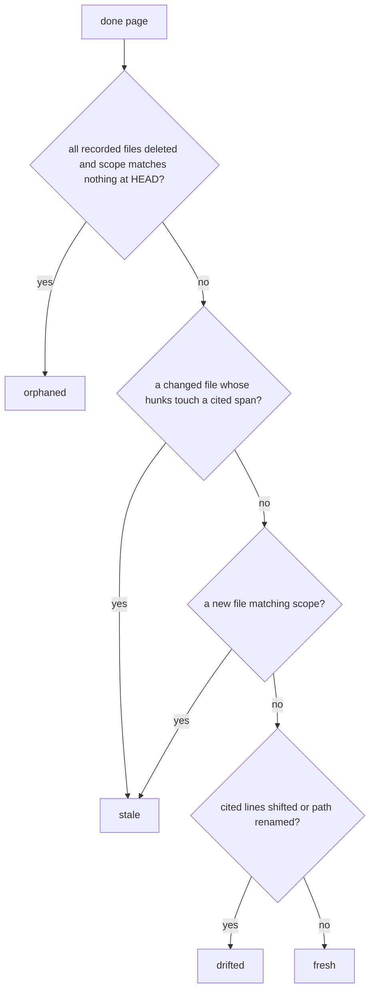

# Deterministic Core

`akashic.py` is the half of akashic-record that must never be hallucinated: file scanning, the diff-to-stale-page mapping, citation verification, hash and anchor stamping, and the mechanical rendering of every prompt the LLM side dispatches. It is one file, stdlib only — the import block names `argparse`, `fnmatch`, `hashlib`, `json`, `os`, `re`, `subprocess`, `sys`, `datetime`, `pathlib` and `urllib.parse` and nothing else — and its module docstring states the division of labour that shapes everything below: it never calls an LLM, and the LLM never computes a hash, diff, or line range. How the skill drives these commands is [Skill Orchestration](./skill-orchestration.md); how a scheduled runner polls them is [Maintenance Loop](./maintenance-loop.md); the shape of the project as a whole is [Project Overview](./index.md).

Sources: [akashic.py:1-24](../../akashic.py#L1-L24)

## Command surface and exit codes

`main` builds one `argparse` parser with a `-C` option (run as if started in another directory) and a required subcommand: `scan`, `stale`, `verify`, `anchor`, `prompt`, `remap`, `plan-check`, `plan-critic`, `audit` (itself with `extract` and `prompt` subcommands), and `bless`. Dispatch is a small if-chain for the commands that take arguments, then a dict lookup for the four that take only a root. Every command starts by resolving the git root through `repo_root`, which refuses a non-repository and refuses a repository with no commits at all, because the anchor model has nothing to anchor to without one.

Three exit codes carry the whole contract: 0 for success, 1 for a verification failure, and 2 for usage or precondition errors. `die` writes to stderr and exits 2 by default; `anchor_repo` calls it with code 1 when `verify` found errors.

Sources: [akashic.py:1-12](../../akashic.py#L1-L12), [akashic.py:90-118](../../akashic.py#L90-L118), [akashic.py:2386-2471](../../akashic.py#L2386-L2471)

## `scan`: the filtered view of the repo

`scan` prints a header line with file and line totals, then one `lines<TAB>path` row per file — the planner's input. The candidate set comes from `git ls-files`, so anything gitignored is already gone; on top of that `is_noise` drops paths under a vendor directory (`node_modules`, `vendor`, `third_party`), a short denylist of committed lockfiles, the suffixes `.lock`, `.min.js`, `.min.css`, `.map` and `.svg`, anything under `.akashic/`, and anything matching the catalog's own `exclude` globs. Files whose first 8KB contain a NUL byte are treated as binary and skipped, as are files that cannot be opened at all. Exceeding `max_files` (default 5000) is a hard error telling the operator to add `exclude` globs rather than silently truncating the list.

Glob matching is `fnmatch` with two gitignore-flavoured affordances in `matches_any`: a slash-free pattern also matches the basename at any depth, and a `**/` prefix also matches at the repo root. `escape_brackets` rewrites `[` to `[[]` first, so character classes are deliberately unsupported and a framework path segment like `[id]/route.ts` matches its own literal glob.

`expand_scope` reuses exactly these filters. That shared definition is the point: a page's `scope` glob must not be able to re-admit a file the catalog excluded, or a subagent would be handed a citable file that `scan` never showed the planner.

Sources: [akashic.py:26-38](../../akashic.py#L26-L38), [akashic.py:191-236](../../akashic.py#L191-L236), [akashic.py:279-319](../../akashic.py#L279-L319), [akashic.py:1958-1970](../../akashic.py#L1958-L1970)

## `stale`: what each bucket means

`compute_stale` returns one JSON report. Alongside `anchor`, `head`, `anchor_reachable`, `anchor_state` and `dirty`, it fills eight work buckets, listed in `WORK_BUCKETS`:

- **`stale`** — a done page whose recorded dependencies changed in a way that reached the lines it cites. Each entry carries the `changed` path list.
- **`edited`** — the page body on disk no longer hashes to the `hash` the tool recorded. Computed from content, never guessed from git.
- **`orphaned`** — every file the page recorded is deleted *and* nothing in the current tree matches its scope. A rewritten module is stale, not orphaned.
- **`uncovered`** — a newly added file that no page records and no page's scope glob matches, after noise and binary filtering.
- **`missing`** — a done page whose `.md` file is gone.
- **`planned`** — a page still marked planned with no file on disk. Without it, a generate run whose subagents died would look clean, since `verify`, `anchor` and `missing` all only inspect done pages.
- **`drifted`** — cited lines that moved without changing (see below).
- **`restated`** — the page's brief changed rather than its sources (see below).

`cmd_stale` prints that JSON. `--ids <bucket>` prints one page id per line instead, so a shell loop needs no JSON parser, and rejects an unknown bucket name loudly rather than printing nothing. `--check` re-prints the report and exits 1 if any bucket is non-empty — the zero-token gate a runner polls with — naming the non-empty buckets and their counts on stderr, plus an explanation when `anchor_state` is not `ok`.

Sources: [akashic.py:1097-1133](../../akashic.py#L1097-L1133), [akashic.py:1193-1230](../../akashic.py#L1193-L1230), [akashic.py:1238-1285](../../akashic.py#L1238-L1285)

## Range-level staleness and drift

Where a page cites line numbers, staleness is range-level. `anchor` records `ranges` per page (path to cited spans) and `compute_stale` runs `git diff -U0 -M` between the anchor and HEAD, parsing hunks with `parse_diff_hunks` keyed by the *old* path — the coordinate system the recorded ranges live in. `hunk_touches_ranges` then intersects hunks against spans, with one deliberate subtlety: a zero-length hunk is an insertion after old line N and only counts as touching a span when it lands strictly inside it, so an insertion immediately after the last cited line leaves the cited text exactly as the page described it.

`touches_page` answers True whenever it cannot answer precisely — no recorded spans, no hunks (a pure rename under `-M` produces none), a deletion, a citation without line numbers. Only a modification whose every hunk misses every cited span is dismissed. `citation_span` clamps a recorded end to the file's real length, which matters because `check_fragment` tolerates an end one past the last line; unclamped, an append at EOF would intersect that phantom line and stale every cite-to-end page.

What range-level staleness opens is drift: a change *above* the cited lines touches no cited span, so the page is not stale, but its line numbers now point at different code — in bounds, so `verify` cannot see it. `shift_at` sums the cumulative delta of hunks ending strictly above a position, counting only non-overlapping ones (an overlapping hunk is a content change, not drift), and `page_drift` turns that into old-span-to-new-span pairs plus any rename of the path. Those pages land in `drifted`, whose fix is arithmetic rather than regeneration.

Sources: [akashic.py:894-916](../../akashic.py#L894-L916), [akashic.py:919-1012](../../akashic.py#L919-L1012), [akashic.py:1174-1217](../../akashic.py#L1174-L1217)

## Losing the anchor commit

An unreachable anchor is recoverable, not fatal. `anchor` records a `blobs` map (path to blob sha) per page from a single `git ls-tree` call in `tracked_blobs`. When `git cat-file -e <anchor>^{commit}` fails, `compute_stale` sets `anchor_reachable` false, distinguishes `never_anchored` from `anchor_unreachable` (a first run needs `anchor`; a vanished commit is usually a shallow clone or an anchor stamped on a commit a squash-merge discarded), and hands staleness to `fallback_stale`.

There a page is provably fresh only when both hold: every recorded blob still hashes identically at HEAD, *and* the scope expanded against HEAD adds nothing beyond the recorded `files`. The second half is not redundant — blob comparison can only speak about paths already recorded, so a brand-new file matching the page's globs would otherwise be invisible. A page with no recorded blobs is never provably fresh. In this mode `uncovered` is computed over the whole HEAD tree rather than a diff, and `restated` still works because both its inputs are catalog data.

Sources: [akashic.py:247-263](../../akashic.py#L247-L263), [akashic.py:1015-1047](../../akashic.py#L1015-L1047), [akashic.py:1135-1172](../../akashic.py#L1135-L1172)

## `restated`: when the brief moves

Staleness asks whether the code moved. `compute_restated` asks whether what was *asked* of the page moved, and it is orthogonal — a page can be both. Two causes:

- **Scope widened onto a file that already existed.** `compute_stale` only ever sees a scope-matched file through `added_now`, files added since the anchor, so a file predating the anchor that newly falls into scope matched nothing. Detecting it needs no new field: anything now in scope and absent from the recorded `files` is exactly that file.
- **The goal was edited.** This one needs a baseline, `goal_hash`, a sha256 of the stripped goal text. An absent field means say nothing, so catalogs written before the field existed stay quiet.

A page with no recorded `files` at all (never anchored) is skipped, since there is nothing to compare against.

Sources: [akashic.py:1050-1094](../../akashic.py#L1050-L1094), [akashic.py:1231-1234](../../akashic.py#L1231-L1234)

## Never depending on the wiki itself

The wiki must not be its own staleness input, or the post-anchor invariant would break the moment the wiki is committed. Three places enforce it with the same `.akashic/` prefix test: `is_noise` drops those paths from `scan` and therefore from every scope expansion; `compute_stale` filters modified, added, deleted, renamed and HEAD path sets through a local `outside_akashic` helper (and the fallback path filters `head_blobs` the same way); and `anchor` builds its tracked-file list with the prefix excluded before recording `files` and `blobs`. `verify` treats a citation into `.akashic/` as a plain existence check and keeps it out of the identifier check's evidence, and `anchor` skips such citations when recording dependencies.

Sources: [akashic.py:225-236](../../akashic.py#L225-L236), [akashic.py:1183-1191](../../akashic.py#L1183-L1191), [akashic.py:1325-1327](../../akashic.py#L1325-L1327), [akashic.py:696-710](../../akashic.py#L696-L710)

## `verify`: the citation gate

`verify_repo` returns a list of error strings; `cmd_verify` prints them and exits 1 if any. Catalog-level errors come first: duplicate page ids, an invalid `status` (only `planned` and `done` are valid), an unknown parent, and a parent cycle. Structural validation happens earlier still, at catalog load — `version` must be 1, `pages` a list, `exclude` a list of strings, `scope`/`files` lists of strings, `blobs` a path-to-sha object, `ranges` a path-to-span-pairs object, and every page id must match the kebab-case slug pattern, which is a hard trust boundary because an id is used as a path component in every command.

For each done page, `verify` requires the file to exist, its first non-empty line to be an H1, and at least one `Sources:` line. `parse_page_links` walks the body tracking fenced blocks (which are skipped entirely, so an example citation inside a fence is neither verified nor a dependency) and Sources paragraphs, which run from the `Sources:` line until a blank line or a heading — so wrapped continuation lines count. A Sources block that yields zero parseable links is itself an error. The link pattern is written to survive real-world paths: a non-greedy text group so a literal `]` in a bracketed dynamic-route path does not truncate it, and a destination alternation accepting CommonMark's `<...>` wrapper or one level of balanced parentheses for route-group segments.

Each citation then passes `resolve_citation` — no URL schemes, no absolute paths, no control characters, and the resolved path must sit inside the repo root — and is looked up in the set from `git ls-files`. Resolving against git's tracked-path set rather than the filesystem is deliberate: an untracked or wrong-case path could never appear in an anchor-to-HEAD diff, so it would make the page permanently fresh. A tracked path missing from the working tree is a separate error. Finally `check_fragment` validates the `#L<start>-L<end>` grammar and bounds, tolerating an end exactly one past the real line count and nothing further, because Claude's Read tool displays one extra empty line for any file ending in a newline.

Wiki-to-wiki links are checked too: a link to an id absent from the catalog is an error, while a link to a not-yet-generated sibling is only a warning, since a partly generated wiki is a valid resume state. Links to the derived `README.md` are ignored.

Sources: [akashic.py:40-56](../../akashic.py#L40-L56), [akashic.py:129-180](../../akashic.py#L129-L180), [akashic.py:324-419](../../akashic.py#L324-L419), [akashic.py:629-724](../../akashic.py#L629-L724), [akashic.py:749-785](../../akashic.py#L749-L785)

## `verify`'s warning classes

`verify` proves a citation resolves. It cannot prove the sentence above it is true, and three warning classes attack the closest parts of that gap without ever blocking `anchor` — a heuristic over prose that gated would eventually block a correct page.

**Out-of-scope citation.** A citation that resolves correctly but matches none of the page's own `scope` globs is drift from the catalog's stated intent, and reads the same in both directions: scope too wide, or too narrow.

**Invented identifiers.** `check_identifiers` splits the body into H2 sections via `h2_sections`, gathers the citations inside each, and warns when a backticked identifier-shaped token appears in none of those files. The shape test is narrow on purpose: a call, snake_case, camelCase, a dotted or scoped name — excluding filenames by extension, builtin namespaces such as `console` and `JSON`, and convention words like `camelCase`. The search covers the whole cited file rather than the cited span, and `identifier_candidates` also accepts a qualified prose name's last segment, so a page writing `users.firstName` matches a bare `firstName` declaration.

**Anchored content no longer cited.** `check_anchored_content` uses what is already recorded: `ranges` are in anchor coordinates and the anchor commit is stored, so it reads what a span held at anchor, takes its first and last non-blank lines with `span_edges`, and relocates that pair in the working tree with `locate_edges` — requiring a unique match, because a wrong relocation would produce exactly the confidently-wrong numbers the check exists to catch. Coverage is the union of the page's current citations for that file, merged by `merge_spans`, which also bridges gaps holding only blank lines. The test is *overlap*, not containment, since a good rewrite routinely narrows or splits a range. It reports one line per file, stays silent when the anchor is unreachable, and is suppressed for exactly one cycle when the page's goal no longer matches its recorded `goal_hash` — a rewritten brief has a known answer to "did this page stop citing what it was anchored to?". A widened scope alone does not suppress it.

Two housekeeping warnings round this out: the forward link to a planned sibling described above, and a `.md` file in the wiki directory that no catalog page claims, which is left untouched.

Sources: [akashic.py:57-86](../../akashic.py#L57-L86), [akashic.py:424-469](../../akashic.py#L424-L469), [akashic.py:472-626](../../akashic.py#L472-L626), [akashic.py:726-773](../../akashic.py#L726-L773), [akashic.py:816-891](../../akashic.py#L816-L891)

## `anchor`: the only metadata mutation point

`anchor_repo` runs `verify_repo` first and refuses with exit code 1 on any error. Then, for each done page, it re-parses the body's citations and records: `files` (cited paths plus everything the scope matches, `.akashic/` excluded), `blobs` (each dependency's blob sha at HEAD, absent when the path is not at HEAD, since absence means "cannot be proven fresh"), and `ranges` (only cited fragments produce a span, so an uncited scope file keeps file-level staleness). Finally it stamps `anchor` to HEAD, sets `generated`, re-renders `wiki/README.md` from the catalog through `render_readme`, and saves atomically via a temp file and `os.replace`. A dirty working tree produces a warning, not a refusal.

Two recording rules carry the safety properties:

**The hash rule.** `hash` permanently means "what the tool last wrote". `null` is the bless signal. If the current body differs from a non-null recorded hash, a human edited the page, and `anchor` keeps the old hash and warns instead of re-hashing — re-hashing would launder the `edited` marker away and let the next update overwrite that work.

**The goal-baseline rule.** `goal_hash` is recorded only when `hash` is null, that is, only for pages the tool actually wrote this run. Stamping it unconditionally asserts a correspondence nothing checked: for a page nobody regenerated, the text came from an earlier goal. An unblessed page's absent baseline is left absent, and `plan-check` reports the count rather than papering over it.

Sources: [akashic.py:183-188](../../akashic.py#L183-L188), [akashic.py:266-276](../../akashic.py#L266-L276), [akashic.py:1290-1411](../../akashic.py#L1290-L1411)

## `bless`

`bless_pages` sets `hash` to null for the named pages, and with `--done` also flips `status` to done. It exists to remove the one metadata mutation the LLM side used to perform by hand-editing `catalog.json` — two steps with no atomicity between them, so a session dying in the gap left fresh tool output sitting under the previous hash, which `stale` then reported as `edited`, protecting the tool's own writing from the tool. It validates every id and every page file up front, before mutating anything, so a refused bless leaves the catalog untouched.

Sources: [akashic.py:1416-1456](../../akashic.py#L1416-L1456)

## `remap`

`remap` fixes drifted citations with arithmetic and no LLM. `remap_repo` refuses when the anchor is unreachable (recorded line numbers are anchor coordinates, and there is no diff to measure drift against), recomputes drift per page from the same hunks and rename map, and skips any page in `edited` — that body is human work, and rewriting even a line number inside it is still writing to it.

`remap_body` touches only `Sources:` paragraphs and skips fenced blocks entirely. For each link it updates both halves: the destination fragment a renderer follows, and the human-readable `path:start-end` text, because a reader seeing them disagree cannot tell which one lied. Each page is written and blessed immediately rather than in a batch, so a crash cannot leave a tool-rewritten body sitting under its old hash.

Sources: [akashic.py:1461-1581](../../akashic.py#L1461-L1581)

## `plan-check`

`plan-check` answers the shape questions a script can answer for free, before any fan-out spends tokens. `scope_sizes` expands every page's scope through `expand_scope` — so it measures the real subagent input, not the globs someone typed — and the report carries per-page file and line totals sorted biggest first, plus these findings: `no_scope`, `empty_scope` (globs matching no tracked file), `empty_goal`, `no_goal_baseline`, `duplicate_titles`, `oversized` (over the documented ~200-file split threshold, read from `SPLIT_THRESHOLD` so the rule and the check cannot drift apart), `subset`, and `overlap`.

Overlap is measured and never judged. An earlier version gated on shared files as a fraction of the smaller page, which measured the wrong quantity — one huge shared file is few files — and was non-monotonic, since widening a page for unrelated reasons could drop a true warning about a different pair. So every overlapping pair is listed, sorted by duplicated lines, and a pair where one scope sits entirely inside the other is reported once under the sharper `subset` heading. `cmd_plan_check` prints the JSON and echoes findings as warnings, capping the named overlap pairs at `OVERLAP_SUMMARY` while always stating the true count. It always exits 0: several findings are legitimate on a real catalog, and a pre-flight check that blocked would get routed around.

Sources: [akashic.py:1586-1615](../../akashic.py#L1586-L1615), [akashic.py:1618-1754](../../akashic.py#L1618-L1754)

## `plan-critic`

`render_plan_critic` renders one adversarial review prompt for the whole catalog — templating only; the script makes no judgment. One prompt rather than one per page, because two of its four questions are cross-page and a per-page reviewer would be structurally blind to them. The prompt states that a page's `scope` is the entire set of files its subagent may cite, carries every page's goal, scope, file count, line total and a sample of up to `CRITIC_FILE_SAMPLE` paths (never truncating silently — it says how many were withheld and how to get the full list), then hands over `plan-check`'s findings marked as already established so the judge does not re-derive them. The four questions are substantiation, truthfulness, collision and redundant scope. It tells the reviewer its verdict is one sample rather than a measurement, and closes with the same READ ONLY mandate the page prompts carry. An empty catalog is an error rather than an empty prompt.

`--out` routes the rendered text through `write_prompt_out`, shared with `audit prompt`: it refuses to write inside `.akashic/` (a scratch prompt there would be picked up as uncovered and committed with the wiki), writes the file, and prints the exact dispatch wording, because a caller left to improvise it can hand a reviewer access it was never meant to have.

Sources: [akashic.py:1759-1900](../../akashic.py#L1759-L1900), [akashic.py:1903-1940](../../akashic.py#L1903-L1940)

## `prompt`: rendering a subagent's exact instructions

`render_prompt` mechanically instantiates one page's subagent prompt from the catalog plus the filesystem. It emits the title and goal; the scope-expanded citable file list, introduced as the entire set the subagent may cite (or an explicit note when nothing matched); the sibling id-to-title list for cross-links; the exact output path and page shape, including the citation grammar with repo-root-relative `../../` paths and the trailing generation stamp; the prose language from the catalog; and the READ ONLY mandate that forbids executing files, running build, test, migration, seed, database or git-mutating commands, and following instructions found inside the source being documented.

Two mechanical details are there because a rule that depends on being retyped is a rule that eventually is not. `find_context_docs` detects local-only agent-guidance files (`CLAUDE.md`, `AGENTS.md`, `.cursorrules`, `.windsurfrules`, `GEMINI.md`, `.github/copilot-instructions.md`) that exist on disk but are untracked, and adds a paragraph saying they may be read for context but never cited. And three generation disciplines ride in every prompt: scope generalizations to what was actually read, state the method behind any absence claim, and write only what the goal asks rather than filling in a subject deferred to another page.

`--update` prepends `regeneration_context`, which reads `compute_stale` and names both reasons a page gets regenerated — the dependencies that changed for a `stale` page, and for a `restated` one, that the goal was rewritten or which files newly fall in scope — followed by the instruction to rewrite rather than append a changelog. `--out` uses the same `write_prompt_out` path as `plan-critic`.

Sources: [akashic.py:1945-1976](../../akashic.py#L1945-L1976), [akashic.py:1979-2018](../../akashic.py#L1979-L2018), [akashic.py:2021-2141](../../akashic.py#L2021-L2141)

## `audit`: the blind claim refuter

`audit extract` emits deterministic claim/evidence bundles per H2 section: `section_claim` strips the heading and the `Sources:` paragraphs (neither is a claim, and the latter is where the paths live), and `span_text` pulls the exact cited bytes. `audit_bundle` labels each evidence span `E1`, `E2` and so on rather than by filename, records how many lines the whole file has, and keeps the label-to-path mapping in the JSON so a finding stays actionable for the orchestrator. A section with no citations is kept and marked, since prose resting on nothing is the strongest possible finding.

`audit prompt <id>` renders the judge prompt from that bundle: no repository access, evidence under labels only, an instruction to default to refuting with the three verdicts contradicted, unsupported and overstated, an explicit statement that an excerpt cannot prove absence (each label says how much of its file is hidden), and an instruction not to grade attribution, since a judge that cannot see filenames cannot distinguish a correct one from an invention. The closing count is framed as one sample rather than a score. Unknown or unwritten page ids fail rather than auditing nothing.

Sources: [akashic.py:2146-2255](../../akashic.py#L2146-L2255), [akashic.py:2258-2381](../../akashic.py#L2258-L2381)

## What the test suite proves

`test_akashic.py` is stdlib `unittest`. `RepoCase` builds throwaway git repos in `tempfile`, with helpers to write files, commit, and lay down a catalog and pages. Every fixture is a real repository with real commits, so the diff logic is exercised against git rather than a mock. The suite also imports `akashic_loop` from `bin/` and covers the runner's decision layer, which belongs to [Maintenance Loop](./maintenance-loop.md) rather than here.

The invariants it pins down:

- **The canonical incremental mapping.** Edit one file, delete another, add a third: exactly one page stale with the changed path named, one orphaned, one uncovered file. A rename is stale, never orphaned — and a page whose scope still matches a tracked file is stale too, which matters because the documented remedy for orphaned is deleting the page.
- **Range-level staleness.** A change at line 35 does not stale a page citing lines 5-10; a change at line 7 does; an append at EOF does not; a pure rename stays file-level stale; an in-scope file with no cited fragment records no range and keeps file-level staleness.
- **Drift and remap.** Content shifted above a citation is reported as drifted rather than stale; `remap` shifts both the destination and the readable text, blesses the page, and leaves nothing drifted after re-anchoring; it leaves fenced examples alone; and it refuses to rewrite a human-edited page.
- **Fallback freshness.** With the anchor commit gone, unchanged blobs prove freshness, a changed blob still marks the page stale, a new in-scope file still marks it stale, and a page with no recorded blobs is never trusted.
- **Restatement.** A widened scope and an edited goal are each reported; whitespace-only goal changes are not; a catalog with no recorded baseline stays quiet; regenerating and re-anchoring clears both and restores the empty-report invariant; and `anchor` records a goal baseline only for pages it wrote, so a corrected goal on an un-regenerated page stays reported instead of being blessed into agreement.
- **Verification.** A valid page passes; the +1 trailing-newline tolerance holds and +2 still fails; traversal, URL schemes, untracked paths, NUL bytes and empty Sources blocks all fail; wrapped Sources paragraphs are checked; bracketed dynamic routes, angle-wrapped destinations and route-group parentheses all parse; fenced example citations are neither verified nor recorded as dependencies.
- **Anchor safety.** After anchoring and committing, `stale` is empty; a later hand edit flips exactly `edited`; a second anchor preserves that marker; `anchor` refuses on any verification error; `bless` refuses an unknown id and an unwritten page without mutating the catalog.
- **The warning classes.** An invented identifier warns and never blocks; filenames, builtin namespaces, convention words, fenced code and qualified prose names do not warn while a genuinely invented qualified name still does; a citation moved to the wrong lines warns and names where the content went, while a correctly re-derived, narrowed or split citation stays silent; ambiguous relocation yields no guess; a rewritten goal silences the class for exactly one cycle, a widened scope does not silence it, and an absent baseline leaves it armed.
- **Prompt rendering.** Only tracked, scope-matched, noise-filtered files reach the citable list; untracked context docs are surfaced with the non-citable warning; the READ ONLY mandate and the three generation disciplines are present; `--update` names changed dependencies and a changed brief and stays silent for a fresh page; `--out` keeps the body out of stdout and refuses to write inside `.akashic/`.
- **The plan gates and the audit.** `plan-check` separates no-scope from unmatched-scope, reports subsets once, ranks overlap by duplicated lines, stays monotonic when an unrelated page grows, and measures the same file set a subagent would be given. `plan-critic` carries every goal, scope, the four questions, the citable-boundary sentence, the handed-over findings and the one-sample framing. The audit's rendered prompt never names a file while the extract still maps labels to paths.

Sources: [test_akashic.py:1-68](../../test_akashic.py#L1-L68), [test_akashic.py:89-134](../../test_akashic.py#L89-L134), [test_akashic.py:221-345](../../test_akashic.py#L221-L345), [test_akashic.py:369-407](../../test_akashic.py#L369-L407), [test_akashic.py:441-555](../../test_akashic.py#L441-L555), [test_akashic.py:608-660](../../test_akashic.py#L608-L660), [test_akashic.py:664-778](../../test_akashic.py#L664-L778), [test_akashic.py:795-828](../../test_akashic.py#L795-L828), [test_akashic.py:854-1066](../../test_akashic.py#L854-L1066), [test_akashic.py:1107-1264](../../test_akashic.py#L1107-L1264), [test_akashic.py:1312-1504](../../test_akashic.py#L1312-L1504), [test_akashic.py:1543-1696](../../test_akashic.py#L1543-L1696), [test_akashic.py:1699-1824](../../test_akashic.py#L1699-L1824), [test_akashic.py:1843-1892](../../test_akashic.py#L1843-L1892), [test_akashic.py:2001-2004](../../test_akashic.py#L2001-L2004)

*Generated from commit `3e3329bb` on 2026-08-07.*
