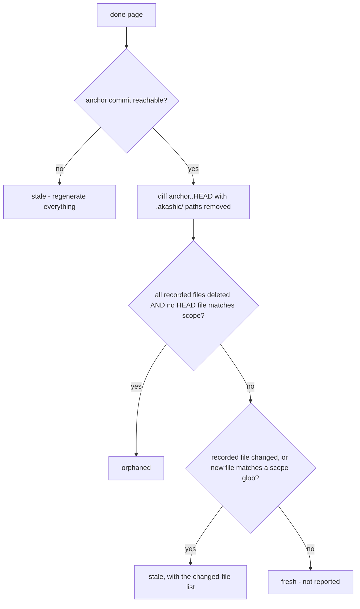

# Deterministic Core

`akashic.py` is the half of akashic-record that must never be hallucinated: file scanning, the diff-to-stale-page mapping, citation verification, hash/anchor stamping, and deterministic rendering of the exact subagent prompt used to generate a page. It never calls an LLM, and the LLM side (catalog planning and page prose, described in [Skill Orchestration](./skill-orchestration.md)) never computes a hash, diff, line range, or prompt text. The script is stdlib-only Python 3.9+, exposes five subcommands — `scan`, `stale`, `verify`, `anchor`, `prompt` — behind a `-C` directory flag, requires a git repository with at least one commit, and exits 0 on success, 1 on verification failures, 2 on usage or precondition errors. How these commands fit into the overall system is covered in [Project Overview](./index.md).

Sources: [akashic.py:1-29](../../akashic.py#L1-L29), [akashic.py:78-87](../../akashic.py#L78-L87), [akashic.py:782-807](../../akashic.py#L782-L807)

## scan — the planner's filtered view

`scan` prints every file the planner is allowed to see, one `lines<TAB>path` entry per tracked file, preceded by a `# N files, M lines` header. The candidate set is `git ls-files`, so anything gitignored is already gone. On top of that, `is_noise` drops:

- files under vendor directories (`node_modules`, `vendor`, `third_party`) at any depth;
- a small denylist of lockfile names (`package-lock.json`, `pnpm-lock.yaml`, `bun.lockb`, `npm-shrinkwrap.json`, `Pipfile.lock`, `go.sum`);
- noise suffixes: `.lock`, `.min.js`, `.min.css`, `.map`, `.svg`;
- everything under `.akashic/` itself;
- any path matching the catalog's `exclude` globs.

Binary files (a NUL byte in the first 8 KiB) and unreadable files are skipped after that. If the surviving count exceeds `max_files` (default 5000), the command dies with instructions to add `exclude` globs rather than silently truncating; entries are emitted sorted by path.

Glob matching via `matches_any` is fnmatch with two gitignore-flavored affordances: a slash-free pattern also matches the basename at any depth (`*.snap` matches `a/b/x.snap`), and a `**/` prefix also matches at the repository root (`**/*.snap` matches `top.snap`).

This filter is not scan-local. `stale`'s `uncovered` bucket and `prompt`'s citable-file expansion call the same `is_noise` and the same binary check, so there is exactly one definition of which files the wiki can see.

Sources: [akashic.py:26-38](../../akashic.py#L26-L38), [akashic.py:146-159](../../akashic.py#L146-L159), [akashic.py:162-173](../../akashic.py#L162-L173), [akashic.py:203-208](../../akashic.py#L203-L208), [akashic.py:213-237](../../akashic.py#L213-L237)

## stale — bucket semantics

`stale` is read-only: it prints a JSON report with `anchor`, `head`, `anchor_reachable`, `dirty`, and five page buckets — `stale`, `edited`, `orphaned`, `uncovered`, `missing`. Only pages with `status: "done"` participate.

Two buckets are computed before any diff. `missing` lists done pages whose wiki file is gone. `edited` compares the current normalized-body hash of each page file (CRLF/CR to LF, trailing whitespace stripped per line, trailing newlines stripped) against the `hash` recorded in the catalog — edit detection is independent of git and never guessed from it. If the recorded anchor commit is absent or unreachable, the tool refuses to guess: `anchor_reachable` goes false and every done page is reported stale with an empty `changed` list, on the principle that wasting a regeneration is acceptable but marking stale content fresh is not.

With a reachable anchor, the tool parses `git diff --name-status -M -z anchor..HEAD` into modified/added/deleted/rename sets. Renames land on both sides: both endpoints count as changed (citations to the old path dangle), and the new name counts as an addition for scope matching.

Sources: [akashic.py:184-200](../../akashic.py#L184-L200), [akashic.py:478-501](../../akashic.py#L478-L501), [akashic.py:504-525](../../akashic.py#L504-L525), [akashic.py:581-583](../../akashic.py#L581-L583)

A done page is then bucketed:

Sources: [akashic.py:527-563](../../akashic.py#L527-L563)

The orphaned condition is deliberately narrow: a page is orphaned only when everything it documented is deleted *and* nothing in the current HEAD tree matches its scope — a rewritten module is stale, not orphaned.

**Self-dependency exclusion.** Every path under `.akashic/` is stripped from the diff sets and from the HEAD file list (`outside_akashic`, a closure inside `compute_stale`) before any bucketing. Wiki artifacts must never be staleness inputs: if the wiki depended on itself, committing it would break the post-anchor invariant immediately.

`uncovered` lists added files that no page claims. `files` entries are exact paths — a recorded root `Makefile` must not shadow a new nested `Makefile` — while `scope` entries are globs; noise (the same filter as `scan`, including catalog excludes) and binaries are dropped.

Sources: [akashic.py:540-549](../../akashic.py#L540-L549), [akashic.py:565-577](../../akashic.py#L565-L577), [akashic.py:162-173](../../akashic.py#L162-L173)

## verify — the citation gate

`verify` returns exit 1 with one error line per failure, or prints `verify: ok`. Catalog invariants come first: duplicate page ids, invalid `status` values (only `planned` and `done`), unknown parents, and parent cycles. Page ids are already slug-validated at catalog load, because ids become path components — a non-slug id is a traversal vector. The same load also type-checks `exclude`, `max_files`, each page's `id`/`title`/`goal` strings, `scope`/`files` as lists of strings, and `parent` as a string or null.

For each done page it then enforces, in order:

- the wiki file `wiki/<id>.md` exists;
- the first non-empty line is an H1 title;
- at least one `Sources:` block exists (cite-or-omit), and no `Sources:` block yields zero parseable links;
- every citation resolves, is tracked by git, exists in the working tree, and has a valid line fragment.

A `Sources:` block is a paragraph — the `Sources:` line plus continuation lines until a blank line or heading — so wrapped citations are verified. Fenced code blocks are skipped entirely, so an example citation inside a fence is neither verified nor recorded as a dependency. Non-`Sources:` links ending in `.md` are collected separately as wiki links: one pointing into the wiki directory must name a real catalog id (`README.md` is exempt, being derived at anchor time), while a link to a `planned` sibling is only a warning, since a partially generated wiki is a valid state.

Citation resolution rejects URL schemes, absolute paths, control characters (including percent-decoded NUL), and anything resolving outside the repository root. Two destination forms are accepted: CommonMark's `<...>` wrapper, and a bare form permitting one level of balanced parentheses — framework route groups name path segments that way (`api/(cron)/route.ts`), and a destination pattern that stopped at the first `)` would truncate to a shorter prefix that still resolves, so the citation would fail as "not tracked by git" instead of being parsed correctly. Link *text* is matched non-greedily rather than with `[^\]]*`, because dynamic-route paths (`[id]/route.ts`) put literal `]` characters inside the text.

Resolved paths are checked against git's tracked-path set, not the filesystem: an untracked or wrong-case path can never appear in an anchor-to-HEAD diff, so accepting it would make the page permanently fresh. Line fragments must be `#L<start>` or `#L<start>-L<end>`, and the end line may exceed the real line count by exactly one — Claude's Read tool numbers one extra empty line for files ending in a trailing newline — with anything beyond that rejected. A citation to a real file outside the page's own catalog scope is a warning, not an error: it signals drift in either direction (scope too wide or too narrow) without blocking `anchor`. Extra `.md` files in the wiki directory that no catalog page claims are also warned about and left untouched.

Sources: [akashic.py:40-56](../../akashic.py#L40-L56), [akashic.py:98-135](../../akashic.py#L98-L135), [akashic.py:242-287](../../akashic.py#L242-L287), [akashic.py:290-312](../../akashic.py#L290-L312), [akashic.py:315-337](../../akashic.py#L315-L337), [akashic.py:342-462](../../akashic.py#L342-L462), [akashic.py:465-473](../../akashic.py#L465-L473)

## anchor — recording state without laundering edits

`anchor` is the only metadata mutation point, and it runs the full verify gate first — any verification error means it refuses to anchor (exit 1). For each done page it recomputes `files` as the union of the page's resolved citations and every tracked file matching its `scope` globs, with `.akashic/` paths excluded on both sides so wiki artifacts can never become page dependencies.

**Hash-preservation rule.** The recorded `hash` permanently means "what the tool wrote". A null hash is the explicit bless signal, set by the orchestrator after writing a page. If the current page text hashes differently from a non-null recorded hash, a human edited the page: `anchor` keeps the *old* hash and warns, because re-hashing would launder the `edited` marker away and let the next update silently overwrite the human's work. Only a null or matching recorded hash gets stamped with the current hash.

Finally it:

- stamps `anchor` (current HEAD) and a `generated` UTC timestamp into the catalog;
- rebuilds `wiki/README.md` (`render_readme`), a derived table of contents regenerated on every anchor so it can never drift from the catalog (done pages are links, others are marked *(planned)*, nesting follows `parent`);
- saves the catalog atomically via a temp-file rename (`save_catalog`);
- warns if the working tree is dirty (the wiki may describe uncommitted code; the recommended flow is commit, then anchor).

Sources: [akashic.py:138-143](../../akashic.py#L138-L143), [akashic.py:588-610](../../akashic.py#L588-L610), [akashic.py:613-625](../../akashic.py#L613-L625), [akashic.py:629-642](../../akashic.py#L629-L642), [akashic.py:644-656](../../akashic.py#L644-L656), [akashic.py:659-673](../../akashic.py#L659-L673)

## prompt — deterministic subagent-prompt rendering

`akashic.py prompt <page-id>` prints the exact text a subagent should receive to generate one catalog page, so no human has to hand-type the same rules into every dispatch. `render_prompt` is plain string templating over `catalog.json` and the filesystem — it makes no LLM-style judgment call — and its output mirrors the shape SKILL.md's page contract expects: a goal statement, the citable file list, sibling pages for cross-linking, the exact `Sources:`/heading/Mermaid/cross-link/cite-or-omit rules, the catalog's prose `language`, and a trailing `*Generated from commit \`<hash>\` on <date>.*` line. When a page's scope matches nothing, the file list is replaced by an explicit instruction to fix the scope before generating.

The citable file list is `expand_scope`: tracked files matching the page's `scope` globs, then filtered by the same `is_noise` and binary checks `scan` applies, sorted. Sharing one definition of the citable universe is the point — otherwise `exclude` globs, lockfiles, minified assets, and binaries would be dropped from planning yet still land in a page's "the ENTIRE set of files you may cite" list, and `verify` would accept citations to them. A `scope` glob cannot re-admit what the catalog excluded.

`find_context_docs` separately surfaces local-only agent-guidance files (`CLAUDE.md`, `AGENTS.md`, `.cursorrules`, `.windsurfrules`, `GEMINI.md`, `.github/copilot-instructions.md`) that exist on disk but are **not** tracked by git — commonly excluded via `.git/info/exclude` or a personal gitignore. When present, the rendered prompt explicitly tells the subagent it may read them for context but must never cite them in a `Sources:` line, since an untracked file may not exist for another clone of the repo; a fact sourced from one should instead be traced to the tracked code that implements it, stated as uncited prose, or omitted. If no such files are present (or they are already tracked), the warning paragraph is omitted entirely rather than emitted as boilerplate.

`cmd_prompt` requires a page id argument and dies with exit 2 if the id is not in the catalog, via the same `die()` path every other precondition failure uses.

Sources: [akashic.py:678-688](../../akashic.py#L678-L688), [akashic.py:691-702](../../akashic.py#L691-L702), [akashic.py:705-708](../../akashic.py#L705-L708), [akashic.py:711-770](../../akashic.py#L711-L770), [akashic.py:773-777](../../akashic.py#L773-L777)

## What the test suite proves

`test_akashic.py` is 33 stdlib `unittest` tests over throwaway git-repo fixtures, one check per deterministic component. The invariants it pins down:

- **Scan filtering**: a source file survives while a binary, a lockfile, an excluded glob, and `.akashic/` itself are all dropped.
- **The canonical incremental mapping**: edit `f1`, delete `f2`, add `f3` yields exactly `{stale: [a], orphaned: [b], uncovered: [f3]}` with empty `edited`/`missing`.
- **Renames**: a rename is stale (citations dangle), never orphaned.
- **Unreachable anchor**: everything regenerates; never guess.
- **The citation gate**: a valid page passes cleanly; out-of-range fragments fail naming the page and line; a trailing-newline `+1` range is tolerated but `+2` still fails; traversal targets, scheme URLs, untracked-but-on-disk citations, NUL-byte paths (error, not crash), and empty `Sources:` blocks all fail; wrapped `Sources:` paragraphs are verified; fenced example citations are neither verified nor recorded as dependencies; a citation outside the page's own scope warns but does not fail; a wiki link to an unknown catalog id still fails, while a forward link to a not-yet-`done` sibling does not.
- **Awkward real-world paths parse**: a bracketed dynamic-route path (`app/users/[id]/route.ts`) and a parenthesized route-group path (`app/api/(cron)/route.ts`) each verify both as a bare destination and inside the `<...>` wrapper — four tests, because the paren case previously truncated to a still-resolvable prefix and surfaced a real file as untracked.
- **The post-anchor invariant**: after `anchor` and committing its artifacts, all five stale buckets are empty — with `README.md` deliberately in a page's scope to prove the wiki's own derived TOC never basename-matches into a self-dependency — and a manual edit afterwards flips exactly the `edited` bucket. `anchor` refuses (exit 1) on verification failure.
- **Edit protection survives re-anchoring**: a second anchor over a human-edited page keeps the original tool hash; only an explicit `hash: null` bless clears the `edited` state.
- **Trust-boundary loading**: a traversal page id and a string-typed `scope` are rejected at catalog load with exit 2.
- **Glob and coverage semantics**: the `**/` and basename affordances of `matches_any`, and that exact `files` entries do not shadow same-named files at other depths in the `uncovered` report.
- **`prompt` rendering**: the citable list holds only tracked, in-scope files and omits an out-of-scope sibling file; scope expansion applies the scan filters, so a `src/**` scope offers `src/app.py` but never `bundle.min.js`, `package-lock.json`, an excluded `.snap`, or a binary; siblings and the page `goal` appear verbatim; an untracked `CLAUDE.md` is named alongside a "NOT tracked by git" warning, and that paragraph is absent when no such doc exists; an unknown page id exits 2.

Sources: [test_akashic.py:2-7](../../test_akashic.py#L2-L7), [test_akashic.py:25-64](../../test_akashic.py#L25-L64), [test_akashic.py:67-82](../../test_akashic.py#L67-L82), [test_akashic.py:85-143](../../test_akashic.py#L85-L143), [test_akashic.py:146-209](../../test_akashic.py#L146-L209), [test_akashic.py:212-262](../../test_akashic.py#L212-L262), [test_akashic.py:268-327](../../test_akashic.py#L268-L327), [test_akashic.py:329-349](../../test_akashic.py#L329-L349), [test_akashic.py:351-410](../../test_akashic.py#L351-L410), [test_akashic.py:412-457](../../test_akashic.py#L412-L457), [test_akashic.py:468-483](../../test_akashic.py#L468-L483), [test_akashic.py:485-552](../../test_akashic.py#L485-L552), [test_akashic.py:554-578](../../test_akashic.py#L554-L578)

*Generated from commit `496bd36d` on 2026-07-30.*
