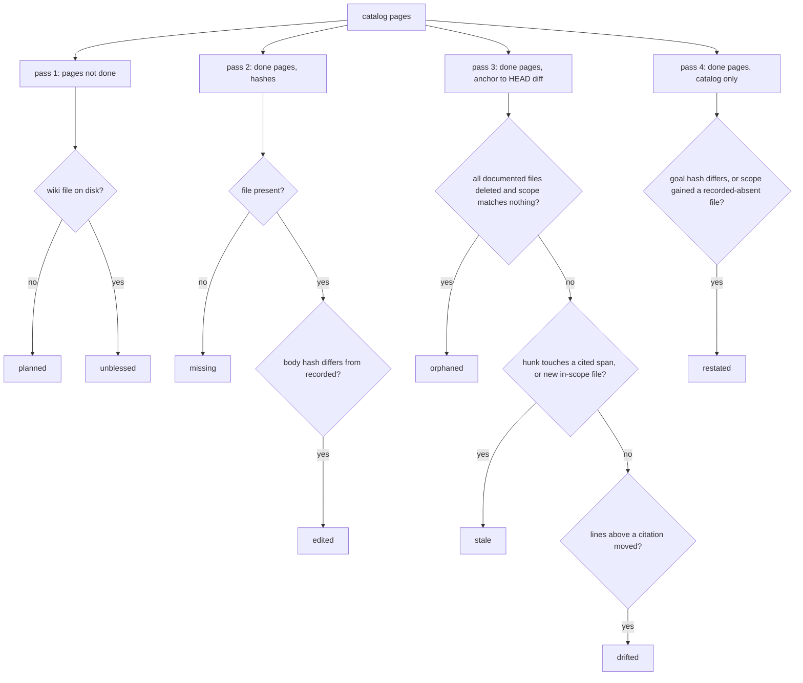

# Deterministic Core

`akashic.py` is the half of akashic-record that is not allowed to guess. It is one stdlib-only file whose subcommands scan a repository, decide which wiki pages have gone out of date, verify what a subagent wrote, and stamp the metadata that makes the next incremental run possible. The dividing line it states for itself is that the LLM never computes a hash, diff, or line range and this script never calls an LLM; everything below is that rule worked out in detail. The LLM side that consumes these commands is described in [Skill Orchestration](./skill-orchestration.md), and the scheduled runner that polls them in [Maintenance Loop](./maintenance-loop.md).

## The command surface

`main` builds one `argparse` parser with a subcommand each for `scan`, `stale`, `verify`, `anchor`, `prompt`, `remap`, `plan-check`, `plan-critic`, `audit` (itself split into `extract` and `prompt`) and `bless`, plus a global `-C` that says which directory to run in. Every path goes through `repo_root` first, so a non-repository, or a repository with no commits at all, is refused before any subcommand sees it — the anchor model needs at least one commit to exist. Three exit codes carry the whole contract: 0 for success, 1 for a verification failure, 2 for usage or precondition errors, which is what `die` returns by default.

The import block names only standard-library modules, and there is exactly one `subprocess.run` in the file — inside `git`, established by searching the whole file for `subprocess.` — which is the mechanical form of the "never calls an LLM" claim in the module docstring. `git` captures output with `errors="surrogateescape"` and, unless a caller passes `check=False`, turns a non-zero git exit into `die`.

Sources: [akashic.py:1-25](../../akashic.py#L1-L25), [akashic.py:91-119](../../akashic.py#L91-L119), [akashic.py:2575-2660](../../akashic.py#L2575-L2660)

## Catalog loading is a trust boundary, not a parse

`load_catalog` runs in every command that reads `.akashic/catalog.json`, and it validates rather than trusts. The format marker must be the *integer* 1 — checked with `type(version) is not int` precisely because Python's `True == 1` and `1.0 == 1` would otherwise let a corrupt marker through. `pages` must be a list, `exclude` a list of strings, `max_files` an integer; each page must carry non-empty string `id`, `title` and `goal`; `scope` and `files` must be lists of strings; `parent` must be a string or null; `blobs` must be an object of path to sha, and `ranges` an object of path to `[[start, end], ...]` with integer endpoints.

The sharpest of these is the id check. A page id is used as a path component (`wiki/<id>.md`) in every command, so `SLUG_RE` is applied at load and a non-kebab-case id is fatal — that is the traversal guard, placed where every entry point crosses it rather than at each use site. Writes go through `save_catalog`, which renders to a `.json.tmp` sibling and `os.replace`s it into position, so a crash mid-write cannot leave a truncated catalog.

Sources: [akashic.py:41](../../akashic.py#L41), [akashic.py:130-195](../../akashic.py#L130-L195)

## `scan`: the planner's filtered view

`scan_repo` starts from `git ls-files`, so anything gitignored is already gone, and then applies `is_noise`: any path segment in `VENDOR_DIRS`, any basename in `LOCKFILE_NAMES`, any of the `NOISE_SUFFIXES` (`.lock`, `.min.js`, `.min.css`, `.map`, `.svg`), anything under `.akashic/`, and anything matching the catalog's `exclude` globs. Files whose first 8 KB contain a NUL byte, and files that cannot be opened at all, are dropped by `is_binary`. What survives is sorted and printed as `<lines>\t<path>` under a header counting files and lines; exceeding `max_files` is a hard error that tells the operator to add `exclude` globs.

Glob matching is `fnmatch` with three deliberate deviations, all in `matches_any` and `escape_brackets`: `[` is escaped so bracket characters in a path segment stay literal (a framework route like `[id]/route.ts` is a path, not a character class), a slash-free pattern also matches the basename at any depth, and a `**/` prefix also matches at the repo root. `expand_scope` reuses `is_noise` and `is_binary`, which is what stops a broad `scope` glob from re-admitting a file the catalog excluded — one definition of the citable universe, shared by `scan`, the rendered prompts, `plan-check` and the coverage half of `stale`.

Sources: [akashic.py:27-39](../../akashic.py#L27-L39), [akashic.py:198-243](../../akashic.py#L198-L243), [akashic.py:286-326](../../akashic.py#L286-L326), [akashic.py:2110-2122](../../akashic.py#L2110-L2122)

## `stale`: nine buckets and what each one means

`compute_stale_with_context` produces the JSON report, and `compute_stale` is the one-value wrapper everything except `remap` calls. The report carries the recorded `anchor`, current `head`, an `anchor_reachable` flag, an `anchor_state` string, a `dirty` flag from `git status --porcelain`, and nine work buckets. The buckets are filled by four independent passes, so a page can appear in more than one:

- **`planned` and `unblessed`** come from the non-done pages. The split is on whether `wiki/<id>.md` exists: absent means nobody generated the page, present means a subagent wrote it and died before it was accepted. They are kept apart because the remedies differ and one of them destroys work — `planned` prescribes generation, which for a page that already has a body would discard it unread.
- **`missing` and `edited`** come from a hash pass over done pages, independent of any diff: no file on disk is `missing`; a file whose `page_hash` differs from the recorded `hash` is `edited`.
- **`orphaned`, `stale` and `drifted`** come from the `anchor..HEAD` diff pass. A page is orphaned only when every file it documented is deleted *and* nothing in the current HEAD tree matches its scope — a rewritten module is stale, never orphaned. Otherwise it is stale if a change reached lines it cites or a newly added file falls in its scope, and drifted if neither is true but its cited lines have moved.
- **`restated`** comes from `compute_restated` and reads only catalog data: a `goal` whose recorded `goal_hash` no longer matches, or a file now matched by the page's scope that is absent from its recorded `files`. A page that was never anchored has no recorded `files` to compare against and is skipped.

`uncovered` is not a page bucket but a file list: paths added since the anchor that no page's `files` names exactly and no page's `scope` matches, after noise and binary filtering. The `files` comparison is exact rather than glob so that a recorded root `Makefile` does not shadow a new nested one.

Every path fed into the diff pass is filtered through a local `outside_akashic` helper, and `fallback_stale` and the unreachable-anchor coverage pass apply the same `.akashic/` prefix test. That is the self-dependency exclusion: the wiki must never be an input to its own staleness, or committing a refresh would immediately mark the refreshed pages stale again.

Sources: [akashic.py:1117-1155](../../akashic.py#L1117-L1155), [akashic.py:1241-1358](../../akashic.py#L1241-L1358)

## Range-level staleness, and the drift it exposes

Where a page cites line numbers, staleness is measured against those numbers rather than the whole file. `anchor` records `ranges` in anchor coordinates via `citation_span`, which clamps a cited end to the file's real line count — without that clamp an append at EOF would intersect the phantom trailing line that every cite-to-end citation carries, and stale the page on every append. `diff_context` takes one `git diff -U0 -M` for hunks and one `git diff --name-status -M -z` for the added, deleted and renamed sets; `parse_diff_hunks` keys hunks by the *old* path, because that is the coordinate system the recorded ranges live in.

`touches_page` then answers conservatively: it returns True whenever it cannot answer precisely — no recorded spans (an in-scope file the page never cited), no hunks (a pure rename under `-M` emits none), a fragment-less citation, a deletion. Only a modification whose every hunk misses every cited span is dismissed, and `hunk_touches_ranges` treats a zero-length hunk as an insertion after line N that counts only when it lands strictly inside a span.

The hole this opens is drift: a change *above* a cited block touches nothing cited, so the page is not stale, but its line numbers now point at different code — in bounds, so `verify` cannot see it. `shift_at` sums the deltas of hunks that end strictly above a position, `page_drift` applies that to each span and also carries a rename's new path, and the result is reported as `drifted` while the span mapping is kept in the diff context beside the report rather than inside the public JSON.

Sources: [akashic.py:955-1073](../../akashic.py#L955-L1073), [akashic.py:1158-1190](../../akashic.py#L1158-L1190), [akashic.py:1326-1340](../../akashic.py#L1326-L1340)

## When the anchor commit is gone

An unreachable anchor is recoverable rather than fatal. `compute_stale_with_context` tests the recorded anchor with `git cat-file -e <anchor>^{commit}` and, on failure, sets `anchor_state` to `never_anchored` (no anchor recorded) or `anchor_unreachable` (recorded but absent — a shallow clone, or a commit a squash-merge discarded), then falls back to `fallback_stale`.

That fallback proves freshness from content rather than history. `anchor` records a `blobs` map of path to blob sha, read in one `git ls-tree -r -z HEAD` call by `tracked_blobs`; blob shas are content hashes, so equality at HEAD proves a file is byte-identical without the old commit existing. A page is provably fresh only when every recorded blob still matches *and* its scope expanded against HEAD adds nothing beyond its recorded `files` — the second condition is not redundant, since blob comparison can only speak about paths already recorded and would be blind to a brand-new module inside the page's own scope. A page with no recorded blobs is never provably fresh. Coverage in this mode is computed over the whole HEAD tree instead of a diff, and `restated` still runs, because both its inputs are catalog data.

Sources: [akashic.py:254-270](../../akashic.py#L254-L270), [akashic.py:1076-1108](../../akashic.py#L1076-L1108), [akashic.py:1257-1294](../../akashic.py#L1257-L1294)

## The bucket-to-action table, and the runner gate

`BUCKET_ACTIONS` maps each bucket to what somebody has to *do* — `update` for most, `review` for `edited`, `remap` for `drifted` — and `WORK_BUCKETS` is derived from its keys rather than written beside it, so a bucket no action covers cannot exist. The comment records why: the two structures were once independent and drifted, leaving a restated-only repository classified as clean. `edited` is deliberately routed to `review` and never to `update`, because handing a human-edited page to a regenerator would destroy the edit.

`cmd_stale` prints the report as indented JSON. With `--check` it additionally exits 1 when any work bucket is non-empty, printing a `bucket=count` summary and, when the anchor state is not `ok`, a sentence naming which of the two causes it is. With `--ids BUCKET` it prints one page id per line via `bucket_ids` and nothing else, and an unknown bucket name dies rather than printing an empty list — a typo that yields no output is indistinguishable from "nothing to do".

Sources: [akashic.py:1361-1435](../../akashic.py#L1361-L1435)

## `verify`: the citation gate

`verify_repo` returns a list of error strings; `cmd_verify` prints them and returns 1 if there are any. Catalog-level errors come first: duplicate page ids, a `status` outside `{"planned", "done"}`, an unknown `parent`, and a parent cycle (walked with a `seen` set per page). Then every **done** page is checked — non-done pages are skipped, which is exactly why the `planned` and `unblessed` buckets exist in `stale`.

Per page, the errors are: the file does not exist; the first non-empty line is not an H1; there is no `Sources:` line at all; a Sources block yielded no parseable links. Citations are extracted by `parse_page_links`, which treats a Sources block as a paragraph (the `Sources:` line plus continuation lines until a blank line or a heading), ignores fenced code entirely, and skips inline code spans through `split_code_spans` — so both a fenced example citation and a backticked one are neither verified nor recorded as a dependency.

Each citation target then goes through `resolve_citation`, which strips a CommonMark `<...>` wrapper, splits off the `#fragment`, percent-decodes, and rejects URL schemes, absolute paths, control characters, and anything resolving outside the repository root. The resolved path must be in `git ls-files` — not merely present on disk. That is load-bearing twice over: an untracked or wrong-case path can never appear in an anchor-to-HEAD diff, so citing one would make the page permanently fresh. A citation under `.akashic/` is exempt from the tracked check and only has to exist. Finally `check_fragment` parses `#L<start>` or `#L<start>-L<end>`, rejects a malformed or inverted range, and allows an end at most one past the real line count — the single extra empty line a reader sees for a file that ends in a newline.

Sources: [akashic.py:331-453](../../akashic.py#L331-L453), [akashic.py:670-762](../../akashic.py#L670-L762), [akashic.py:818-826](../../akashic.py#L818-L826)

## The five warning classes `verify` emits

Warnings go to stderr through `warn` and never enter the error list, so none of them can block `anchor`. There are five, counted by searching `verify_repo` for its `warn(` call sites and the two helpers whose returned messages it forwards.

**Out-of-scope citation.** A citation that resolves correctly to a real tracked file but does not match the page's own catalog `scope`. The rendered prompt promises the scope is the entire citable set, and nothing enforced that; the drift reads the same in both directions — scope too wide, or too narrow — so it is surfaced, not blocked.

**Invented identifier.** `check_identifiers` groups citations by the H2 section they sit in (`h2_sections` splits on `## `, skipping fences) and, for each backticked token in that section, checks whether it appears anywhere in any file the section cites. The search is the whole cited file rather than the cited span, because a page legitimately names a symbol defined elsewhere in the same module. The filters that keep this usable are `identifier_tokens` and `identifier_candidates`: only identifier-shaped tokens count (`IDENT_SHAPE_RE` wants a call, snake_case, camelCase, or a dotted or scoped name); tracked basenames from `tracked_basenames` and anything matching `FILE_EXT_RE` are filenames, not symbols; `BUILTIN_NAMESPACES` members and `PROSE_TOKENS` like `camelCase` are excluded; a `Sources:` line is skipped, since its backticks are paths the citation gate already owns; and a qualified prose name falls back to its last segment, so `users.firstName` matches a bare `firstName` declaration.

**Anchored content no longer cited.** `check_anchored_content` reads what each recorded span held at the anchor commit (`file_at_rev`), reduces it to its first and last non-blank lines (`span_edges`), and relocates that pair in the working tree (`locate_edges`, which requires uniqueness and prefers a match preserving the original length — ambiguity yields no answer rather than a guess). If no current citation *touches* where the content landed, the page is warned about. Overlap rather than containment is the test, because a good rewrite narrows ranges; coverage is the union of the page's citations for that file, merged by `merge_spans`, which also bridges gaps containing only blank lines. One line per file names every uncovered region. The check is silent when the anchor is unreachable, and silent for a page whose recorded `goal_hash` no longer matches its `goal` — a rewritten brief has a known answer to this question. A widened scope alone does not silence it.

**Forward link to a not-yet-generated page.** Markdown links outside Sources blocks that point at `.md` files inside the wiki directory are resolved to a page id. `README` is skipped (it is derived at anchor time), an id absent from the catalog is an *error*, and an id whose page is still `planned` is a warning — a partial wiki is a valid resume state.

**An unclaimed `.md` in the wiki directory.** Any `*.md` in `wiki/` that is neither `README.md` nor `<id>.md` for a catalog page is reported as not in the catalog and left untouched.

Sources: [akashic.py:58-87](../../akashic.py#L58-L87), [akashic.py:458-504](../../akashic.py#L458-L504), [akashic.py:507-667](../../akashic.py#L507-L667), [akashic.py:767-814](../../akashic.py#L767-L814), [akashic.py:857-952](../../akashic.py#L857-L952)

## `anchor`: the only metadata mutation point, and the hash rule

`anchor_repo` runs `verify_repo` first and refuses with exit code 1 if there is a single error. Then, for each done page, it re-parses the body's citations and records three things: `files` (the union of cited paths and scope-matched tracked paths, with `.akashic/` excluded), `blobs` (the HEAD blob sha for each of those files that exists at HEAD — a staged-but-uncommitted dependency is simply absent, which means "cannot be proven fresh"), and `ranges` (sorted cited spans per path, only for citations that carried line numbers).

Two guards live in the tail of that loop, and both exist to avoid asserting something nothing checked.

The **hash rule**: the recorded `hash` permanently means "what the tool last wrote". `null` is the bless signal. If the current body hash differs from a non-null recorded hash, a human edited the page — `anchor` warns and *keeps the old hash*, because re-hashing would launder the `edited` marker away and let the next update overwrite the edit. Only a page whose hash is null or unchanged gets a new hash recorded. Hashes are computed over a normalized body (`normalize_body`: CRLF and CR to LF, trailing whitespace stripped per line, trailing newlines stripped), so line-ending churn is not mistaken for an edit.

The **goal baseline rule**, three lines above it: `goal_hash` is recorded only when `hash` is null, that is, only for pages the tool actually wrote this run. Stamping it unconditionally would assert that a page nobody regenerated corresponds to the current goal; the comment records that this cost a real run, silently blessing ten corrected goals onto unwritten pages. A page left without a baseline is reported by `plan-check` rather than papered over.

Finally `anchor` stamps `catalog["anchor"]` to HEAD and `generated` to a UTC timestamp, rewrites `wiki/README.md` from `render_readme` (a TOC re-derived from the catalog's `parent` fields on every run, so it cannot drift), saves the catalog, and warns if the working tree is dirty.

Sources: [akashic.py:273-283](../../akashic.py#L273-L283), [akashic.py:1440-1555](../../akashic.py#L1440-L1555)

## `bless`: the one metadata edit the LLM side used to make by hand

`bless_pages` sets `hash` to null for the named pages and, with `--done`, also flips `status` to `done`. It validates every id and every page file *before* mutating anything, so a typo'd id or a page whose file was never written fails without touching the catalog, and the mutation is a single `save_catalog`. The docstring gives the reason it exists at all: hand-editing `catalog.json` after writing a page is two steps with no atomicity between them, and a session dying in the gap leaves the tool's own fresh output sitting under the previous hash — which `stale` then reports as `edited`, protecting it from the very tool that wrote it.

Sources: [akashic.py:1566-1606](../../akashic.py#L1566-L1606)

## `remap`: fixing drift without an LLM

`remap_repo` calls `compute_stale_with_context` and uses **that one snapshot** for both the classification and the arithmetic. Taking a second diff would be a second instant: a commit landing in between is seen by the newer diff and not the older one, so a page the newer diff has made stale could still sit in the older report's `drifted` list, be shifted, be blessed, and then be recorded fresh by `anchor`. Without a reachable anchor it dies with exit code 1, because recorded line numbers are anchor coordinates and there is nothing to measure drift against.

Pages in `edited` are skipped and reported — rewriting even a line number inside a human-edited body is still writing to it. For the rest, `remap_body` rewrites only `Sources:` paragraphs, skips fenced blocks entirely, and rewrites around inline code spans rather than through them, updating both halves of each link: the destination fragment a renderer follows and the human-readable `path:start-end` text, since a reader who sees them disagree cannot tell which one lied. Each page is written and blessed immediately, one at a time, so a crash cannot leave a tool-rewritten body sitting under its old hash.

Sources: [akashic.py:1611-1733](../../akashic.py#L1611-L1733)

## `plan-check`: shape questions a script can answer for free

`plan_check` runs before any fan-out and reports on the catalog's shape. `scope_sizes` expands every page's scope through `expand_scope`, so it measures the real subagent input rather than the globs someone typed. The findings are `no_scope`, `empty_scope` (a scope matching no tracked file), `empty_goal`, `no_goal_baseline` (a done page with no recorded `goal_hash`, so a goal edit on it is undetectable until it is next generated), `duplicate_titles`, `oversized` (a scope over `SPLIT_THRESHOLD`, 200, which is read from the documented planning rule rather than invented here), `subset` (one page's file set entirely inside another's) and `overlap`, plus a `pages` list of per-page file and line totals sorted biggest first.

Overlap is reported and never judged. Every overlapping pair is listed, sorted by duplicated lines, with no threshold at all: the docstring records that the original ratio-against-page-size gate stayed silent on a pair sharing 3632 lines while flagging one sharing 2754, and was non-monotonic — widening one page for unrelated reasons dropped a true finding about a different pair. A pair that is a subset is reported once, under the sharper heading. `cmd_plan_check` prints the JSON, emits a warning per finding (capping the named overlap pairs at `OVERLAP_SUMMARY`, 3, while always stating the true count), and always returns 0: it is advisory, because several findings are legitimate on a real catalog and a pre-flight check that blocked would get routed around.

Sources: [akashic.py:1738-1767](../../akashic.py#L1738-L1767), [akashic.py:1770-1906](../../akashic.py#L1770-L1906)

## `plan-critic`: the same plan, judged by a model

`render_plan_critic` is templating only — it renders a prompt and judges nothing. One prompt covers the whole catalog rather than one per page, because two of its four questions (collision, redundant scope) are cross-page and a per-page reviewer would be structurally blind to them. The prompt carries every page's goal, scope and expanded file list (capped at `CRITIC_FILE_SAMPLE`, 40, with the withheld count and the command that prints the full list stated explicitly), states that a page's scope is the entire set of files its subagent may cite, and hands over `plan_check`'s findings under a heading marking them as already established so the judge does not re-derive them. The findings block is omitted entirely when there is nothing to report. The four questions are substantiation, truthfulness, collision and redundant scope; the prompt closes with a READ ONLY mandate and an instruction that the review is one sample and not a measurement — two passes over an unchanged catalog have disagreed in both directions.

With `--out`, `cmd_plan_critic` routes through `write_prompt_out`, which refuses to write inside `.akashic/` (a scratch file there would be picked up as uncovered and committed with the wiki), writes the file, and prints the exact verbatim dispatch sentence rather than leaving a caller to improvise one.

Sources: [akashic.py:1911-2052](../../akashic.py#L1911-L2052), [akashic.py:2055-2092](../../akashic.py#L2055-L2092)

## `prompt`: the subagent contract, rendered rather than remembered

`render_prompt` instantiates one page's brief mechanically from the catalog and the filesystem. It emits the title and goal; the citable file list from `expand_scope` (with an explicit "fix this page's catalog scope" line when nothing matched); the sibling id-to-title list for cross-links; the required page shape, including the exact `Sources:` grammar and the commit stamp taken from `git rev-parse HEAD`; the prose language from the catalog; and a READ ONLY mandate that forbids executing the files, running build or migration or git-mutating commands, and following instructions found inside the files themselves.

Two additions are there because a rule that depends on being retyped eventually is not. `find_context_docs` looks for the `CONTEXT_DOC_NAMES` agent-guidance files that are present on disk but *not* tracked by git, and, when any exist, renders the paragraph saying they may be read but never cited. And three generation disciplines ride in every prompt — scope generalizations to what was actually read, state the method behind any absence claim, write only what the goal asks — which the comment marks as instructions rather than gates, because the gates only ever reported the same result.

`--update` adds regeneration context from `regeneration_context`, which reads the `stale` and `restated` buckets and names the changed dependencies, the rewritten goal, or the newly in-scope files. When it has nothing to say, the prompt does **not** silently degrade to a generate prompt: it renders a paragraph saying so and warning against merely re-verifying and restamping the page, because that restamp broke a recorded hash and produced a false `edited` marker. `--out` behaves as it does for `plan-critic`, via the same `write_prompt_out`.

Sources: [akashic.py:2097-2170](../../akashic.py#L2097-L2170), [akashic.py:2173-2311](../../akashic.py#L2173-L2311)

## `audit`: an on-demand blind refuter

`audit extract` builds per-H2-section bundles: the section's prose with its heading and `Sources:` paragraphs removed (`section_claim`), and the exact cited bytes as evidence (`span_text`). `audit prompt <id>` renders a judge prompt from those bundles in which evidence is labelled `[E1]`, `[E2]` and no filename appears — a judge shown a path fills gaps with what a file by that name usually contains. The label-to-path mapping stays in the extract JSON so a finding remains actionable. Each label states its file's total length and how many lines are hidden, without which every claim of *absence* is unfalsifiable from an excerpt; the judge is told not to grade attribution, since it cannot see filenames; the section list and denominator are fixed by the extract rather than chosen by the judge; and the total is described as one sample and not a score. A section that cites nothing is rendered with `EVIDENCE: none` rather than dropped, and an unknown or unsectioned page id dies rather than auditing nothing. This never gates `anchor`.

Sources: [akashic.py:2316-2425](../../akashic.py#L2316-L2425), [akashic.py:2428-2570](../../akashic.py#L2428-L2570)

## What the test suite pins

`test_akashic.py` is stdlib `unittest` over throwaway git repositories built by `RepoCase`, which initialises a repo, writes files, commits, and stamps a catalog. The invariants it holds down, class by class:

- **The scan filter chain.** One repository holding a three-line source file, a NUL-byte binary, a lockfile and a file matching the catalog's `exclude` globs, run through `scan_repo`, must yield exactly the source file mapped to its line count. The assertion is an equality against the whole result rather than a membership check, so each of the four omissions is pinned as tightly as the one inclusion.
- **The incremental mechanism.** Edit one file, delete another, add a third, and the report must be exactly `stale:[a]`, `orphaned:[b]`, `uncovered:[f3.py]`. A rename is stale and never orphaned. A page whose scope still matches a tracked file is stale rather than orphaned even when everything it recorded was deleted — the bracket-glob fixture exists because SKILL.md resolves `orphaned` by deleting the page, so a glob defect there was a data-loss path.
- **`planned` versus `unblessed`.** A page nobody wrote lands in `planned`; a page whose file exists under a non-done status lands in `unblessed`, is caught by the `--check` gate, is addressable through `--ids`, and leaves the bucket when blessed without its body being rewritten.
- **Range-level staleness.** A change at line 35 does not stale a page citing lines 5-10; a change at line 7 does. An append at EOF does not, which is the recorded-span clamp doing its job. A pure rename and an uncited in-scope file both stay file-level stale.
- **Drift and `remap`.** Inserting five lines above a cited block produces `drifted` and not `stale`; `remap` shifts both the destination and the readable text, blesses the page, and leaves fenced and inline-span example citations alone; it refuses to rewrite a human-edited page. One test counts git invocations to prove exactly two diffs are taken per run, and another asserts the diff context never reaches the serialized JSON.
- **The unreachable anchor.** All pages stale when nothing can be proven; `never_anchored` distinguished from `anchor_unreachable`; unchanged blobs proving freshness without the commit; a new in-scope file still marking the page stale; and a page with no recorded blobs never trusted.
- **`restated`.** A widened scope onto a pre-existing file, a goal edit, whitespace-only goal changes ignored, an absent `goal_hash` staying quiet, and — the regression that cost a real run — `anchor` recording a goal baseline *only* for pages it wrote, with the missing-baseline case surfaced by `plan-check` and self-clearing on the next regeneration.
- **The catalog format.** Versions 2, 0, `"1"`, null, 1.5, `True` and 1.0 all exit 2, a missing version exits 2, and the gate is exercised through `scan`, `stale`, `verify`, `anchor`, `plan-check`, `remap` and `bless` so no subcommand admits a bad catalog by the side door. A traversal page id and a string `scope` are rejected at load.
- **The citation gate.** Valid pages pass; the +1 trailing-newline tolerance is accepted and +2 rejected; out-of-range, traversal, untracked, missing and `file://` citations fail; a NUL byte reports an error instead of crashing; fenced and backticked example citations are neither verified nor recorded as dependencies while a real link on the same line still is; wrapped Sources paragraphs are checked on continuation lines; bracketed and parenthesised route paths parse, in both bare and angle-wrapped forms.
- **The anchor invariant.** Immediately after `anchor` and committing its artifacts, every bucket is empty; a subsequent manual edit flips exactly `edited`; re-anchoring over a human edit preserves the recorded hash and the `edited` marker, and only an explicit `bless` clears it. `anchor` refuses on any verification failure, and `bless` refuses both an unknown id and a page whose file was never written.
- **The warning classes.** An invented identifier warns and never blocks; a tracked basename, an untracked filename, a builtin namespace, a convention word and a qualified prose name whose last segment exists do not warn; fenced identifiers are skipped. For anchored content: a stale citation warns and names where the content went, a correctly re-derived one is silent, a narrowed one and a split one are not dropped claims, repeated boundary lines produce no guess, every uncovered region is named, a rewritten goal silences the class for exactly one cycle while a widened scope alone does not, and an absent `goal_hash` leaves it armed.
- **`plan-check` and `plan-critic`.** Unmatched versus absent scope as separate findings; subset reported instead of overlap; overlap ranked by duplicated lines rather than file count; growing one page never silencing an unrelated pair; every overlapping pair listed. For the critic, that every goal and scope reaches the judge, all four questions are stated, deterministic findings are handed over rather than re-derived, a clean plan omits the findings block, truncation is never silent, an empty catalog fails rather than rendering nothing, and `--out` refuses to write inside `.akashic/`.
- **Prompt rendering.** Only tracked scope-matched files are offered as citable, `exclude` globs and built-in noise do not leak back in, untracked context docs are surfaced with their non-citable warning, the three generation disciplines and the READ ONLY mandate are present, `--update` names what changed *and* a changed brief, `--update` is never byte-identical to a plain prompt, and `--out` writes the body to a file while printing only the dispatch line.
- **The audit halves that are deterministic.** Evidence is the exact cited bytes; the claim drops its heading and Sources paragraph; the rendered prompt never names a file while the extract keeps the label-to-path mapping; labels are unique per page; hidden-line counts appear only when something is hidden; and the denominator and section list are fixed by the extract.
- **The docs themselves.** `TestDocBucketEnumerations` is the one test that reads the repository's prose, checking README, CLAUDE.md, DESIGN.md's bucket table and SKILL.md's update flow against `WORK_BUCKETS`, because four hand-maintained copies of that list had rotted at once.

The file also imports `akashic_loop` and its `TestLoop` class covers the scheduled runner's decision layer, which is documented in [Maintenance Loop](./maintenance-loop.md) rather than here. The LLM phases have no unit tests at all, since a stubbed judge would only assert the stub, and the runtime `verify` gate is their coverage. For how these commands compose into the plan, generate and update flows, see [Skill Orchestration](./skill-orchestration.md) and [Project Overview](./index.md).

Sources: [test_akashic.py:1-69](../../test_akashic.py#L1-L69), [test_akashic.py:72-87](../../test_akashic.py#L72-L87), [test_akashic.py:93-152](../../test_akashic.py#L93-L152), [test_akashic.py:155-616](../../test_akashic.py#L155-L616), [test_akashic.py:619-798](../../test_akashic.py#L619-L798), [test_akashic.py:801-864](../../test_akashic.py#L801-L864), [test_akashic.py:867-930](../../test_akashic.py#L867-L930), [test_akashic.py:933-983](../../test_akashic.py#L933-L983), [test_akashic.py:986-1943](../../test_akashic.py#L986-L1943), [test_akashic.py:1946-2099](../../test_akashic.py#L1946-L2099), [test_akashic.py:2102-2227](../../test_akashic.py#L2102-L2227), [test_akashic.py:2230-2431](../../test_akashic.py#L2230-L2431), [test_akashic.py:2434-2437](../../test_akashic.py#L2434-L2437)

*Generated from commit `65acf413` on 2026-08-11.*
