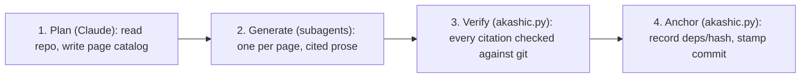

# Project Overview

akashic-record is a repo wiki generator for Claude Code: it plans a page catalog, generates repo-committed markdown with line-range citations into source, and incrementally updates only the pages whose underlying files changed — while never overwriting human edits. It ships as a Claude Code skill plus one stdlib-only Python helper, and the repo itself is MIT licensed. This page orients a new developer to the three artifacts, how work is split between the LLM and the deterministic script, the four-phase pipeline that produces a wiki, and where to read next.

## What it is and why it exists

Every codebase accumulates knowledge that lives nowhere but in the heads of whoever wrote it, and that knowledge goes stale the moment nobody updates a doc, or nobody wrote one. Hosted products like Qoder's Repo Wiki and DeepWiki solve this by generating a wiki from the code, but your code goes through someone else's pipeline and the output lives in their format. akashic-record does the same job — architecture pages with real source citations, kept fresh as the code changes — as a Claude Code skill: no service to trust with your code, no proprietary format, just markdown committed straight into the repo alongside the code it describes.

Sources: [README.md:1-6](../../README.md#L1-L6), [README.md:8-20](../../README.md#L8-L20), [DESIGN.md:1-9](../../DESIGN.md#L1-L9)

## The three artifacts

- **`DESIGN.md`** — the normative design, on-disk format spec, and the research this was built against (Qoder Repo Wiki, DeepWiki, and others).
- **`SKILL.md`** — the Claude Code skill that orchestrates planning and generation; covered in depth in [Skill Orchestration](./skill-orchestration.md).
- **`akashic.py`** — the deterministic core (stdlib-only, Python 3.9+): everything that must never be hallucinated — diffing, citation verification, hashing, anchoring; covered in depth in [Deterministic Core](./deterministic-core.md).

Sources: [README.md:22-28](../../README.md#L22-L28)

## How it works

Claude reads the repo and writes a page catalog first — titles, a generation brief, and which files each page is scoped to. Then one subagent per page runs in parallel, each reading only its assigned files and writing a page where every section ends in a citation. `akashic.py verify` is the one part of this that isn't an LLM: it mechanically checks that every citation resolves to a real, git-tracked file with a valid line range before anything gets anchored. `akashic.py anchor` then records each page's file dependencies and content hash against the current commit, so a later update knows exactly which pages a given code change should regenerate — and never touches a page a human has since edited.

Sources: [README.md:30-49](../../README.md#L30-L49)

## Division of labor: LLM vs. script

| Who | Does | Never does |
|---|---|---|
| LLM (skill-orchestrated) | overview, catalog planning, page prose, update triage | compute a hash, diff, or line range |
| `akashic.py` (stdlib only) | `scan`, `stale`, `verify`, `anchor` | call an LLM |

Everything that can lose human work or mark stale content as fresh is deterministic code; everything stochastic passes through a deterministic verification gate before it is anchored. This split is the design's one non-negotiable invariant.

Sources: [DESIGN.md:47-56](../../DESIGN.md#L47-L56)

## Getting started

Symlink this repo into `~/.claude/skills/akashic-record` to install it. Inside Claude Code, in any git repo with at least one commit: `/akashic-record` plans and generates the wiki on first run, `/akashic-record update` regenerates only stale pages, and `/akashic-record status` reports what would change without writing anything. The wiki lands in `.akashic/wiki/` as plain markdown, meant to be committed so teammates get it via `git pull` and GitHub renders it (Mermaid included).

The helper also works standalone — `python3 akashic.py -C <repo> scan|stale|verify|anchor|prompt <id>` — and the deterministic core has its own test suite, runnable with `python3 test_akashic.py`.

Sources: [README.md:51-68](../../README.md#L51-L68), [README.md:70-84](../../README.md#L70-L84)

## License

akashic-record is released under the MIT License, copyright ARMeeru — permissive use, modification, and redistribution, with the license text and copyright notice required to be preserved in copies.

Sources: [LICENSE:1-3](../../LICENSE#L1-L3)

## Where to start reading

1. This page, for orientation.
2. [Deterministic Core](./deterministic-core.md) — `akashic.py`'s subcommands (`scan`, `stale`, `verify`, `anchor`) and their tests.
3. [Skill Orchestration](./skill-orchestration.md) — how `SKILL.md` drives the LLM phases: planning, per-page subagent contract, edit-protection rules.

Sources: [README.md:22-28](../../README.md#L22-L28)

*Generated from commit `d6882155` on 2026-07-22.*
