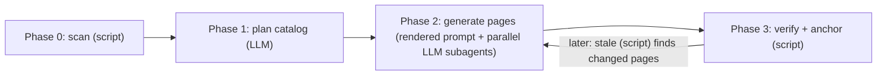

# Project Overview

akashic-record is a repo wiki generator for Claude Code: it plans a page catalog, generates repo-committed markdown with line-range citations into source, and incrementally updates only the pages whose underlying files changed — while never overwriting human edits. The design distills a survey of shipped wiki generators (Qoder Repo Wiki, DeepWiki, OpenDeepWiki, CodeWiki, and others) down to the four patterns every system converged on, deleting everything else. This page orients a new developer to the repo's three artifacts, how work is split between the LLM and the deterministic script, and where to read next.

## What it is and why it exists

The form factor is deliberate: a Claude Code skill (`SKILL.md`) plus one stdlib-only Python helper (`akashic.py`) — not a standalone CLI, not an MCP server, not a plugin. The research finding behind this choice is that the quality gap between closed wiki pipelines and their open-source clones came from pipeline structure — catalog-first planning, per-page scoped prompts, agentic exploration — not from model access; a skill encodes exactly that structure as instructions, and Claude Code supplies the model, tools, parallel subagents, and orchestration for free. The output serves two audiences with one artifact: humans get browsable onboarding/architecture docs with Mermaid diagrams, and agents get pre-digested context that answers "how does X work" without re-exploring the codebase.

Sources: [DESIGN.md:1-9](../../DESIGN.md#L1-L9), [DESIGN.md:19-45](../../DESIGN.md#L19-L45), [README.md:1-6](../../README.md#L1-L6)

## The three artifacts

- **`DESIGN.md`** — the normative design and on-disk format spec; everything else implements it.
- **`SKILL.md`** — the Claude Code skill that orchestrates planning and generation; covered in depth in [Skill Orchestration](./skill-orchestration.md).
- **`akashic.py`** — the deterministic core, stdlib-only (Python 3.9+): "everything that must never be hallucinated"; covered in depth in [Deterministic Core](./deterministic-core.md).

A fourth file, `test_akashic.py`, gives each deterministic component the smallest check that fails if its logic breaks. The LLM phases have no unit tests of their own — they are covered by the runtime `verify` gate instead.

Sources: [README.md:8-12](../../README.md#L8-L12), [README.md:42-46](../../README.md#L42-L46)

## Division of labor: LLM vs. script

This split is the design's one non-negotiable invariant:

| Who | Does | Never does |
|---|---|---|
| LLM (skill-orchestrated) | overview, catalog planning, page prose, update triage | compute a hash, diff, or line range |
| `akashic.py` (stdlib only) | `scan`, `stale`, `verify`, `anchor` | call an LLM |

Everything that can lose human work or mark stale content as fresh is deterministic code; everything stochastic passes through a deterministic verification gate before it is anchored.

Sources: [DESIGN.md:47-56](../../DESIGN.md#L47-L56)

## On-disk format

The `.akashic/` directory lives in the target repo and is committed: `catalog.json` is the single authoritative metadata file (settings + TOC plan + per-page state), `wiki/README.md` is a derived TOC rendered by `anchor` — never hand-edited — and `wiki/<id>.md` pages sit flat regardless of the catalog's parent/child hierarchy; an optional `notes.md` carries free-text steering injected verbatim into the planning prompt. Each page's `id` is a kebab-case slug derived from its initial title, uniquified and frozen at creation, so retitling or reparenting a page never breaks its filename or inbound links.

Each page is markdown whose H2 sections each close with a `Sources:` paragraph of comma-separated links (repo root is `../../` from `wiki/`), optionally with a `#Lstart-Lend` fragment. Two grammar fixes matter when citing real repos: a citation whose link *text* is itself a path containing literal brackets (route-based frameworks that name path segments this way, e.g. `[id]/route.ts`) may wrap the destination in angle brackets per CommonMark instead of percent-encoding it; and a citation's end line may exceed the file's real line count by exactly one, because Read-tool output shows one extra empty numbered line for any file ending in a trailing newline — `verify` tolerates `end <= real_lines + 1` rather than rejecting the phantom line.

Sources: [DESIGN.md:58-73](../../DESIGN.md#L58-L73), [DESIGN.md:75-82](../../DESIGN.md#L75-L82), [DESIGN.md:167-196](../../DESIGN.md#L167-L196)

## Pipeline

The pipeline is catalog-first: the whole table of contents is planned before any page is written, and the four phases alternate between script and LLM.

Sources: [DESIGN.md:198-304](../../DESIGN.md#L198-L304)

`scan` walks `git ls-files`, drops binaries/lockfiles/vendored dirs/excluded globs, and caps at `max_files`; it requires a git repo with at least one commit, since incremental update depends on having a commit to anchor against. Planning reads the scan output, README, and `notes.md`, optionally consulting tokensave or `graphify-out/graph.json` if present, and writes the `pages` array. Generation dispatches one subagent per page whose prompt is now **rendered by `akashic.py prompt <id>`, never hand-written** — assembling the goal, the scope-expanded file allowlist, the sibling id→title list for cross-links, and the citation contract, plus a note to read (but never cite) untracked local agent-guidance files like `CLAUDE.md`. Verification checks that every `Sources:` citation resolves to a git-tracked path inside the repo with a line range in bounds; anchor then records each page's file dependencies and body hash, stamps the commit, and renders the TOC.

Sources: [DESIGN.md:205-216](../../DESIGN.md#L205-L216), [DESIGN.md:218-233](../../DESIGN.md#L218-L233), [DESIGN.md:237-253](../../DESIGN.md#L237-L253), [DESIGN.md:278-304](../../DESIGN.md#L278-L304)

## Incremental update

`akashic.py stale` is read-only: it diffs the stored anchor commit against `HEAD` and intersects changed/deleted paths against each page's recorded `files` (plus `scope` globs, for added files), sorting pages into four buckets — `stale` (regenerate), `edited` (a human touched the page; never auto-overwritten), `orphaned` (every file the page documented is gone; auto-deleted unless also edited), and `uncovered` (added files matching no page's scope, proposed as new catalog entries or ignored). It is a tested invariant that immediately after `anchor` runs, `stale` returns empty. Pages carry no in-page changelog — git history is the changelog, and the structured update report becomes the commit message.

Sources: [DESIGN.md:310-340](../../DESIGN.md#L310-L340)

## Install and use

Symlink this repo into `~/.claude/skills/akashic-record`. In any git repo with at least one commit, `/akashic-record` plans and generates the wiki on first run, `/akashic-record update` regenerates only stale pages, and `/akashic-record status` reports what would change without writing anything. The helper also runs standalone: `python3 akashic.py -C <repo> scan|stale|verify|anchor`.

Sources: [README.md:14-40](../../README.md#L14-L40)

## Where to start reading

1. `DESIGN.md` §1–2 — positioning and the division-of-labor invariant; the shortest path to why the system is shaped this way.
2. `DESIGN.md` §3–5 — the on-disk format, the four-phase pipeline, and incremental-update semantics.
3. [Deterministic Core](./deterministic-core.md) — `akashic.py`'s subcommands (`scan`, `stale`, `verify`, `anchor`) and their tests.
4. [Skill Orchestration](./skill-orchestration.md) — how `SKILL.md` drives the LLM phases: planning, per-page subagent contract, edit-protection rules.

The build order in `DESIGN.md` §10 mirrors this reading order: helper first, tests second, skill third, README last.

Sources: [DESIGN.md:420-429](../../DESIGN.md#L420-L429)

*Generated from commit `8ae2ecc0` on 2026-07-16.*
