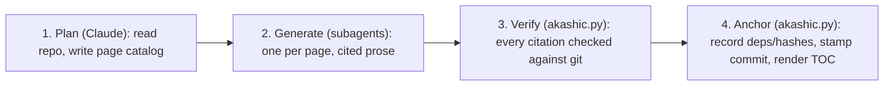

# Project Overview

akashic-record is a repo wiki generator for Claude Code: it plans a page catalog, generates repo-committed markdown with line-range citations into source, and incrementally updates only the pages whose underlying files changed — while never overwriting human edits. It ships as a Claude Code skill plus one stdlib-only Python helper, is MIT licensed, and dogfoods itself: the page you are reading lives in this repo's own `.akashic/wiki/`. This page orients a new developer in their first hour — what the project is, the three artifacts, the division of labor between the LLM and the deterministic script, the ground rules for contributing, and where to read next.

## What it is and why it exists

Every codebase accumulates knowledge that lives nowhere but in the heads of whoever wrote it, and that knowledge goes stale the moment nobody updates a doc, or nobody wrote one. Hosted products like Qoder's Repo Wiki and DeepWiki solve this by generating a wiki from the code, but your code goes through someone else's pipeline and the output lives in their format. akashic-record does the same job — architecture pages with real source citations, kept fresh as the code changes — as a Claude Code skill: no service to trust with your code, no proprietary format, just markdown committed straight into the repo alongside the code it describes. The design summarizes itself in one sentence: Qoder Repo Wiki class output, built as a Claude Code skill plus one deterministic Python helper, keeping only the four patterns every surveyed system converged on and deleting everything else.

Sources: [README.md:1-6](../../README.md#L1-L6), [README.md:8-20](../../README.md#L8-L20), [DESIGN.md:1-16](../../DESIGN.md#L1-L16)

## The three artifacts

akashic-record is a skill — not a CLI, service, or MCP server — made of three files:

- **`DESIGN.md`** — the **normative** design, on-disk format spec, and the research this was built against (Qoder Repo Wiki, DeepWiki, and others). Any behavior or format change must keep it in sync, and its §8 lists things deliberately not built.
- **`SKILL.md`** — the LLM side: plan/generate/update/status orchestration and the hard rules (script authority, edit protection, cite-or-omit). Covered in depth in [Skill Orchestration](./skill-orchestration.md).
- **`akashic.py`** — the deterministic core: one file, stdlib only, Python 3.9+, with subcommands `scan`, `stale`, `verify`, `anchor`, `prompt` — everything that must never be hallucinated (diffing, citation verification, hashing, anchoring). Covered in depth in [Deterministic Core](./deterministic-core.md).

Install is a symlink of this repo into `~/.claude/skills/akashic-record`; the repo *is* the skill.

Sources: [CLAUDE.md:8-16](../../CLAUDE.md#L8-L16), [README.md:22-28](../../README.md#L22-L28)

## How it works

Claude first reads the repo (README, existing docs, scan output) and writes a page catalog: titles, a generation brief per page, and which files each page is scoped to. Then one subagent per page runs in parallel, each reading only its assigned files and writing a page where every section ends in a `Sources:` citation. `akashic.py verify` is the one part of this that isn't an LLM: it mechanically checks that every citation resolves to a real, git-tracked file with a valid line range before anything gets anchored. Finally, `anchor` records each page's file dependencies and content hash against the current commit, so a later update knows exactly which pages a given code change should regenerate — and never touches a page a human has since edited. Catalog-first planning is the universal pattern every surveyed system converged on.



Sources: [README.md:30-49](../../README.md#L30-L49), [DESIGN.md:198-202](../../DESIGN.md#L198-L202)

## Division of labor: LLM vs. script

The design's one non-negotiable: **the LLM never computes a hash, diff, or line range; `akashic.py` never calls an LLM.**

| Who | Does | Never does |
|---|---|---|
| LLM (skill-orchestrated) | overview, catalog planning, page prose, update triage | compute a hash, diff, or line range |
| `akashic.py` (stdlib only) | `scan`, `stale`, `verify`, `anchor` | call an LLM |

Everything that can lose human work or mark stale content as fresh is deterministic code; everything stochastic passes through the deterministic `verify` gate before it is anchored.

Sources: [DESIGN.md:47-56](../../DESIGN.md#L47-L56), [CLAUDE.md:40-42](../../CLAUDE.md#L40-L42)

## On-disk format and invariants

Into a *target* repo the tool writes `.akashic/catalog.json` — the single authoritative metadata file (page ids/titles/goals/scopes/files/status/hash, anchor commit, settings) — plus flat pages at `.akashic/wiki/<id>.md` (hierarchy exists only in catalog `parent` fields) and `wiki/README.md`, a derived TOC re-rendered on every `anchor` and never hand-edited. An optional `notes.md` steers planning as free text.

A handful of invariants shape most of the code, and contributors must not break them:

- Page ids are frozen forever and slug-validated at catalog load — an id is a path component, so a non-slug id is a traversal vector.
- `hash` permanently means "what the tool last wrote"; `null` is the bless signal. A changed body under a non-null hash is a human edit — never re-hash it, never overwrite the page.
- Citations resolve against git's tracked-path set, not the filesystem, and resolved paths must realpath inside the repo root.
- `.akashic/` paths are never staleness inputs or recorded dependencies — the wiki must not depend on itself.
- Immediately after `anchor`, `stale` is empty (tested); an unreachable anchor reports *all* pages stale rather than guessing.
- Subagent prompts are rendered by `prompt <id>`, never hand-written.

Sources: [DESIGN.md:58-73](../../DESIGN.md#L58-L73), [CLAUDE.md:44-54](../../CLAUDE.md#L44-L54), [CONTRIBUTING.md:11-16](../../CONTRIBUTING.md#L11-L16)

## Getting started

Install by symlinking this repo into `~/.claude/skills/akashic-record`. Inside Claude Code, in any git repo with at least one commit: `/akashic-record` plans and generates the wiki on first run, `/akashic-record update` regenerates only stale pages, and `/akashic-record status` reports what would change without writing anything. The wiki lands in `.akashic/wiki/` as plain markdown, meant to be committed so teammates get it via `git pull` and GitHub renders it (Mermaid included).

The helper also works standalone against any target repo (hard precondition: ≥1 commit):

```sh
python3 akashic.py -C <repo> scan          # filtered file list with line counts (planner input)
python3 akashic.py -C <repo> stale         # JSON: stale/edited/orphaned/uncovered/missing pages
python3 akashic.py -C <repo> verify        # citation + catalog gate; exit 1 on any error
python3 akashic.py -C <repo> anchor        # verify, then record deps/hashes, stamp anchor, render TOC
python3 akashic.py -C <repo> prompt <id>   # render one page's exact subagent prompt
```

Exit codes: 0 ok, 1 verification failure, 2 usage/precondition error. There is no build step, no dependencies, no lint config; the test suite runs with `python3 test_akashic.py`.

Sources: [README.md:51-78](../../README.md#L51-L78), [CLAUDE.md:18-38](../../CLAUDE.md#L18-L38), [README.md:80-84](../../README.md#L80-L84)

## Contributing and dogfooding

The default branch is `develop`; branch from it and target PRs at it, with commit messages and PR titles following Conventional Commits v1.0.0. Ground rules: `akashic.py` stays stdlib-only (no third-party imports, ever); DESIGN.md is normative, so any behavior or format change must update it in the same PR; and anything listed in DESIGN.md §8 as deliberately not built (embeddings/RAG, DB storage, MCP server, watchers, Mermaid validation, …) needs a design discussion in an issue before a PR. The roadmap is maintainer-driven, tracked as GitHub milestones M1–M3. New deterministic behavior needs at least one smallest-possible `unittest` check; the LLM phases are covered by the runtime `verify` gate, not unit tests.

This repo carries its own generated wiki in `.akashic/` and follows the skill's own rules: never hand-edit `catalog.json`'s `anchor`/`hash`/`files`/`generated` fields (exception: set `hash` to `null` right after regenerating a page), never edit the derived `wiki/README.md`, and after source changes refresh via the update flow (`stale` → regenerate → `verify` → `anchor`), committed as `chore: refresh self-dogfooded wiki`.

Sources: [CONTRIBUTING.md:5-9](../../CONTRIBUTING.md#L5-L9), [CONTRIBUTING.md:18-31](../../CONTRIBUTING.md#L18-L31), [README.md:86-92](../../README.md#L86-L92), [DESIGN.md:382-402](../../DESIGN.md#L382-L402), [CLAUDE.md:60-62](../../CLAUDE.md#L60-L62)

## Security policy

Report vulnerabilities privately via GitHub private vulnerability reporting — never a public issue; acknowledgment within 7 days, best-effort timelines (solo-maintained). In scope: path traversal out of the target repo root, writes escaping `.akashic/`, anything that reports stale or human-edited content as fresh, and bypasses of the `verify` gate. Out of scope: quality of LLM-generated prose (a regular bug), vulnerabilities in target repos, and Claude Code itself. Only the latest commit on `develop` is supported — there are no tagged releases.

Sources: [SECURITY.md:1-7](../../SECURITY.md#L1-L7), [SECURITY.md:9-24](../../SECURITY.md#L9-L24), [SECURITY.md:26-28](../../SECURITY.md#L26-L28)

## License

akashic-record is released under the MIT License, copyright (c) 2026 ARMeeru — permissive use, modification, and redistribution, provided the license text and copyright notice are preserved in copies.

Sources: [LICENSE:1-13](../../LICENSE#L1-L13)

## Where to start reading

1. This page, for orientation.
2. [Deterministic Core](./deterministic-core.md) — `akashic.py`'s subcommands (`scan`, `stale`, `verify`, `anchor`, `prompt`) and their tests.
3. [Skill Orchestration](./skill-orchestration.md) — how `SKILL.md` drives the LLM phases: planning, the per-page subagent contract, edit-protection rules, the update flow.
4. `DESIGN.md` in the repo root, when you need the normative answer to a format or behavior question — especially §2 (division of labor) and §8 (what is deliberately not built).

Sources: [README.md:22-28](../../README.md#L22-L28), [CLAUDE.md:12-14](../../CLAUDE.md#L12-L14)

*Generated from commit `f4be9e01` on 2026-07-29.*
