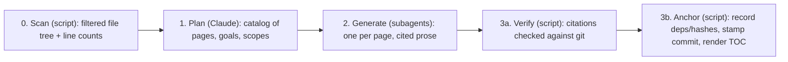

# Project Overview

akashic-record is a repo wiki generator for Claude Code: it plans a page catalog, generates repo-committed markdown with line-range citations into source, and incrementally updates only the pages whose underlying files changed — while never overwriting human edits. It ships as a Claude Code skill plus one stdlib-only Python helper, is MIT licensed, and dogfoods itself: the page you are reading lives in this repo's own `.akashic/wiki/`. This page is the first-hour orientation — what the project is, the three artifacts, the division of labor between the LLM and the deterministic script, the citation contract that holds it together, and where to read next.

## What it is and why it exists

Every codebase accumulates knowledge that lives nowhere but in the heads of whoever wrote it, and that knowledge goes stale the moment nobody updates a doc, or nobody wrote one. Hosted products like Qoder's Repo Wiki and DeepWiki solve this by generating a wiki from the code, but your code goes through someone else's pipeline and the output lives in their format. akashic-record does the same job — architecture pages with real source citations, kept fresh as the code changes — as a Claude Code skill: no service to trust with your code, no proprietary format, just markdown committed straight into the repo alongside the code it describes. The design states its own thesis in one sentence: Qoder Repo Wiki class output, built as a Claude Code skill plus one deterministic Python helper, keeping only the four patterns every surveyed system converged on and deleting everything else. That claim rests on documented research — Qoder's on-disk format reverse-engineered from committed wiki files across 180+ public repos, plus a comparative study of DeepWiki, DeepWiki-Open, OpenDeepWiki, CodeWiki, Mutable.ai Auto Wiki, and Google Code Wiki.

Sources: [README.md:1-6](../../README.md#L1-L6), [README.md:8-20](../../README.md#L8-L20), [DESIGN.md:1-15](../../DESIGN.md#L1-L15)

## Form factor and audiences

A skill, not a standalone CLI, not an MCP server, not a plugin. The design argues this from the research rather than from taste: the 14–17-point quality gap between the closed pipelines and their open-source clones came from pipeline structure — catalog-first planning, per-page scoped prompts, agentic exploration — not from model access, and a skill encodes exactly that structure as instructions while Claude Code supplies the model, tools, parallel subagents, and resumable orchestration. A standalone CLI would mean API keys, retries, rate limits, provider abstraction, and a queue before the first page renders. Headless CI still works, via `claude -p "/akashic-record update"`. The output serves two audiences from one artifact: humans get onboarding and architecture docs with Mermaid diagrams, browsable on GitHub; agents get pre-digested context for "how does X work" and "what documents the file I'm about to edit" without re-exploring the codebase.

Sources: [DESIGN.md:19-39](../../DESIGN.md#L19-L39), [DESIGN.md:41-45](../../DESIGN.md#L41-L45)

## The three artifacts

akashic-record is a skill — not a CLI, service, or MCP server — made of three files:

- **`DESIGN.md`** — the **normative** design, on-disk format spec, and the research it was built against. Any behavior or format change must keep it in sync, and its §8 lists what is deliberately not built.
- **`SKILL.md`** — the LLM side: plan/generate/update/status orchestration and the hard rules (script authority, edit protection, cite-or-omit). Covered in depth in [Skill Orchestration](./skill-orchestration.md).
- **`bin/akashic_loop.py`** — the maintenance loop: poll a fleet of repos, refresh only what changed, open a PR, and never exit 0 on a failure. Covered in [Maintenance Loop](./maintenance-loop.md).
- **`akashic.py`** — the deterministic core: one file, stdlib only, Python 3.9+, with subcommands `scan`, `stale`, `verify`, `anchor`, `prompt`, `bless` — everything that must never be hallucinated (diffing, citation verification, hashing, anchoring). Covered in depth in [Deterministic Core](./deterministic-core.md).

Install is a symlink of this repo into `~/.claude/skills/akashic-record`; the repo *is* the skill, so don't assume the symlink already exists on the machine you're working on.

Sources: [CLAUDE.md:8-16](../../CLAUDE.md#L8-L16), [README.md:22-30](../../README.md#L22-L30)

## Division of labor: LLM vs. script

The design's one non-negotiable: **the LLM never computes a hash, diff, or line range; `akashic.py` never calls an LLM.**

| Who | Does | Never does |
|---|---|---|
| LLM (skill-orchestrated) | overview, catalog planning, page prose, update triage | compute a hash, diff, or line range |
| `akashic.py` (stdlib only: `json subprocess hashlib pathlib re fnmatch`) | `scan`, `stale`, `verify`, `anchor`, `prompt`, `bless` | call an LLM |

Anything that could lose human work or mark stale content as fresh is deterministic code; everything stochastic passes through the deterministic `verify` gate before it can be anchored. Read that as the boundary between the two sibling pages: [Deterministic Core](./deterministic-core.md) is the left column, [Skill Orchestration](./skill-orchestration.md) is the right.

Sources: [DESIGN.md:47-56](../../DESIGN.md#L47-L56), [CLAUDE.md:42-45](../../CLAUDE.md#L42-L45)

## How the pipeline runs

Catalog-first, the one pattern every surveyed system converged on. Phase 0 is `scan`: a filtered file tree with per-file line counts, sourced from `git ls-files` (so gitignore is respected for free) minus binaries, lockfiles and vendored directories, and `exclude` globs, capped at `max_files`. Phase 1 is planning in the main session — Claude reads scan output, the README, and `notes.md` if present, and writes the `pages` array of the catalog. Phase 2 dispatches one subagent per page in parallel, each reading only its assigned files. Phase 3 is the script again: `verify` checks that every citation resolves to a git-tracked path inside the repo with an in-bounds line range, that every page has an H1, and that every internal cross-link points at an id the catalog actually contains; then `anchor` records each page's dependencies and body hash, stamps the anchor commit, and re-renders the derived TOC.



Sources: [DESIGN.md:231-236](../../DESIGN.md#L231-L236), [DESIGN.md:238-244](../../DESIGN.md#L238-L244), [DESIGN.md:251-266](../../DESIGN.md#L251-L266), [DESIGN.md:315-343](../../DESIGN.md#L315-L343)

Two things about Phase 2 are worth knowing before you touch it. Each subagent's prompt is rendered by `akashic.py prompt <id>`, never hand-written — the mechanical template carries the goal, the scope-expanded file allowlist, the sibling id-to-title list, and the citation contract, because an agent hand-constructing that prompt from memory is how the untracked-citation bug first shipped. And the standing generation rule is cite-or-omit: prefer "not documented here" over invention, with a `Sources:` entry behind every non-obvious claim. Scope is the citable boundary, but nothing enforces it at generation time; `verify` warns rather than errors when a page cites a real file outside its scope, which is a planning signal — scope too wide duplicates content, scope too narrow forces the subagent outside it. There is a hard precondition on the whole pipeline: a git repo with at least one commit, failing loudly rather than degrading, because the anchor model depends on it.

Sources: [DESIGN.md:268-282](../../DESIGN.md#L268-L282), [DESIGN.md:296-313](../../DESIGN.md#L296-L313), [DESIGN.md:246-249](../../DESIGN.md#L246-L249)

## On-disk format and invariants

Into a *target* repo the tool writes `.akashic/catalog.json` — the single authoritative metadata file, holding settings plus per-page id, title, parent, goal, scope, files, status, hash, and frozen flag — alongside flat pages at `.akashic/wiki/<id>.md` and `wiki/README.md`, a nested TOC re-derived on every `anchor` and never hand-edited. Hierarchy lives only in catalog `parent` fields, so reparenting is a one-line catalog edit and no file ever moves; an optional `notes.md` steers planning as free text injected verbatim. Repo-committed markdown is a deliberate choice: Qoder launched with an internal index and was pushed by users into in-repo markdown, and OpenDeepWiki's database storage is its most-criticized property. Git is the sync layer.

Glob semantics matter more than they look. `scope` and `exclude` are fnmatch with two gitignore-flavored affordances — a slash-free pattern matches basenames at any depth, and a `**/` prefix also matches at the repo root — while `files` entries are always exact paths, never patterns. `exclude` plus the built-in noise filter define the citable universe **once**, filtering `scan`, per-page `scope` expansion, and `uncovered` alike, so a broad `scope` glob cannot re-admit a file the catalog excluded.

One deliberate subtraction from fnmatch: **literal `[` is escaped before matching, so character classes are not supported** in `scope` or `exclude` globs. Framework routing conventions put literal brackets in path segments — Next.js `[id]/route.ts` — far more often than a catalog wants a character class, and reading `[id]` as a class made the natural glob for such a path match nothing. Every symptom of that misreading was silent, in three places: files dropped from a page's citable set, files added under the scope never marking the page stale, and an `orphaned` false positive whose documented remediation deletes the page. `*` and `?` keep their glob meaning, and note that `*` still crosses `/` — making it single-segment would break existing catalogs and needs its own format change.

A handful of invariants shape most of the code, and contributors must not break them:

- Page ids are frozen forever and slug-validated at catalog load in every command — an id is a path component, so a non-slug id is a traversal vector, rejected at the trust boundary.
- The loop's cheapest cycle is also its only self-merging one: a remap PR is arithmetic a reviewer can re-derive, so it merges behind the branch's required checks, while any PR carrying regenerated prose waits for a human.
- Precision has a price, and `remap` pays it: narrowing staleness to the cited lines means a change *above* them leaves the page fresh while moving the code it points at. `stale` reports those as `drifted` and `remap` shifts the numbers deterministically, so the cheapest kind of update contains no generated prose at all.
- Staleness is range-level wherever a page cites line numbers: `anchor` records the cited spans, and `stale` intersects `git diff -U0` hunks against them, so a change outside those lines leaves the page fresh. Everything the intersection cannot speak about stays file-level.
- An unreachable anchor is recoverable rather than catastrophic: `anchor` records a `blobs` map (path to blob sha) per page, and because blob shas are content hashes, equality at HEAD proves a dependency is byte-identical without the anchor commit existing. A page is fresh only when every recorded blob matches *and* its scope adds nothing new.
- `hash` permanently means "what the tool last wrote"; `null` is the bless signal, set by the `bless` subcommand immediately after (re)generating a page — a subcommand rather than a hand-edit precisely because it was the last catalog mutation left to the LLM side, and a two-step one with no atomicity. A changed body under a non-null hash is a human edit — never re-hash it, because that would launder the `edited` marker, and never overwrite the page.
- Citations resolve against git's tracked-path set, not the filesystem, and resolved paths must realpath inside the repo root. An untracked or wrong-case path could never appear in an anchor-to-HEAD diff, so it would make the page permanently fresh.
- `.akashic/` paths are never staleness inputs or recorded dependencies — the wiki must not depend on itself.
- Immediately after `anchor`, `stale` is empty (tested); an unreachable anchor reports *all* pages stale rather than guessing.
- Subagent prompts are rendered by `prompt <id>`, never hand-written.

Sources: [DESIGN.md:58-73](../../DESIGN.md#L58-L73), [DESIGN.md:75-82](../../DESIGN.md#L75-L82), [DESIGN.md:84-108](../../DESIGN.md#L84-L108), [DESIGN.md:149-163](../../DESIGN.md#L149-L163), [CLAUDE.md:48-59](../../CLAUDE.md#L48-L59), [CONTRIBUTING.md:11-16](../../CONTRIBUTING.md#L11-L16)

## The citation contract

Every page follows one fixed, machine-parsed shape: an H1, a one-paragraph orientation, H2 sections of prose with plain Mermaid where a diagram earns its place, and a trailing anchor line. Each H2 section ends with a paragraph starting with the literal token `Sources:` followed by comma-separated markdown links; a `Sources:` paragraph directly under a Mermaid block cites that diagram. Link destinations are paths relative to the page — repo root is `../../` from `.akashic/wiki/` — with an optional `#Lstart-Lend` fragment, so they render as working, line-highlighting links on GitHub, unlike Qoder's non-standard `file://` scheme. Every `Sources:` line on this page is a live example of the grammar.

Three details of the grammar exist because real paths and real tooling forced them:

- When the link **text** is itself a file path containing a literal `[` or `]` — routing frameworks that name path segments this way, Next.js `[id]/route.ts` being the case that surfaced it — the destination may be wrapped in angle brackets per CommonMark instead of percent-encoded, and the parser strips the wrapper before resolving. Destinations containing **balanced parentheses**, such as Next.js route groups like `api/(cron)/route.ts`, are parsed natively, bare or angle-wrapped, to one nesting level; percent-encoding them is accepted but unnecessary. A destination parser that stopped at the first `)` would be worse than incomplete, because the truncated prefix still resolves and the real cited file gets reported as untracked instead of failing to parse.
- A citation's end line may exceed the file's real line count by exactly one. Any file ending in a trailing newline shows one extra empty numbered line through Claude Code's Read tool, and every subagent independently trusts the number it sees; `check_fragment` accepts `end <= real_lines + 1` and still rejects anything further out.
- `Sources:` stays in English regardless of the wiki's `language`, because localized structural markers break parsers — only prose localizes. And there is no `<cite>` header block: the per-section lines are the single citation authority, since a fact stored twice is a fact that diverges.

Line numbers are coordinates in the anchor commit. How the generating side of this contract is enforced is covered in [Skill Orchestration](./skill-orchestration.md); the parser and its checks are in [Deterministic Core](./deterministic-core.md).

Sources: [DESIGN.md:171-198](../../DESIGN.md#L171-L198), [DESIGN.md:199-212](../../DESIGN.md#L199-L212), [DESIGN.md:213-222](../../DESIGN.md#L213-L222), [DESIGN.md:223-229](../../DESIGN.md#L223-L229)

## Incremental update

The update mechanism is the convergent one across every shipped system: a stored commit anchor plus a diff plus a per-page file-dependency map, triggered by polling or by hand — never per-push webhooks. `akashic.py stale` is read-only and prints JSON. It first checks that the anchor is reachable; if a force-push or shallow clone made it unreachable it says so and reports all pages stale rather than guessing, because wasting a regeneration is acceptable and marking stale content fresh is not. Then it diffs anchor to HEAD with rename detection, counting a rename as both old and new path, and intersects the changed paths against each page's recorded `files`, plus `scope` globs for added files. The result sorts into four buckets: `stale` pages get regenerated under the same Phase-2 contract; `edited` pages, where the current body hash differs from the recorded one, are never auto-overwritten; `orphaned` pages, whose documented files are all gone, are auto-deleted unless they are also edited, in which case they are only flagged; and `uncovered` added files may become proposed new catalog entries. The run ends by regenerating, verifying, anchoring, and printing a structured report that becomes the commit message. Pages carry no in-page changelog sections — pages are timeless, and temporal data belongs to git.

Sources: [DESIGN.md:349-372](../../DESIGN.md#L349-L372), [DESIGN.md:439-444](../../DESIGN.md#L439-L444)

## Getting started

Install by symlinking this repo into `~/.claude/skills/akashic-record`. Inside Claude Code, in any git repo with at least one commit: `/akashic-record` plans and generates the wiki on first run, `/akashic-record update` regenerates only stale pages, and `/akashic-record status` reports what would change without writing anything. The wiki lands in `.akashic/wiki/` as plain markdown, meant to be committed so teammates get it via `git pull` and GitHub renders it, Mermaid included.

The helper also works standalone against any target repo (hard precondition: at least one commit):

```sh
python3 akashic.py -C <repo> scan          # filtered file list with line counts (planner input)
python3 akashic.py -C <repo> stale         # JSON: stale/edited/orphaned/uncovered/missing/planned
python3 akashic.py -C <repo> stale --check # same, exit 1 if any bucket is non-empty (runner gate)
python3 akashic.py -C <repo> verify        # citation + catalog gate; exit 1 on any error
python3 akashic.py -C <repo> anchor        # verify, then record deps/hashes, stamp anchor, render TOC
python3 akashic.py -C <repo> prompt <id>   # render one page's exact subagent prompt
python3 akashic.py -C <repo> bless <id>    # hash -> null after regenerating; --done also flips status
```

Exit codes: 0 ok, 1 verification failure, 2 usage or precondition error. There is no build step, no dependencies, and no lint config; the suite runs with `python3 test_akashic.py`, and single classes or tests can be named directly. Fixtures are throwaway git repos built in `tempfile`, one smallest-possible check per deterministic component; the LLM phases have no unit tests, because the runtime `verify` gate is their coverage.

Sources: [README.md:53-83](../../README.md#L53-L83), [CLAUDE.md:18-41](../../CLAUDE.md#L18-L41), [README.md:84-89](../../README.md#L84-L89), [CLAUDE.md:60-63](../../CLAUDE.md#L60-L63), [DESIGN.md:507-521](../../DESIGN.md#L507-L521)

## Contributing and dogfooding

The default branch is `develop`; branch from it and target PRs at it, with commit messages and PR titles following Conventional Commits v1.0.0. Three ground rules: `akashic.py` stays stdlib-only, on a plain Python 3.9+ interpreter, with no third-party imports ever; DESIGN.md is normative, so any behavior or format change updates it in the same PR; and anything DESIGN.md §8 lists as deliberately not built — embeddings and RAG, database storage, a serialized knowledge graph, an MCP server, watchers and webhooks, a web UI, Mermaid syntax validation, and more — needs a design discussion in an issue before a PR. The standing exceptions to that laziness are named too: citation verification with repo-root containment, anchor-reachability handling, hash-based edit protection, and the at-least-one-commit precondition. Anything bigger than a small fix starts as an issue; the roadmap is maintainer-driven, tracked as milestones M1 through M3 and as GitHub issues that carry sequencing constraints and a per-task definition of done. New deterministic behavior needs at least one smallest-possible `unittest` check.

This repo carries its own generated wiki in `.akashic/` and follows the skill's own rules: never hand-edit `catalog.json`'s `anchor`, `hash`, `files`, or `generated` fields, running `bless <id>` after regenerating a page instead, never edit the derived `wiki/README.md`, and after source changes refresh through the update flow — `stale`, regenerate, `verify`, `anchor` — committed as `chore: refresh self-dogfooded wiki`.

Sources: [CONTRIBUTING.md:5-9](../../CONTRIBUTING.md#L5-L9), [CONTRIBUTING.md:18-31](../../CONTRIBUTING.md#L18-L31), [CONTRIBUTING.md:33-35](../../CONTRIBUTING.md#L33-L35), [DESIGN.md:485-505](../../DESIGN.md#L485-L505), [README.md:106-117](../../README.md#L106-L117), [CLAUDE.md:5-6](../../CLAUDE.md#L5-L6), [CLAUDE.md:64-67](../../CLAUDE.md#L64-L67)

## Security and license

Report vulnerabilities privately through GitHub private vulnerability reporting, not a public issue; expect acknowledgment within 7 days, with best-effort timelines on a solo-maintained project. In scope: path traversal out of the target repository root, writes escaping `.akashic/`, anything that causes stale or human-edited content to be reported as fresh, and bypasses of the `verify` gate. Out of scope: the quality or accuracy of LLM-generated prose (a regular bug), vulnerabilities in the repositories the tool is run against, and Claude Code itself. Only the latest commit on `develop` is supported — there are no tagged releases, and install is a symlink of the working tree. The project is MIT licensed, copyright (c) 2026 ARMeeru: permissive use, modification, and redistribution, provided the license text and copyright notice travel with copies.

Sources: [SECURITY.md:1-7](../../SECURITY.md#L1-L7), [SECURITY.md:9-24](../../SECURITY.md#L9-L24), [SECURITY.md:26-28](../../SECURITY.md#L26-L28), [LICENSE:1-13](../../LICENSE#L1-L13)

## Where to start reading

A reading order for the first hour:

1. This page, for orientation.
2. [Deterministic Core](./deterministic-core.md) — `akashic.py`'s subcommands (`scan`, `stale`, `verify`, `anchor`, `prompt`) and the tests that pin them down.
3. [Skill Orchestration](./skill-orchestration.md) — how `SKILL.md` drives the LLM phases: planning, the per-page subagent contract, edit-protection rules, the update flow.
4. `DESIGN.md` in the repo root, when you need the normative answer to a format or behavior question — especially §2 (division of labor), §3.3 (the citation grammar), and §8 (what is deliberately not built). Its build order also doubles as a dependency order for reading the source: `akashic.py`, then `test_akashic.py`, then `SKILL.md`, then `README.md`.
5. `CONTRIBUTING.md` before your first PR, for the invariants and the branch and commit conventions.

Sources: [README.md:22-30](../../README.md#L22-L30), [CLAUDE.md:12-14](../../CLAUDE.md#L12-L14), [DESIGN.md:523-532](../../DESIGN.md#L523-L532), [CONTRIBUTING.md:1-3](../../CONTRIBUTING.md#L1-L3)

*Generated from commit `adadcf1` on 2026-08-07.*
