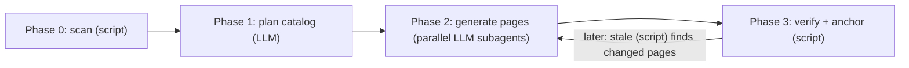

# Project Overview

akashic-record is a repo wiki generator for Claude Code. It plans a page catalog, generates repo-committed markdown with line-range citations into source, and incrementally updates only the pages whose underlying files changed — while never overwriting human edits. The design distills a survey of shipped wiki generators (Qoder Repo Wiki, DeepWiki, OpenDeepWiki, CodeWiki, and others) down to the four patterns every system converged on, and deletes everything else. This page orients you across the repo's three artifacts and tells you where to start reading.

## What it is and why it exists

The form factor is deliberate: a Claude Code skill (`SKILL.md`) plus one stdlib-only Python helper (`akashic.py`) — not a standalone CLI, not an MCP server. The research finding driving this is that the quality gap between closed pipelines and their open-source clones came from pipeline structure (catalog-first planning, per-page scoped prompts, agentic exploration), not model access; a skill encodes that structure as instructions while Claude Code supplies the model, tools, parallel subagents, and orchestration for free. The output serves two audiences with one artifact: humans get browsable onboarding docs with Mermaid diagrams, and agents get pre-digested context that answers "how does X work" without re-exploring the codebase.

Sources: [DESIGN.md:1-15](../../DESIGN.md#L1-L15), [DESIGN.md:19-45](../../DESIGN.md#L19-L45), [README.md:1-6](../../README.md#L1-L6)

## The three artifacts

- **`DESIGN.md`** — the normative design and on-disk format spec. Everything else implements it.
- **`SKILL.md`** — the Claude Code skill that orchestrates planning and generation; covered in depth in [Skill Orchestration](./skill-orchestration.md).
- **`akashic.py`** — the deterministic core (stdlib-only, Python 3.9+): "everything that must never be hallucinated"; covered in depth in [Deterministic Core](./deterministic-core.md).

A fourth file, `test_akashic.py`, gives each deterministic component the smallest check that fails if its logic breaks (run with `python3 test_akashic.py`). The LLM phases have no unit tests — they are covered by the runtime `verify` gate instead.

Sources: [README.md:8-12](../../README.md#L8-L12), [README.md:42-46](../../README.md#L42-L46), [DESIGN.md:364-378](../../DESIGN.md#L364-L378)

## Division of labor: LLM vs. script

This split is the design's one non-negotiable invariant:

| Who | Does | Never does |
|---|---|---|
| LLM (skill-orchestrated) | overview, catalog planning, page prose, update triage | compute a hash, diff, or line range |
| `akashic.py` (stdlib only) | `scan`, `stale`, `verify`, `anchor` | call an LLM |

Everything that can lose human work or mark stale content as fresh is deterministic code. Everything stochastic passes through a deterministic verification gate before it is anchored.

Sources: [DESIGN.md:47-56](../../DESIGN.md#L47-L56)

## Pipeline at a glance

The pipeline is catalog-first — the TOC is planned before any page is written — and alternates between script and LLM phases:

Sources: [DESIGN.md:185-268](../../DESIGN.md#L185-L268), [DESIGN.md:270-295](../../DESIGN.md#L270-L295)

Incremental update follows the mechanism every shipped system converged on: a stored commit anchor, `git diff` from anchor to HEAD, and a per-page file-dependency map. `stale` sorts pages into `stale`, `edited`, `orphaned`, and `uncovered` buckets; human-edited pages are never auto-overwritten, and after `anchor` runs, `stale` must return empty (a tested invariant). The output lands in the target repo as plain committed markdown under `.akashic/wiki/` — git is the sync layer, and GitHub renders it, Mermaid included.

Sources: [DESIGN.md:270-295](../../DESIGN.md#L270-L295), [DESIGN.md:58-73](../../DESIGN.md#L58-L73), [README.md:30-31](../../README.md#L30-L31)

## Install and use

Symlink the repo into `~/.claude/skills/akashic-record`, then in any git repo with at least one commit run `/akashic-record` (first run: plan + generate), `/akashic-record update` (regenerate only stale pages), or `/akashic-record status` (dry-run report). The helper also works standalone: `python3 akashic.py -C <repo> scan|stale|verify|anchor`.

Sources: [README.md:14-40](../../README.md#L14-L40)

## Where to start reading

1. **`DESIGN.md` §1–2** — positioning and the division-of-labor invariant; the shortest path to understanding why the system is shaped this way.
2. **`DESIGN.md` §3–5** — the on-disk format (`catalog.json`, page/citation grammar), the four-phase pipeline, and incremental update semantics.
3. **[Deterministic Core](./deterministic-core.md)** — `akashic.py`'s four subcommands (`scan`, `stale`, `verify`, `anchor`) and their tests.
4. **[Skill Orchestration](./skill-orchestration.md)** — how `SKILL.md` drives the LLM phases: planning prompts, per-page subagent contract, edit-protection rules.

The build order in `DESIGN.md` §10 mirrors this reading order: helper first, tests second, skill third, README last.

Sources: [DESIGN.md:380-389](../../DESIGN.md#L380-L389), [README.md:8-12](../../README.md#L8-L12)

*Generated from commit `6855f70` on 2026-07-16.*
