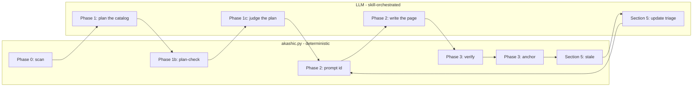

# Project Overview

akashic-record generates and incrementally maintains a wiki that lives inside the repository it describes. `README.md`'s opening pitch and its "How it works" walkthrough describe the shape: plain markdown committed into the repo, and — in the sentence that closes that walkthrough — a generated page that reads like a normal architecture doc, with prose, an occasional Mermaid diagram, and a `Sources:` line under every section pointing at the exact lines that back the claim above it. `DESIGN.md` §3.3 turns that sentence into a fixed, machine-parsed grammar, which is why the same `Sources:` line appears at the foot of every section below. `DESIGN.md` §1 states the form factor as a decision: a Claude Code skill plus one stdlib-only Python helper, so the harness supplies the model, the file-reading tools and the parallel subagents while this repo supplies the pipeline structure. The shortest orientation for a first hour is §2's one non-negotiable rule — an LLM writes the prose, a Python script decides what is true about files, hashes and line numbers, and neither may do the other's job.

## What it is

`README.md`'s "Why" section states the problem: architecture knowledge lives in the heads of whoever wrote the code, and goes stale the moment a doc is forgotten. It names Qoder's Repo Wiki and DeepWiki as products that solve this by generating a wiki from the code itself, and gives the objection to both — they are hosted services or IDE features, so your code goes through someone else's pipeline and the output lives in their format. akashic-record does the same job as a Claude Code skill, with the markdown committed straight into your repo beside the code it describes.

`DESIGN.md` §1 makes the form factor an argument rather than a preference. It cites the CodeWikiBench gap between the closed pipelines and the open-source clones and attributes that gap to pipeline structure — catalog-first planning, per-page scoped prompts, agentic exploration — rather than to model access, and a skill encodes exactly that structure as instructions. The same section lists what would have to be built otherwise: OpenDeepWiki's orchestration apparatus exists only because it must make its own LLM calls, and inside Claude Code that apparatus is the harness. `CLAUDE.md`'s "What this repo is" opens with the same framing, in its own words: a skill, not a CLI, service, or MCP server.

§1 also names the two audiences one artifact serves — humans reading onboarding and architecture docs on GitHub, and agents reading pre-digested context instead of re-exploring the codebase. `README.md`'s "Install" section gives the mechanism: a symlink of this working tree into `~/.claude/skills/akashic-record`, which it warns pins nothing, because whatever the clone has checked out is what runs. `CLAUDE.md` adds, in the same list where it names the three artifacts, that the repo *is* the skill and that you should not assume the symlink exists on the machine you are on.

Sources: [README.md:1-20](../../README.md#L1-L20), [README.md:32-52](../../README.md#L32-L52), [README.md:93-101](../../README.md#L93-L101), [DESIGN.md:19-45](../../DESIGN.md#L19-L45), [DESIGN.md:208-235](../../DESIGN.md#L208-L235), [CLAUDE.md:8-16](../../CLAUDE.md#L8-L16)

## The four artifacts

`README.md`'s bulleted entry-point list, immediately under the "Why" section, names four files and says what each is for. They are the four things worth knowing by name on day one:

| Artifact | Role, per `README.md`'s entry-point list |
|---|---|
| `DESIGN.md` | the normative design, the on-disk format spec, and the research the tool was built against |
| `SKILL.md` | the Claude Code skill that orchestrates planning and generation |
| `akashic.py` | the deterministic core, stdlib-only on Python 3.9+: diffing, citation verification, hashing, anchoring |
| `bin/akashic_loop.py` | the maintenance loop: poll a fleet, refresh only what changed, open a PR |

"Normative" is enforced rather than asserted. `CONTRIBUTING.md`'s "Ground rules" make it a merge condition — any change to behavior or the on-disk format must update `DESIGN.md` in the same PR — and points at §8, the table of things deliberately not built, which needs a design discussion in an issue before a PR reintroduces one. That table gives a reason per row (embeddings scored bottom-tier on the benchmark; database storage was OpenDeepWiki's biggest liability; an MCP server would be an adapter to ourselves), and closes with the standing exceptions the project refuses to be lazy about: citation verification with repo-root containment, anchor-reachability handling, hash-based edit protection, and the one-commit-minimum precondition.

The count of artifacts differs by document, so it is worth naming where the four-way split comes from. `CLAUDE.md`'s "What this repo is" list has three bullets — `SKILL.md`, `akashic.py`, `DESIGN.md` — and the loop is not among them; the fourth comes from `README.md`'s list. `DESIGN.md` §10, the build order, lists a different set again: `akashic.py`, `test_akashic.py`, `SKILL.md`, `README.md`, in the order they were built.

Each of the three code-bearing artifacts has its own page here: [Skill Orchestration](./skill-orchestration.md) for the LLM side, [Deterministic Core](./deterministic-core.md) for `akashic.py`, and [Maintenance Loop](./maintenance-loop.md) for `bin/akashic_loop.py`.

Sources: [README.md:22-30](../../README.md#L22-L30), [CONTRIBUTING.md:5-9](../../CONTRIBUTING.md#L5-L9), [DESIGN.md:994-1014](../../DESIGN.md#L994-L1014), [DESIGN.md:1042-1051](../../DESIGN.md#L1042-L1051), [CLAUDE.md:8-16](../../CLAUDE.md#L8-L16)

## Division of labor

`DESIGN.md` §2 is titled "Division of labor (core invariant)" and consists of a two-row table plus the rule behind it. The table's first row gives the LLM the overview, catalog planning, page prose and update triage, and forbids it to compute a hash, diff, or line range. The second gives `akashic.py` — stdlib only, importing `json`, `subprocess`, `hashlib`, `pathlib`, `re` and `fnmatch` — the subcommands `scan`, `stale`, `verify`, `anchor`, `prompt`, `remap`, `plan-check`, `plan-critic`, `audit` and `bless`, and forbids it to call an LLM. The prose under the table states the principle: anything that can lose human work or mark stale content as fresh is deterministic code, everything stochastic passes a deterministic gate before it is anchored, and this split is the design's one non-negotiable. `CLAUDE.md`'s "Architecture" section compresses the same rule into a sentence and cites §2 by number.

The table says what each side must not do. Two later passages say what the split is *for*. §4 Phase 1c, introducing the plan critic, states the division explicitly for that command: the script does mechanical templating from catalog and filesystem and never judges, while an LLM judges — which is why `plan-critic` renders a review prompt rather than a review. §4 Phase 2 applies the same reasoning to page generation: subagent prompts are rendered by `prompt <id>` and never hand-written, because an orchestrating agent rebuilding that prompt from memory is how the untracked-citation bug first shipped, and moving the templating into the deterministic core removes the failure mode instead of documenting it.

The diagram below is `DESIGN.md` §4's numbered phases drawn as edges. Phase 0 is `scan`, whose filtered file list feeds Phase 1, where Claude writes the `pages` array of `catalog.json`. That plan passes two pre-fan-out gates — Phase 1b `plan-check`, the script's shape-only look, and Phase 1c `plan-critic`, the rendered prompt an LLM judges — before Phase 2 renders one `prompt <id>` per page and dispatches a subagent to write it. Phase 3 is `verify` then `anchor`. §5's incremental update closes the loop: `stale` reports what moved, and only those pages re-enter Phase 2.



Sources: [DESIGN.md:47-56](../../DESIGN.md#L47-L56), [DESIGN.md:280-298](../../DESIGN.md#L280-L298), [DESIGN.md:300-315](../../DESIGN.md#L300-L315), [DESIGN.md:317-326](../../DESIGN.md#L317-L326), [DESIGN.md:391-414](../../DESIGN.md#L391-L414), [DESIGN.md:442-466](../../DESIGN.md#L442-L466), [DESIGN.md:503-512](../../DESIGN.md#L503-L512), [DESIGN.md:613-619](../../DESIGN.md#L613-L619), [DESIGN.md:625-629](../../DESIGN.md#L625-L629), [README.md:32-48](../../README.md#L32-L48), [CLAUDE.md:46-50](../../CLAUDE.md#L46-L50)

`CLAUDE.md`'s "Architecture" section follows its one-sentence version of §2 with a bulleted list headed "Invariants that shape most of the code", and those bullets are what a newcomer trips over first: page ids are frozen forever and slug-validated at catalog load, because an id is a path component and therefore a traversal vector; `hash` permanently means "what the tool last wrote", with `null` as the bless signal, so a changed body under a non-null hash is a human edit that must never be re-hashed or overwritten; citations resolve against git's tracked-path set rather than the filesystem, since an untracked path could never appear in an anchor-to-HEAD diff and would leave its page permanently fresh; and `.akashic/` paths are never staleness inputs or recorded dependencies, so the wiki cannot depend on itself. `CONTRIBUTING.md` carries a shorter version of the same list under the heading "Invariants you must not break", where it adds `goal_hash` — recorded only for pages the tool actually wrote in that run, since stamping it on a page nobody regenerated asserts a correspondence nothing checked.

The mechanics behind each of these — the buckets `stale` reports, how `ranges` and `blobs` are recorded, what `anchor` mutates — belong to [Deterministic Core](./deterministic-core.md) and are not repeated here.

Sources: [CLAUDE.md:52-71](../../CLAUDE.md#L52-L71), [CONTRIBUTING.md:11-17](../../CONTRIBUTING.md#L11-L17)

## What verification proves, and what it does not

Step 3 of `README.md`'s "How it works" describes `verify` as the one part of the pipeline that is not an LLM: it mechanically checks that every citation resolves to a real, git-tracked file with a valid line range before anything is anchored. The same step says what that does not buy, and the section titled "What it does not do" quantifies it — across four update runs against a 28-page production repo, an adversarial claim audit was pointed at seven pages and found all seven materially wrong, with a section describing a mechanism from one migration, "nothing here is hard-deleted" above a literal `DELETE`, and "nine components" above a table listing ten. `CHANGELOG.md` repeats the limit as a titled entry under v0.1.0, "Known limit, stated because pinning it should be deliberate", so that choosing a version is not an assumption about what the gate covers. `README.md`'s advice from there is to read a generated page as a map with footnotes rather than as territory, since the citations say exactly where to check.

That same section lists three things that exist because of the gap, and states that none of them gates `anchor`, on the grounds that a heuristic over prose which blocked publishing would eventually block a correct page: `plan-check` and `plan-critic` before generation, the on-demand blind refuter `audit prompt <id>`, and standing generation rules carried in every page prompt. `DESIGN.md` §5b draws the same boundary from the other side, listing what each mechanism does prove — `verify` that a citation resolves, the anchored-content warning that it still points where it was anchored, the identifier warning that a named symbol exists somewhere the section cites — and says none of them can speak to whether the sentence above the citation is true. §5b also records the owner decision of 2026-07-29 that the audit is on-demand only, never part of the standing update flow.

The gap decides how a bad page is meant to be fixed, which is the part most likely to be got wrong on day one. `README.md` closes "What it does not do" by naming one intervention that reliably works — correct the page's `goal` and regenerate — and says plainly to resist editing the prose, because the next regeneration writes from the goal, so a fix living only in the page lasts until the file it documents changes. What belongs in the goal is what the page got wrong: the groups it must distinguish, the claim it may not generalize.

`SECURITY.md`'s "Scope" section makes a related point about a different kind of trust, in a paragraph that opens "Worth stating plainly, because it reads like a control and is not one": the read-only mandate rendered into every subagent prompt and the blind labelling in the claim audit are instructions to a model, not a sandbox. A subagent has whatever tools its harness grants it, and these are conventions the tool makes hard to forget rather than enforcement.

Sources: [README.md:32-48](../../README.md#L32-L48), [README.md:54-91](../../README.md#L54-L91), [CHANGELOG.md:36-40](../../CHANGELOG.md#L36-L40), [DESIGN.md:875-885](../../DESIGN.md#L875-L885), [SECURITY.md:17-28](../../SECURITY.md#L17-L28)

## Two version numbers, and which one you are pinning

`CHANGELOG.md` opens with a bolded warning before its first release entry: the tag and the catalog `version` are independent on purpose, and reading `v0.1.0` and `"version": 1` as tracking each other is a mistake. The tag numbers the tool. `version` numbers the on-disk format the tool reads and writes, it is currently `1`, and a tool release can change behavior without touching the format — which that paragraph calls the common case. `DESIGN.md` §3.2's `version` bullet supplies the format half of the contract: the supported value is exactly the integer `1`, enforced in every catalog-reading subcommand with exit 2 before any other field is inspected, and enforced as an integer specifically because Python makes `True == 1` and `1.0 == 1` true. The same bullet states that additive optional fields never bump the version, naming `goal_hash`, `blobs` and `ranges` as fields added to catalogs already in the field, each following the rule that absent means say nothing rather than guess.

`CHANGELOG.md`'s own preamble says what it records — behavior and format changes only, with internal refactors, test additions and prose edits left to `git log`, because a changelog that lists everything is one nobody reads before upgrading. Its v0.1.0 entry summarizes the state at first tag under four bolded labels: **Format** (`version` 1 with those three optional fields), **Nine `stale` buckets** (`stale`, `edited`, `orphaned`, `uncovered`, `missing`, `planned`, `drifted`, `restated`, `unblessed`, each mapped to one of three actions in `BUCKET_ACTIONS`, with `WORK_BUCKETS` derived from that table so a bucket no action covers cannot exist), **Ten subcommands** with exit codes 0 for ok, 1 for a verification failure and 2 for a usage or precondition error, and **The maintenance loop**, which polls a fleet through `stale --check` and opens pull requests rather than committing. What each bucket and subcommand does is [Deterministic Core](./deterministic-core.md)'s subject; the loop's own behavior is [Maintenance Loop](./maintenance-loop.md)'s.

`README.md`'s "Install" section draws the practical consequence. A bare symlink pins nothing, so switching the clone to another branch changes every session on the machine with no install step and no warning; pinning means checking out a tag before symlinking, upgrading is `git fetch --tags && git checkout <newer tag>` in that clone, and the section says to read `CHANGELOG.md` first. Working on the tool itself, or dogfooding it against this repo, means staying on `develop` and accepting that the skill changes underneath you — which that section calls the right trade for a maintainer and the wrong one for a team. `SECURITY.md`'s "Supported versions" section reaches the same place from the security side: the latest commit on `develop` only, no backporting, so a pinned tag is upgraded rather than patched where it sits, and whichever ref the symlinked clone has checked out is what actually runs.

Sources: [CHANGELOG.md:1-11](../../CHANGELOG.md#L1-L11), [CHANGELOG.md:13-34](../../CHANGELOG.md#L13-L34), [DESIGN.md:110-125](../../DESIGN.md#L110-L125), [README.md:93-117](../../README.md#L93-L117), [SECURITY.md:36-38](../../SECURITY.md#L36-L38)

## Working in this repo

`CLAUDE.md`'s "Commands" section opens by stating there is no build step, no dependencies and no lint config, and both it and `CONTRIBUTING.md`'s first ground rule require `akashic.py` to run on a plain Python 3.9+ interpreter with no third-party imports, ever. Both documents give the same three test invocations:

```sh
python3 test_akashic.py                                  # full suite
python3 test_akashic.py TestStale                        # one class
python3 test_akashic.py TestStale.test_rename_marks_stale_not_orphaned   # one test
```

`CONTRIBUTING.md`'s "Tests" section asks that new deterministic behavior come with at least one smallest-possible `unittest` check in `DESIGN.md` §9 style, where fixtures are throwaway git repos built from `RepoCase`, and says the LLM phases are covered by the runtime `verify` gate rather than unit tests — `CLAUDE.md`'s "Tests" section says the same. §9 itself is a component/check table, one row each for `scan`, `stale`, `verify`, `anchor` and a manual pipeline acceptance run, and it flags one class as deliberately not of that shape: `TestDocBucketEnumerations`, which reads this repository's own prose and checks every hand-maintained list of the stale buckets against `WORK_BUCKETS`, because four such lists rotted at once and only the generated wiki page stayed current.

`CONTRIBUTING.md`'s "Workflow" section sets the branching rule — `develop` is the default branch, branch from it, PRs target it, and commit messages and PR titles follow Conventional Commits v1.0.0 — while its third ground rule asks for an issue before anything bigger than a small fix, since the roadmap is maintainer-driven.

This repo carries its own generated wiki, and both `CONTRIBUTING.md`'s "Dogfooding" section and `CLAUDE.md`'s refresh it through the normal update flow (`stale` → regenerate → `bless <id>` → `verify` → `anchor`), committing as `chore: refresh self-dogfooded wiki`. The two lists of tool-owned `catalog.json` fields you must not hand-edit differ: `CONTRIBUTING.md` names `anchor`, `hash`, `files`, `ranges`, `blobs` and `goal_hash`; `CLAUDE.md` names `anchor`, `hash`, `files` and `generated`, and additionally forbids editing the derived `wiki/README.md`. Both agree on the reason — `bless` is what tells the tool it wrote a page.

Before filing anything security-shaped, read `SECURITY.md`'s "Scope" section. It lists four in-scope classes: path traversal out of the target repository root, writes escaping `.akashic/`, anything that causes stale or human-edited content to be reported as fresh, and bypasses of the `verify` gate. It puts the quality of LLM-generated prose out of scope as a regular bug. It also describes the two scripts' network posture in its own words: `akashic.py` has no dependencies and makes no network calls, shelling out only to the local git operations it lists (`rev-parse`, `diff`, `ls-files`, `ls-tree`, `cat-file`, `show`, `status`), while `bin/akashic_loop.py` does reach the network by design, running `claude -p`, `git push` and `gh pr create`. The project is MIT licensed.

Sources: [CONTRIBUTING.md:5-9](../../CONTRIBUTING.md#L5-L9), [CONTRIBUTING.md:19-22](../../CONTRIBUTING.md#L19-L22), [CONTRIBUTING.md:24-36](../../CONTRIBUTING.md#L24-L36), [CLAUDE.md:18-27](../../CLAUDE.md#L18-L27), [CLAUDE.md:73-79](../../CLAUDE.md#L73-L79), [DESIGN.md:1016-1040](../../DESIGN.md#L1016-L1040), [SECURITY.md:9-34](../../SECURITY.md#L9-L34), [LICENSE:1-3](../../LICENSE#L1-L3)

## Where to start reading

A first-hour path through the documents, in the order that makes each one legible:

1. **`README.md`**, all of it. It is short, and it carries the pitch, the four-artifact list, the "How it works" four steps, the three-verb usage in its "Use" section (`/akashic-record`, `/akashic-record update`, `/akashic-record status`), the standalone helper commands with a one-line gloss each, and the "What it does not do" section that sets expectations correctly before anything else.
2. **`DESIGN.md` §1 through §3.** Positioning and form factor, §2's division-of-labor table, and §3's on-disk format block — `.akashic/catalog.json` as the single authoritative metadata file, flat `wiki/<id>.md` pages with hierarchy living only in catalog `parent` fields, and a derived `wiki/README.md` table of contents. §3 also gives the reason repo-committed markdown was chosen: Qoder launched with an internal-index-only wiki and was forced by users into in-repo markdown, and git is the sync layer.
3. **`CLAUDE.md`.** Its "Commands" block with the exit codes, and its "Invariants that shape most of the code" list, which is the fastest way to learn which parts of the system are load-bearing.
4. **`CONTRIBUTING.md`** before a first PR, and `CHANGELOG.md` before pinning or upgrading a checkout.

`README.md`'s "Use" section is specific about the run that teaches the most, and it is not a reading task: pick a repo you already know well and can read the entire output of, something in the low thousands of lines producing maybe eight to fifteen pages. The reason it gives is not that the tool struggles with more — it names the 28-page field repo it was hardened against — but that checking the output against what you already know is the only way to learn what it produces. That section offers this repo's own committed wiki as the worked example: the generated table of contents at `.akashic/wiki/README.md`, with four pages under it covering 12 files and about 7,700 lines of source and design docs.

The same section lays out the by-hand order for driving the pipeline without the skill, as six numbered steps: `scan` and a hand-written catalog, then `plan-check` and `plan-critic --out` to judge the plan before paying for a fan-out, then `prompt <id> --out` dispatched per page, `bless <id> --done` as each lands, `verify` and `anchor`, and a final `stale --check` that should exit 0. It warns against shortening the sequence, since every step either produces something a later one needs or is a gate, and notes that on an existing wiki the same sequence starts at the dispatch step and is driven by `stale` instead of a new catalog. How the skill itself sequences this is [Skill Orchestration](./skill-orchestration.md)'s subject; the scheduled version in `README.md`'s "Keeping it fresh" section — which polls a fleet, opens PRs, and explains what it means when a cycle suddenly wants to regenerate everything — belongs to [Maintenance Loop](./maintenance-loop.md).

Two pointers for keeping your bearings afterwards. `CLAUDE.md`'s second header line directs an agent to `gh issue view <n>` before feature work, because GitHub issues carry sequencing constraints and a per-task definition of done, and to `gh issue list --milestone Backlog` for what is deliberately deferred and its re-entry triggers. `README.md`'s "Roadmap" section records that milestones M0 through M3 have all shipped, summarizes each in one line, and says most of what came after them came out of running the tool against a real 28-page repo and fixing what broke, leaving the Backlog milestone as what remains.

Sources: [README.md:1-30](../../README.md#L1-L30), [README.md:119-140](../../README.md#L119-L140), [README.md:142-178](../../README.md#L142-L178), [README.md:186-213](../../README.md#L186-L213), [README.md:215-228](../../README.md#L215-L228), [DESIGN.md:1-16](../../DESIGN.md#L1-L16), [DESIGN.md:58-73](../../DESIGN.md#L58-L73), [CLAUDE.md:5-6](../../CLAUDE.md#L5-L6), [CLAUDE.md:28-44](../../CLAUDE.md#L28-L44), [CONTRIBUTING.md:1-9](../../CONTRIBUTING.md#L1-L9), [CHANGELOG.md:1-11](../../CHANGELOG.md#L1-L11)

*Generated from commit `62b2f0ac` on 2026-08-11.*
