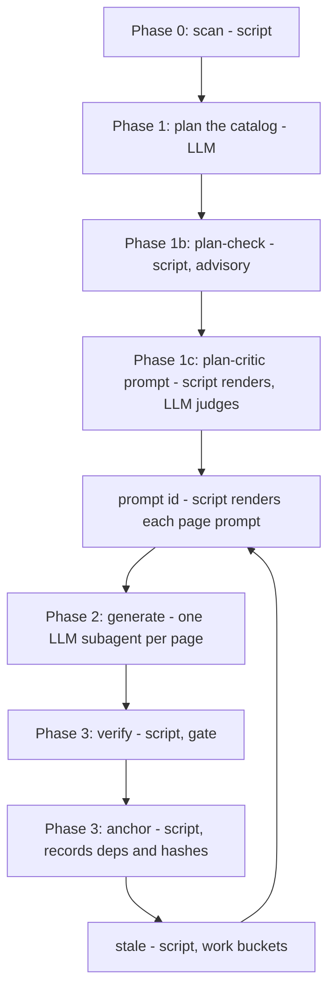

# Project Overview

akashic-record generates a repo wiki for Claude Code: it plans a page catalog, writes markdown into the repository itself with line-range citations back into the source, and later regenerates only the pages whose underlying files changed — without overwriting anything a human edited. It ships as a Claude Code skill rather than a service, so the code never leaves the machine and the output is ordinary markdown committed beside the code it describes. This page orients you to the shape of the project: what it is, the files it is made of, the one division of labor everything else follows, and the order in which to read the rest.

## What akashic-record is

The form factor is deliberate and argued at length in DESIGN.md: a Claude Code skill (`SKILL.md`) plus one stdlib-only Python helper (`akashic.py`) — the design states it is not a standalone CLI, not an MCP server, and not a plugin. The reasoning is that the quality gap the research found between closed and open wiki generators came from pipeline structure (catalog-first planning, per-page scoped prompts, agentic exploration) rather than from model access, and a skill encodes that structure directly while Claude Code supplies the model, the tools, the parallel subagents and the orchestration. Installation is a symlink of the repository into `~/.claude/skills/akashic-record`, so the repository *is* the skill.

Output serves two audiences from one artifact: humans reading onboarding and architecture docs on GitHub, and agents reading pre-digested context about the code they are about to touch. Committing the markdown into the target repo is itself a research-driven decision — the surveyed hosted products either kept the wiki in an internal index or in a database column, which is neither diffable nor reviewable in a PR, and git is used here as the sync layer instead.

Sources: [README.md:1-20](../../README.md#L1-L20), [DESIGN.md:19-46](../../DESIGN.md#L19-L46), [DESIGN.md:58-73](../../DESIGN.md#L58-L73), [CLAUDE.md:8-16](../../CLAUDE.md#L8-L16)

## The four artifacts

README.md points a new reader at four files, and each one has a page or a section of its own:

- **`DESIGN.md`** — the normative design, the on-disk format spec, and the research the project was built against. It is the authority: CONTRIBUTING.md requires any behavior or format change to update DESIGN.md in the same PR, and §8 lists what is deliberately not built (embeddings/RAG, database storage, an MCP server, watchers, Mermaid validation, and more), each with the evidence behind the refusal.
- **`SKILL.md`** — the LLM side: plan, generate, update and status orchestration, plus the hard rules (script authority, edit protection, cite-or-omit). See [Skill Orchestration](./skill-orchestration.md).
- **`akashic.py`** — the deterministic core: one file, stdlib only, Python 3.9+, exposing `scan`, `stale`, `verify`, `anchor`, `prompt`, `remap`, `plan-check`, `plan-critic`, `audit` and `bless`. See [Deterministic Core](./deterministic-core.md).
- **`bin/akashic_loop.py`** — the maintenance loop: poll a fleet of repos, refresh only what changed, open a PR. See [Maintenance Loop](./maintenance-loop.md).

The summary at the top of CLAUDE.md names three of these — SKILL.md, akashic.py and DESIGN.md — and leaves the loop out; README.md's list is the one that includes `bin/akashic_loop.py`.

Sources: [README.md:22-30](../../README.md#L22-L30), [README.md:88-92](../../README.md#L88-L92), [CLAUDE.md:10-16](../../CLAUDE.md#L10-L16), [CLAUDE.md:31-41](../../CLAUDE.md#L31-L41), [DESIGN.md:52-52](../../DESIGN.md#L52-L52), [DESIGN.md:965-985](../../DESIGN.md#L965-L985), [CONTRIBUTING.md:7-9](../../CONTRIBUTING.md#L7-L9)

## Division of labor between the LLM and the script

This is the design's one non-negotiable rule, and most of the code shape follows from it: **the LLM never computes a hash, a diff, or a line range; `akashic.py` never calls an LLM.** The LLM does the overview, catalog planning, page prose and update triage. The script does `scan`, `stale`, `verify`, `anchor`, `prompt`, `remap`, `plan-check`, `plan-critic`, `audit` and `bless`, importing only `json`, `subprocess`, `hashlib`, `pathlib`, `re` and `fnmatch`.

The principle behind the split: anything that could lose human work or mark stale content as fresh is deterministic code, and everything stochastic passes through a deterministic verification gate before it can be anchored. CONTRIBUTING.md restates the load-bearing consequences as invariants a PR must not break — frozen, slug-validated page ids; `hash` meaning permanently "what the tool last wrote"; citations resolving against git's tracked-path set with a repo-root containment check; and `.akashic/` never being a staleness input, so the wiki cannot depend on itself.

Sources: [DESIGN.md:47-56](../../DESIGN.md#L47-L56), [CLAUDE.md:46-52](../../CLAUDE.md#L46-L52), [CONTRIBUTING.md:11-17](../../CONTRIBUTING.md#L11-L17)

## The pipeline in one pass

Every surveyed system plans the table of contents before writing a page, and so does this one. A first run walks the phases below; an update run re-enters at generation for the pages `stale` reports.

Sources: [DESIGN.md:251-269](../../DESIGN.md#L251-L269), [DESIGN.md:288-298](../../DESIGN.md#L288-L298), [DESIGN.md:378-385](../../DESIGN.md#L378-L385), [DESIGN.md:413-437](../../DESIGN.md#L413-L437), [DESIGN.md:474-490](../../DESIGN.md#L474-L490), [DESIGN.md:584-590](../../DESIGN.md#L584-L590)

`scan` produces a filtered file tree with per-file line counts from `git ls-files`, and a git repo with at least one commit is a hard precondition rather than something the tool degrades around. Planning turns that into the `pages` array of `catalog.json`. The two pre-flight gates then look at the plan before any tokens are spent on it: `plan-check` is free and mechanical (unmatched scopes, a scope sitting inside a sibling's, overlapping pairs ranked by duplicated lines) and always exits 0, while `plan-critic` renders one adversarial review prompt for the whole catalog and an LLM judges whether each brief is truthful and reachable from its own files.

Generation fans out one subagent per page, each reading only its assigned files, each prompt rendered by `akashic.py prompt <id>` rather than typed by hand — mechanical templating is what keeps a rule like the read-only mandate or the citable-file allowlist from being forgotten on one dispatch. `verify` then checks the citations mechanically and `anchor` records each page's dependencies, hashes and blob shas against the current commit and re-renders the derived table of contents. The orchestration rules around all of this live in [Skill Orchestration](./skill-orchestration.md), the subcommand behavior in [Deterministic Core](./deterministic-core.md), and the unattended scheduled version in [Maintenance Loop](./maintenance-loop.md).

Sources: [README.md:32-52](../../README.md#L32-L52), [DESIGN.md:258-269](../../DESIGN.md#L258-L269), [DESIGN.md:271-286](../../DESIGN.md#L271-L286), [DESIGN.md:288-298](../../DESIGN.md#L288-L298), [DESIGN.md:351-360](../../DESIGN.md#L351-L360), [DESIGN.md:362-385](../../DESIGN.md#L362-L385), [DESIGN.md:413-437](../../DESIGN.md#L413-L437), [DESIGN.md:584-594](../../DESIGN.md#L584-L594)

## What lands in the repository

The tool writes a single directory into the target repo: `catalog.json` as the one authoritative metadata file (settings, the TOC plan, and per-page state), `wiki/README.md` as a derived nested TOC that `anchor` re-renders and nobody hand-edits, `wiki/<id>.md` for every page — flat, with hierarchy living only in catalog `parent` fields — and an optional `notes.md` of free-text steering injected verbatim into the planning prompt.

A page is an ordinary architecture doc: an H1, a one-paragraph orientation, H2 sections of prose with the occasional plain Mermaid diagram, and under each section a paragraph beginning with the literal token `Sources:` followed by comma-separated markdown links into the source. Link targets are paths relative to the page with an optional `#Lstart-Lend` fragment, which GitHub renders as working line-highlighting links, and the numbers are coordinates in the anchor commit. `Sources:` stays in English whatever language the prose is in, because a localized structural marker breaks any parser. Pages carry no changelog sections: they are timeless, and git holds the history.

Sources: [DESIGN.md:58-73](../../DESIGN.md#L58-L73), [DESIGN.md:191-212](../../DESIGN.md#L191-L212), [DESIGN.md:214-249](../../DESIGN.md#L214-L249), [DESIGN.md:832-835](../../DESIGN.md#L832-L835), [CLAUDE.md:46-50](../../CLAUDE.md#L46-L50)

## What verification proves, and what it does not

`verify` proves that every citation resolves to a real, git-tracked file at a real line range. It does not prove the sentence above the citation is true, and README.md is blunt about how wide that gap turned out to be: across four update runs against a 28-page production repo, an adversarial claim audit was pointed at seven pages and found all seven materially wrong — a mechanism described that existed in one migration and nowhere else, "nothing here is hard-deleted" written above a literal `DELETE`, "nine components" above a table listing ten. Read a generated page as a map with footnotes; the citations tell you exactly where to check, which is the point of having them.

Three things exist because of that gap, and none of them gates `anchor`, on the reasoning that a heuristic over prose which blocked publishing would eventually block a correct page: the two pre-flight plan gates, the on-demand blind claim audit (`audit prompt <id>`, which labels evidence `[E1]`, `[E2]` rather than by filename so the judge cannot fill gaps from what a file of that name usually contains), and three standing generation disciplines rendered into every page prompt — scope generalizations to what was actually read, state the method behind any absence claim, and write only what the goal asks. SECURITY.md adds the matching caveat about the safety wording: the read-only mandate in subagent prompts and the blind labelling in the audit are instructions to a model, not a sandbox, and should be read as conventions the tool makes hard to forget rather than as enforcement.

Sources: [README.md:54-86](../../README.md#L54-L86), [DESIGN.md:439-458](../../DESIGN.md#L439-L458), [DESIGN.md:846-856](../../DESIGN.md#L846-L856), [SECURITY.md:24-28](../../SECURITY.md#L24-L28)

## Where to start reading

For the first hour, in this order:

1. **README.md** — the pitch, the four artifacts, the honest limitations, and the command surface for both the skill (`/akashic-record`, `update`, `status`) and the standalone helper.
2. **DESIGN.md** — normative, and the answer to almost every "why is it like this". §2 is the division of labor, §3 the on-disk format, §4 the pipeline phases, §5 the incremental update model and its work buckets, §8 the things deliberately not built.
3. **The sibling pages here** — [Skill Orchestration](./skill-orchestration.md) for the LLM side, [Deterministic Core](./deterministic-core.md) for `akashic.py`, [Maintenance Loop](./maintenance-loop.md) for the scheduled fleet refresh.
4. **CONTRIBUTING.md** — the ground rules before you touch anything: stdlib only, DESIGN.md updated in the same PR, an issue before anything bigger than a small fix, `develop` as the default branch, and Conventional Commits v1.0.0 for commit messages and PR titles.

There is no build step and no dependency install; `python3 test_akashic.py` runs the full stdlib `unittest` suite, and a class or a single test can be named as an argument. New deterministic behavior needs at least one smallest-possible check, with fixtures built as throwaway git repos; the LLM phases are covered by the runtime `verify` gate rather than by unit tests. This repository also carries its own generated wiki under `.akashic/`, so a change to source files is expected to be followed by a refresh (`stale` → regenerate → `bless <id>` → `verify` → `anchor`) committed as `chore: refresh self-dogfooded wiki`, and the tool-owned catalog fields are never hand-edited.

On status and housekeeping: CLAUDE.md records milestones M0–M3 as shipped with only the Backlog milestone open, and points at GitHub issues for sequencing and per-task definitions of done. The project is MIT licensed, and SECURITY.md asks for vulnerabilities via GitHub private vulnerability reporting, naming path traversal, writes escaping `.akashic/`, edit-protection or hash-semantics bypasses, and `verify` bypasses as in scope — with the quality of generated prose explicitly out of scope and treated as a regular bug.

Sources: [README.md:94-128](../../README.md#L94-L128), [README.md:150-163](../../README.md#L150-L163), [DESIGN.md:987-1011](../../DESIGN.md#L987-L1011), [CONTRIBUTING.md:5-9](../../CONTRIBUTING.md#L5-L9), [CONTRIBUTING.md:19-36](../../CONTRIBUTING.md#L19-L36), [CLAUDE.md:5-6](../../CLAUDE.md#L5-L6), [CLAUDE.md:20-26](../../CLAUDE.md#L20-L26), [CLAUDE.md:77-79](../../CLAUDE.md#L77-L79), [LICENSE:1-3](../../LICENSE#L1-L3), [SECURITY.md:3-23](../../SECURITY.md#L3-L23)

*Generated from commit `45c32618` on 2026-08-11.*
