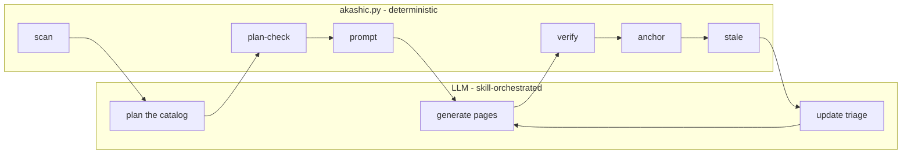

# Project Overview

akashic-record generates and incrementally maintains a wiki that lives inside the repository it describes: plain markdown under `.akashic/wiki/`, where every section ends in a `Sources:` line pointing at the exact lines of source that back it. It ships as a Claude Code skill rather than a service or a standalone CLI, so the harness supplies the model, the file-reading tools and the parallel subagents, while this repo supplies the pipeline structure and one stdlib-only Python helper that owns everything which must never be guessed. The shortest orientation for your first hour: an LLM writes the prose, a Python script decides what is true about files, hashes and line numbers, and neither is permitted to do the other's job.

## What it is

The problem statement in `README.md` is that architecture knowledge lives in the heads of whoever wrote the code, and goes stale the moment a doc is forgotten. Hosted products solve it by generating a wiki from the code, but the code goes through someone else's pipeline and the output lands in their format; akashic-record does the same job as a skill, with the markdown committed straight into your repo beside the code it describes.

`DESIGN.md` states the form factor as a decision with reasons: a skill (`SKILL.md`) plus one stdlib-only Python helper (`akashic.py`), and explicitly not a standalone CLI, not an MCP server, not a plugin. The argument is that the quality gap measured between open-source and closed wiki pipelines came from pipeline structure — catalog-first planning, per-page scoped prompts, agentic exploration — rather than model access, and a skill encodes exactly that structure as instructions. `CLAUDE.md` repeats the same framing as the first thing it tells an agent working here.

One artifact serves two audiences, per `DESIGN.md`: humans reading onboarding and architecture docs on GitHub, and agents reading pre-digested context instead of re-exploring the codebase. Installation is a symlink of this working tree into `~/.claude/skills/akashic-record` — the repo *is* the skill — and `CLAUDE.md` warns not to assume that symlink exists on the machine you are on.

Sources: [README.md:1-20](../../README.md#L1-L20), [DESIGN.md:19-40](../../DESIGN.md#L19-L40), [DESIGN.md:41-45](../../DESIGN.md#L41-L45), [DESIGN.md:231-238](../../DESIGN.md#L231-L238), [CLAUDE.md:8-16](../../CLAUDE.md#L8-L16), [DESIGN.md:1050-1051](../../DESIGN.md#L1050-L1051)

## The four artifacts

`README.md` points at four entry points, and they are the four things worth knowing by name:

| Artifact | Role |
|---|---|
| `DESIGN.md` | the normative design, the on-disk format spec, and the research the tool was built against |
| `SKILL.md` | the Claude Code skill that orchestrates planning and generation |
| `akashic.py` | the deterministic core, stdlib-only on Python 3.9+: diffing, citation verification, hashing, anchoring |
| `bin/akashic_loop.py` | the maintenance loop: poll a fleet of repos, refresh only what changed, open a PR |

Read `DESIGN.md` as the authority rather than as background. `CONTRIBUTING.md` makes it a merge condition: any change to behavior or the on-disk format must update `DESIGN.md` in the same PR, and its §8 list of things deliberately not built (embeddings/RAG, database storage, an MCP server, watchers, Mermaid validation) needs a design discussion in an issue before a PR reintroduces one. That §8 table gives a reason per entry rather than a preference, and it names the standing exceptions the project refuses to be lazy about: citation verification with repo-root containment, anchor-reachability handling, hash-based edit protection, and the one-commit-minimum precondition.

`CLAUDE.md` enumerates three artifacts rather than four — `SKILL.md`, `akashic.py`, `DESIGN.md` — leaving the loop out of its summary, so the four-way split above comes from `README.md`. `DESIGN.md`'s build order lists the same core three plus `README.md`, in the order they were built.

The three code-bearing artifacts each have their own page here: [Skill Orchestration](./skill-orchestration.md) for the LLM side, [Deterministic Core](./deterministic-core.md) for `akashic.py`, and [Maintenance Loop](./maintenance-loop.md) for `bin/akashic_loop.py`.

Sources: [README.md:22-30](../../README.md#L22-L30), [CONTRIBUTING.md:5-9](../../CONTRIBUTING.md#L5-L9), [DESIGN.md:994-1014](../../DESIGN.md#L994-L1014), [CLAUDE.md:10-16](../../CLAUDE.md#L10-L16), [DESIGN.md:1042-1051](../../DESIGN.md#L1042-L1051)

## Division of labor

This is the one invariant `DESIGN.md` calls non-negotiable, and `CLAUDE.md` restates it in a single sentence: the LLM never computes a hash, diff, or line range; `akashic.py` never calls an LLM. The design's table assigns the overview, catalog planning, page prose and update triage to the LLM, and `scan`, `stale`, `verify`, `anchor`, `prompt`, `remap`, `plan-check`, `plan-critic`, `audit` and `bless` to the script, which imports only `json`, `subprocess`, `hashlib`, `pathlib`, `re` and `fnmatch`. The rule behind the split: anything that could lose human work or mark stale content as fresh is deterministic code, and everything stochastic passes through a deterministic verification gate before it can be anchored. That abstract form says what each side must not do; `DESIGN.md` also says what the split is *for* — the script does mechanical templating from catalog and filesystem, rendering the prompts an LLM then judges from, and never judges itself, which is why `plan-critic` produces a review prompt rather than a review. The same shape governs page generation: subagent prompts are rendered by `prompt <id>` and never hand-written, because an orchestrating agent rebuilding that prompt from memory is how the untracked-citation bug first shipped, and `DESIGN.md` describes moving the templating into the deterministic core as removing that failure mode instead of documenting it.



Sources: [DESIGN.md:47-56](../../DESIGN.md#L47-L56), [DESIGN.md:280-298](../../DESIGN.md#L280-L298), [DESIGN.md:300-311](../../DESIGN.md#L300-L311), [DESIGN.md:317-320](../../DESIGN.md#L317-L320), [DESIGN.md:407-414](../../DESIGN.md#L407-L414), [DESIGN.md:442-462](../../DESIGN.md#L442-L462), [DESIGN.md:464-466](../../DESIGN.md#L464-L466), [DESIGN.md:503-512](../../DESIGN.md#L503-L512), [DESIGN.md:613-615](../../DESIGN.md#L613-L615), [DESIGN.md:625-629](../../DESIGN.md#L625-L629), [README.md:32-48](../../README.md#L32-L48), [CLAUDE.md:31-37](../../CLAUDE.md#L31-L37), [CLAUDE.md:46-48](../../CLAUDE.md#L46-L48)

The consequences of that split are the invariants a newcomer trips over first, and `CLAUDE.md` collects them in one list: page ids are frozen forever and slug-validated at catalog load, because an id is a path component and therefore a traversal vector; `hash` permanently means "what the tool last wrote", with `null` as the bless signal, so a changed body under a non-null hash is a human edit that must never be re-hashed or overwritten; citations resolve against git's tracked-path set rather than the filesystem, since an untracked path could never appear in a diff and would make its page permanently fresh; and `.akashic/` paths are never staleness inputs or recorded dependencies, so the wiki cannot depend on itself. `CONTRIBUTING.md` carries the same list as the invariants a PR must not break, adding that `goal_hash` is recorded only for pages the tool actually wrote in that run.

The mechanics behind each of these — the buckets `stale` reports, how ranges are recorded, what `anchor` mutates — belong to [Deterministic Core](./deterministic-core.md) and are not repeated here.

Sources: [CLAUDE.md:52-71](../../CLAUDE.md#L52-L71), [CONTRIBUTING.md:11-17](../../CONTRIBUTING.md#L11-L17)

## What verification proves, and what it does not

`verify` mechanically checks that every citation resolves to a real, git-tracked file at a valid line range before anything is anchored. `README.md` is blunt that this proves the citation is real and cannot prove the sentence above it is true, and quantifies the gap: across four update runs against a 28-page production repo, an adversarial claim audit was pointed at seven pages and found all seven materially wrong, including "nothing here is hard-deleted" written above a literal `DELETE`. The advice that follows is to read a generated page as a map with footnotes rather than as territory — the citations tell you where to check.

Three things exist because of that gap, and `README.md` notes that none of them gates `anchor`, since a heuristic over prose that blocked publishing would eventually block a correct page: `plan-check` and `plan-critic` before generation, an on-demand blind claim refuter (`audit prompt <id>`), and standing generation rules carried in every page prompt. `DESIGN.md` draws the same line from the other side — `verify` proves a citation resolves, the anchored-content warning proves it still points where it was anchored, and the identifier warning proves a named symbol exists somewhere the section cites, while none of them can say whether the sentence above the citation is true.

That gap also decides how you are meant to fix a bad page, which is the part most likely to be got wrong on day one. `README.md` names correcting the page's `goal` and regenerating as the one intervention that reliably works, and says plainly to resist editing the prose: the next regeneration writes from the goal, so a fix living only in the page lasts until the file it documents changes. What belongs in the goal is what the page got wrong — the groups it must distinguish, the claim it may not generalize — and `README.md` points at the audit flow in `SKILL.md` for working out what is wrong in the first place.

`SECURITY.md` makes a related point about a different kind of trust. The read-only mandate rendered into every subagent prompt and the blind labelling in the claim audit are instructions to a model, not a sandbox: a subagent has whatever tools its harness grants it, and these are conventions the tool makes hard to forget rather than enforcement.

Sources: [README.md:54-91](../../README.md#L54-L91), [DESIGN.md:881-885](../../DESIGN.md#L881-L885), [SECURITY.md:24-28](../../SECURITY.md#L24-L28)

## Working in this repo

There is no build step, no dependency install and no lint config. `CONTRIBUTING.md` and `CLAUDE.md` both state the stdlib-only rule for `akashic.py`, on a plain Python 3.9+ interpreter, with no third-party imports. The full test suite is one command, and single classes or tests can be named:

```sh
python3 test_akashic.py                                  # full suite
python3 test_akashic.py TestStale                        # one class
python3 test_akashic.py TestStale.test_rename_marks_stale_not_orphaned   # one test
```

`CONTRIBUTING.md` asks that new deterministic behavior come with at least one smallest-possible `unittest` check in `DESIGN.md` §9 style, where fixtures are throwaway git repos, and both documents state that the LLM phases have no unit tests: the runtime `verify` gate is their coverage. §9 also records one class that is deliberately not of that shape, `TestDocBucketEnumerations`, which reads this repository's own prose and checks every hand-maintained list of stale buckets against `WORK_BUCKETS` — it exists because four such lists rotted simultaneously.

The default branch is `develop`; branch from it and target it, with commit messages and PR titles following Conventional Commits v1.0.0. Anything bigger than a small fix wants an issue first, since the roadmap is maintainer-driven.

This repo carries its own generated wiki, so a change touching source files should refresh it through the normal update flow (`stale` → regenerate → `bless <id>` → `verify` → `anchor`) and commit that refresh as `chore: refresh self-dogfooded wiki`. `CONTRIBUTING.md` and `CLAUDE.md` both forbid hand-editing the tool-owned fields of `catalog.json` — `CONTRIBUTING.md` names `anchor`, `hash`, `files`, `ranges`, `blobs` and `goal_hash`, `CLAUDE.md` names `anchor`, `hash`, `files` and `generated` and additionally forbids editing the derived `wiki/README.md`. `bless` is what tells the tool it wrote a page.

Two things are worth knowing before you file anything security-shaped. `SECURITY.md` defines the in-scope classes as path traversal out of the target repo root, writes escaping `.akashic/`, anything that causes stale or human-edited content to be reported as fresh, and bypasses of the `verify` gate; it puts LLM prose quality out of scope as a regular bug. It also states that `akashic.py` has no dependencies and makes no network calls, shelling out only to local git operations, while `bin/akashic_loop.py` does reach the network by design. Supported versions are the latest commit on `develop` only: there are no tagged releases, and install is a symlink of the working tree. The project is MIT licensed.

Sources: [CONTRIBUTING.md:5-9](../../CONTRIBUTING.md#L5-L9), [CONTRIBUTING.md:19-36](../../CONTRIBUTING.md#L19-L36), [CLAUDE.md:18-27](../../CLAUDE.md#L18-L27), [CLAUDE.md:73-79](../../CLAUDE.md#L73-L79), [README.md:160-164](../../README.md#L160-L164), [DESIGN.md:1016-1040](../../DESIGN.md#L1016-L1040), [SECURITY.md:9-22](../../SECURITY.md#L9-L22), [SECURITY.md:36-38](../../SECURITY.md#L36-L38), [LICENSE:1-3](../../LICENSE#L1-L3)

## Where to start reading

A first-hour path through the four artifacts, in the order that makes each one legible:

1. **`README.md`**, all of it. It is short, it carries the pitch, the four entry points, the three-verb usage (`/akashic-record`, `/akashic-record update`, `/akashic-record status`), the standalone helper commands with a one-line gloss each, and the "what it does not do" section that sets expectations correctly before you read anything else.
2. **`DESIGN.md` §1 through §3.** Positioning and form factor, the division of labor table, and the on-disk format — `.akashic/catalog.json` as the single authoritative metadata file, flat `wiki/<id>.md` pages with hierarchy living only in catalog `parent` fields, and a derived `wiki/README.md` table of contents. `DESIGN.md` describes itself as the normative design; the rest of the document is reasons, and the reasons are the point.
3. **`CLAUDE.md`.** The command list with its exit codes (0 ok, 1 verification failure, 2 usage or precondition error) and the invariant list, which is the fastest way to learn which parts of the system are load-bearing.
4. **`CONTRIBUTING.md`**, before your first PR.

Then follow the artifact you are actually changing: [Skill Orchestration](./skill-orchestration.md), [Deterministic Core](./deterministic-core.md), or [Maintenance Loop](./maintenance-loop.md).

Reading is not the whole of the first hour, and `README.md` is specific about the run that teaches the most: pick a repo you already know well and can read the entire output of, something in the low thousands of lines producing maybe eight to fifteen pages. The reason is not that the tool struggles with more — the field repo it was hardened against is 28 pages — but that checking the output against what you already know is the only way to learn what it produces. This repo's own committed wiki is offered as the worked example, its generated table of contents at `.akashic/wiki/README.md` and four pages under it covering 12 files and about 7,700 lines of source and design docs.

If you would rather see the pipeline than the skill running it, `README.md` also lays out the by-hand order — `scan` and a catalog, then `plan-check` and `plan-critic --out` to judge the plan before paying for a fan-out, then `prompt <id> --out` dispatched per page, `bless <id> --done` as each lands, `verify`, `anchor`, and a `stale --check` that should exit 0 — with the warning not to shorten it, since every step either feeds a later one or is a gate. On an existing wiki the same sequence starts at the dispatch step and is driven by `stale`. How the skill itself sequences this is [Skill Orchestration](./skill-orchestration.md)'s subject; the scheduled version that polls a fleet and opens PRs, including what to do when a cycle suddenly wants to regenerate everything, belongs to [Maintenance Loop](./maintenance-loop.md).

Two pointers for keeping your bearings afterwards. `CLAUDE.md` directs an agent to `gh issue view <n>` before feature work, because GitHub issues carry sequencing constraints and a per-task definition of done, and to `gh issue list --milestone Backlog` for what is deliberately deferred and its re-entry triggers. `README.md`'s roadmap records that all four milestones (M0 through M3) have shipped, that most of what came after them came out of running the tool against a real 28-page repo and fixing what broke, and that the Backlog milestone is what remains.

Sources: [README.md:1-30](../../README.md#L1-L30), [README.md:54-91](../../README.md#L54-L91), [README.md:99-120](../../README.md#L99-L120), [README.md:122-158](../../README.md#L122-L158), [README.md:166-193](../../README.md#L166-L193), [README.md:195-208](../../README.md#L195-L208), [DESIGN.md:11-15](../../DESIGN.md#L11-L15), [DESIGN.md:19-22](../../DESIGN.md#L19-L22), [DESIGN.md:47-56](../../DESIGN.md#L47-L56), [DESIGN.md:58-68](../../DESIGN.md#L58-L68), [CLAUDE.md:5-6](../../CLAUDE.md#L5-L6), [CLAUDE.md:28-44](../../CLAUDE.md#L28-L44), [CLAUDE.md:52-71](../../CLAUDE.md#L52-L71), [CONTRIBUTING.md:1-9](../../CONTRIBUTING.md#L1-L9)

*Generated from commit `f2b491c0` on 2026-08-11.*
