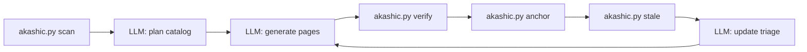

# Project Overview

akashic-record is a repo wiki generator that runs as a Claude Code skill. It plans a catalog of pages, generates markdown with line-range citations back into source, commits that markdown into the repo it describes, and later regenerates only the pages whose underlying files changed — without overwriting anything a human edited. There is no service, no database, and no proprietary format: the output is plain markdown under `.akashic/wiki/`, and git is the sync layer. This page orients you to the pieces and the one rule that shapes all of them; the sibling pages go deeper.

## What this repo is

The problem it targets is knowledge that lives only in the heads of whoever wrote the code, and docs that go stale the moment someone forgets to update them. Hosted products (`README.md` names Qoder's Repo Wiki and DeepWiki) solve it by generating a wiki from the code, at the cost of sending your code through someone else's pipeline and getting output in their format. akashic-record does the same job as a skill instead: markdown committed straight into your repo alongside the code it describes.

`CLAUDE.md` is emphatic about the form factor — a Claude Code **skill**, not a CLI, service, or MCP server. Install is a symlink of this repo into `~/.claude/skills/akashic-record`, so the repo *is* the skill. `DESIGN.md` explains why the research forced that shape: the quality gap between open-source clones and closed pipelines came from pipeline structure (catalog-first planning, per-page scoped prompts, agentic exploration) rather than model access, and a skill encodes exactly that structure while Claude Code supplies the model, tools, and parallel subagents for free. The output serves two audiences from one artifact: humans onboarding via GitHub-rendered docs, and agents reading pre-digested context instead of re-exploring the codebase.

Sources: [README.md:1-20](../../README.md#L1-L20), [CLAUDE.md:8-16](../../CLAUDE.md#L8-L16), [DESIGN.md:1-45](../../DESIGN.md#L1-L45)

## The four artifacts

`README.md` points at four files, and they are the right four to know by name:

| Artifact | What it is |
|---|---|
| `DESIGN.md` | The **normative** design and on-disk format spec, plus the research it was built against. |
| `SKILL.md` | The LLM side: plan/generate/update/status orchestration and the hard rules (script authority, edit protection, cite-or-omit). |
| `akashic.py` | The deterministic core: one file, stdlib only, Python 3.9+. Diffing, citation verification, hashing, anchoring. |
| `bin/akashic_loop.py` | The maintenance loop: poll a fleet of repos, refresh only what changed, open a PR. |

`CLAUDE.md` names the first three as "three artifacts" and does not list the loop among them; `README.md` lists all four. Read that as the loop being an optional operational layer over the other three rather than a disagreement.

"Normative" is load-bearing for `DESIGN.md`: both `CLAUDE.md` and `CONTRIBUTING.md` state that any behavior or format change must keep it in sync in the same change, and that §8's list of things deliberately not built (embeddings/RAG, database storage, an MCP server, watchers, Mermaid validation) needs a design discussion before anything reintroduces one.

Sources: [README.md:22-31](../../README.md#L22-L31), [CLAUDE.md:10-16](../../CLAUDE.md#L10-L16), [DESIGN.md:19-22](../../DESIGN.md#L19-L22), [CONTRIBUTING.md:7-9](../../CONTRIBUTING.md#L7-L9)

## The division of labor

This is the one thing to internalize before reading any code. `DESIGN.md` §2 calls it the design's single non-negotiable, and `CLAUDE.md` repeats it verbatim as the architecture summary:

> the LLM never computes a hash, diff, or line range; `akashic.py` never calls an LLM.

The split follows from what each side can be trusted with. Anything that could lose human work or mark stale content as fresh is deterministic code. Everything stochastic — the overview, catalog planning, page prose, update triage — passes through a deterministic verification gate before it can be anchored. `akashic.py` gets the mechanical half: `scan`, `stale`, `verify`, `anchor`, `prompt`, `remap`, `plan-check`, `plan-critic`, `audit`, `bless`, on nothing but the standard library.



Sources: [DESIGN.md:47-56](../../DESIGN.md#L47-L56), [CLAUDE.md:46-48](../../CLAUDE.md#L46-L48), [README.md:32-48](../../README.md#L32-L48)

## What lands on disk

The tool writes one metadata file and a flat directory of pages into the *target* repo:

```
.akashic/
  catalog.json   # AUTHORITATIVE: settings + TOC plan + per-page state
  wiki/
    README.md    # DERIVED nested TOC, rendered by `anchor` — never hand-edited
    <id>.md      # every page, FLAT — hierarchy lives only in catalog parent fields
  notes.md       # OPTIONAL free-text steering, injected verbatim into planning
```

`catalog.json` is the single authoritative metadata file: page ids, titles, goals, scopes, recorded files, status, hash, the anchor commit, and settings. Pages sit flat because hierarchy lives only in catalog `parent` fields, which is what makes reparenting a one-line edit instead of a file move. Repo-committed markdown is a deliberate reaction to what the research found: Qoder was forced by users out of an internal-index-only wiki, and OpenDeepWiki's database storage (markdown in a column) is its most-criticized property — server-bound, not diffable, not PR-reviewable.

A generated page is prose, an occasional Mermaid diagram, and a `Sources:` line under every section pointing at the exact lines backing the claim above it, like `Sources: [src/auth/jwt.ts:42-88](../../src/auth/jwt.ts#L42-L88)`. Line numbers are coordinates in the anchor commit, and `Sources:` stays in English regardless of the wiki's prose language so the parser stays locale-invariant.

Sources: [DESIGN.md:58-108](../../DESIGN.md#L58-L108), [DESIGN.md:191-249](../../DESIGN.md#L191-L249), [CLAUDE.md:50](../../CLAUDE.md#L50-L50), [README.md:50-52](../../README.md#L50-L52)

## How a wiki gets made

Four steps, catalog-first — which `DESIGN.md` notes is the one pattern every surveyed system converged on:

1. **Plan** — Claude reads the repo (README, existing docs, `scan` output) and writes a page catalog: titles, a generation brief per page, and the files each page is scoped to.
2. **Generate** — one subagent per page, in parallel, each reading only its assigned files and ending every section in a citation.
3. **Verify** — `akashic.py verify` mechanically checks that every citation resolves to a real, git-tracked file at a valid line range before anything is anchored.
4. **Anchor** — records each page's file dependencies and content hash against the current commit, so a later update knows which pages a given code change should regenerate, and never touches a page a human has since edited.

The phase-by-phase contract — planning guidance, the pre-fan-out plan gates, how subagent prompts are rendered, and the update flow — belongs to [Skill Orchestration](./skill-orchestration.md). The mechanics underneath (`stale` buckets, range-level staleness, hashing and edit protection, the `verify` gate itself) belong to [Deterministic Core](./deterministic-core.md). Running this unattended across a fleet of repos, by PR, is [Maintenance Loop](./maintenance-loop.md).

Sources: [README.md:32-48](../../README.md#L32-L48), [DESIGN.md:251-256](../../DESIGN.md#L251-L256)

## What verify proves, and what it does not

Read this before you trust a generated page. `verify` proves every citation resolves to a real, tracked file at a real line range. It does not prove the prose above the citation is true, and `README.md` reports that gap being wider than it sounds: across four update runs against a 28-page production repo, an adversarial claim audit was pointed at seven pages and found all seven materially wrong — including "nothing here is hard-deleted" sitting above a literal `DELETE`, and "nine components" above a table listing ten. `DESIGN.md` §5b puts it structurally: everything else in the design checks the *scaffolding* of a claim, and only the audit asks whether the sentence is true.

So read a generated page as a map with footnotes rather than as territory. The citations tell you exactly where to check, which is the point of having them.

Three things exist because of that gap, and `README.md` is explicit that none of them gates `anchor` — a heuristic over prose that blocked publishing would eventually block a correct page:

- **`plan-check` and `plan-critic`**, before generation. The first is free and deterministic (unmatched scopes, a scope inside a sibling's, overlapping pairs ranked by duplicated lines). The second renders one adversarial review prompt for the whole catalog and an LLM judges whether each page's brief is truthful and reachable from its own files.
- **`audit prompt <id>`**, an on-demand blind refuter that hands a judge each claim beside the exact bytes it cites, with evidence labelled `[E1]`, `[E2]` rather than by filename.
- **Standing generation rules** in every page prompt: scope generalizations to what was actually read, state the method behind any absence claim, write only what the goal asks.

Two caveats travel with these. A critic pass is one sample, not a measurement — rerunning on an unchanged catalog keeps finding things. And the one intervention `README.md` says reliably fixes a wrong page is correcting its `goal` and regenerating.

Sources: [README.md:54-86](../../README.md#L54-L86), [DESIGN.md:758-768](../../DESIGN.md#L758-L768)

## Where to start reading

A reasonable first hour, in order:

1. **`README.md`** for the shape of the thing, then its "What it does not do" section for the honest limits.
2. **`DESIGN.md` §1 and §2** — positioning and the division of labor. Everything else in the design hangs off those two.
3. **`CLAUDE.md`** — the command list and the invariants that shape most of the code, in condensed form. That invariant list is where the design's accumulated field lessons are densest: page ids, hash semantics, the update buckets and what each one's remedy is, range-level staleness, and what `verify` warns about beyond citation resolution.
4. **`akashic.py`**, guided by [Deterministic Core](./deterministic-core.md); then **`SKILL.md`**, guided by [Skill Orchestration](./skill-orchestration.md).

`DESIGN.md` §10 records the order the project was actually built in — `akashic.py`, then `test_akashic.py`, then `SKILL.md`, then `README.md` — which is close enough to a reading order to be useful.

To try it, install is one symlink, and the skill exposes three verbs inside Claude Code:

```sh
ln -s "$(pwd)" ~/.claude/skills/akashic-record
```

```
/akashic-record            # first run: plan + generate the wiki
/akashic-record update     # regenerate only stale pages
/akashic-record status     # what would update, without changing anything
```

The helper also runs standalone against any git repo with at least one commit — `python3 akashic.py -C <repo> scan | stale | verify | anchor | prompt <id> | remap | plan-check | plan-critic | audit prompt <id> | bless <id>`. Exit codes are 0 ok, 1 verification failure, 2 usage or precondition error. `CLAUDE.md` and `README.md` both carry the annotated list.

Sources: [README.md:88-122](../../README.md#L88-L122), [CLAUDE.md:18-44](../../CLAUDE.md#L18-L44), [CLAUDE.md:52-71](../../CLAUDE.md#L52-L71), [DESIGN.md:915-921](../../DESIGN.md#L915-L921)

## Working in this repo

There is no build step, no dependency install, and no lint config. Tests are one stdlib `unittest` file:

```sh
python3 test_akashic.py                                  # full suite
python3 test_akashic.py TestStale                        # one class
python3 test_akashic.py TestStale.test_rename_marks_stale_not_orphaned   # one test
```

Fixtures are throwaway git repos built in `tempfile` (see `RepoCase`), and new deterministic behavior needs at least one smallest-possible check. The LLM phases have no unit tests — the runtime `verify` gate is their coverage.

`CONTRIBUTING.md` lists five invariants a PR must not break: page ids are frozen forever and slug-validated at catalog load (an id is a path component, so a non-slug id is a traversal vector); `hash` permanently means "what the tool last wrote" and `null` is the bless signal; citations resolve against git's tracked-path set rather than the filesystem, with resolved paths realpathed inside the repo root; `.akashic/` paths are never staleness inputs or recorded dependencies, so the wiki cannot depend on itself; and `goal_hash` is recorded only for pages the tool actually wrote that run. The default branch is `develop`, PRs target it, and commit messages follow Conventional Commits v1.0.0.

This repo carries its own generated wiki in `.akashic/`, so a change touching source files is expected to refresh it via `stale` → regenerate → `bless <id>` → `verify` → `anchor`, committed as `chore: refresh self-dogfooded wiki`. Never hand-edit `catalog.json`'s `anchor`, `hash`, `files`, `ranges`, `blobs` or `goal_hash`, and never edit the derived `wiki/README.md`.

Sources: [CLAUDE.md:18-26](../../CLAUDE.md#L18-L26), [CLAUDE.md:73-79](../../CLAUDE.md#L73-L79), [CONTRIBUTING.md:11-36](../../CONTRIBUTING.md#L11-L36), [DESIGN.md:899-913](../../DESIGN.md#L899-L913)

## Security posture and license

`SECURITY.md` scopes the project as a skill plus two stdlib-only Python scripts that read a target git repository and write generated wiki files into that repository's `.akashic/` directory. It states that `akashic.py` has no dependencies and makes no network calls, shelling out only to local git operations (`rev-parse`, `diff`, `ls-files`, `ls-tree`, `cat-file`, `show`, `status`), while `bin/akashic_loop.py` does reach the network by design — it runs `claude -p`, `git push`, and `gh pr create`. Two loop behaviours are named there as intentional rather than defects: executing the command in `$AKASHIC_NOTIFY` through a shell, and opening pull requests on repositories listed in your own config file.

In scope for a report: path traversal out of the target repo root, writes escaping `.akashic/`, anything causing stale or human-edited content to be reported as fresh, and bypasses of the `verify` gate. Out of scope: the quality or accuracy of generated prose (that is a regular bug), vulnerabilities in the repositories the tool is run against, and Claude Code itself. One caveat is stated plainly because it reads like a control and is not one — the read-only mandate rendered into every subagent prompt, and the blind labelling in the claim audit, are instructions to a model rather than a sandbox, since a subagent has whatever tools its harness grants it. Vulnerabilities go through GitHub private vulnerability reporting, and only the latest commit on `develop` is supported; there are no tagged releases.

The project is MIT licensed, copyright 2026 ARMeeru.

Sources: [SECURITY.md:3-38](../../SECURITY.md#L3-L38), [LICENSE:1-3](../../LICENSE#L1-L3)

*Generated from commit `9134229f` on 2026-08-07.*
