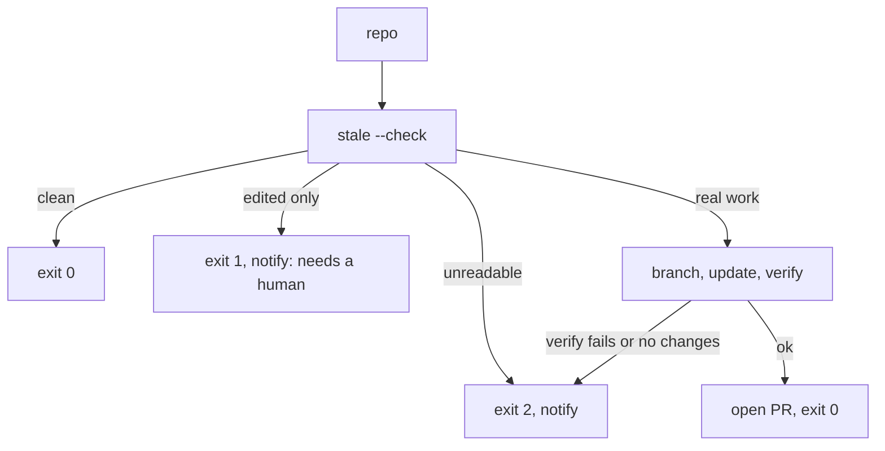

# Maintenance Loop

`bin/akashic_loop.py` is what turns akashic-record from a generator you remember to run into a wiki that keeps itself current. It walks a list of repositories, asks each one a question that costs nothing, and spends an LLM only where the answer says something actually changed. Everything it decides is downstream of the deterministic report described in [Deterministic Core](./deterministic-core.md), and the update it triggers is the flow documented in [Skill Orchestration](./skill-orchestration.md).

## The zero-token gate

The loop's economics rest on one property: asking "does this repo need work?" is free. Each repo is put through `akashic.py stale --check` as a subprocess, and only exit codes 0 and 1 are treated as answers — 0 meaning nothing outstanding, 1 meaning something is. Any other exit code, or output that will not parse as JSON, is raised rather than absorbed, so a repo the gate cannot read never resembles a repo with nothing to do.

That distinction is the whole reason a schedule is reasonable rather than extravagant. A quiet fleet can be polled as often as you like, because the polling never reaches a model at all.

Sources: [bin/akashic_loop.py:1-27](../../bin/akashic_loop.py#L1-L27), [bin/akashic_loop.py:109-121](../../bin/akashic_loop.py#L109-L121)

## Four verdicts, and the one that never reaches an LLM

`classify` reduces a `stale` report to one of four constants, which `process` then acts on:

- **clean** — nothing in any bucket. The repo is skipped and costs nothing.
- **needs-update** — anything in `stale`, `orphaned`, `uncovered`, `missing` or `planned`. The repo goes through the update flow.
- **remap-only** — the sole finding is `drifted`: cited lines moved without changing. That is arithmetic, so `remap` fixes it and no model is ever invoked. The resulting PR contains no generated prose at all, which is what makes it the one safe candidate for automatic merging.
- **review-only** — `edited` is the *sole* finding. This is the interesting case: a human wrote that page, and hard rule 2 says never overwrite detected human work, so regenerating would be exactly the wrong response. The loop notifies the owner and returns 1 rather than handing the repo to a model.

A repo with `edited` *alongside* real work is still classified `needs-update`, because the other buckets genuinely need doing. Skipping the edited pages themselves is the update flow's job, not the classifier's — the loop does not try to re-implement a rule the skill already enforces.

Sources: [bin/akashic_loop.py:34-44](../../bin/akashic_loop.py#L34-L44), [bin/akashic_loop.py:61-82](../../bin/akashic_loop.py#L61-L82), [bin/akashic_loop.py:212-249](../../bin/akashic_loop.py#L212-L249)

## Which PRs may merge themselves

Exactly one kind. A remap PR contains nothing a model wrote: every line number in it was shifted by integer arithmetic from a diff, and a reviewer can re-derive the whole change in seconds. It requests auto-merge as soon as it is opened.

A PR carrying regenerated pages never does. `verify` proves that the citations resolve; it says nothing about whether the sentences above them are true, and that gap is precisely what a reader is for. The policy lives in one predicate that both paths call, so the two cannot drift apart. If it ever inverted, unread generated prose would start landing on the default branch by itself; the test that pins the direction lives with the rest of the suite, covered in [Deterministic Core](./deterministic-core.md).

Auto-merge is *requested*, not performed. The branch's required status checks are the real gate, so a red run holds the PR open rather than landing it. Where a repository has auto-merge switched off the request fails harmlessly and the PR waits for a human, which is why that path warns instead of raising.

Sources: [bin/akashic_loop.py:39-48](../../bin/akashic_loop.py#L39-L48), [bin/akashic_loop.py:159-174](../../bin/akashic_loop.py#L159-L174)

## Pull request, not commit

When a repo needs updating, the loop creates a branch, runs the skill's update flow headlessly via `claude -p`, and opens a pull request. It never commits to whatever branch was checked out.

Before it will open that PR, three things must hold: the update flow itself must exit 0, `verify` must then exit 0, and the working tree must actually contain changes. A flow that reports work but changes nothing, or that leaves the wiki unverified, raises instead of producing a PR — the loop refuses to present unverified output as a finished result.

The reasoning behind the PR is that this output is produced while nobody is watching. A pull request is the cheapest possible place to put a human back in the path without making the loop wait for one.

Sources: [bin/akashic_loop.py:124-130](../../bin/akashic_loop.py#L124-L130), [bin/akashic_loop.py:177-209](../../bin/akashic_loop.py#L177-L209)

## Never exit 0 on failure

The exit-code contract is the loop's most load-bearing property, and it inverts the usual instinct to keep a scheduled job quiet:

Sources: [bin/akashic_loop.py:212-249](../../bin/akashic_loop.py#L212-L249)

Across a fleet the worst outcome wins, so one broken repo cannot be hidden by nine healthy ones. A missing or empty repo list is itself a failure rather than a quiet no-op, because a loop configured into silence looks identical to a loop with nothing to do. The stated reason is that a set-and-forget loop failing silently fossilizes the wiki, which is worse than having no loop at all: you would go on believing the docs were current.

Failures reach the owner through `notify`, which always writes to stderr — enough for a scheduler that mails output — and additionally pipes the message to whatever command `$AKASHIC_NOTIFY` names. A notification hook that itself fails is caught and reported rather than being allowed to take down the run.

Sources: [bin/akashic_loop.py:95-106](../../bin/akashic_loop.py#L95-L106), [bin/akashic_loop.py:252-281](../../bin/akashic_loop.py#L252-L281)

## Configuration

The fleet is a plain text file: one repository path per line, `#` comments and blank lines ignored, `~` expanded so paths are never handed to git with a tilde in them. It is read from `--repos`, else `$AKASHIC_REPOS`, else `~/.config/akashic-record/repos`. The list lives outside the repository on purpose — which repos a person maintains is machine-local, not something to commit to a shared project.

`--dry-run` reports what each repo would need and spends nothing, which is also the safe way to confirm a schedule is pointed at the right paths. It fires the notification hook too, for any repo that is not clean: under a scheduler stdout is a log file nobody opens, and report-only is the mode an install is meant to start in, so a dry run that only printed would make a fleet needing work look exactly like a quiet one. A clean dry run stays silent, because a banner that always arrives is a banner that stops being read.

Sources: [bin/akashic_loop.py:29-32](../../bin/akashic_loop.py#L29-L32), [bin/akashic_loop.py:51-58](../../bin/akashic_loop.py#L51-L58), [bin/akashic_loop.py:85-92](../../bin/akashic_loop.py#L85-L92), [bin/akashic_loop.py:212-249](../../bin/akashic_loop.py#L212-L249), [bin/akashic_loop.py:252-281](../../bin/akashic_loop.py#L252-L281)

*Generated from commit `66f9e52a` on 2026-08-07.*
