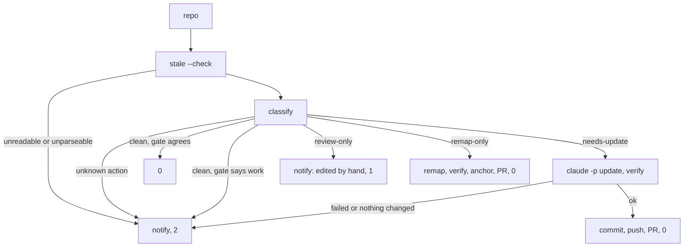

# Maintenance Loop

`bin/akashic_loop.py` is what turns akashic-record from a generator you remember to run into a wiki that keeps itself current. It walks a list of repositories, asks each one a question that costs nothing, and spends an LLM only where the answer says something actually changed. It is deliberately not a watcher or a daemon: no long-lived process, no subscriptions, no state of its own, just a periodic poll of a deterministic check. Everything it decides is downstream of the report described in [Deterministic Core](./deterministic-core.md), and the update it triggers is the flow documented in [Skill Orchestration](./skill-orchestration.md).

## The zero-token gate

The loop's economics rest on one property: asking "does this repo need work?" is free. Each repo is put through `akashic.py stale --check` as a subprocess, and only exit codes 0 and 1 are treated as answers — 0 meaning nothing outstanding, 1 meaning something is. Any other exit code, or output that will not parse as JSON, raises rather than being absorbed, so a repo the gate cannot read never resembles a repo with nothing to do.

That distinction is the whole reason a schedule is reasonable rather than extravagant. A quiet fleet can be polled as often as you like, because the polling never reaches a model at all, and a busy one pays only for what changed.

Sources: [bin/akashic_loop.py:2-21](../../bin/akashic_loop.py#L2-L21), [bin/akashic_loop.py:141-153](../../bin/akashic_loop.py#L141-L153)

## Four verdicts, and the one that never reaches an LLM

`classify` reduces a `stale` report to one of four constants — `clean`, `needs-update`, `remap-only`, `review-only` — which `process` then acts on:

- **clean** — no work bucket is populated. The repo is skipped and costs nothing.
- **needs-update** — the report holds anything whose action is `update`. The repo goes through the skill's update flow.
- **remap-only** — the only findings route to `remap`: cited lines moved without their content changing. That is arithmetic, so `remap` fixes it and no model runs. It is the cheapest cycle, and the only kind whose PR contains no generated prose.
- **review-only** — the only findings route to `review`, which today means `edited`. A human wrote that page, hard rule 2 says never overwrite it, and regenerating would be exactly the wrong response — so the loop notifies the owner and returns 1 rather than handing the repo to a model.

The routing table is imported, never restated: `classify` iterates `akashic.BUCKET_ACTIONS` and maps each action through a small `ACTION_VERDICTS` dictionary. The docstring records why. This file used to keep its own list of which buckets mean work; two buckets were added to the core hours later, and a repo whose only finding was one of them classified as clean from then on. An action the loop does not recognise raises instead of defaulting, because defaulting to `update` would hand a future edited-like bucket to a model and destroy prose.

`summarize` was the second copy of that same hardcoded enumeration, omitting the same two buckets, and its `or "clean"` fallback is where the failure was actually visible: a repo with outstanding work printed `clean -> clean`, and since the `clean` verdict returns before the dry-run notification, report-only mode said nothing at all about exactly those repos. It now iterates `akashic.WORK_BUCKETS` for the same reason `classify` iterates the action table, formatting each populated bucket as `name=count` and appending `anchor_state` when it is anything other than `ok`.

Where several verdicts apply at once, `VERDICT_PRECEDENCE` picks the most urgent: update beats remap (regeneration rewrites the citations remap would have shifted), and both beat review. So a repo with `edited` *alongside* real work is still updated — skipping the edited pages themselves is the update flow's job, not the classifier's.

Sources: [bin/akashic_loop.py:40-61](../../bin/akashic_loop.py#L40-L61), [bin/akashic_loop.py:78-115](../../bin/akashic_loop.py#L78-L115), [bin/akashic_loop.py:118-124](../../bin/akashic_loop.py#L118-L124), [bin/akashic_loop.py:274-300](../../bin/akashic_loop.py#L274-L300)

## The parity tripwire

`stale --check` exits 1 whenever any work bucket is non-empty, so the gate and the classifier are two answers to one question and they have to agree. `process` compares them. If the gate says there is work and the classifier says `clean`, the loop notifies and exits 2, and the message names `akashic_loop.py` as the thing to fix rather than the repo.

That is the guard for the divergence no table can catch by itself — including a bucket added to a newer core than the routing here was written against. A loop quietly reporting a clean fleet while the gate disagrees is precisely the failure the zero-token story depends on not happening.

Sources: [bin/akashic_loop.py:244-272](../../bin/akashic_loop.py#L244-L272)

## Pull request, not commit

Neither live path commits to the branch that happened to be checked out. Both start with `git switch -c` onto a fixed branch name — `chore/wiki-remap` for a remap, `chore/wiki-refresh` for an update — and end at `gh pr create`.

The remap path runs `remap`, then `verify`, then guards that `git status --porcelain` is non-empty ("remap reported drift but rewrote nothing"), commits, runs `anchor`, commits the anchor separately, pushes, and opens the PR.

The update path invokes the skill headlessly as `claude -p "/akashic-record update"` — by search over the file, that line is its only invocation of a model — and then requires three things before it will open a PR: the update flow must exit 0, `verify` must then exit 0, and the working tree must actually contain changes. A flow that leaves the wiki unverified, or that reported work and changed nothing, raises instead of producing a PR. The loop will not present unverified output as a finished result.

The reasoning behind the PR is stated in the code: this output is produced while nobody is watching, and a pull request is the cheapest place to put a human back in the path without making the loop wait for one.

Sources: [bin/akashic_loop.py:156-188](../../bin/akashic_loop.py#L156-L188), [bin/akashic_loop.py:209-241](../../bin/akashic_loop.py#L209-L241), [bin/akashic_loop.py:284-300](../../bin/akashic_loop.py#L284-L300)

## Which PRs may merge themselves

Exactly one kind. `AUTO_MERGEABLE` is a frozen set containing only `remap-only`, and both paths ask the same `may_auto_merge` predicate, so the two cannot drift apart. A remap PR contains nothing a model wrote — every line number in it was shifted by integer arithmetic from a git diff — and a reviewer can re-derive the whole change in seconds.

A PR carrying regenerated pages never merges itself. `verify` proves that the citations resolve; it says nothing about whether the sentences above them are true, and that gap is exactly what a human is for. Its PR body says so out loud, ending with "Read the diff."

Auto-merge is *requested*, not performed. The branch's required status checks are the real gate, so a red run holds the PR open rather than landing it. Where a repository has auto-merge switched off the request fails harmlessly and the PR waits for a human, which is why `open_pr` warns through `notify` instead of raising there.

Sources: [bin/akashic_loop.py:56-65](../../bin/akashic_loop.py#L56-L65), [bin/akashic_loop.py:184-206](../../bin/akashic_loop.py#L184-L206), [bin/akashic_loop.py:236-241](../../bin/akashic_loop.py#L236-L241)

## Never exit 0 on failure

The exit-code contract is the loop's most load-bearing property, and it inverts the usual instinct to keep a scheduled job quiet. `process` returns a per-repo contribution — 0 fine, 1 needs a human, 2 failed:

Sources: [bin/akashic_loop.py:244-300](../../bin/akashic_loop.py#L244-L300)

Across a fleet the worst outcome wins — `main` folds the per-repo codes with `max` — so one broken repo cannot be hidden by nine healthy ones. A missing or empty repo list is itself a failure returning 2 rather than a quiet no-op, because a loop configured into silence looks identical to a loop with nothing to do. The stated reason for all of it is in the module docstring: a loop that fails silently fossilizes the wiki, which is worse than having no loop, since you would go on believing the docs were current.

Failures reach the owner through `notify`, which always writes to stderr — enough for a scheduler that mails its output — and additionally pipes the message to whatever shell command `$AKASHIC_NOTIFY` names, with a 30-second timeout. A hook that itself fails is caught and reported rather than being allowed to take down the run.

Sources: [bin/akashic_loop.py:16-18](../../bin/akashic_loop.py#L16-L18), [bin/akashic_loop.py:127-138](../../bin/akashic_loop.py#L127-L138), [bin/akashic_loop.py:325-328](../../bin/akashic_loop.py#L325-L328)

## Configuration and the dry run

The fleet is a plain text file: one repository path per line, `#` comments and blank lines ignored, `~` expanded so paths are never handed to git with a tilde in them. It is read from `--repos`, else `$AKASHIC_REPOS`, else `~/.config/akashic-record/repos`. The list lives outside the repository on purpose — which repos a person maintains is machine-local.

`--dry-run` reports what each repo needs and spends nothing, which is also the safe way to confirm a schedule is pointed at the right paths; both `remap_repo` and `update_repo` print a "would:" line and return before touching git. It fires the notification hook too, for any repo that is not clean: under a scheduler stdout is a file nobody opens, and report-only is the mode an install is meant to start in, so a dry run that only printed would make a fleet needing work look exactly like a quiet one. The live paths stay quiet at that point on purpose — they speak by opening a PR, and `notify` is reserved for what needs a human.

Sources: [bin/akashic_loop.py:13-14](../../bin/akashic_loop.py#L13-L14), [bin/akashic_loop.py:30-32](../../bin/akashic_loop.py#L30-L32), [bin/akashic_loop.py:68-75](../../bin/akashic_loop.py#L68-L75), [bin/akashic_loop.py:165-171](../../bin/akashic_loop.py#L165-L171), [bin/akashic_loop.py:209-215](../../bin/akashic_loop.py#L209-L215), [bin/akashic_loop.py:274-283](../../bin/akashic_loop.py#L274-L283), [bin/akashic_loop.py:303-323](../../bin/akashic_loop.py#L303-L323)

*Generated from commit `c57eaf30` on 2026-08-11.*
