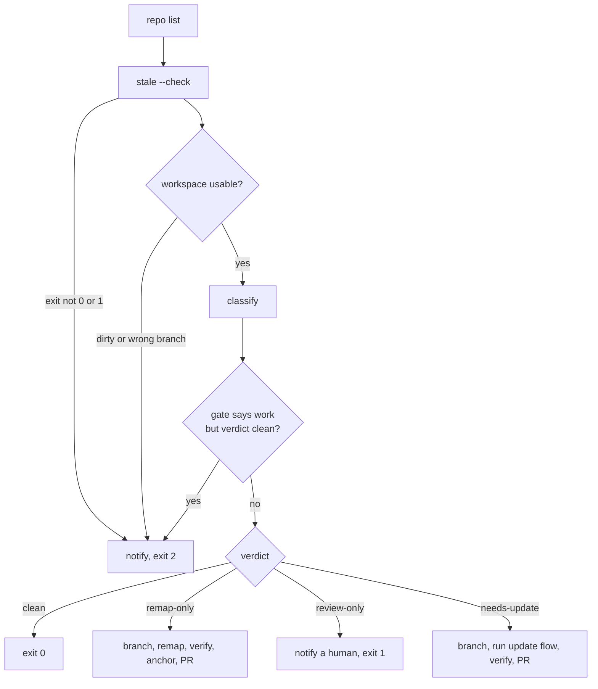

# Maintenance Loop

`bin/akashic_loop.py` is how a wiki stays current when nobody is watching it. It is a single-pass program, not a daemon: something external (cron, a launchd job, a CI schedule) runs it, it walks a list of repo paths, asks each one a deterministic question that costs no tokens, and only the repos that answer "there is work" get any further. Where work exists, the loop does it on a fresh branch and leaves a pull request; where it cannot proceed safely, it refuses out loud and exits non-zero. Its module docstring states the two properties everything else follows from — the zero-token gate is what makes polling affordable, and a loop that fails silently fossilizes the wiki, which is worse than having no loop.

Sources: [bin/akashic_loop.py:1-21](../../bin/akashic_loop.py#L1-L21)

## One cycle

`main` resolves a repo-list file from `--repos`, then `$AKASHIC_REPOS`, then `~/.config/akashic-record/repos`; a missing or empty list is itself a failure, not a quiet no-op. `read_repo_list` takes one path per line, strips `#` comments and blanks, and expands `~`. Each repo goes through `process`, and the program's exit code is the worst any repo produced.

Inside `process` the order is fixed: run the gate, refuse unusable checkouts, classify, cross-check the classification against the gate, then act. The workspace check runs *before* the verdict is trusted, because a report read from the wrong tree is not a wrong answer to be handled downstream — it is a correct answer about a tree the fleet is not tracking.

Sources: [bin/akashic_loop.py:146-153](../../bin/akashic_loop.py#L146-L153), [bin/akashic_loop.py:366-433](../../bin/akashic_loop.py#L366-L433), [bin/akashic_loop.py:436-461](../../bin/akashic_loop.py#L436-L461)

## The zero-token gate

`stale_report` shells out to `akashic.py stale --check` and reads its JSON from stdout. That subcommand is the whole scheduling economy: it exits 0 when nothing is outstanding and 1 when some work bucket is non-empty, so a quiet fleet can be polled as often as you like and a busy one pays only for what actually changed. See [Deterministic Core](./deterministic-core.md) for what the buckets are and how they are computed.

Any other return code is a failure rather than a verdict, and so is stdout that will not parse as JSON — both raise `RuntimeError`, which `process` turns into a notification and exit 2. The gate is never allowed to degrade into "probably clean".

`stale_report` returns the parsed report *and* the boolean `returncode == 1`, which is what later makes the parity tripwire possible: the loop keeps both the gate's answer and its own, so the two can be compared.

Sources: [bin/akashic_loop.py:1-21](../../bin/akashic_loop.py#L1-L21), [bin/akashic_loop.py:219-231](../../bin/akashic_loop.py#L219-L231)

## The checkout the loop refuses

`workspace_problems` returns the reasons this checkout may not be used; empty means proceed. Two conditions are checked. A report with `dirty` set means uncommitted changes are present, and the loop will not run — `git add .akashic` would otherwise sweep a human's in-progress wiki edits into a bot PR. And the checkout must not be sitting on a branch a previous cycle created: `LOOP_BRANCHES` names `chore/wiki-remap` and `chore/wiki-refresh`, and a checkout stranded on one of those would be polled forever against a branch that upstream merges never advance, reporting the wiki fresh while the real repo moved on.

Otherwise, the branch is compared against `origin/HEAD`. `default_branch` returns `None` when git cannot answer locally, and `None` means "do not check" rather than "assume `main`" — guessing a default branch name is how a gate starts refusing correct checkouts. The git queries behind all of this go through `git_says`, which answers `""` rather than raising, including on `OSError`: these back a gate, and a gate that raises would escape `main`'s loop and abandon every repo queued behind this one.

The doctrine here is refusal, not repair. The loop does not switch, stash or fetch on the owner's behalf; both alternatives would mean this program mutating a checkout it does not own.

Sources: [bin/akashic_loop.py:68-71](../../bin/akashic_loop.py#L68-L71), [bin/akashic_loop.py:74-103](../../bin/akashic_loop.py#L74-L103), [bin/akashic_loop.py:106-143](../../bin/akashic_loop.py#L106-L143), [bin/akashic_loop.py:376-383](../../bin/akashic_loop.py#L376-L383)

## Four verdicts

`classify` turns a `stale` report into exactly one of `clean`, `needs-update`, `remap-only` or `review-only`. It does not carry its own opinion about which buckets mean work: it iterates `akashic.BUCKET_ACTIONS`, imported from `akashic.py` at module load, and maps each bucket's *action* through `ACTION_VERDICTS` (`update` → `needs-update`, `remap` → `remap-only`, `review` → `review-only`). The comments record why: a local copy of the work model went stale the same day two buckets were added to the core, and a restated-only or unblessed-only repo classified as clean from then on. An action the loop does not recognize raises rather than defaulting — defaulting to update would hand a future edited-like bucket to a model.

When several buckets are populated, `VERDICT_PRECEDENCE` picks the most urgent: update beats remap beats review. A repo with both drifted and stale pages is updated, because regeneration rewrites the citations a remap would have shifted.

`review-only` is the verdict that never reaches an LLM. It comes from the `edited` bucket — a page a human changed by hand — and the loop's response is to notify with the count and return 1. Regenerating would overwrite that person's prose, which the code cites as hard rule 2 (see [Skill Orchestration](./skill-orchestration.md) for the rules the update flow itself enforces). A repo with `edited` pages *and* other findings is still updated for the other buckets; the edited pages are skipped by the update flow, not by this classifier.

`remap-only` is the cheapest cycle and the only one whose PR contains no generated prose: cited lines moved without their content changing, which is arithmetic.

Sources: [bin/akashic_loop.py:34-38](../../bin/akashic_loop.py#L34-L38), [bin/akashic_loop.py:40-54](../../bin/akashic_loop.py#L40-L54), [bin/akashic_loop.py:156-193](../../bin/akashic_loop.py#L156-L193), [bin/akashic_loop.py:424-426](../../bin/akashic_loop.py#L424-L426)

## PR, never commit

Both acting paths follow the same skeleton: record the current branch, `git switch -c` onto the loop's branch, do the work in a `try`, and restore the original branch in a `finally` before opening the PR. `restore_branch` uses `check=False` deliberately — it runs in a `finally`, so raising there would replace whatever real failure sent us into it, and a switch that fails simply leaves the checkout on the loop branch for the next cycle's gate to catch.

`remap_cycle` runs `remap`, then `verify`, then commits, then `anchor`, then commits again, then pushes. `update_cycle` invokes the skill headlessly with `claude -p "/akashic-record update"`, then runs `verify` and refuses to open a PR if it fails. Both then check `wiki_is_dirty` and raise if nothing was written — "reported work but changed nothing" is treated as a defect, not a success. That check is scoped to `.akashic` on purpose: a flow that modified something outside the wiki cannot satisfy the guard and is left dirty for the gate to catch. Reading the whole file, `claude -p` on line 324 is the only command it runs that invokes a model; every other subprocess is `git`, `gh`, `akashic.py`, or the user's notify hook.

Neither path commits to the checked-out branch. The whole point of the PR is that an unattended run's output gets read before it lands, and the two PR bodies say different things for that reason: the remap body states that no model ran and every line number came from integer arithmetic, while the refresh body warns that `verify` proves the citations resolve, not that the sentences above them are true.

That difference is also the auto-merge policy. `AUTO_MERGEABLE` contains `remap-only` alone, so only a remap PR asks for `gh pr merge --auto --merge`; the refresh PR is created and left for a human. Auto-merge is *requested*, not performed — the branch's required status checks still gate it — and if the request fails (a repo with auto-merge disabled, say) `open_pr` notifies and returns rather than raising, leaving the PR waiting for a human.

Sources: [bin/akashic_loop.py:56-65](../../bin/akashic_loop.py#L56-L65), [bin/akashic_loop.py:243-261](../../bin/akashic_loop.py#L243-L261), [bin/akashic_loop.py:264-302](../../bin/akashic_loop.py#L264-L302), [bin/akashic_loop.py:305-320](../../bin/akashic_loop.py#L305-L320), [bin/akashic_loop.py:323-363](../../bin/akashic_loop.py#L323-L363)

## Exit codes, and the tripwire

`process` returns an exit-code contribution per repo — 0 fine, 1 needs a human, 2 a step failed — and `main` returns the worst of them. The contract in the module docstring is that the loop never exits 0 on a failure. Exit 2 covers a gate that could not run, an unusable checkout, an unknown bucket action, and any `RuntimeError` from the remap or update path. Exit 1 is reserved for `review-only`: nothing broke, but a person has to look.

Between classification and action sits the parity tripwire. `--check` exits 1 when any work bucket is non-empty, so the gate and the classifier are two answers to the same question. If the gate says there is work and the loop says `clean`, that disagreement is a defect in `akashic_loop.py` — including a bucket added to a newer core than its routing was written against — and it exits 2 rather than reporting a fresh wiki. It is the one guard that catches a divergence no routing table knows about.

Everything a human needs to see goes through `notify`, which always prints to stderr (so cron mail catches it) and additionally pipes the message to `$AKASHIC_NOTIFY` if that is set, with a 30-second timeout; a failing hook is reported, never raised. `--dry-run` reports and spends nothing, and it is the one non-failure case that notifies on a work verdict: under a scheduler stdout is a file nobody opens, and a silent report-only run looks exactly like a clean fleet. The live paths stay quiet there deliberately — they speak by opening a PR. `summarize` builds the one-line digest from `akashic.WORK_BUCKETS`, appending `anchor_state` when it is not `ok`.

Sources: [bin/akashic_loop.py:16-18](../../bin/akashic_loop.py#L16-L18), [bin/akashic_loop.py:196-216](../../bin/akashic_loop.py#L196-L216), [bin/akashic_loop.py:366-433](../../bin/akashic_loop.py#L366-L433), [bin/akashic_loop.py:436-461](../../bin/akashic_loop.py#L436-L461)

## Where it sits

The loop is a client of the rest of the project, never a peer. It owns no format, computes no staleness, and holds no state of its own; it shells out to `akashic.py` for the gate, the remap and the verify, and to the skill for regeneration. The two constants it imports rather than restates — `BUCKET_ACTIONS` and `WORK_BUCKETS` — are the seam where the deterministic core stays authoritative over what work means. For the core's commands and the format they maintain see [Deterministic Core](./deterministic-core.md); for the generation flow the loop triggers see [Skill Orchestration](./skill-orchestration.md); for how the pieces fit together see [Project Overview](./index.md).

Sources: [bin/akashic_loop.py:30-38](../../bin/akashic_loop.py#L30-L38), [bin/akashic_loop.py:292-302](../../bin/akashic_loop.py#L292-L302), [bin/akashic_loop.py:323-341](../../bin/akashic_loop.py#L323-L341)

*Generated from commit `885a1135` on 2026-08-11.*
