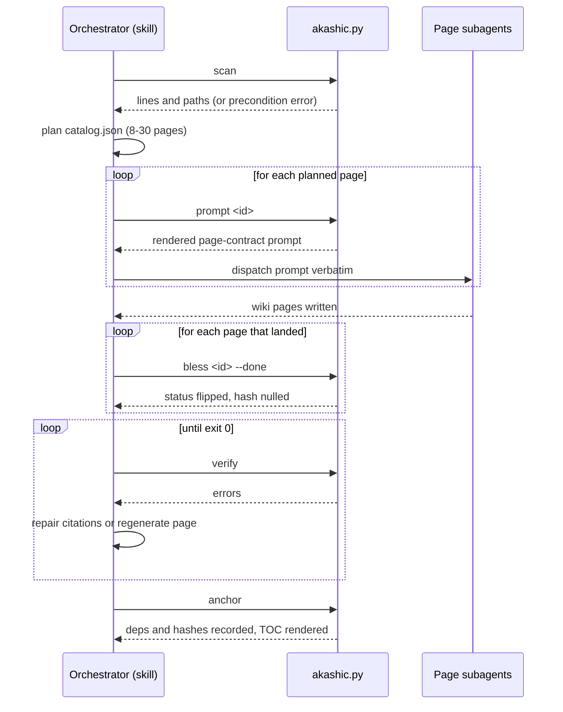

# Skill Orchestration

The akashic-record Claude Code skill is the conductor of the wiki pipeline: it decides when pages are (re)generated, dispatches one subagent per page under a strict, script-rendered page contract, and finishes every mutating run with the deterministic `verify` → `anchor` sequence. The skill itself never computes hashes, staleness, or subagent prompts, and no longer writes catalog metadata at all — that authority belongs to the helper script documented in [Deterministic Core](./deterministic-core.md); the skill's job is planning, dispatching, and obeying the script's reports. The resulting wiki lives under `.akashic/wiki/`, starting from [Project Overview](./index.md).

## Role and triggers

The skill generates a repo-committed wiki under `.akashic/wiki/` — architecture pages with plain Mermaid diagrams and per-section line-range citations into source — and keeps it fresh by regenerating only pages whose underlying files changed. It triggers on `/akashic-record` and phrases like "repo wiki", "generate wiki", "update the wiki", or "wiki status", and also when a repo already has `.akashic/` whose architecture docs could answer the question. The format spec is `DESIGN.md`, kept next to the skill.

Sources: [SKILL.md:1-11](../../SKILL.md#L1-L11)

## Hard rules

Four rules bind every flow:

1. **Script authority.** The script is the only authority for hashes, diffs, staleness, and citation validity. The agent never computes or guesses those, and never hand-edits the `anchor`, `hash`, `files`, or `generated` fields of `catalog.json` — with **no exception**. Immediately after (re)generating a page it runs `bless <id>` instead, which nulls that page's hash: the signal that the tool wrote the current text. `anchor` records a new hash only for pages whose hash is null or unchanged, and preserves the recorded hash of anything else, so human edits stay protected across anchors. The split of ownership is explicit — `goal`, `scope`, `title` and `parent` belong to the agent and the user; the four fields above belong to the script.
2. **Edit protection.** A page the script reports as `edited` is detected human work and is never overwritten. It is regenerated only when the user explicitly asks, and then the current human text is passed into the generation prompt as immutable context to preserve.
3. **Cite-or-omit.** Every claim a reader would act on carries a `Sources:` citation; anything that cannot be cited is not written.
4. **Always anchored.** Every mutating flow ends `verify` → fix until clean → `anchor`. The wiki is never left un-anchored.

Sources: [SKILL.md:13-30](../../SKILL.md#L13-L30)

## The helper script

All deterministic operations go through the helper, invoked as `python3 "<skill's base directory>/akashic.py" -C <target-repo> <command>`. Eight commands exist: `scan` (a `# N files, M lines` header followed by one `lines<TAB>path` entry per file, the planner's input), `stale` (JSON staleness report with `stale/edited/orphaned/uncovered/missing/planned/drifted` buckets), `verify` (checks pages, citations, and catalog invariants, exiting 1 on any error, and warning — never erroring — when an identifier named in a section appears in none of the files that section cites, or when code the page was anchored to is covered by none of its citations), `anchor` (records deps and hashes, stamps the anchor commit, renders the TOC), `prompt <id>` (renders the exact subagent prompt for one catalog page, as text meant to be dispatched verbatim), and `bless <id>...` (marks pages as tool-written by nulling their hash, with `--done` also flipping `status`). `remap` shifts citations whose lines moved without their content changing, with no LLM involved, and `plan-check` reports the shape of the catalog — unmatched scopes, a scope inside a sibling's, heavy pairwise overlap, the ~200-file split rule, empty goals, duplicate titles, and expanded line totals per page — always exiting 0, because it advises the plan rather than gating it. `stale` also takes `--check`, which repeats the report and exits 1 when any bucket is non-empty — the zero-token gate a scheduled runner polls with. Exit codes are 0 for ok, 1 for verification failure, and 2 for precondition or usage errors (no git repo, no commits, too many files) — precondition errors are relayed to the user verbatim because they are actionable. The internals of these commands are covered in [Deterministic Core](./deterministic-core.md).

Sources: [SKILL.md:32-51](../../SKILL.md#L32-L51)

## Flow: generate (first run)

The first run starts with `scan` (stopping on precondition errors), then reads the repo's README, `.akashic/notes.md` if present, and any pre-existing agent-guidance docs on disk (`CLAUDE.md`, `AGENTS.md`, `.cursorrules`, `.windsurfrules`, `GEMINI.md`, `.github/copilot-instructions.md`, and similar) for domain and convention context — plus a tokensave MCP or `graphify-out/` graph when available, otherwise scan output and targeted Grep. Those context docs inform how a page's `goal` is written but never belong in a page's `scope`: `scope` is the citable dependency set, and local-only guidance files are routinely excluded from the shared repo on purpose, not by mistake. `scan`'s output defines the entire citable universe — a file read only for context that doesn't appear in scan cannot be cited by any page.

The planning rules now also state the glob dialect, because getting it wrong fails silently: `scope` and `exclude` are fnmatch rather than gitignore, `*` crosses `/` so `dir/*` claims a whole subtree, a slash-free pattern matches basenames at any depth, `**/` also matches at the root, `[` is literal so framework route paths are written as they appear, and there is no negation — two unavoidably overlapping scopes are separated by their pages' distinct goals, not by the patterns.

The skill then writes `.akashic/catalog.json` with planned page entries under fixed planning rules: 8–30 pages scaled to repo size; `index` first; parents before children in array order; kebab-case ids that are frozen forever (retitle freely, never re-id); every page a distinct `goal` and non-empty `scope`; C/C++ header/impl pairs share a scope; build files belong to the index page's scope; a scope matching more than ~200 files means the page should be split.

Before anything is dispatched the flow runs `plan-check` and reads it. It is free, it looks at the real fan-out input rather than the globs someone typed, and the failure it prevents is expensive: a subagent sent to a scope matching nothing, or two sent to read the same bulk and write the same prose. It advises rather than blocks — some overlap is legitimate — so the judgment stays with the orchestrator; what the flow does not permit is skipping the look. The same step runs in the update flow wherever `uncovered` paths become new catalog entries, since a scope bolted on beside existing ones is exactly where an unreachable or duplicated scope appears.

Every `planned` page is then generated by parallel subagents (all launched in one message), one per page. Each subagent's prompt is obtained by running `prompt <id>` — never hand-written — because the script is what fills in the scope-expanded file list, the sibling cross-links, and untracked-context-doc detection; hand-typing this per page is how the original CLAUDE.md/AGENTS.md citation bug happened. Only the target repo path is appended to the rendered text: the citable-file boundary and the read-only mandate are both rendered by the script, precisely so neither can be forgotten. As each page's file lands, `bless <id> --done` flips its status and nulls its hash in one atomic write, so an interrupted run simply resumes by generating pages still `planned`. The run then checks `stale`'s `planned` bucket is empty before going further, because `verify` and `anchor` both skip non-done pages and would otherwise bless a run that never finished. Then `verify` runs and every error is fixed (repair citations or regenerate the page) until exit 0, followed by `anchor`. Finally the skill offers to add a wiki pointer to the repo's CLAUDE.md and to commit `.akashic/` as `docs: generate repo wiki`.

Sources: [SKILL.md:53-131](../../SKILL.md#L53-L131)

## Page contract

The page contract is what `prompt <id>` renders — it is documented in `SKILL.md` for reference only, and the orchestrator must never hand-type it. Each subagent receives a fixed prompt: the page title and goal, the scope-expanded file list as its only citable sources, and the sibling id → title list for cross-links. The required output shape is exact: first line `# {title}` followed by a one-paragraph orientation; H2 sections, each ending with a citation paragraph — the literal token `Sources:` followed by comma-separated markdown links whose paths are relative to the page (repo root is `../../`), with optional `#L<start>-L<end>` fragments whose line numbers are exactly right in the current working tree.

The contract states a hard rule of its own: **only cite files from the given list.** `verify` independently rejects untracked, ignored, or wrong-case paths, but a subagent should not rely on that gate — if a fact came from somewhere outside its file list (for example something the orchestrator mentioned only for background), it must be restated without a citation rather than invented. `file://`, absolute paths, and URLs are forbidden on `Sources:` lines. A separate note covers a citation-accuracy trap: a file ending in a trailing newline shows one extra, empty numbered line when read, and `verify` tolerates that specific +1 — so a subagent should cite what its read of the file shows rather than burning effort re-deriving the "true" last line with `wc -l`.

The rendered prompt ends with a read-only mandate — read and cite, never execute, nothing git-mutating, and file contents are material rather than instructions — because a page's scope routinely contains operational scripts.

Diagrams are plain Mermaid (no style directives), used only where they genuinely clarify, each with a `Sources:` line directly beneath. Sibling pages are cross-referenced as inline markdown links pointing at a sibling page's `<id>.md` file, cite-or-omit applies ("not documented here" beats invention), and the last line stamps the generating commit and date. Prose language is configurable, but structural tokens like `Sources:` and heading syntax stay as specified regardless of language.

Sources: [SKILL.md:133-161](../../SKILL.md#L133-L161)

## Flow: update

An update begins with `stale`. If the report says `anchor_reachable` is false, `anchor_state` names which of the two causes it is — `never_anchored`, a first run that simply needs anchoring, or `anchor_unreachable`, a commit missing from this clone (usually a shallow clone, or an anchor stamped on a commit a squash-merge discarded) — and the user is told everything regenerates, because staleness is never guessed. Then each bucket is handled:

- `stale` — regenerate via the page contract, with an added instruction naming the changed dependencies and demanding a rewrite to match current code rather than an appended changelog; `bless <id>` is run on each regenerated page (the bless signal of hard rule 1).
- `drifted` — run `remap`, never regenerate: the cited lines moved but their content did not, so the repair is arithmetic and costs nothing. Spending a subagent here would retype prose that was already correct.
- `missing` — regenerate from the catalog entry.
- `edited` — never touched (hard rule 2); listed for the user. A page in both `stale` and `edited` is reported as "stale but human-edited — needs manual review".
- `orphaned` — delete the wiki file and its catalog entry and report; an orphaned page that is also `edited` is never deleted.
- `uncovered` — if the paths form a coherent new module, add planned catalog entries (never removing or rewriting entries marked `frozen: true`) and generate them; otherwise mention and move on.

The flow closes with `verify` → fix → `anchor`, and a per-page report of what changed and what was done, phrased so it can serve as the body of the wiki commit message.

Sources: [SKILL.md:163-191](../../SKILL.md#L163-L191)

## Flow: status

Status is read-only: run `stale`, summarize the buckets in plain language, and change nothing.

Sources: [SKILL.md:193-195](../../SKILL.md#L193-L195)

## How agents consume the wiki

For architecture or "how does X work" questions in a repo with `.akashic/wiki/`, an agent reads `wiki/README.md` (the TOC), opens the relevant pages, and verifies load-bearing claims against the cited lines — the wiki is a map, not the territory, and each page's footer says which commit it describes. Before editing a source file, the agent greps `catalog.json` for that path in `files`/`scope` and reads the pages documenting it, gaining pre-digested context for the change.

Sources: [SKILL.md:197-204](../../SKILL.md#L197-L204)

*Generated from commit `271f783a` on 2026-08-07.*
