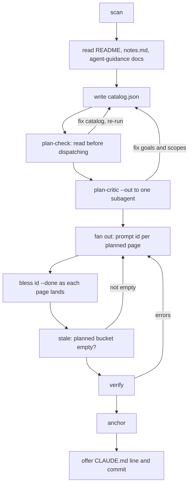

# Skill Orchestration

`SKILL.md` is the LLM half of akashic-record: the instructions Claude Code loads when the skill triggers, telling it which helper subcommand to run at each step, when to fan out to subagents, and what it may never decide on its own. It is not code — it is a contract that fences every stochastic step between two deterministic ones, so nothing reaches `.akashic/` without passing `verify` and nothing a human wrote gets overwritten by a model. The flows it defines (generate, update, status, plus an on-demand audit) all route through the single helper described in [Deterministic Core](./deterministic-core.md); the incremental half of the loop is expanded in [Maintenance Loop](./maintenance-loop.md), and the artifacts these flows produce are laid out in [Project Overview](./index.md).

## Entry points and the helper

The skill's frontmatter `description` is what Claude Code matches against: it names both the generate and the maintain halves and lists the trigger phrases `/akashic-record`, "repo wiki", "generate wiki", "update the wiki", and "wiki status", plus a passive trigger — a repo that already has `.akashic/` and an architecture question its docs could answer. The body opens by stating what the skill produces: a repo-committed wiki under `.akashic/wiki/`, with plain Mermaid diagrams and per-section line-range citations, kept fresh by regenerating only pages whose underlying files changed, with `DESIGN.md` named as the format spec.

Everything deterministic goes through one invocation form, `python3 "<this skill's base directory>/akashic.py" -C <target-repo> <command>`, which keeps the skill directory and the documented repo separate. A command table tells the orchestrator what each subcommand returns before it runs one: `scan` (a `# N files, M lines` header, then `lines<TAB>path`), `stale` (JSON with the `stale/edited/orphaned/uncovered/missing/planned/drifted/restated/unblessed` buckets), `stale --check` (same report, exit 1 when any bucket is non-empty, described as a zero-token gate for a scheduled runner), `stale --ids <bucket>` (one id per line, so a loop needs no JSON parsing), `verify`, `anchor`, `prompt <id>`, `remap`, `plan-check`, `plan-critic`, `audit extract`, `audit prompt`, and `bless <id>...`.

Three table rows are marked "dispatch it verbatim" — `prompt`, `plan-critic`, and `audit prompt` — which is the table's way of saying the script renders subagent prompts and the orchestrator only forwards them. Exit codes are documented as 0 ok, 1 verification failure, 2 precondition or usage error, with the instruction to relay class-2 messages to the user verbatim because they are actionable.

Sources: [SKILL.md:1-11](../../SKILL.md#L1-L11), [SKILL.md:32-55](../../SKILL.md#L32-L55)

## The four hard rules

These sit at the top of the file, ahead of any flow, and the flows below refer back to them by number.

**1. The script is the only authority** for hashes, diffs, staleness, and citation validity. The LLM must never compute or guess any of those, and never hand-edit the `anchor`, `hash`, `files`, or `generated` fields of `catalog.json` — stated with "there is no exception". The replacement for hand-editing is the bless signal: immediately after (re)generating a page, run `bless <id>`, which nulls that page's hash, and a null hash is what tells the tool it wrote the current text. `anchor` then records a new hash only for pages whose hash is null or unchanged, and preserves the recorded hash of anything else, which is how human edits survive across anchors. The rule's other half names what the LLM does own: `goal`, `scope`, `title`, and `parent` are editable by hand.

**2. Never overwrite a page the script reports as `edited`** — that bucket is detected human work. Regeneration happens only if the user explicitly asks, and even then the current human text goes into the generation prompt as immutable context to preserve.

**3. Cite-or-omit**: every claim a reader would act on carries a `Sources:` citation, and anything that cannot be cited does not get written.

**4. Always anchored**: every mutating flow ends `verify` → fix until clean → `anchor`, and the wiki is never left un-anchored.

Sources: [SKILL.md:13-30](../../SKILL.md#L13-L30)

## Flow: generate (first run)

The first-run flow is nine steps, shaped as: gather context, write a plan, review that plan twice before spending anything, fan out, then gate.

Steps 1–3 build the catalog. `scan` runs first, and a precondition failure is relayed and stops the flow. Then the orchestrator reads the repo's README, `.akashic/notes.md` if present (free-text steering to honor during planning), and any pre-existing agent-guidance docs on disk — the list given is `CLAUDE.md`, `AGENTS.md`, `.cursorrules`, `.windsurfrules`, `GEMINI.md`, `.github/copilot-instructions.md`, "and similar". A tokensave MCP or a `graphify-out/` graph is used for modules, hotspots and entry points when one exists; otherwise scan output plus targeted Grep is declared sufficient. The rule attached to those context docs is emphatic and carries its reason: they inform how a page's `goal` is written and never belong in a `scope`, because `scope` is the citable dependency set, and files of that kind are routinely kept local-only through `.git/info/exclude` or a personal gitignore so one person's AI-alignment notes do not leak into a shared repo. `scan`'s output defines the citable universe; a file absent from it cannot be cited by any page, and the page contract enforces that again where citations actually get written.

Step 3 writes `.akashic/catalog.json` from a worked skeleton (top-level `version`, `anchor`, `generated`, `language`, `exclude`, `max_files`, and a `pages` array whose entries carry `id`, `title`, `parent`, `goal`, `scope`, `files`, `status`, `hash`, `frozen`). The planning rules: 8–30 pages scaled to repo size, `index` first, parents before children in array order, kebab-case ids frozen forever (retitle freely, never re-id), a distinct `goal` and non-empty `scope` per page, C/C++ header and implementation pairs in the same scope, build files on the index page's scope, and a scope matching more than ~200 files as the signal to split.

The strongest splitting lever, presented as measured rather than assumed, is the count of parallel entities a page must describe at once rather than file count: a page covering three small modules produced no over-generalizations, miscounts or self-contradictions, while a page covering one file that declared 21 near-identical functions produced all three — as had the 13-file page it was split out of. Roughly ten parallel entities is named as where it starts to break down. Two limits are attached. Scope globs cannot split a file, so when the entities crowd into one indivisible module the page's `goal` is the only remaining lever and must name the specific groups to distinguish. And a scope can be cut too small: a page whose citable set is too narrow starts making true claims it cannot cite — who calls this, what consumes that — which cite-or-omit turns into a defect, so the answer is to cross-link, and a page that keeps needing a neighbour's files means the split was cut in the wrong place.

Glob semantics get their own paragraph because, as the file puts it, getting them wrong is silent: patterns are `fnmatch` rather than gitignore, `*` crosses `/`, a slash-free pattern matches the basename at any depth, a `**/` prefix also matches at the repo root, `[` is literal (so framework route paths like `src/app/api/users/[id]/route.ts` are written as they appear, and character classes are consequently unsupported), and there is no negation — where scopes unavoidably overlap, the distinct `goal` fields are what separate the pages, with DESIGN.md §3.2 named as the normative text.

Sources: [SKILL.md:57-134](../../SKILL.md#L57-L134)

## Fan-out and the closing gates

Step 5 is the fan-out: every `planned` page generated by parallel subagents in one message, one subagent per page, each prompt obtained by running `prompt <id>` rather than hand-written. The rationale is recorded as a past failure — hand-typing the prompt per page "is how the original CLAUDE.md/AGENTS.md citation bug happened" — and the only thing the orchestrator may append to the rendered text is the target repo path, because the read-only mandate and the citable-file boundary are rendered by the script precisely so they cannot be forgotten. `bless <id> --done` runs as each page's file lands, flipping `status` and nulling the hash in one atomic write, which is also what makes the flow resumable: an interrupted run is simply re-run, generating pages still `planned`.

Steps 6–9 close it out. `stale` is run to confirm the `planned` bucket is empty, because `verify` and `anchor` both skip non-done pages and would therefore never notice a page a subagent failed to write — the instruction is to regenerate it or say so explicitly, and never anchor a run not confirmed finished. Then `verify` until exit 0, fixing each error by repairing citations or regenerating the page; then `anchor`; then two offers to the user — adding a `Repo wiki: .akashic/wiki/README.md (architecture + module docs with source citations)` line to the repo's CLAUDE.md, and committing `.akashic/` as `docs: generate repo wiki`.

Sources: [SKILL.md:57-173](../../SKILL.md#L57-L173)

Sources: [SKILL.md:155-173](../../SKILL.md#L155-L173)

## The pre-fan-out gates: plan-check and plan-critic

Step 4 of the generate flow is a two-stage plan review, and both stages run before any generation subagent is dispatched.

`plan-check` is the cheap one — free, advisory, never blocking — and it looks at the real fan-out input. What it reports is listed: a scope matching no tracked file, a scope entirely inside a sibling's, a heavy pairwise overlap, a page over the ~200-file split rule, an empty goal, a duplicate title, and the expanded line total per page. The instruction is to fix the catalog and re-run rather than dispatch a subagent that has nothing to cite, or two that will read the same bulk and write the same prose. Because some overlap is legitimate the judgment stays with the orchestrator — "what is not acceptable is not looking" — and the same output is named as what a plan-approval checkpoint should show a human.

`plan-critic` is the second stage: dispatch `plan-critic --out <tmp>` to one subagent told "read that file in full and follow it, read nothing else", and act on what comes back before generating anything. The division of labor is stated directly: `plan-check` answers the shape questions, `plan-critic` answers the ones that need reading the code — whether a goal promises something the repo does not contain, whether what it promises is inside its own scope, and whether two goals claim the same subject. It is called the only check that can catch those, because `verify` proves a citation resolves and never that a page wrote what it was asked to, and cite-or-omit means an under-scoped page does not fail, it quietly says less. The cost argument is that one adversarial pass over the whole catalog is a fraction of one page's generation. Its verdict is explicitly one sample: a page it calls fine is not proven fine, and re-running against an unchanged catalog is called a legitimate way to find more rather than a redundancy. Fix what it names, re-run both checks, and only then fan out.

Sources: [SKILL.md:135-154](../../SKILL.md#L135-L154)

## The page contract subagents receive

`SKILL.md` reproduces what `prompt <id>` renders as a block quote, labelled reference-only and explicitly not to be hand-typed. The contract hands the subagent a title, a goal, a scope-expanded file list that doubles as the entire set of citable files, and a sibling id → title list for cross-links. Then it fixes the page shape: first line `# {title}` followed by a one-paragraph orientation; H2 sections each ending in a citation paragraph of the literal token `Sources:` plus comma-separated markdown links, with paths relative to the page (repo root is `../../`) and optional `#L<start>-L<end>` line numbers that must be exactly right in the current working tree; plain Mermaid with no style directives, only where a diagram genuinely clarifies, with a `Sources:` line directly beneath it; sibling cross-references written as a markdown link whose text is the sibling's title and whose target is that sibling's id with a `./` prefix and an `.md` suffix; cite-or-omit, preferring "not documented here" over invention; a last line stamping the short commit sha and the date in `YYYY-MM-DD` form; and a prose language, with structural tokens staying as specified whatever that language is.

Two clauses exist to head off specific subagent failure modes. On the citable set: `verify` independently rejects untracked, ignored and wrong-case paths, but the prompt tells the subagent not to lean on that gate — a fact that came from outside the file list, such as background the orchestrator mentioned, is to be restated without a citation rather than given an invented one. On line numbers: a file ending in a trailing newline shows one extra empty numbered line when Read, `verify` tolerates that specific +1, and the subagent is told not to burn effort re-deriving the true last line with `wc -l`. `Sources:` lines may never use `file://`, absolute paths, or URLs.

Sources: [SKILL.md:175-203](../../SKILL.md#L175-L203)

## Flow: update

The update flow starts with `stale` and branches on whether the anchor is reachable. When `anchor_reachable` is false, `anchor_state` distinguishes the two causes: `never_anchored` (a first run — just anchor) and `anchor_unreachable`, described as usually a shallow clone or an anchor stamped on a commit a squash-merge discarded. In the unreachable case the user is told everything regenerates and why, the reason being that staleness is never guessed.

Before anything is regenerated, `plan-critic` runs again — and the file insists this is not only for newly added entries, because the pages about to be regenerated will be written from goals that may never have been reviewed. The evidence given is its first real run against a 28-page repo, where it found defects in 16 of them, almost none related to new paths: a goal promising a "BOL public reference" that exists nowhere, a "public endpoint" that requires a token, a "house convention" holding in 5 of ~101 files. The next step anticipates the consequence: the critic's fixes usually widen a scope, which makes more pages `restated`, and that is framed as expected rather than something to route around. The default is to act on findings for pages already being regenerated, apply the rest to the catalog anyway, and let the next `stale` pick them up — `restated` exists precisely so a corrected brief is not lost. If the expanded set is more than the user wants to spend now, the deferral must be stated and itemized; a finding is never silently dropped.

Then the flow acts per bucket:

- `stale` → regenerate via `prompt <id> --update --out <tmp>`, which renders what changed into the prompt and keeps it out of the orchestrator's context; dispatch with "read that file in full and follow it", and use `stale --ids stale` to loop over ids without parsing JSON. That context is never hand-appended, because `stale` knows the changed list and the script is what joins them. Each regenerated page gets `bless <id>` per hard rule 1.
- `drifted` → run `remap`, do not regenerate. The cited lines moved but their content did not, so the fix is arithmetic: `remap` shifts each fragment and its human-readable text, blesses the page, and costs nothing. Regenerating these would spend a subagent retyping prose that was already correct.
- `restated` → the page's brief changed rather than its code, either an edited goal or a scope widened onto a file that already existed; regenerate with `prompt <id> --update --out <tmp>`, which names which of the two it was. This is identified as where `plan-critic`'s findings land — acting on them used to write into the catalog and never reach the page.
- `missing` → regenerate from the catalog entry.
- `unblessed` → a page file exists whose catalog entry was never accepted, meaning a generation subagent wrote it and then died before `bless`. Read the page before deciding: a complete one is accepted as written with `bless <id> --done` at no cost, and regeneration is only for a truncated or wrong page, since regenerating by reflex throws away a finished page unread.
- `edited` → do not touch, per hard rule 2; list them for the user. A page in both `stale` and `edited` is reported as "stale but human-edited — needs manual review".
- `orphaned` → delete `wiki/<id>.md` and its catalog entry and report, but never delete a page that is also `edited`.
- `uncovered` → three outcomes, with the middle one called the commonest: paths belonging inside an existing page's module widen that page's `scope` (making it `restated`), which is what a new file in an already-documented module usually needs; paths forming a coherent new module get new planned catalog entries — never removing or rewriting entries marked `frozen: true` — followed by `plan-check` and then `plan-critic` before dispatch, on the grounds that a goal written for a module nobody has read yet is a goal written from filenames; and anything that is neither gets a mention and nothing more.

The flow closes with `verify` → fix → `anchor` (hard rule 4) and a per-page report of what changed and what was done, phrased so it can serve as the body of the wiki commit message. The on-demand claim audit is a fourth flow with its own dispatch discipline, described as never a gate and never scheduled; it is covered in [Maintenance Loop](./maintenance-loop.md) rather than here.

Sources: [SKILL.md:205-265](../../SKILL.md#L205-L265), [SKILL.md:267-269](../../SKILL.md#L267-L269)

## Flow: status

Status is the read-only flow: run `stale`, summarize the buckets in plain language, change nothing. `plan-check` is added when the question is about the plan rather than freshness, on the stated grounds that it reads nothing but the catalog and the file tree and changes nothing either.

Sources: [SKILL.md:289-291](../../SKILL.md#L289-L291)

## Consumption: how agents read the wiki

The closing section covers the skill's passive mode — an agent working in a repo that already carries a wiki. For architecture or "how does X work" questions in a repo with `.akashic/wiki/`, the route is: read `wiki/README.md` as the table of contents, open the relevant pages, and verify load-bearing claims against the cited lines. The framing for that last step is that the wiki is a map, not the territory, and that each page's footer says which commit it describes. Separately, before editing a source file, the instruction is to grep `catalog.json` for that path in the `files`/`scope` fields and read the pages that document it, as pre-digested context for the change.

Sources: [SKILL.md:293-300](../../SKILL.md#L293-L300)

*Generated from commit `b9f3e036` on 2026-08-07.*
