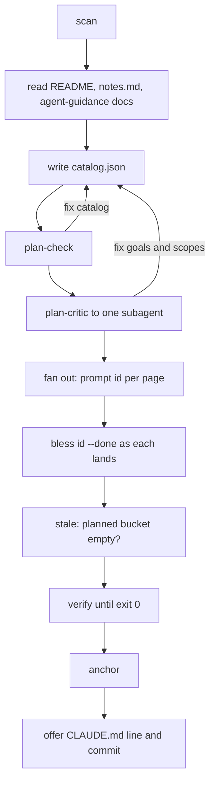

# Skill Orchestration

`SKILL.md` is the LLM half of akashic-record: the document Claude Code loads when the skill triggers, and the one that decides what gets run, in what order, and what is never allowed to happen. It defines four hard rules that bound the model's authority, a table of the helper commands it may call, three flows (generate, update, status) plus an on-demand audit, and the page contract that every generation subagent receives. Everything mechanical it delegates to `akashic.py` — see [Deterministic Core](./deterministic-core.md) for what those commands actually compute, and [Project Overview](./index.md) for how the two halves fit together.

## What the skill is and when it loads

The file carries YAML frontmatter with a `name` of `akashic-record` and a description that doubles as the trigger surface: generating or creating a repo wiki, updating or refreshing it, checking wiki status, or answering an architecture question in a repo that already has `.akashic/`. The named triggers are `/akashic-record`, "repo wiki", "generate wiki", "update the wiki", and "wiki status". The body states the product in one breath: a repo-committed wiki under `.akashic/wiki/`, architecture pages with plain Mermaid diagrams and per-section line-range citations into source, kept fresh by regenerating only pages whose underlying files changed. For the on-disk format it points at `DESIGN.md` next to it rather than restating the spec.

Sources: [SKILL.md:1-11](../../SKILL.md#L1-L11)

## The four hard rules

These are stated before any flow, because they constrain all of them.

**1. The script is the only authority** for hashes, diffs, staleness, and citation validity. The model must never compute or guess any of those, and never hand-edit the `anchor`, `hash`, `files`, or `generated` fields of `catalog.json` — stated with "there is no exception". The prescribed alternative is the bless signal: immediately after (re)generating a page, run `bless <id>`, which nulls that page's hash, and a null hash is what tells the tool it wrote the current text. `anchor` then records a new hash only for pages whose hash is null or unchanged, and preserves the recorded hash of anything else, so human edits survive across anchors. The complementary half of the rule names what *is* the model's to edit: `goal`, `scope`, `title` and `parent`.

**2. Never overwrite a page the script reports as `edited`** — that is detected human work. Regeneration happens only when the user explicitly asks for it, and then the current human text goes into the generation prompt as immutable context to preserve.

**3. Cite-or-omit.** Every claim a reader would act on carries a `Sources:` citation; anything that cannot be cited is not written.

**4. Always anchored.** Every mutating flow ends `verify` → fix until clean → `anchor`, and the wiki is never left un-anchored.

Sources: [SKILL.md:13-30](../../SKILL.md#L13-L30)

## The helper surface

All script calls take the shape `python3 "<this skill's base directory>/akashic.py" -C <target-repo> <command>`. The command table names each subcommand alongside what it does and what it emits: `scan` (filtered file list with line counts, the planner's input), `stale` and its `--check` variant (which exits 1 when any bucket is non-empty, described as a zero-token gate for a scheduled runner) and `--ids <bucket>` (one page id per line, so a loop needs no JSON parsing), `verify`, `anchor`, `prompt <id>` with `--update` and `--out`, `remap`, `plan-check`, `plan-critic`, `audit extract` and `audit prompt`, and `bless <id>...` with `--done`. Three of these — `prompt`, `plan-critic`, `audit prompt` — are annotated "dispatch it verbatim", marking them as prompt renderers rather than reports. The `stale` row lists the bucket set the report can return: `stale/edited/orphaned/uncovered/missing/planned/drifted/restated/unblessed`.

Exit codes are 0 for ok, 1 for verification failure, and 2 for a precondition or usage error (no git repo, no commits, too many files) — and the skill instructs that code-2 messages be relayed to the user verbatim because they are actionable.

Sources: [SKILL.md:32-55](../../SKILL.md#L32-L55)

## Flow: generate

The first run walks nine steps. It opens with `scan`, relaying precondition errors and stopping on failure. Step two gathers context: the repo's README, `.akashic/notes.md` if present (free-text steering to honor during planning), and any pre-existing agent-guidance docs on disk — `CLAUDE.md`, `AGENTS.md`, `.cursorrules`, `.windsurfrules`, `GEMINI.md`, `.github/copilot-instructions.md` and similar. A tokensave MCP or `graphify-out/` graph is used when present to find modules, hotspots and entry points; otherwise scan output plus targeted Grep suffices. The step then draws a hard line those docs must not cross: they inform how a page's `goal` is written and never belong in a page's `scope`, because `scope` is the citable dependency set, and files of that kind are routinely kept local-only via `.git/info/exclude` or a personal gitignore. `scan`'s output defines the citable universe — a context file absent from it cannot be cited by any page.

Step three writes `.akashic/catalog.json`, and the skill embeds a skeleton showing the top-level keys (`version`, `anchor`, `generated`, `language`, `exclude`, `max_files`) and one page object with `id`, `title`, `parent`, `goal`, `scope`, `files`, `status`, `hash` and `frozen`. The planning rules that follow: 8–30 pages scaled to repo size, `index` first, parents before children in array order, kebab-case ids frozen forever (retitle freely, never re-id), a distinct `goal` and non-empty `scope` per page, C/C++ header/impl pairs kept in one scope, build files in the index page's scope, and a split when a scope matches more than ~200 files.

The longest planning rule is about entity count rather than file count, and the skill flags it as measured rather than assumed: a page covering three small modules produced no over-generalizations, miscounts or self-contradictions, while a page covering **one** file that declared 21 near-identical functions produced all three — as had the 13-file page it was split from. The instruction that follows is to split until each page speaks about a handful, with roughly ten parallel entities named as the point where it starts to break down. Paired with it is the limit: scope globs cannot split a file, so when the entities are crowded into one module the page's `goal` is the only remaining lever and must name the specific groups to distinguish. The opposite failure gets its own paragraph — an over-shrunk scope starts making true claims it cannot cite, so cross-link instead.

A glob-semantics block closes the step because getting these wrong is silent: patterns are `fnmatch`, not gitignore; `*` crosses `/`; a slash-free pattern matches the basename at any depth; a `**/` prefix also matches at the repo root; `[` is literal, so framework route paths can be written as they appear and character classes are consequently unsupported; and there is no negation, so where scopes unavoidably overlap the distinct `goal` fields are what separate the pages. It defers the normative text to DESIGN.md §3.2.

After the two gates (next section), step five generates every `planned` page with parallel subagents in one message, one per page, each prompt obtained by running `prompt <id>` rather than hand-written — the skill attributes the original CLAUDE.md/AGENTS.md citation bug to hand-typing. Only the target repo path may be appended to the rendered text, since the read-only mandate and the citable-file boundary are rendered by the script so they cannot be forgotten. `bless <id> --done` runs as each page's file lands, flipping status and nulling the hash in one atomic write, and an interrupted run is resumed by re-running: generate the pages still `planned`.

Steps six through nine are the close-out. `stale` is re-run to confirm the `planned` bucket is empty, because `verify` and `anchor` both skip non-done pages and would otherwise not notice a page a subagent never wrote. Then `verify` until exit 0, then `anchor`, then an offer to add the `Repo wiki: .akashic/wiki/README.md` line to the repo's CLAUDE.md and to commit `.akashic/` as `docs: generate repo wiki`.

Sources: [SKILL.md:57-134](../../SKILL.md#L57-L134), [SKILL.md:155-173](../../SKILL.md#L155-L173)

Sources: [SKILL.md:57-173](../../SKILL.md#L57-L173)

## The two pre-fan-out gates

`plan-check` runs first and must be read **before dispatching anything**. The skill describes it as free and as looking at the real fan-out input, listing what it surfaces: a scope matching no tracked file, a scope entirely inside a sibling's, a heavy pairwise overlap, a page over the ~200-file split rule, an empty goal, a duplicate title, and the expanded line total per page. The prescribed response is to fix the catalog and re-run rather than dispatch a subagent with nothing to cite, or two that will read the same bulk and write the same prose. It is advisory and never blocks — some overlap is legitimate — so the judgment stays with the model; what the skill rules out is not looking. Its output is also named as what a plan-approval checkpoint should show a human.

`plan-critic` runs second, dispatched as `plan-critic --out <tmp>` to **one subagent** told to read that file in full and follow it and read nothing else. It answers the questions that need reading the code: whether a goal promises something the repo does not contain, whether what it promises is inside its own scope, and whether two goals claim the same subject. The skill argues it is the only check that can catch those, because `verify` proves a citation resolves and never that a page wrote what it was asked to, and cite-or-omit means an under-scoped page does not fail — it quietly says less. Cost is framed as a fraction of one page's generation. Its verdict is to be treated as **one sample**: a page it calls fine is not proven fine, and rerunning on an unchanged catalog is described as a legitimate way to find more rather than a redundancy.

The update flow reuses `plan-critic` at step two and gives the reason: pages about to be regenerated will be written from goals that may never have been reviewed. The recorded first real run against a 28-page repo found defects in 16 of them — a goal promising a "BOL public reference" that exists nowhere, a "public endpoint" that requires a token, a "house convention" holding in 5 of ~101 files — and regenerating from those ships every one. Because its fixes usually widen a scope, more pages become `restated`; the skill calls that expected, and sets the default to act on findings for the pages already being regenerated, apply the rest to the catalog, and let the next `stale` pick them up. Deferring is allowed only explicitly and with the deferred items listed; silently dropping a finding is not.

Sources: [SKILL.md:135-154](../../SKILL.md#L135-L154), [SKILL.md:212-224](../../SKILL.md#L212-L224)

## The page contract

`SKILL.md` reproduces what `prompt <id>` renders as a block-quoted reference explicitly marked "do not hand-type". The rendered prompt gives a subagent the page title and repo path, the `goal`, the scope-expanded file list framed as "this is also the *entire* set of files you may cite", and the sibling id → title list for cross-links. The output shape it dictates: write to `.akashic/wiki/{id}.md`; first line `# {title}` followed by a one-paragraph orientation; H2 sections where every section ends with a citation paragraph using the literal token `Sources:`, comma-separated markdown links, paths relative to the page (repo root `../../`), and optional `#L<start>-L<end>` line numbers exactly right in the current working tree.

Two guardrails ride inside the citation rule. First, only files from the list may be cited — and although `verify` independently rejects untracked, ignored or wrong-case paths, the contract tells the subagent not to rely on that gate: a fact from outside the file list, such as background the orchestrator mentioned, gets restated without a citation rather than given an invented one. `file://`, absolute paths and URLs are barred from `Sources:` lines. Second, a file ending in a trailing newline shows one extra empty numbered line when Read, `verify` tolerates that specific +1, and the subagent is told not to burn effort re-deriving the true last line with `wc -l`.

The remaining clauses: plain Mermaid with no style directives, only where a diagram genuinely clarifies, with a `Sources:` line directly under each diagram; sibling cross-references written in prose as a markdown link whose text is the sibling's title and whose target is that sibling's page id with a `.md` suffix, relative to the current directory; cite-or-omit, preferring "not documented here" over invention; a last line stating the short commit sha and a `{YYYY-MM-DD}` date in the italicised "Generated from commit" form; and a prose language taken from `{language}` while structural tokens stay as specified regardless of language.

The generate flow adds what the script fills in beyond the template — the scope-expanded file list, the sibling cross-links, and untracked-context-doc detection — and notes that the read-only mandate and the citable-file boundary are rendered by the script rather than appended by the orchestrator.

Sources: [SKILL.md:175-203](../../SKILL.md#L175-L203), [SKILL.md:155-162](../../SKILL.md#L155-L162)

## Flow: update

The update flow opens with `stale`. When `anchor_reachable` is false, `anchor_state` distinguishes the two causes — `never_anchored`, a first run that just needs anchoring, and `anchor_unreachable`, usually a shallow clone or an anchor stamped on a commit a squash-merge discarded — and the user is told everything regenerates and why, since staleness is never guessed. `plan-critic` and its fallout follow (previous section), and then the flow routes per bucket:

- `stale` → regenerate with `prompt <id> --update --out <tmp>`, which renders what changed into the prompt and keeps it out of the orchestrator's context; dispatch as "read that file in full and follow it". `stale --ids stale` supplies the ids without JSON parsing. The changed list is never hand-appended, because `stale` knows it and the script joins it. `bless <id>` follows each regeneration, per hard rule 1.
- `drifted` → run `remap`, do not regenerate. The cited lines moved but their content did not, so the fix is arithmetic: `remap` shifts each fragment and its human-readable text, blesses the page, and costs nothing.
- `restated` → the brief changed rather than the code: a goal was edited, or a scope was widened onto a file that already existed. Regenerate with `prompt <id> --update --out <tmp>`, which names which of the two it was. This is where `plan-critic`'s findings land; the skill notes that acting on them used to write into the catalog and never reach the page.
- `missing` → regenerate from the catalog entry.
- `planned` → a catalog entry with no page file at all. Generate it as the generate flow does, then `bless <id> --done`.
- `unblessed` → a page file exists but its entry was never accepted, meaning a generation subagent wrote it and died before `bless`. **Read the page before deciding**: if complete, `bless <id> --done` accepts it as written at no cost; regenerate only if it is truncated or wrong. The two buckets are explicitly contrasted — same non-`done` status, opposite remedy, because in `unblessed` the file already exists.
- `edited` → do not touch, per hard rule 2; list them for the user. A page in both `stale` and `edited` is reported as "stale but human-edited — needs manual review".
- `orphaned` → delete `wiki/<id>.md` and its catalog entry and report, never deleting a page that is also `edited`.
- `uncovered` → three outcomes, with the middle one called the commonest: paths belonging inside an existing page's module mean widening that page's `scope` (the page becomes `restated` and regenerates on that basis); paths forming a coherent new module mean adding planned catalog entries — never removing or rewriting entries marked `frozen: true` — then `plan-check`, then `plan-critic`, then generation; neither means mention and move on.

The flow closes with `verify` → fix → `anchor`, then a per-page report of what changed and what was done, phrased so it can serve as the body of the wiki commit message. The bucket semantics themselves are covered in [Maintenance Loop](./maintenance-loop.md).

Sources: [SKILL.md:205-270](../../SKILL.md#L205-L270)

## Flow: status, and the on-demand audit

Status is the smallest flow: run `stale`, summarize the buckets in plain language, change nothing. `plan-check` is added when the question is about the plan rather than freshness, since it reads only the catalog and the file tree and changes nothing either.

The audit flow sits outside the mutating pipeline by design — "on demand only", reached for when a page smells wrong, never on a schedule and never as a gate. It renders `audit prompt <id> --out <tmp>` to one subagent with no other context, with `--out` justified on cost (the whole prompt would otherwise pass through the orchestrator's context and then the judge's, 200KB paid twice for a large page). The prompt shows every claim beside the exact bytes it cites, with files labelled `[E1]`, `[E2]` rather than named, so the judge cannot fill gaps with what a file of that name usually contains. The skill positions it against the other checks: `verify` proves a citation resolves, the anchored-content warning proves it still points where it was anchored, the identifier warning proves a named symbol exists somewhere the section cites, and none of them can say whether the sentence is true. Findings map back to paths through `audit extract --page <id>`, then the prose is fixed, `bless`ed, verified and anchored; the three finding kinds named are contradicted, unsupported (the commonest) and overstated.

Sources: [SKILL.md:272-296](../../SKILL.md#L272-L296)

## Consumption: how an agent reads the wiki

The last section of `SKILL.md` is about reading rather than writing. For architecture or "how does X work" questions in a repo that has `.akashic/wiki/`, the instruction is to read `wiki/README.md` as the table of contents, open the relevant pages, and verify load-bearing claims against the cited lines — with the reason stated plainly: the wiki is a map, not the territory, and each page's footer says which commit it describes. The second habit is pre-edit context: before editing a source file, grep `catalog.json` for its path in `files`/`scope` and read the pages that document it.

Sources: [SKILL.md:298-305](../../SKILL.md#L298-L305)

*Generated from commit `45c32618` on 2026-08-11.*
